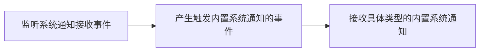

<!--keywords: 内置系统通知,通知,监听,获取,删除,更新-->

网易云信 NIM SDK 支持接收和存储内置系统通知。同时提供处理、查询、删除内置系统通知、修改通知状态等内置系统通知管理功能。


## 技术原理


内置系统通知是云信系统内建的通知，由云信服务器推送给用户或群组，用于云信系统类的事件通知。

网易云信 NIM SDK 的 [`NIMSystemNotificationManager`](https://doc.yunxin.163.com/docs/interface/messaging/iOS/doxygen/Latest/zh/de/d93/protocol_n_i_m_system_notification_manager-p.html) 提供系统通知操作相关接口， [`NIMSystemNotificationManagerDelegate`](https://doc.yunxin.163.com/docs/interface/messaging/iOS/doxygen/Latest/zh/d2/d52/protocol_n_i_m_system_notification_manager_delegate-p.html) 提供系统通知相关观察者通知接口，帮助您快速实现和使用云信系统的系统通知功能。


## <span id="监听内置系统通知">监听内置系统通知</span>

只有在注册监听内置系统通知相关事件后，用户才会收到对应的内置系统通知。



通过调用 [`addDelegate:`](https://doc.yunxin.163.com/docs/interface/messaging/iOS/doxygen/Latest/zh/de/d93/protocol_n_i_m_system_notification_manager-p.html#a479b58fc3467d4ab121585fc2521ae93) 方法添加系统通知委托，再调用[`onReceiveSystemNotification:`](https://doc.yunxin.163.com/docs/interface/messaging/iOS/doxygen/Latest/zh/d2/d52/protocol_n_i_m_system_notification_manager_delegate-p.html#ac10d5da1bbcdd8f63e459b73fc93d778) 方法监听内置系统通知接收事件回调。

示例代码如下：

```
/// 自定义类实现 NIMSystemNotificationManagerDelegate 接口

/// 系统通知委托接口调用类声明
/// NIMSystemNotificationAdapter.h
@interface NIMSystemNotificationAdapter :NSObject<NIMSystemNotificationManagerDelegate>
@end
/// 系统通知委托接口调用类实现
/// NIMSystemNotificationAdapter.m
@implementation NIMSystemNotificationAdapter
/// 收到系统通知回调
- (void)onReceiveSystemNotification:(NIMSystemNotification *)notification {
    NSLog(@"[On receive system notification info, type: %ld, sourceId: %@, targetID: %@, read: %@]",
          (long)[notification type],
          [notification sourceID],
          [notification targetID],
          [notification read] ? @"YES" : @"NO");
}
@end

/// main.m
    /// 实例化接口调用的类
    static NIMSystemNotificationAdapter *adpater;
    adpater = [[NIMSystemNotificationAdapter alloc] init];
    /// 添加系统通知委托
    [[[NIMSDK sharedSDK] systemNotificationManager] addDelegate:adpater];
    /// 当收到系统通知时，调用h onReceiveSystemNotification 回调，打印如下数据
    /// Console: [On receive system notification info, type: 2, sourceId: ios01, targetID: 6454904318, read: NO]

```

您也可以调用 [`removeDelegate:`](https://doc.yunxin.163.com/docs/interface/messaging/iOS/doxygen/Latest/zh/de/d93/protocol_n_i_m_system_notification_manager-p.html#ab2ce7d0dcbf1d2ecfcba259c7fd74ee8) 方法移除系统通知通知委托。

目前云信内置的能触发内置系统通知的事件包括：

通知类型|说明
:----|:-----
`NIMSystemNotificationTypeTeamInvite`|邀请用户加入高级群
`NIMSystemNotificationTypeTeamApply`|用户申请加入高级群
`NIMSystemNotificationTypeTeamIviteReject`|用户拒绝加入高级群邀请
`NIMSystemNotificationTypeTeamApplyReject`|拒绝用户的加入高级群申请
`NIMSystemNotificationTypeSuperTeamInvite`|邀请用户加入超大群
`NIMSystemNotificationTypeSuperTeamApply`|用户申请加入超大群
`NIMSystemNotificationTypeSuperTeamIviteReject`|用户拒绝加入超大群邀请
`NIMSystemNotificationTypeSuperTeamApplyReject`|拒绝用户的加入超大群申请
`NIMSystemNotificationTypeFriendAdd`|对方（请求/已经）加你为好友
`NIMSystemNotificationTypeDeleteFriend`|删除好友
`NIMSystemNotificationTypeRevokeP2PMsg`|单聊消息撤回
`NIMSystemNotificationTypeDeleteP2PMsg`|单聊消息单向删除（发送方无感知，接收方消息会被清掉）
`NIMSystemNotificationTypeDeleteTeamMsg`|高级群消息单向删除（发送方无感知，接收方消息会被清掉）
`NIMSystemNotificationTypeRevokeTeamMsg`|高级群消息撤回
`NIMSystemNotificationTypeRevokeSuperTeamMsg`|超大群消息撤回


## <span id="查询内置系统通知">查询内置系统通知</span>

### <span id="查询内置系统通知列表">查询内置系统通知列表</span>

通过调用 [`fetchSystemNotifications:limit:`](https://doc.yunxin.163.com/docs/interface/messaging/iOS/doxygen/Latest/zh/de/d93/protocol_n_i_m_system_notification_manager-p.html#ad5fe6f73c9b0b7f3cd2837b6e6d52e3c) 方法查询本地存储的内置系统通知列表。

**参数说明：**

|参数|说明|
|:---|:---|
|notification|当前最早系统通知，即从此条系统通知开始查询，从头开始则传入nil|
|limit  |数据库查询系统通知的数量|

**示例代码：**

```objc
/// 从当前系统通知向前查询，若传入 nil 表示查询最新系统通知
    NIMSystemNotification *lastNotification = nil;
    /// 最大获取数
    NSInteger limit = 100;
    /// 获取本地存储的系统通知
    NSArray<NIMSystemNotification *> *sysNotifications = [[[NIMSDK sharedSDK] systemNotificationManager] fetchSystemNotifications:lastNotification limit:limit];
                                                                                             
```


### <span id="查询指定类型的内置系统通知列表">查询指定类型的内置系统通知列表</span>

通过调用 [`fetchSystemNotifications:limit:filter:`](https://doc.yunxin.163.com/docs/interface/messaging/iOS/doxygen/Latest/zh/de/d93/protocol_n_i_m_system_notification_manager-p.html#a79feaa5873f67525009350db39c3e774) 方法查询指定类型的内置系统通知列表。

**参数说明：**

|参数|说明|
|:---|:---|
|notification|当前最早系统通知，即从此条系统通知开始查询，从头开始则传入nil|
|limit  |数据库查询系统通知的数量|
|filter|过滤器，通过 [`NIMSystemNotificationFilter`](https://doc.yunxin.163.com/docs/interface/messaging/iOS/doxygen/Latest/zh/dc/ddb/interface_n_i_m_system_notification_filter.html) 筛选出指定通知类型|

**示例代码：**

```objc
 /// 从当前系统通知向前查询，若传入 nil 表示查询最新系统通知
    NIMSystemNotification *lastNotification = nil;
    /// 最大获取数
    NSInteger limit = 100;
    /// 系统消息过滤器，仅返回符合类型的系统通知
    NIMSystemNotificationFilter *filter = [[NIMSystemNotificationFilter alloc] init];
    /// 过滤器设置需要过滤得到的系统通知类型，其他通知类型详见 NIMSystemNotificationType
    /// 例：
    ///     申请入群: NIMSystemNotificationTypeTeamApply = 0
    ///     拒绝入群: NIMSystemNotificationTypeTeamApplyReject = 1
    ///     邀请入群: NIMSystemNotificationTypeTeamInvite = 2
    ///     拒绝邀请: NIMSystemNotificationTypeTeamIviteReject = 3
    [filter setNotificationTypes: [[NSArray alloc]initWithObjects:
                                   @(NIMSystemNotificationTypeTeamApply),
                                   @(NIMSystemNotificationTypeTeamApplyReject),
                                   nil]];
    /// 获取过滤后的本地存储的系统通知
    NSArray<NIMSystemNotification *> *sysNotifications =
    [[[NIMSDK sharedSDK] systemNotificationManager] fetchSystemNotifications:lastNotification
                                                                       limit:limit
                                                                      filter:filter];                                                                                            
```

## <span id="删除内置系统通知">删除内置系统通知</span>

### <span id="删除所有内置系统通知">删除所有内置系统通知</span>

通过调用 [`deleteAllNotifications`](https://doc.yunxin.163.com/messaging/references/iOS/doxygen/Latest/zh/de/d93/protocol_n_i_m_system_notification_manager-p.html#a0cdb04b66a8718a72df48521321b9fba) 方法删除本地存储的所有内置系统通知。示例代码如下：

```objc
 [[[NIMSDK sharedSDK] systemNotificationManager] deleteAllNotifications];
```

### <span id="删除指定类型的内置系统通知">删除指定类型的内置系统通知</span>

通过调用 [`deleteAllNotifications:`](https://doc.yunxin.163.com/docs/interface/messaging/iOS/doxygen/Latest/zh/de/d93/protocol_n_i_m_system_notification_manager-p.html#a065b77d91f0763fcc9e014732b1c3434) 方法删除指定类型的内置系统通知。

其中入参需要传入 `filter`，通过 [`NIMSystemNotificationFilter`](https://doc.yunxin.163.com/docs/interface/messaging/iOS/doxygen/Latest/zh/dc/ddb/interface_n_i_m_system_notification_filter.html) 筛选出需要删除的通知类型。

**示例代码：**

```objc
/// 系统消息过滤器，仅删除符合类型的系统通知
    NIMSystemNotificationFilter *filter = [[NIMSystemNotificationFilter alloc] init];
    /// 过滤器设置需要过滤得到的系统通知类型，其他通知类型详见 NIMSystemNotificationType
    /// 例：
    ///     申请入群: NIMSystemNotificationTypeTeamApply = 0
    ///     拒绝入群: NIMSystemNotificationTypeTeamApplyReject = 1
    ///     邀请入群: NIMSystemNotificationTypeTeamInvite = 2
    ///     拒绝邀请: NIMSystemNotificationTypeTeamIviteReject = 3
    [filter setNotificationTypes: [[NSArray alloc]initWithObjects:
                                   @(NIMSystemNotificationTypeTeamApply),
                                   @(NIMSystemNotificationTypeTeamApplyReject),
                                   nil]];
    /// 删除符合过滤器的系统消息
    [[[NIMSDK sharedSDK] systemNotificationManager] deleteAllNotifications:filter];                                                                                             
```

### <span id="删除指定的单条内置系统通知">删除指定的单条内置系统通知</span>

通过调用 [`deleteNotification:`](https://doc.yunxin.163.com/docs/interface/messaging/iOS/doxygen/Latest/zh/de/d93/protocol_n_i_m_system_notification_manager-p.html#a96f8fd3ce53326d2d164f76f067a015b) 方法删除指定的单条内置系统通知。

其中入参 `notification` 需要传入待删除的系统通知（`NIMSystemNotification`）。

**示例代码：**

```objc
/// 获取本地存储的系统通知    
    NSArray<NIMSystemNotification *> *sysNotifications =
    [[[NIMSDK sharedSDK] systemNotificationManager] fetchSystemNotifications:nil
                                                                       limit:10];
    if ([sysNotifications count] == 0) return;
    /// 待删除的系统消息，此示例处为最新的一条系统通知
    NIMSystemNotification *toBeDeletedNotification = sysNotifications[0];
    /// 删除单条系统消息
    [[[NIMSDK sharedSDK] systemNotificationManager] deleteNotification:toBeDeletedNotification];                                                                                             
```

## <span id="设置内置系统通知状态">设置内置系统通知状态</span>

SDK 内置系统通知状态通过 `NIMSystemNotification` 中的 `handleStatus` 参数来定义，处理状态由开发者自定义，解析工作也由开发者负责。

当对系统通知事件作出相应的处理后，您可以修改该系统通知的 `handleStatus` 参数来设置该系统通知状态。

修改该属性，后台会自动更新 db 中对应的数据，SDK 调用者可以使用该值来持久化其对系统通知的处理结果，默认为 0。


