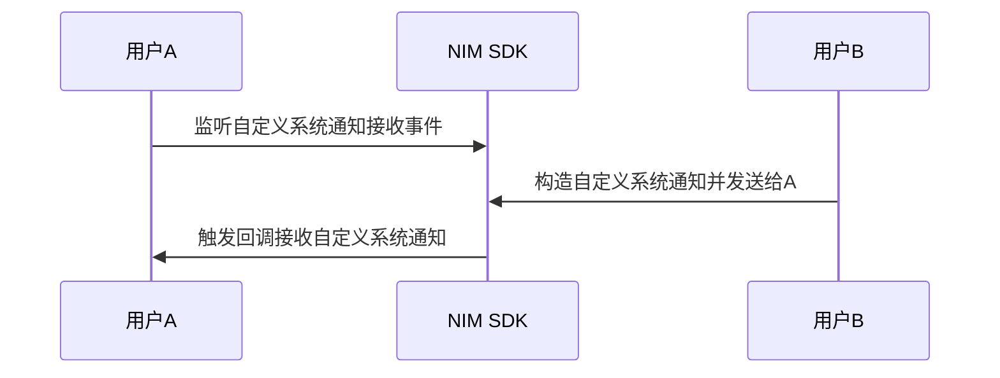

<!--keywords: 自定义系统通知,构造,发送,接收,推送-->


NIM SDK 支持自定义系统通知的收发，帮助您快速实现多样化的业务场景。

本文介绍通过网易云信 NIM SDK 实现自定义系统通知的技术原理、具体的实现流程以及典型的应用场景。

## 技术原理

NIM SDK 提供自定义系统通知，其对应的数据结构为 [`NIMCustomSystemNotification`](https://doc.yunxin.163.com/docs/interface/messaging/iOS/doxygen/Latest/zh/d8/d71/interface_n_i_m_custom_system_notification.html)（支持自定义配置项）。自定义系统通知既可以由客户端发起，也可以由开发者服务器发起。SDK 仅透传自定义系统通知，不负责解析和存储。通知内容由第三方 APP 自由扩展。

开发者可以根据其业务逻辑自定义一些事件状态的通知，来实现各种业务场景。例如实现单聊场景中的对方“正在输入”的功能。

NIM SDK 通过 `NIMSystemNotificationManagerDelegate` 中的[`onReceiveCustomSystemNotification:`](https://doc.yunxin.163.com/docs/interface/messaging/iOS/doxygen/Latest/zh/d2/d52/protocol_n_i_m_system_notification_manager_delegate-p.html#aa17db317ec72861c3b203e34187a3964) 方法监听自定义系统通知回调； `NIMSystemNotificationManager` 中的 [`sendCustomNotification:`](https://doc.yunxin.163.com/docs/interface/messaging/iOS/doxygen/Latest/zh/de/d93/protocol_n_i_m_system_notification_manager-p.html#abdd436a7e194ecbbc53d9dcc7968f033) 方法发送自定义系统通知。

## <span id="实现流程">实现流程</span>




1. 通过调用[`onReceiveCustomSystemNotification:`](https://doc.yunxin.163.com/docs/interface/messaging/iOS/doxygen/Latest/zh/d2/d52/protocol_n_i_m_system_notification_manager_delegate-p.html#aa17db317ec72861c3b203e34187a3964) 方法监听自定义系统通知回调。

**示例代码：**
```
```

2. 根据自定义系统通知的数据结构[`NIMCustomSystemNotification`](https://doc.yunxin.163.com/docs/interface/messaging/iOS/doxygen/Latest/zh/d8/d71/interface_n_i_m_custom_system_notification.html) 构造自定义系统通知，并调用[`sendCustomNotification:`](https://doc.yunxin.163.com/docs/interface/messaging/iOS/doxygen/Latest/zh/de/d93/protocol_n_i_m_system_notification_manager-p.html#abdd436a7e194ecbbc53d9dcc7968f033) 方法发送自定义系统通知。

::: note notice
- 自定义系统通知的发送仅支持个人和群，不支持聊天室。
- 一秒内默认最多调用该接口100次。如需上调上限，请在官网首页通过微信、在线消息或电话等方式咨询商务人员。
:::

**`sendCustomNotification:`参数说明：**

|参数|类型|说明
|:---|:---|:---
|notification|[`NIMCustomSystemNotification`](https://doc.yunxin.163.com/docs/interface/messaging/iOS/doxygen/Latest/zh/d8/d71/interface_n_i_m_custom_system_notification.html)|自定义的系统通知
|session|[`NIMSession`](https://doc.yunxin.163.com/docs/interface/messaging/iOS/doxygen/Latest/zh/d3/de1/interface_n_i_m_session.html)|自定义系统通知接收方

**`NIMCustomSystemNotification`重要参数说明：**

|参数   |类型   |说明   |
|---   |---| ---|
|receiver   |NSString    |  接收者 ID，群 ID或者用户 ID  |
|receiverType|[`NIMSessionType`](https://doc.yunxin.163.com/docs/interface/messaging/iOS/doxygen/Latest/zh/d1/d48/_n_i_m_session_8h.html#ab5e4034f0bb5e3e78d3675f27c02680e)|通知接受者类型，即接收者所处的会话场景|
|content|NSString|自定义系统通知的具体内容|
|sendToOnlineUsersOnly|BOOL|是否只发送给在线用户<br/>默认为YES。若设为NO，通知接受者在通知投递时不在线,那么他会在下次登录时收到该通知|
|apnsContent  |NSString    |  APNS 推送文案，长度限制500字 |
|apnsPayload   |NSDictionary    |  APNS 推送 Payload <br/>可通过该字段自定义通知的推送Payload，支持字段参考苹果技术文档，最多支持2K|
|setting   |[`NIMCustomSystemNotificationSetting`](https://doc.yunxin.163.com/docs/interface/messaging/iOS/doxygen/Latest/zh/d8/d4b/interface_n_i_m_custom_system_notification_setting.html) | 自定义系统通知设置<br/>可通过该字段制定当前通知的各种设置，如是否需要计入推送未读，是否需要带推送前缀等 |
|[`initWithContent:`](https://doc.yunxin.163.com/docs/interface/messaging/iOS/doxygen/Latest/zh/d8/d71/interface_n_i_m_custom_system_notification.html#a2189f89faeb8393f77659db8ce897595)|instancetype|自定义系统通知初始化方法|

**`NIMCustomSystemNotificationSetting` 配置项说明：**
|参数|说明|
|:---|:---|
|apnsEnabled | 是否需要苹果推送<br/>默认为YES。若设为NO，将不再有苹果推送通知|
|apnsWithPrefix | 苹果推送是否需要带前缀（一般为昵称）<br/>默认为NO。若设为YES，推送将带有前缀(xx:)|
|shouldBeCounted |是否需要被计入苹果推送通知的未读计数<br>默认为YES。默认情况下，用户收到的自定义系统通知会在应用图标上累计未读|

**示例代码：**
```objc
NSDictionary *dict = @{
                        NTESNotifyID : @(NTESCustom),
                        NTESCustomContent : content,
                      };
NSData *data = [NSJSONSerialization dataWithJSONObject:dict
                                               options:0
                                                 error:nil];
NSString *json = [[NSString alloc] initWithData:data
                                       encoding:NSUTF8StringEncoding];
// 初始化自定义系统通知内容，并返回实例
NIMCustomSystemNotification *notification = [[NIMCustomSystemNotification alloc] initWithContent:json];
// 设置推送文案
notification.apnsContent = content;
// 设置只发给在线用户，若接收者不在线，则收不到。
notification.sendToOnlineUsersOnly = NO;

NIMCustomSystemNotificationSetting *setting = [[NIMCustomSystemNotificationSetting alloc] init];
// 默认为YES。默认情况下，用户收到的自定义系统通知会在应用图标上累计未读。
setting.shouldBeCounted = NO;
// 消息需要推送
setting.apnsEnabled = YES;
// 推送是否需要带昵称前缀。默认为NO。
setting.apnsWithPrefix = YES;
notification.setting = setting;
[[[NIMSDK sharedSDK] systemNotificationManager] sendCustomNotification:notification
                                                             toSession:session
                                                            completion:nil];
```


3. 触发回调，收到自定义系统通知。

<!--

## 典型应用场景

这里以实现单聊场景中的对方“正在输入”的功能为例，示例代码如下：

```

```
-->

