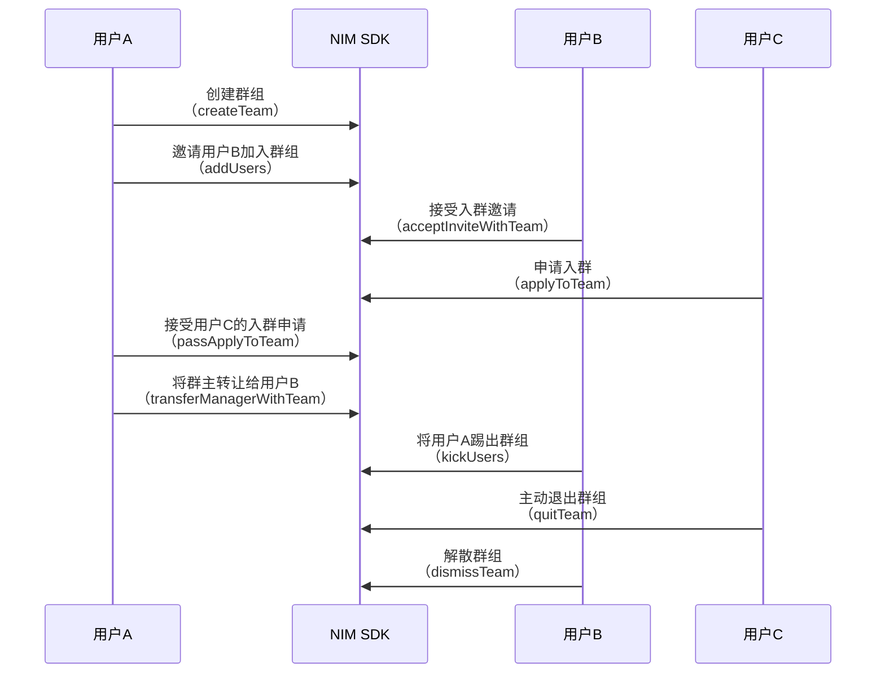

<!-- keywords: IM群组,高级群,群组管理,创建,解散,转让,更新,退出 -->


网易云信 NIM SDK 提供了高级群形式的群组功能，支持用户创建、加入、退出、转让、修改、查询、解散群组，拥有完善的管理功能。

SDK 的 [`NIMTeamManager`](https://doc.yunxin.163.com/docs/interface/messaging/iOS/doxygen/Latest/zh/dd/d54/protocol_n_i_m_team_manager-p.html) 提供群组操作相关接口， [`NIMTeamManagerDelegate`](https://doc.yunxin.163.com/docs/interface/messaging/iOS/doxygen/Latest/zh/d5/df3/protocol_n_i_m_team_manager_delegate-p.html) 提供群组相关回调接口，帮助您快速实现和使用群组的管理功能。 

## 群组相关事件监听

在进行群组操作前，您可以提前注册监听群相关事件。监听后，在进行群组管理相关操作时，会收到对应的通知。

可以根据用户需求，监听以下事件回调。

- [`onTeamAdded:`](https://doc.yunxin.163.com/docs/interface/messaging/iOS/doxygen/Latest/zh/d5/df3/protocol_n_i_m_team_manager_delegate-p.html#a1cf7904ac10714a86a0cbfeb0781daa7)：新增群组的回调
- [`onTeamUpdated:`](https://doc.yunxin.163.com/docs/interface/messaging/iOS/doxygen/Latest/zh/d5/df3/protocol_n_i_m_team_manager_delegate-p.html#a2768c078a299e1aa62724103fe1d70f0)：群组更新的回调
- [`onTeamRemoved:`](https://doc.yunxin.163.com/docs/interface/messaging/iOS/doxygen/Latest/zh/d5/df3/protocol_n_i_m_team_manager_delegate-p.html#a97e7e89df1caeee34021eebcdfbc32f5)：移除群组的回调
- [`onTeamMemberChanged:`](https://doc.yunxin.163.com/docs/interface/messaging/iOS/doxygen/Latest/zh/d5/df3/protocol_n_i_m_team_manager_delegate-p.html#a23c28fbbe5e0de788b009c693ec9d727)：群组成员变动回调,包括数量增减以及成员属性变动
- [`onTeamMemberUpdated:withMembers:`](https://doc.yunxin.163.com/docs/interface/messaging/iOS/doxygen/Latest/zh/d5/df3/protocol_n_i_m_team_manager_delegate-p.html#aa388a8a61bd811f17b133951fa04320f)：群组成员信息更新回调,包含有更新的群成员ID
- [`onTeamMemberRemoved:withMembers:`](https://doc.yunxin.163.com/docs/interface/messaging/iOS/doxygen/Latest/zh/d5/df3/protocol_n_i_m_team_manager_delegate-p.html#a8dde21a166921eb3150671b97ef827ec)：踢除群组成员回调,包含被移除的群成员ID

通过调用 [`addDelegate:`](https://doc.yunxin.163.com/docs/interface/messaging/iOS/doxygen/Latest/zh/dd/d54/protocol_n_i_m_team_manager-p.html#ab44be31567b2be69919c8be30bb01c6b) 方法添加群组相关事件的监听。

示例代码如下：
```
/// 自定义类实现 NIMTeamManagerDelegate 接口

/// 群组委托接口调用类声明
/// NIMTeamAdapter.h
@interface NIMTeamAdapter :NSObject<NIMTeamManagerDelegate>

@end

/// 群组委托接口调用类实现
/// NIMTeamAdapter.m
@implementation NIMTeamAdapter
/// 更改群组信息时的回调
- (void)onTeamUpdated:(NIMTeam *)team {
    NSLog(@"[On team updated, teamId: %@]", [team teamId]);
}
@end
...

/// main.m
/// 实例化接口调用的类
static NIMTeamAdapter *adpater;
adpater = [[NIMTeamAdapter alloc] init];
/// 添加群组委托
[[[NIMSDK sharedSDK] teamManager] addDelegate:adpater];
/// 更新群信息，触发委托
// [[[NIMSDK sharedSDK] teamManager] updateTeamName:@"TestDelegate"
//                                           teamId:@"6271272396"
//                                       completion:nil];
```

若想要取消监听，可调用[`removeDelegate:`](https://doc.yunxin.163.com/docs/interface/messaging/iOS/doxygen/Latest/zh/dd/d54/protocol_n_i_m_team_manager-p.html#a5af17947daaa814847cf81ba67f52181) 方法移除监听。


## 实现流程

本章节通过群主、管理员、普通成员之间的交互为例，介绍群组管理的实现流程。




## 创建群组

通过调用[`createTeam:completion:`](https://doc.yunxin.163.com/docs/interface/messaging/iOS/doxygen/Latest/zh/dd/d54/protocol_n_i_m_team_manager-p.html#a5e80e284d6c3f8fa95f0a1e03db52b87)方法创建群组，创建者即为该群群主。


::: note notice
原创建群接口 `createTeam:users:completion:`已废弃。
:::


| 参数  |类型 | 说明     |
|  ----   | ---|------ |
|name|NSString | 群名|
|type| `NIMTeamType`| 群组类型<note type=note>默认为 `NIMTeamTypeAdvanced`，即高级群。高级群拥有完善的成员权限体系及管理功能。为避免产生问题，不建议使用其他取值。</note> |
|avatarUrl|NSString|群头像|
|intro|NSString|群简介|
|announcement|NSString|群公告|
|clientCustomInfo|NSString|客户端自定义信息|
|postscript|NSString|邀请他人的附言|
|joinMode | `NIMTeamJoinMode`| 群验证模式<br/>NIMTeamJoinModeNoAuth：（默认）不需要验证，即允许所有人入群 <br/>NIMTeamJoinModeNeedAuth：加此群需要相关人员的验证   <br/>NIMTeamJoinModeRejectAll：不允许任何人加入 <note type=notice>该参数只有在群类型为高级群时有效。</note>|
|inviteMode| `NIMTeamInviteMode`| 群组邀请模式<br/>NIMTeamInviteModeManager：（默认）管理员，仅限管理员可以邀请人进群<br/>NIMTeamInviteModeAll：所有人，所有人都可以邀请人进群 <note type=notice>该参数只有在群类型为高级群时有效。</note>  |
|beInviteMode|`NIMTeamBeInviteMode`| 被邀请模式<br/>NIMTeamBeInviteModeNeedAuth：（默认）此群邀请某人，需要此人验证通过才能加入<br>NIMTeamBeInviteModeNoAuth：不需要验证<br/>  <note type=notice>该参数只有在群类型为高级群时有效。</note> |
|updateInfoMode | `NIMTeamUpdateInfoMode`| 群信息修改权限<br/>NIMTeamUpdateInfoModeManager：（默认）管理员，仅限管理员可以修改群信息<br/>NIMTeamUpdateInfoModeAll：所有人，所有人都可以修改  <note type=notice>该参数只有在群类型为高级群时有效。</note>|
|updateClientCustomMode|`NIMTeamUpdateClientCustomMode`|客户端群信息自定义字段修改权限<br/>NIMTeamUpdateClientCustomModeManager：（默认）管理员<br/>NIMTeamUpdateClientCustomModeAll ：所有人   <note type=notice>该参数只有在群类型为高级群时有效。</note>|
|maxMemberCountLimitation| NSUInteger| 群最大人数上限，默认 200 人|
|antispamBusinessId|NSString|需要进行内容审核的业务ID|
| users | NSArray<NSString *>| 邀请用户列表 |


**示例代码：**

```
NIMCreateTeamExOption *option = [NIMCreateTeamExOption new];
[option setName:@"一个被创建的群聊"];
[option setType:NIMTeamTypeAdvanced];
[option setIntro:@"一个被创建的群聊的简介"];
/// users 用户Accid列表
[option setUsers:@[@"user01", @"user02"]];
/// completion 完成后的回调
NIMTeamCreateHandler completion = ^(NSError * __nullable error,
        NSString * __nullable teamId,
        NSArray<NSString *> * __nullable failedUserIds)
{
    if (error == nil) {
        /// 群组创建成功
        NSLog(@"[Create team succeeded, teamId: %@]", teamId);
        /// your code ...
    } else {
        /// 群组创建失败
        NSLog(@"[NSError message: %@]", error);
    }
};
/// 创建群组
[[[NIMSDK sharedSDK] teamManager] createTeam:option completion:completion];
```


## 加入群组

加入群组可以通过以下两种方式：
- 用户接受邀请入群。
- 用户主动申请入群。

### 邀请入群

::: note note
邀请入群的权限可以通过 `inviteMode` 来定义，设为 `NIMTeamInviteModeManager`，那么仅限群主和管理员可以邀请人进群；设为 `NIMTeamInviteModeAll` ，那么群组内的所有人都可以邀请人进群。
:::

通过调用 [`addUsers:toTeam:postscript:attach:completion:`](https://doc.yunxin.163.com/docs/interface/messaging/iOS/doxygen/Latest/zh/dd/d54/protocol_n_i_m_team_manager-p.html#aacfc27ca5b9158de7992f147abf25037) 方法邀请其他用户进入群组。
  - 若群组的被邀请模式 `beInviteMode` 为 `NIMTeamBeInviteModeNoAuth`，那么无需验证，其他用户可直接加入群组。
  - 若群组的被邀请模式 `beInviteMode` 为 `NIMTeamBeInviteModeNeedAuth`，那么需要被邀请用户同意才能加入群组。
  
如果在被邀请成员中存在成员拥有的群组数量已达上限，则会返回失败成员的账号列表。

**参数说明：**

| 参数   | 说明     |
|  ----    | --------- |
|teamId  | 群ID |
|users| 邀请入群的用户账号列表|
|attach|自定义扩展字段，不需要的话设置为空 ，最长512字符|
|postscript|邀请附言，不需要的话设置为空|
|completion|完成后的回调|


- 发起邀请后，被邀请用户会收到 [`NIMSystemNotification`](https://doc.yunxin.163.com/docs/interface/messaging/iOS/doxygen/Latest/zh/d0/db5/interface_n_i_m_system_notification.html) 系统通知，其通知类型为`NIMSystemNotificationTypeTeamInvite`。在通知中可以获取邀请人 ID、邀请进入的群组 ID 以及邀请附言。
- 被邀请用户可以调用 [`acceptInviteWithTeam`](https://doc.yunxin.163.com/docs/interface/messaging/iOS/doxygen/Latest/zh/dd/d54/protocol_n_i_m_team_manager-p.html#aee60c03642d42b53395ab97051764e05) 方法接受入群邀请，接受即入群。所有群成员会收到群组通知消息（消息类型为 `NIMMessageTypeNotification`），触发事件为 `NIMTeamOperationTypeAcceptInvitation`。
- 也可以调用 [`rejectInviteWithTeam`](https://doc.yunxin.163.com/docs/interface/messaging/iOS/doxygen/Latest/zh/dd/d54/protocol_n_i_m_team_manager-p.html#ae800ceef71b6a74ce4613556d1a219ac) 方法拒绝入群邀请。拒绝后，邀请者会收到 [`NIMSystemNotification`](https://doc.yunxin.163.com/docs/interface/messaging/iOS/doxygen/Latest/zh/d0/db5/interface_n_i_m_system_notification.html) 系统通知，其通知类型为 `NIMSystemNotificationTypeTeamApplyReject`。

**示例代码：**

```
 /// users 待邀请入群用户Accid列表
    NSArray<NSString *> *users = [NSArray arrayWithObjects:@"ios01", @"ios02", nil];
    /// teamId 邀请进入的群组 ID
    NSString *teamId = @"6271272396";
    /// postscript 邀请附言，选填
    NSString *postscript = @"邀请你进入群聊";
    /// attach 扩展消息，选填
    NSString *attach = @"扩展消息";
    /// completion 完成后的回调
    NIMTeamMemberHandler completion = ^(NSError * __nullable error, NSArray<NIMTeamMember *> * __nullable members)
    {
        if (error == nil) {
            /// 邀请用户入群成功，members 为成功邀请的群成员列表
            NSLog(@"[Add %lu users to team: %@ succeed]", (unsigned long)[members count], teamId);
            /// your code ...
        } else {
            /// 邀请用户入群失败
            NSLog(@"[NSError message: %@]", error);
        }
    };
    /// 邀请用户入群
    [[[NIMSDK sharedSDK] teamManager] addUsers:users
                                        toTeam:teamId
                                    postscript:postscript
                                        attach:attach
                                    completion:completion];

//接受入群邀请
    NSString *teamId = @"6271272396";
    /// invitorId 邀请者ID
    NSString *invitorId = @"ios02";
    /// completion 完成后的回调
    NIMTeamHandler completion = ^(NSError * __nullable error)
    {
        if (error == nil) {
            /// 接受入群邀请成功
            NSLog(@"[Accept invite of invitor: %@ in team: %@ succeed.]", invitorId, teamId);
            /// your code ...
        } else {
            /// 接受入群邀请失败
            NSLog(@"[NSError message: %@]", error);
        }
    };
    /// 接受入群邀请
    [[[NIMSDK sharedSDK] teamManager] acceptInviteWithTeam:teamId
                                                 invitorId:invitorId
                                                completion:completion];


//拒绝入群邀请
    NSString *teamId = @"6271272396";
    /// invitorId 邀请者ID
    NSString *invitorId = @"ios02";
    /// rejectReason 拒绝原因
    NSString *rejectReason = @"不想加入该群";
    /// completion 完成后的回调
    NIMTeamHandler completion = ^(NSError * __nullable error)
    {
        if (error == nil) {
            /// 拒绝入群邀请成功
            NSLog(@"[Reject invite of invitor: %@ in team: %@ succeed.]", invitorId, teamId);
            /// your code ...
        } else {
            /// 拒绝入群邀请失败
            NSLog(@"[NSError message: %@]", error);
        }
    };
    /// 拒绝入群邀请
    [[[NIMSDK sharedSDK] teamManager] rejectInviteWithTeam:teamId
                                                 invitorId:invitorId
                                              rejectReason:rejectReason
                                                completion:completion];
```  
  

### 申请入群

通过调用 [`applyToTeam:message:completion:`](https://doc.yunxin.163.com/docs/interface/messaging/iOS/doxygen/Latest/zh/dd/d54/protocol_n_i_m_team_manager-p.html#a73618ed08c6a6fd056b18222b1c03ea0) 方法申请加入群组。
  - 若群组的加入模式 `joinMode` 为 `NIMTeamJoinModeNoAuth`，那么无需验证，其他用户可直接加入群组。
  - 若群组的加入模式 `joinMode` 为 `NIMTeamJoinModeNeedAuth`，那么需要群主或者群管理员同意才能加入群组。
  - 若群组的加入模式 `joinMode` 为 `NIMTeamJoinModeRejectAll`，那么该群组不接受入群申请，仅能通过邀请方式入群。


**参数说明：**

| 参数 | 说明     |
|  ----  | --------- |
|teamId | 群ID |
|message|申请附言|
|completion|完成后的回调|


- 当用户发起入群申请后，该群群主和管理员会收到 [`NIMSystemNotification`](https://doc.yunxin.163.com/docs/interface/messaging/iOS/doxygen/Latest/zh/d0/db5/interface_n_i_m_system_notification.html) 系统通知，其通知类型为`NIMSystemNotificationTypeTeamApply`。
- 群主和群管理员可以调用 [`passApplyToTeam`](https://doc.yunxin.163.com/docs/interface/messaging/iOS/doxygen/Latest/zh/dd/d54/protocol_n_i_m_team_manager-p.html#a0db8a5eb8054e80a0ac684c5c299ae85) 方法接受入群申请，接受即入群。所有群成员会收到群组通知消息（消息类型为 `NIMMessageTypeNotification`），触发事件为 `NIMTeamOperationTypeApplyPass`。
- 群主和群管理员也可以调用 [`rejectApplyToTeam`](https://doc.yunxin.163.com/docs/interface/messaging/iOS/doxygen/Latest/zh/dd/d54/protocol_n_i_m_team_manager-p.html#a4c20011145877be9ebdfff552b7c123d) 方法拒绝入群申请。拒绝后，申请者会收到 [`NIMSystemNotification`](https://doc.yunxin.163.com/docs/interface/messaging/iOS/doxygen/Latest/zh/d0/db5/interface_n_i_m_system_notification.html) 系统通知，其通知类型为 `NIMSystemNotificationTypeTeamIviteReject`。

**示例代码：**

```
    NSString *teamId = @"6271272396";
    /// message 申请时的附言
    NSString *message = @"我要申请加群";
    /// completion 完成后的回调
    NIMTeamApplyHandler completion = ^(NSError * __nullable error, NIMTeamApplyStatus applyStatus)
    {
        if (error == nil) {
            /// 群申请成功
            NSLog(@"[Apply to team: %@ succeed, apply status: %ld]", teamId,(long)applyStatus);
            /// your code ...
        } else {
            /// 群申请失败
            NSLog(@"[NSError message: %@]", error);
        }
    };
    /// 群申请
    [[[NIMSDK sharedSDK] teamManager] applyToTeam:teamId
                                          message:message
                                       completion:completion];


  //同意入群申请
    NSString *teamId = @"6271272396";
    /// userId 申请人ID
    NSString *userId = @"ios02";
    /// completion 完成后的回调
    NIMTeamApplyHandler completion = ^(NSError * __nullable error, NIMTeamApplyStatus applyStatus)
    {
        if (error == nil) {
            /// 通过群申请成功
            NSLog(@"[Pass apply in team: %@ of user: %@ succeed, apply status: %ld]", teamId, userId, (long)applyStatus);
            /// your code ...
        } else {
            /// 通过群申请失败
            NSLog(@"[NSError message: %@]", error);
        }
    };
    /// 通过群申请
    [[[NIMSDK sharedSDK] teamManager] passApplyToTeam:teamId
                                               userId:userId
                                           completion:completion];


  //拒绝入群申请
    NSString *teamId = @"6271272396";
    /// userId 申请人ID
    NSString *userId = @"ios02";
    /// rejectReason 拒绝申请理由
    NSString *rejectReason = @"拒绝用户入群";
    /// completion 完成后的回调
    NIMTeamHandler completion = ^(NSError * __nullable error)
    {
        if (error == nil) {
            /// 拒绝群申请成功
            NSLog(@"[Reject apply in team: %@ of user: %@ succeed]", teamId, userId);
            /// your code ...
        } else {
            /// 拒绝群申请失败
            NSLog(@"[NSError message: %@]", error);
        }
    };
    /// 拒绝群申请
    [[[NIMSDK sharedSDK] teamManager] rejectApplyToTeam:teamId
                                                 userId:userId
                                           rejectReason:rejectReason
                                             completion:completion];
```

## 转让群组

::: note note
只有群主才有转让群组的权限。
:::

通过调用 [`transferManagerWithTeam:newOwnerId:isLeave:completion:`](https://doc.yunxin.163.com/docs/interface/messaging/iOS/doxygen/Latest/zh/dd/d54/protocol_n_i_m_team_manager-p.html#ac4ec9959417bda6c4a9827ee3c66b52f) 方法将群组转让给其他成员。

- 转让群后, 群主身份转移，所有群成员会收到群组通知消息（消息类型为 `NIMMessageTypeNotification`），触发事件为 `NIMTeamOperationTypeTransferOwner`。
- 如果转让群的同时离开群, 那么相当于同时调用[`quitTeam`](https://doc.yunxin.163.com/docs/interface/messaging/iOS/doxygen/Latest/zh/dd/d54/protocol_n_i_m_team_manager-p.html#adaabefa04debd6b3d2a80450ef4650fb)主动退群。所有群成员会收到群组通知消息（消息类型为 `NIMMessageTypeNotification），触发事件为 `NIMTeamOperationTypeLeave`。
- 用户退群成功后，相关会话信息仍然会保留，但不再能接收关于此群的消息。


**参数说明：**

| 参数  | 说明     |
|  ----   | --------- |
|teamId| 群ID |
|newOwnerIdt|转让后的新群主账号|
|isLeave|转让群的同时是否退出该群<br/>true：退出<br/>false：不退出，身份变为普通群成员|
|completion|完成后的回调|

**示例代码：**

```
NSString *teamId = @"6271272396";
    /// newOwnerId 新群主ID
    NSString *newOwnerId = @"ios02";
    /// 是否离开本群
    BOOL isLeave = YES;
    NIMTeamHandler completion = ^(NSError * __nullable error)
    {
        if (error == nil) {
            /// 转移群主成功
            NSLog(@"[Transfer manager to new owner: %@ succeed.]", newOwnerId);
            /// your code ...
        } else {
            /// 转移群主失败
            NSLog(@"[NSError message: %@]", error);
        }
    };
    /// 转移群主
    [[[NIMSDK sharedSDK] teamManager] transferManagerWithTeam:teamId
                                                   newOwnerId:newOwnerId
                                                      isLeave:isLeave
                                                   completion:completion];
```

## 退出群组

退出群组可以通过以下两种方式：
- 群主或群组管理员将用户踢出群组。
- 用户主动退群。

### 踢人出群
::: note note
- 只有群主和管理员才能将成员踢出群组。
- 管理员不能踢群主和其他管理员。
:::

通过调用 [`kickUsers:fromTeam:completion:`](https://doc.yunxin.163.com/docs/interface/messaging/iOS/doxygen/Latest/zh/dd/d54/protocol_n_i_m_team_manager-p.html#aa8a62870ebcd426d10e24aa4e9ace291) 方法将成员踢出群组。

- 移除成员后，所有群成员会收到群组通知消息（消息类型为 `NIMMessageTypeNotification`），触发事件为 `NIMTeamOperationTypeKick`。
- 被踢出的用户相关会话信息仍然会保留，但不再能接收关于此群的消息。


**参数说明：**

| 参数 | 说明     |
|  ----  | --------- |
|teamId  | 群ID |
|users|被踢出的群成员账号列表|
|completion|完成后的回调|


**示例代码：**

```
/// users 待踢出用户Accid列表
    NSArray<NSString *> *users = [NSArray arrayWithObjects:@"ios02", nil];
    /// teamId 踢出群组的群组 ID
    NSString *teamId = @"6271272396";
    /// completion 完成后的回调
    NIMTeamHandler completion = ^(NSError * __nullable error)
    {
        if (error == nil) {
            /// 踢人出群成功
            NSLog(@"[Kick users from team: %@ succeed]", teamId);
            /// your code ...
        } else {
            /// 踢人出群失败
            NSLog(@"[NSError message: %@]", error);
        }
    };
    /// 踢出群组
    [[[NIMSDK sharedSDK] teamManager] kickUsers:users
                                       fromTeam:teamId
                                     completion:completion];
```

### 主动退群


通过调用 [`quitTeam:completion:`](https://doc.yunxin.163.com/docs/interface/messaging/iOS/doxygen/Latest/zh/dd/d54/protocol_n_i_m_team_manager-p.html#adaabefa04debd6b3d2a80450ef4650fb) 方法主动退出群组。

- 除群主（需先转让群主）外，其他用户均可以直接主动退群。主动退群后, 所有群成员会收到群组通知消息（消息类型为 `NIMMessageTypeNotification`），触发事件为 `NIMTeamOperationTypeLeave`。
- 用户退群成功后，相关会话信息仍然会保留，但不再能接收关于此群的消息。


**示例代码：**

```
/// teamId 为想要退出的群组 ID
    NSString *teamId = @"6271272396";
    /// completion 完成后的回调
    NIMTeamHandler completion = ^(NSError * __nullable error)
    {
        if (error == nil) {
            /// 退出群组成功
            NSLog(@"[Quit team succeeded, teamId: %@]", teamId);
            /// your code ...
        } else {
            /// 退出群组失败
            NSLog(@"[NSError message: %@]", error);
        }
    };
    /// 退出群组，注：群主需转让群主身份后才可退出
    [[[NIMSDK sharedSDK] teamManager] quitTeam:teamId
                                    completion:completion];
```


## 解散群组

::: note note
只有群主才能解散群组。
:::

通过调用 [`dismissTeam:completion:`](https://doc.yunxin.163.com/docs/interface/messaging/iOS/doxygen/Latest/zh/dd/d54/protocol_n_i_m_team_manager-p.html#a0e56af75d4bc3926905663369087d8fd) 方法解散群组。

解散群后, 所有群成员会收到群组通知消息（消息类型为 `NIMMessageTypeNotification`），触发事件为 `NIMTeamOperationTypeDismiss`。

群解散后，所有群用户关于此群会话会被保留，但是不能在此群会话中收发消息。


**示例代码：**

```
/// teamId 为想要解散的群组 ID
    NSString *teamId = @"6271321659";
    /// completion 完成后的回调
    NIMTeamHandler completion = ^(NSError * __nullable error)
    {
        if (error == nil) {
            /// 群组解散成功
            NSLog(@"[Dismiss team succeeded, teamId: %@]", teamId);
            /// your code ...
        } else {
            /// 群组解散失败
            NSLog(@"[NSError message: %@]", error);
        }
    };
    /// 解散群组
    [[[NIMSDK sharedSDK] teamManager] dismissTeam:teamId
                                       completion:completion];
```


## 修改群组信息

::: note note
修改群信息需要权限。若该群组的群信息修改权限（`updateInfoMode`）为 `NIMTeamUpdateInfoModeManager`，那么只有群主和管理员才能修改群组信息；若为 `NIMTeamUpdateInfoModeAll`，则群组内的所有人都可以修改群组信息。
:::

可修改的群组属性：群组名称、群组头像、群组简介、群组公告、入群验证方式、邀请模式、被邀请模式、群全体禁言模式、群信息修改权限、群自定义信息修改权限、群自定义信息等。

当用户更新群组信息后，所有群成员会收到群组通知消息（消息类型为 `NIMMessageTypeNotification`），触发事件为 `NIMTeamOperationTypeUpdate`。

### 修改群组的单个属性信息

群组属性的对应方法如下：

| 修改的群组属性  |对应的方法|说明
|---|----|-----|
|群组名称|[`updateTeamName:teamId:completion:`](https://doc.yunxin.163.com/docs/interface/messaging/iOS/doxygen/Latest/zh/dd/d54/protocol_n_i_m_team_manager-p.html#adb896ceb51f1a9cb7a8cdab798f197af)	|-
|群组头像|[`updateTeamAvatar:teamId:completion:`](https://doc.yunxin.163.com/docs/interface/messaging/iOS/doxygen/Latest/zh/dd/d54/protocol_n_i_m_team_manager-p.html#a1e6d96e1b21e7ff72878f8f0120848ac)|	群组头像若要上传到云信服务器上，则需要使用[头像资源处理](https://doc.yunxin.163.com/messaging/guide/DI3NjcxMDU?platform=iOS#头像资源处理)
|群组简介|[`updateTeamIntro:teamId:completion:`](https://doc.yunxin.163.com/docs/interface/messaging/iOS/doxygen/Latest/zh/dd/d54/protocol_n_i_m_team_manager-p.html#a13e7b2b2f8f9f9c0805e72ad86e712cb)|-	
|群组公告|[`updateTeamAnnouncement:teamId:completion:`](https://doc.yunxin.163.com/docs/interface/messaging/iOS/doxygen/Latest/zh/dd/d54/protocol_n_i_m_team_manager-p.html#a95a88ae5ae6f2decded57cbc4969f77f)|	-
|入群验证方式|[`updateTeamJoinMode:teamId:completion:`](https://doc.yunxin.163.com/docs/interface/messaging/iOS/doxygen/Latest/zh/dd/d54/protocol_n_i_m_team_manager-p.html#a4c320bcaaafe23cde22ae69e84068f0c)|	NIMTeamJoinModeNoAuth：不需要验证，即允许所有人入群 <br/>NIMTeamJoinModeNeedAuth：加此群需要相关人员的验证   <br/>NIMTeamJoinModeRejectAll：不允许任何人加入	
|被邀请模式|[`updateTeamBeInviteMode:teamId:completion:`](https://doc.yunxin.163.com/docs/interface/messaging/iOS/doxygen/Latest/zh/dd/d54/protocol_n_i_m_team_manager-p.html#aa3720325969c4d04685c6b0985b8645c)|NIMTeamBeInviteModeNoAuth：不需要验证<br/> NIMTeamBeInviteModeNeedAuth：此群邀请某人，需要此人验证通过才能加入
|邀请模式|	[`updateTeamInviteMode:teamId:completion:`](https://doc.yunxin.163.com/docs/interface/messaging/iOS/doxygen/Latest/zh/dd/d54/protocol_n_i_m_team_manager-p.html#a41fbbac790fe1ea648ce14bcb2254131)|NIMTeamInviteModeManager：管理员，仅限管理员可以邀请人进群<br/>NIMTeamInviteModeAll：所有人，所有人都可以邀请人进群
|群信息修改权限|[`updateTeamUpdateInfoMode:teamId:completion:`](https://doc.yunxin.163.com/docs/interface/messaging/iOS/doxygen/Latest/zh/dd/d54/protocol_n_i_m_team_manager-p.html#ace99f00c85828db6f1ac7cc617ba80f1)|NIMTeamUpdateInfoModeManager：管理员，仅限管理员可以修改群信息<br/>NIMTeamUpdateInfoModeAll：所有人，所有人都可以修改
|群自定义信息修改权限|[`updateTeamUpdateClientCustomMode:teamId:completion:`](https://doc.yunxin.163.com/docs/interface/messaging/iOS/doxygen/Latest/zh/dd/d54/protocol_n_i_m_team_manager-p.html#a57f609655993cae35c23c50b90adecce)|NIMTeamUpdateClientCustomModeManager：管理员<br/>NIMTeamUpdateClientCustomModeAll ：所有人
|群自定义信息|[`updateTeamCustomInfo:teamId:completion:`](https://doc.yunxin.163.com/docs/interface/messaging/iOS/doxygen/Latest/zh/dd/d54/protocol_n_i_m_team_manager-p.html#a48a4f3581ebff25f4164e3f845c89a1e)	|SDK 提供了群信息的拓展接口，开发者可以自行定义内容

这里以修改群组名称为例，请参考以下示例代码：
```
 /// teamName 待更新的群组名
    NSString *teamName = @"更新后的群组名";
    /// teamId 待更新群组名的群组ID
    NSString *teamId = @"6271272396";
    /// completion 完成后的回调
    NIMTeamHandler completion = ^(NSError * __nullable error)
    {
        if (error == nil) {
            /// 更新群组名成功
            NSLog(@"[Update team name to: %@ succeed]", teamName);
            /// your code ...
        } else {
            /// 更新群组名失败
            NSLog(@"[NSError message: %@]", error);
        }
    };
    /// 更新群组名
    [[[NIMSDK sharedSDK] teamManager] updateTeamName:teamName
                                              teamId:teamId
                                          completion:completion];
```

### 修改群组的多个属性信息


通过调用 [`updateTeamInfos:teamId:completion:`](https://doc.yunxin.163.com/docs/interface/messaging/iOS/doxygen/Latest/zh/dd/d54/protocol_n_i_m_team_manager-p.html#a4ac02fcc4f36f7da0314a9cf2dc39fe4) 方法批量修改群组的多个属性信息。


**参数说明：**
| 参数    | 说明     |
|  ----    | --------- |
|teamId|群ID|
|values|需要更新的群信息键值对|
|completion|完成后的回调|

传入的数据键值对为 `{@(NIMTeamUpdateTag) : NSString}`，无效数据将被过滤，具体请参见[`NIMTeamUpdateTag`](https://doc.yunxin.163.com/docs/interface/messaging/iOS/doxygen/Latest/zh/df/d8c/_n_i_m_team_notification_content_8h.html#a32609031ea8e31c2b14e711daf09bc69)。

**示例代码：**

```
NSDictionary<NSNumber *,NSString *> *values = @{
        @(NIMTeamUpdateTagName):@"一次性改群名",
        @(NIMTeamUpdateTagIntro):@"一次性改群简介",
        @(NIMTeamUpdateTagAnouncement):@"一次性改群公告"
    };
    /// teamId 待更新的群组ID
    NSString *teamId = @"6271272396";
    /// completion 完成后的回调
    NIMTeamHandler completion = ^(NSError * __nullable error)
    {
        if (error == nil) {
            /// 更新群信息成功
            NSLog(@"[Update team infos to: %@ succeed]", values[@(NIMTeamUpdateTagName)]);
            /// your code ...
        } else {
            /// 更新群信息失败
            NSLog(@"[NSError message: %@]", error);
        }
    };
    /// 更新群信息
    [[[NIMSDK sharedSDK] teamManager] updateTeamInfos:values
                                                teamId:teamId
                                            completion:completion];
接口：
```

### 修改本地群组信息

通过调用 [`updateTInfosLocal:`](https://doc.yunxin.163.com/docs/interface/messaging/iOS/doxygen/Latest/zh/dd/d54/protocol_n_i_m_team_manager-p.html#ae9c4a8fcddbb29b187ba15b0b395a037) 方法修改本地群组信息，不会同步到服务端。


**示例代码：**
```
/// updateTInfosLocal 通常搭配批量拉取群信息的服务使用，如 earchTeamWithOption:, fetchTeamsWithTimestamp:completion: 
    /// option 查询选项: 可设置搜索选项 为 id(01) 或 name(10) 或 id|name(11); 并设置搜索内容
    NIMTeamSearchOption *option = [NIMTeamSearchOption new];
    /// 设置搜索选项为 匹配TeamID
    [option setSearchContentOption:NIMTeamSearchContentOptiontId];
    /// 设置搜索内容为 @"6271272396"
    [option setSearchContent:@"6271272396"];
    /// completion 完成后的回调
    NIMTeamSearchHandler completion = ^(NSError * __nullable error, NSArray<NIMTeam *> * __nullable teams)
    {
        if (error == nil) {
            /// 查询群信息 成功，得到查询结果列表 teams
            NSLog(@"[Search team with option %@ total %ld team(s) succeed.]", [option searchContent], [teams count]);
            ///=================================================
            /// teams 待更新的群组列表
            NSArray<NIMTeam *> *updateTeams = teams;
            /// 更新群本地信息
            BOOL didUpdate = [[[NIMSDK sharedSDK] teamManager] updateTInfosLocal:updateTeams];
            ///=================================================
            NSLog(@"[Update team info result: %@.]", didUpdate ? @"YES" : @"NO");
        } else {
            /// 查询群信息 失败
            NSLog(@"[NSError message: %@]", error);
        }
        /// 查询群信息
        [[[NIMSDK sharedSDK] teamManager] searchTeamWithOption:option
                                                    completion:completion];
    };
```


## 查询群组信息

NIM SDK 在程序启动时会对本地群信息进行同步，所以只需要调用本地缓存接口获取群即可。 

SDK 支持批量查询自己加入的所有群组、以及根据单个群 id 查询指定群组。同样 SDK 也提供了远程获取群信息的接口。

### 查询所有群信息
通过调用[`fetchTeamsWithTimestamp:completion:`](https://doc.yunxin.163.com/docs/interface/messaging/iOS/doxygen/Latest/zh/dd/d54/protocol_n_i_m_team_manager-p.html#a672f8aab33af4715fff0527ccbd3ed7e)方法从服务端全量拉取群信息，并做本地持久化。


**参数说明：**
| 参数    | 说明     |
|  ----    | --------- |
|timestamp|0 表示全量获取群信息|
|block|完成后的回调|

**示例代码：**
```
 /// timeInterval 时间戳，0 表示全量获取群信息
    NSTimeInterval timeInterval = 0;
    /// completion 完成后的回调
    NIMTeamFetchTeamsHandler completion = ^(NSError * __nullable error, NSArray<NIMTeam *> * __nullable teams)
    {
        if (error == nil) {
            /// 获取所有群信息 成功
            NSLog(@"[Fetch %lu teams with timestamp.]", [teams count]);
        } else {
            /// 获取所有群信息 失败
            NSLog(@"[NSError message: %@]", error);
        }
    };
    /// 获取所有群信息
    [[[NIMSDK sharedSDK] teamManager] fetchTeamsWithTimestamp:timeInterval
                                                   completion:completion];
```


### 本地查询自己加入的所有群组

通过调用[`allMyTeams`](https://doc.yunxin.163.com/docs/interface/messaging/iOS/doxygen/Latest/zh/dd/d54/protocol_n_i_m_team_manager-p.html#a910dc932f569db7bf9bf5a6f86be63e5)方法从本地查询自己加入的所有群组。

示例代码如下：
```
/// teams 为加入的所有群组
    NSArray<NIMTeam*> *teams = [[[NIMSDK sharedSDK] teamManager] allMyTeams];
```

### 本地根据 ID 查询指定群组

通过调用[`teamById`](https://doc.yunxin.163.com/docs/interface/messaging/iOS/doxygen/Latest/zh/dd/d54/protocol_n_i_m_team_manager-p.html#aedebcd1b3ea14e4abe4340e7b93599b3) 方法从本地查询指定群组信息。

:::note notice
建议在主线程调用该方法，否则可能导致程序崩溃和数据读写丢失。
:::

示例代码如下：
```
/// teamId 为想要查询的群组 ID
    NSString *teamId = @"6121310012";
    /// team 为群组 ID 获取具体的群组信息，如果自己不在群里，则该接口返回 nil
    NIMTeam *team = [[[NIMSDK sharedSDK] teamManager] teamById:teamId];
```

**群组信息 SDK 本地存储说明：**

解散群、退出群或者被移出群时，本地数据库会继续保留该群组信息。如果用户手动清空全部本地数据，下次登录同步时，服务器将不同步无效的群组，用户将无法取得已退出群的群组信息。


### 从云端查询指定群组

- 通过调用[`fetchTeamInfo:completion:`](https://doc.yunxin.163.com/docs/interface/messaging/iOS/doxygen/Latest/zh/dd/d54/protocol_n_i_m_team_manager-p.html#acba814a3ebb956944bc22aeb9d737b32)方法从云端获取指定的单个群组。示例代码如下：
```
/// teamId 群组ID
    NSString *teamId = @"6271272396";
    /// completion 完成后的回调
    NIMTeamFetchInfoHandler completion = ^(NSError * __nullable error, NIMTeam * __nullable team)
    {
        if (error == nil) {
            /// 获取群信息 成功
            NSLog(@"[Fetch teamId:%@’s infomation: %@ succeed.]", teamId, [team teamName]);
            /// your code ...
        } else {
            /// 获取群信息  失败
            NSLog(@"[NSError message: %@]", error);
        }
    };
    /// 获取群信息
    [[[NIMSDK sharedSDK] teamManager] fetchTeamInfo:teamId
                                         completion:completion];
```
:::note note
如果查询的群是属于自己的群，则会更新本地缓存的群数据。
:::


- 通过调用[`fetchTeamInfoList:completion:`](https://doc.yunxin.163.com/docs/interface/messaging/iOS/doxygen/Latest/zh/dd/d54/protocol_n_i_m_team_manager-p.html#a92c2bfe2dad31e0bb076cec49d368d12)方法从云端获取指定的批量群组。示例代码如下：
```
/// 待获取的指定群 ID
    NSArray<NSString *> *teamsId = [NSArray arrayWithObjects:@"6271272396", nil];
    /// completion 完成后的回调
    NIMTeamFetchTeamInfoListHandler completion = ^(NSError * __nullable error,
                                                   NSArray<NIMTeam *> * __nullable teams,
                                                   NSArray<NSString *> * __nullable failedTeamIds)
    {
        if (error == nil) {
            /// 获取指定群ID信息 成功
            NSLog(@"[Fetch %lu teams succeeded, %lu failed in total.]", [teams count], [failedTeamIds count]);
        } else {
            /// 获取指定群ID信息 失败
            NSLog(@"[NSError message: %@]", error);
        }
    };
    /// 获取指定群ID信息
    [[[NIMSDK sharedSDK] teamManager] fetchTeamInfoList:teamsId
                                             completion:completion];
```

:::note note
- 批量查询时，若数组元素超过10个会取前10个。
- 批量查询是从服务端全量拉取群信息，不做本地持久化。
:::

## 群组检索

通过调用[`searchTeamWithOption:completion:`](https://doc.yunxin.163.com/docs/interface/messaging/iOS/doxygen/Latest/zh/dd/d54/protocol_n_i_m_team_manager-p.html#a99c45d3c1c037565c656e2fd20a26dc2)方法搜索与关键字匹配的所有群。

**`NIMTeamSearchOption`参数说明：**

| 参数    | 说明     |
|  ----    | --------- |
|searchContentOption|搜索文本的匹配区域，类型为 `NIMTeamSearchContentOption`|
|ignoreingCase|是否忽略大小写，默认 YES|
|searchContent|搜索关键字文本|

`NIMTeamSearchContentOption` 枚举说明：

```
typedef NS_OPTIONS(NSInteger, NIMTeamSearchContentOption ) {
   // 群名检索
   NIMTeamSearchContentOptiontName = 1 < < 0,
   // 群id检索
   NIMTeamSearchContentOptiontId = 1 < < 1,
   // 群名与群id均检索
   NIMTeamSearchContentOptionTeamAll = NIMTeamSearchContentOptiontName | NIMTeamSearchContentOptiontId,
};
```

示例代码如下：
```
/// option 查询选项: 可设置搜索选项 为 id(01) 或 name(10) 或 id|name(11); 并设置搜索内容
    NIMTeamSearchOption *option = [NIMTeamSearchOption new];
    /// 设置搜索选项为 匹配TeamID
    [option setSearchContentOption:NIMTeamSearchContentOptiontId];
    /// 设置搜索内容为 @"6271272396"
    [option setSearchContent:@"6271272396"];
    /// completion 完成后的回调
    NIMTeamSearchHandler completion = ^(NSError * __nullable error, NSArray<NIMTeam *> * __nullable teams)
    {
        if (error == nil) {
            /// 查询群信息 成功，得到查询结果列表 teams
            NSLog(@"[Search team with option %@ total %ld team(s) succeed.]", [option searchContent], [teams count]);
            /// your code ...
        } else {
            /// 查询群信息 失败
            NSLog(@"[NSError message: %@]", error);
        }
    };
    /// 查询群信息
    [[[NIMSDK sharedSDK] teamManager] searchTeamWithOption:option
                                                completion:completion];
```

