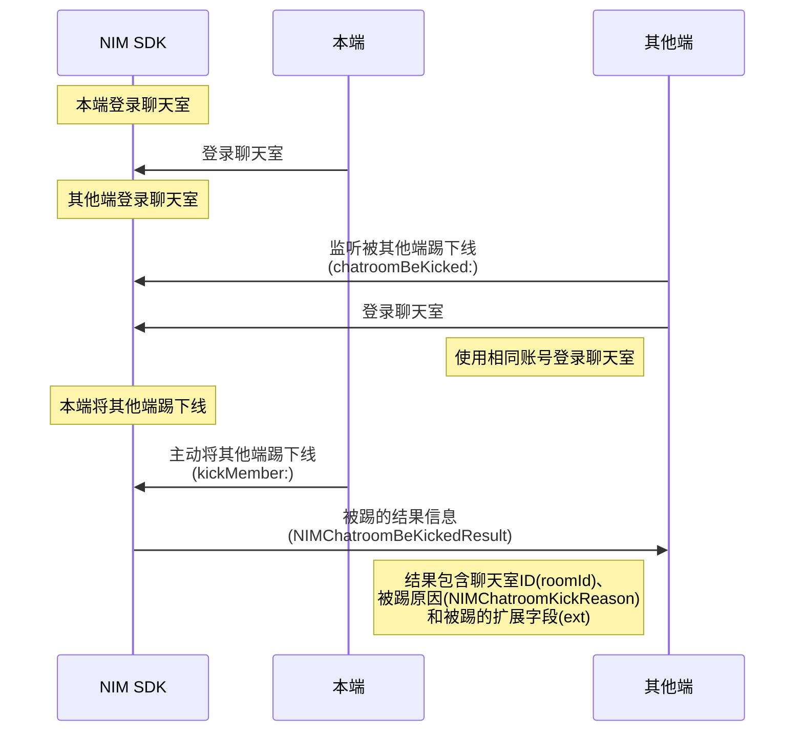

您可通过两种方式实现聊天室的多端登录与互踢。

## 方式一：通过云信控制台配置

当前 NIM SDK 支持通过云信控制台配置两种不同的聊天室多端登录策略：

- 只允许一端登录，Windows、Web、Android、iOS 彼此互踢。同一账号仅允许在一台设备上登录。当该账号在另一台设备上成功登录时，新设备会将旧设备踢下线。
- 各端均可以同时登录在线。最多可支持 10 个设备同时在线，在设备数上限内，所有的新设备再次登录，均不会将在线的旧设备踢下线。

通过该方式的配置，可实现自动管控聊天室的多端登录。具体如何配置，请参见[配置聊天室多端登录模式](https://doc.yunxin.163.com/messaging/guide/Dg2Mzc0Mzc?platform=iOS#配置聊天室多端登录模式)。

::: note note
- 控制台修改多端互踢的逻辑之后，下次新的设备登录时才会基于新的多端互踢策略进行校验，已经建立连接的设备不会因为策略的修改被强制踢出。
- 如果某台设备重复登录同一个聊天室，后登录的会将前面的长连接断开，此时会再触发一次进入聊天室的抄送，但是不会触发退出聊天室的抄送。关于进出聊天室（eventType=9）的抄送请参见[聊天室成员进出聊天室事件抄送](https://doc.yunxin.163.com/messaging/guide/TcxNzU4NzU?platform=server#聊天室成员进出聊天室事件抄送)。
:::

## 方式2：主动将其他端踢下线

### API 调用时序



### 踢方操作

1. [登录聊天室](https://doc.yunxin.163.com/messaging/guide/TExNzgxNzU?platform=iOS)。

2. 调用 [`kickMember:completion:`](https://doc.yunxin.163.com/docs/interface/messaging/iOS/doxygen/Latest/zh/d9/de7/protocol_n_i_m_chatroom_manager-p.html#aec4d2182867279027cef23a6297def04) 方法将其他同时登录的设备端踢下线。 

    ```
    /// 设置 将特定成员踢出聊天室 请求
    NIMChatroomMemberKickRequest *request = [[NIMChatroomMemberKickRequest alloc] init];
    /// 聊天室房号 roomId
    request.roomId = @"3021";
    /// 踢出聊天室的 userId
    request.userId = @"ios02";
    /// 将特定成员踢出聊天室 后的回调
    NIMChatroomHandler block = ^(NSError * __nullable error)
    {
        if (error == nil){
            /// 将特定成员踢出聊天室 成功
            NSLog(@"[Kick member succeeded.]");
            /// your code ...
        }else{
            /// 将特定成员踢出聊天室 失败
            NSLog(@"[NSError with: %@] ", error);
        }
    };
    /// 将特定成员踢出聊天室
    [[[NIMSDK sharedSDK] chatroomManager] kickMember:request
                                          completion:block];
    ```


### 被踢方操作

被踢的设备端，可在登录聊天室前，注册[`chatroomBeKicked:`](https://doc.yunxin.163.com/docs/interface/messaging/iOS/doxygen/Latest/zh/d8/d34/protocol_n_i_m_chatroom_manager_delegate-p.html#a02f35170600721729e2966fcc470d804)回调，监听被踢事件。被踢事件信息包含聊天室 ID（`roomId`）、被踢原因（[`NIMChatroomKickReason`](https://doc.yunxin.163.com/docs/interface/messaging/iOS/doxygen/Latest/zh/db/d35/_n_i_m_chatroom_manager_protocol_8h.html#a7b2dc923c9301ce086ed187485ef31a7)）和被踢的扩展字段（`ext`）。


收到被踢回调后，建议进行注销并切换到登录界面。


1. 注册[`chatroomBeKicked:`](https://doc.yunxin.163.com/docs/interface/messaging/iOS/doxygen/Latest/zh/d8/d34/protocol_n_i_m_chatroom_manager_delegate-p.html#a02f35170600721729e2966fcc470d804)回调，监听被踢事件。

    ```
    /// 自定义类实现 NIMChatroomManagerDelegate 接口
    /// 聊天室委托接口调用类声明
    /// NIMChatroomManagerDelegateImpl.h
    @interface NIMChatroomManagerDelegateImpl :NSObject<NIMChatroomManagerDelegate>

    @end

    /// 聊天室委托接口调用类实现
    /// NIMChatroomManagerDelegateImpl.m
    @implementation NIMChatroomManagerDelegateImpl

    /// 被踢时的回调
    - (void)chatroomBeKicked:(NIMChatroomBeKickedResult *)result {
        NSLog(@"[You are kicked because: %ld]", result.reason);
    }
    ```

    注册 & 移除 delegate：
    ```
    /// 实例化接口调用的类
    static NIMChatroomManagerDelegateImpl *delegateImpl;
    delegateImpl = [[NIMChatroomManagerDelegateImpl alloc] init];
    /// 添加聊天室委托
    [[[NIMSDK sharedSDK] chatroomManager] addDelegate:delegateImpl];
    /// 移除聊天室委托
    [[[NIMSDK sharedSDK] chatroomManager] removeDelegate:delegateImpl];
    ```


2. 用相同账号[登录聊天室](https://doc.yunxin.163.com/messaging/guide/TExNzgxNzU?platform=iOS)。

3. 被其他端踢下线后，收到被踢回调信息（`NIMChatroomBeKickedResult`）。


## 参考信息

`NIMChatroomKickReason` 枚举列表

|<div style="width:120px">参数</div>   |值   |说明   |
|---   |---| ---|
|NIMChatroomKickReasonInvalidRoom   |1    |  聊天室已经解散  |
|NIMChatroomKickReasonByManager   |2    | 被聊天室管理员踢出 |
|NIMChatroomKickReasonByConflictLogin   |3    |  多端被踢  |
|NIMChatroomKickReasonBlacklist   |5    | 被拉黑 |
