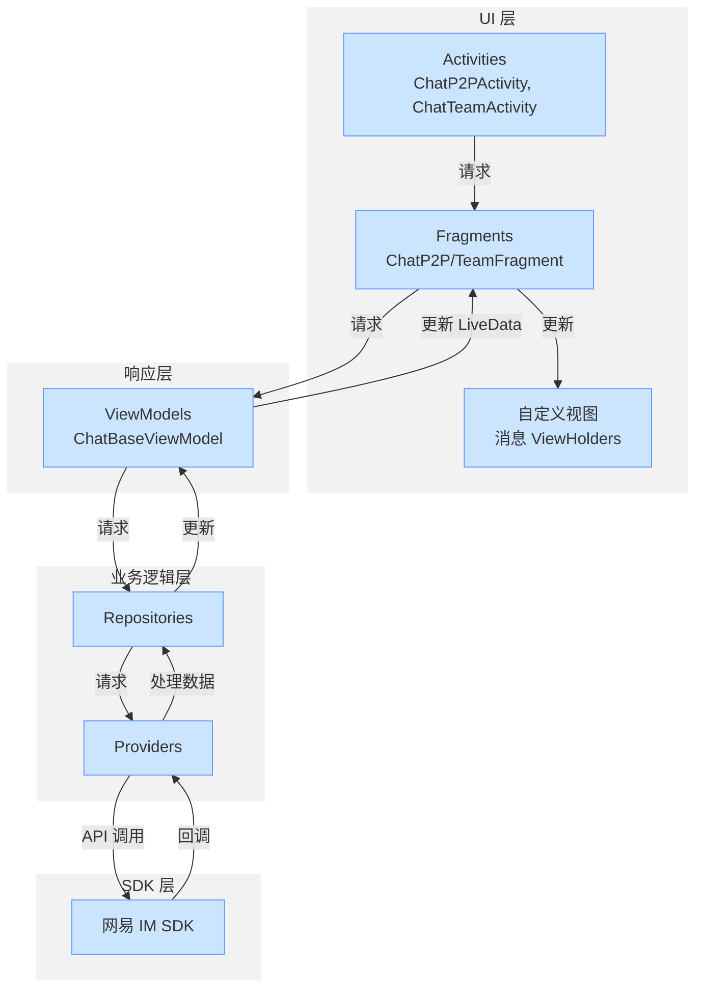
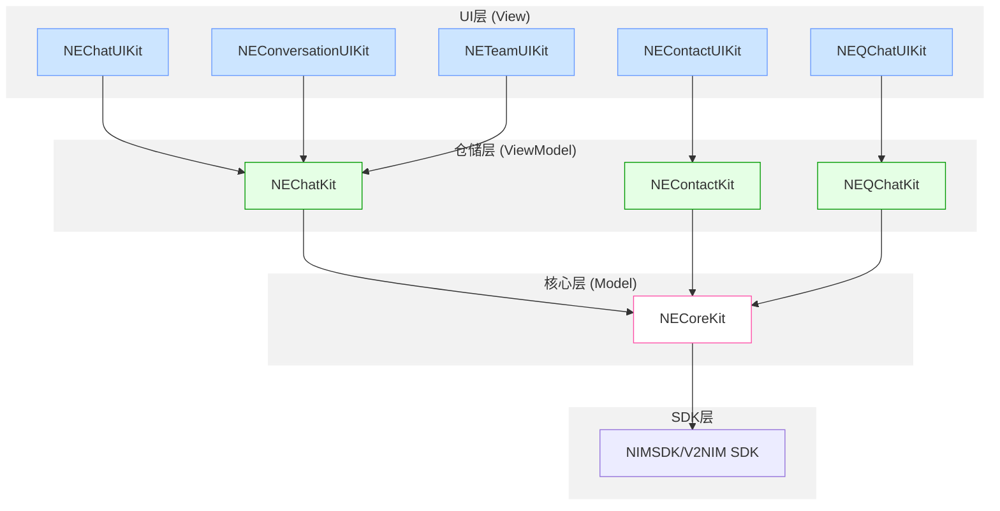
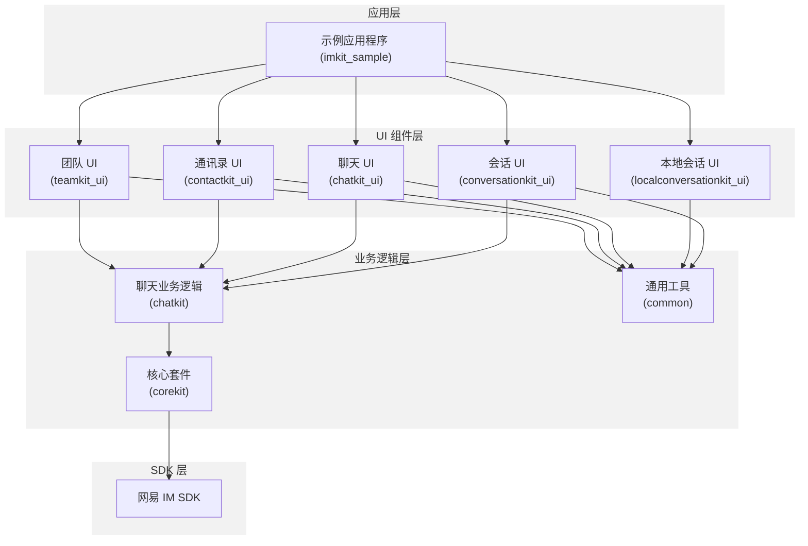
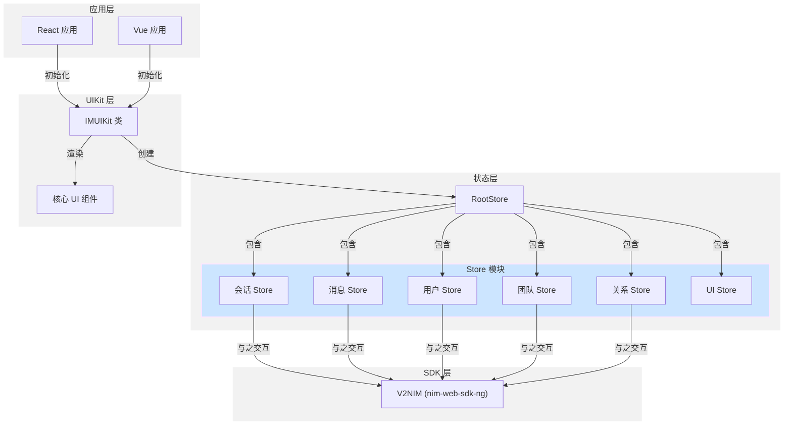
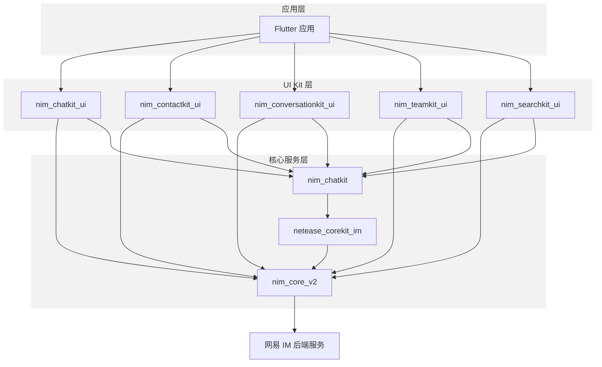
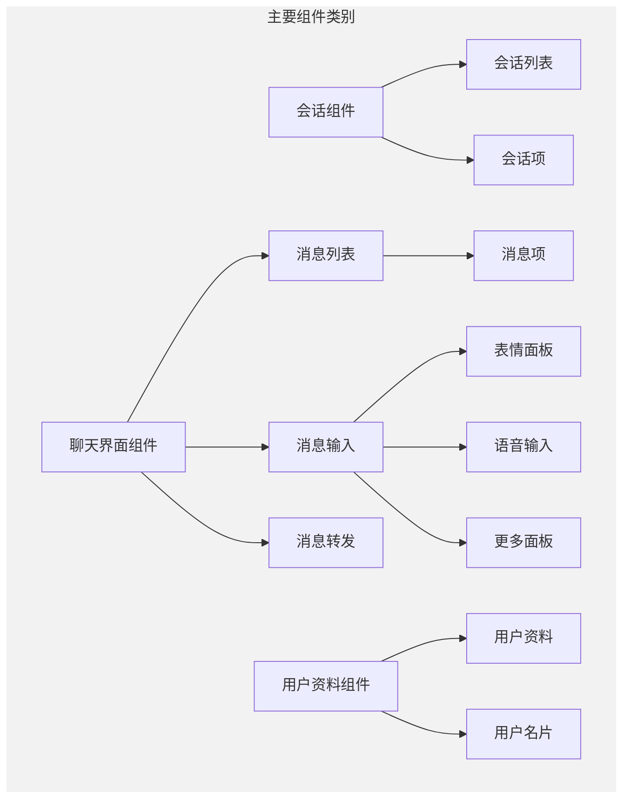

<!--keywords: UIKit,demo,IM UIKit,IMUIKit,Kit -->

网易云信 IM UIKit 是基于 [NIM SDK（网易云信 IM SDK）](https://doc.yunxin.163.com/messaging2/concept/DI0Nzc2NzA?platform=client) 开发的一款即时通讯 UI 组件库，包括聊天、会话、圈组、搜索、通讯录、群管理等组件。通过 IM UIKit，您可快速集成包含 UI 界面的即时通讯应用。

## 适用客群

IM UIKit 简化了基于 NIM SDK 的应用开发过程，适合需要快速集成和定制即时通讯功能的开发者和企业客户。它不仅能助您快速实现 UI 功能，也支持调用 NIM SDK 相应的接口实现即时通讯业务逻辑和数据处理。因此，您在使用 IM UIKit 时仅需关注自身业务或个性化扩展。

## 主要功能

IM UIKit 主要分为会话、群组、通讯录等几个 UI 子组件，每个 UI 组件负责展示不同的内容。更多详情，请参考 [功能概览](https://doc.yunxin.163.com/messaging-uikit/concept/zMzMDQ2MTg?platform=client) 和 [UI 组件介绍](https://doc.yunxin.163.com/messaging-uikit/concept/TI3NTgyNDA?platform=client)。

## 平台兼容

<table style="width:100%; table-layout:fixed;">
  <tr>
    <th style="width:14.28%;">安卓</th>
    <th style="width:14.28%;">iOS</th>
    <th style="width:14.28%;">Web</th>
    <th style="width:14.28%;">uni-app</th>
    <th style="width:14.28%;">H5</th>
    <th style="width:14.28%;">Flutter</th>
    <th style="width:14.28%;">鸿蒙</th>
  </tr>
  <tr>
    <td style="text-align:center;">✔️️</td>
    <td style="text-align:center;">✔️️</td>
    <td style="text-align:center;">✔️️</td>
    <td style="text-align:center;">✔️️</td>
    <td style="text-align:center;">✔️️</td>
    <td style="text-align:center;">✔️️</td>
    <td style="text-align:center;">✔️️</td>
  </tr>
</table>

::: note note
- Flutter UIKit 兼容 Android&iOS 平台。
- Web、H5、uni-app UIKit 支持 Vue（2/3）和 React 框架。
:::

## 功能优势

### 组件解耦

IM UIKit 不同组件可相互独立运行使用。您可按需选择组件，将其快速集成到您的应用，实现相应的 UI 功能，减少无用依赖。

### 简洁易用

- **Android、iOS、Flutter**：IM UIKit 的业务逻辑层与 UI 层相互独立。在 UI 层，您仅需关注视图展示和事件处理。IM UIKit 清晰的数据流转处理，让 UI 层代码更简洁易懂。
- **Web**：IM UIKit 提供 Provider 来管理各个组件之间的状态，开发者无需关心复杂状态的管理以及 NIM SDK 复杂接口的调用，只需引入并使用即可。

### 自定义能力

- **Android、iOS、Flutter**：IM UIKit 支持在各 UI 组件的初始化过程中配置自定义 UI。同时提供 Fragment（安卓）、Controller（iOS）、Widget（Flutter）和 View 的能力封装，助您快速将 UI 功能添加到您的应用中。
- **Web**：IM UIKit 提供 hooks 函数，以便用户获取内部状态进行一些自定义操作。另外还提供多个自定义渲染函数以及自定义主题修改，以供开发者自行定制 UI。另外还提供完善的语言设置功能，帮助开发者快速定制专属文案。

### 业务逻辑处理

IM UIKit 业务逻辑层提供完善的业务逻辑处理能力。您无需关心 SDK 层不同接口间的复杂处理逻辑，业务逻辑层一个接口帮您搞定所有。

## 工作原理

IM UIKit 采用 （Model–View–ViewModel）MVVM 架构模型，实现 UI 展示与业务逻辑开发的相互独立。

:::::: div linked-codes
::: code Android

<!--  -->

流程 | 说明
---- | ----
1 | IM UIKit 展示层的 Activity/Fragment/View 向响应层的 ViewModel 发送请求。
2 | ViewModel 将请求经由业务逻辑层转发至 NIM SDK（网易云信 IM SDK）。
3 | NIM SDK 接收请求后触发回调，回调数据经由业务逻辑层和响应层发送至 Activity/Fragment/View。
4 | Activity/Fragment/View 将回调数据发送至 RecyclerViewAdapter。后者根据界面需要展示的不同实体的 type，判定具体的 UI 样式。例如，SDK 返回的回调数据为消息数据时，RecyclerViewAdapter 可判定消息数据中包含的消息类型（即 type），将消息在 UI 上展示为对应类型的样式。

:::
::: code iOS
<!--  -->

流程 | 说明
---- | ----
1 | IM UIKit 展示层的 UIViewController/View 向响应层的 ViewModel 发送请求。
2 | ViewModel 将请求经由业务逻辑层转发至 NIM SDK（网易云信 IM SDK）。
3 | NIM SDK 接收请求后触发回调，回调数据经由业务逻辑层和响应层发送至 UIViewController/View。
4 | UIViewController/View 将回调数据发送至 UITableViewDelegate 和 UItableViewDataSource。后两者根据需在界面上展示的不同实体的 identifier，判定具体的 UI 样式。例如，SDK 返回的回调数据为消息数据时，UITableViewDelegate 和 UItableViewDataSource 可通过消息数据中包含的代表消息类型的 Identifier，将消息在 UI 上展示为对应类型的样式。
:::
::: code 鸿蒙

<!--  -->

上图中：

- **UIKit 组件 UI 层**：UI 组件中 UI 渲染和数据传递过程，通过业务逻辑层来进行数据获取和数据监听，UI 组件根据数据变更来刷新 UI。组件的被动刷新，采用鸿蒙系统提供的 @Local 装饰器，实现组件 UI 状态管理。
- **UIKit 业务逻辑层**：将 IM SDK 接口能力进行组装提供给 UI 层。
- **IM SDK**：IM UIKit 依赖的底层 [网易云信即时通讯 IM SDK](https://doc.yunxin.163.com/messaging2/concept/DI0Nzc2NzA?platform=client)。

:::
::: code Web
IM UIKit 提供了多个 UI 组件，您可以自行选择并组合。IM UIKit 利用 React Context API，内部管理了各个组件之间的状态，并利用 React 单向数据流来驱动 UI 更新与渲染。

<!--  -->

:::
::: code Flutter
<!-- 

流程 | 说明
---- | ----
1 | IM UIKit 展示层的 Widget 向响应层的 ViewModel 发送请求。
2 | ViewModel 将请求经由业务逻辑层转发至 NIM SDK（网易云信 IM SDK）。
3 | NIM SDK 接收请求后触发回调，回调数据经由业务逻辑层发送至响应层处理，随后通知 Wiget 刷新。
4 | Widget 从响应层获取到新变更的数据，后根据新的数据重新构建 Widget 完成刷新。 -->

该架构采用分层方法：
- UI Kit 层包含五个主要 UI 组件
- 核心服务层提供底层通信基础设施
- 每个 UI 组件与 NIM 核心 SDK (`nim_core_v2`)通信，实现后端服务集成

:::
::: code uni-app

该库遵循结构化的组件架构，将即时通讯的不同功能区域分开：

:::
::::::

## 组件架构

:::::: div linked-codes
::: code Android

上图中：

- UIKit 层的 `ContactKit-ui`、`ChatKit-ui`、`ConversationKit-ui` 和 `TeamKit-ui`，对应上述工作原理图中的 Activity/Fragment/View。
- UIKit 层的 `ChatKit`，对应上述工作原理图中的 Repository。
- CoreKit 层对应上述工作原理图中的 Provider。

:::
::: code iOS

上图中：

- UIKit UI 层的 `NEContactUIKit`、`NEChatUIKit`、`NEConversationUIKit` 和 `NETeamUIKit`，对应上述工作原理图中的 UIViewController/View。
- UIKit UI 层的 `NEChatKit`，对应上述工作原理图中的 Repository。
- NECoreKit 层对应上述工作原理图中的 Provider。

:::
::: code 鸿蒙

上图中：

- **Demo**：按照当前通用的 IM 场景，将 UI 组件组装成一个完整的 App。包括应用初始化、登录、UI 组件搭建首页和设置等功能。
- **UI 组件**：包含会话列表、消息、通讯录和群组四个组件，您可以根据自己的需求来选择集成一个或者多个。
- **业务接口层**：该模块根据 UI 组件的业务逻辑，将 IM SDK 的接口数据进行组合优化，为上层 UI 层提供更加便捷高效的接口。
- **组件框架和公共库**：提供组件的框架服务，包括组件之间的通信、初始化、公共能力，供上层组件使用。
- **IM SDK**：IM UIKit 依赖的底层 [网易云信即时通讯 IM SDK](https://doc.yunxin.163.com/messaging2/concept/DI0Nzc2NzA?platform=client)。

:::
::: code Web

:::
::: code Flutter

上图中：

- UIKit UI 层的 `nim_contactkit_ui`、`nim_chatkit_ui` 和 `nim_conversationkit_ui`，对应上述工作原理图中的 Widget Tree。
- UIKit UI 层的 `nim_contactKit`、`nim_chatKit` 和 `nim_conversationKit`，对应上述工作原理图中的 Repository。
- UIKitCore 层对应上述工作原理图中的 Provider。

:::
::::::

## 相关文档

:::::: div linked-codes
::: code Android

- IM UIKit 的功能清单，请参考 [IM UIKit 功能概览](https://doc.yunxin.163.com/messaging-uikit/concept/zMzMDQ2MTg)。
- IM UIKit 的集成流程，请参考 [集成开发文档](https://doc.yunxin.163.com/messaging-uikit/guide/DU4NzAzNzQ?platform=android)。
- IM UIKit 已支持音视频通话，具体实现流程请参考 [实现音视频通话功能](https://doc.yunxin.163.com/messaging-uikit/guide/jgxOTUyMjQ?platform=android)。

:::
::: code iOS

- IM UIKit 的功能清单，请参考 [IM UIKit 功能概览](https://doc.yunxin.163.com/messaging-uikit/concept/zMzMDQ2MTg)。
- IM UIKit 的集成流程，请参考 [集成开发文档](https://doc.yunxin.163.com/messaging-uikit/guide/DU4NzAzNzQ?platform=android)。
- IM UIKit 已支持音视频通话，具体实现流程请参考 [实现音视频通话功能](https://doc.yunxin.163.com/messaging-uikit/guide/zIzMTgxNDk?platform=iOS)。

:::
::: code 鸿蒙

- IM UIKit 的功能清单，请参考 [IM UIKit 功能概览](https://doc.yunxin.163.com/messaging-uikit/concept/zMzMDQ2MTg)。
- IM UIKit 的集成流程，请参考 [集成 IM UIKit](https://doc.yunxin.163.com/messaging-uikit/guide/TU4MTkzNTk?platform=harmonyos)。

:::
::: code Web

- IM UIKit 的功能清单，请参考 [IM UIKit 功能概览](https://doc.yunxin.163.com/messaging-uikit/concept/zMzMDQ2MTg)。
- IM UIKit 的集成流程，请参考 [集成 IM UIKit（React）](https://doc.yunxin.163.com/messaging-uikit/guide/TU3MDEwODY?platform=web) 或 [集成 IM UIKit（Vue.js）](https://doc.yunxin.163.com/messaging-uikit/guide/zE4MjQzOTQ?platform=web)。

:::
::: code Flutter

- IM UIKit 的功能清单，请参考 [IM UIKit 功能概览](https://doc.yunxin.163.com/messaging-uikit/concept/zMzMDQ2MTg)。
- IM UIKit 的集成流程，请参考 [集成 IM UIKit](https://doc.yunxin.163.com/messaging-uikit/guide/DA2MzEzNTA?platform=flutter)。

:::
::::::