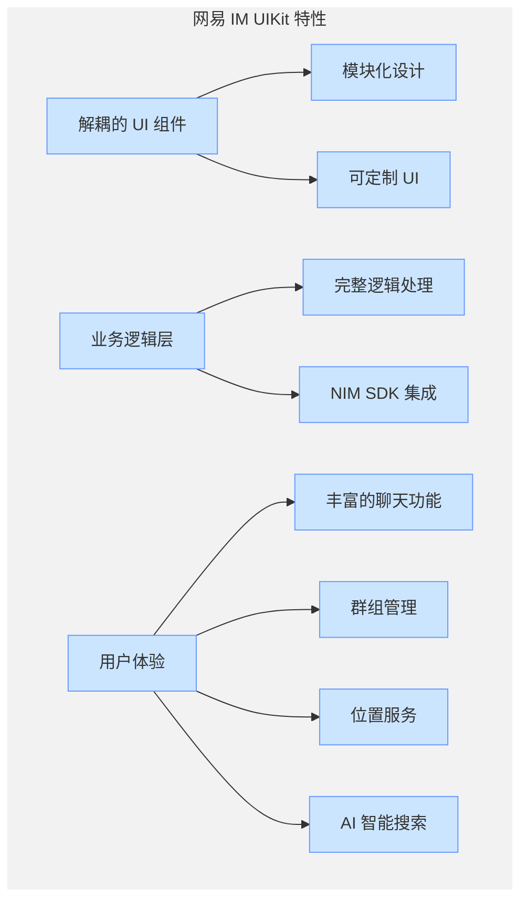
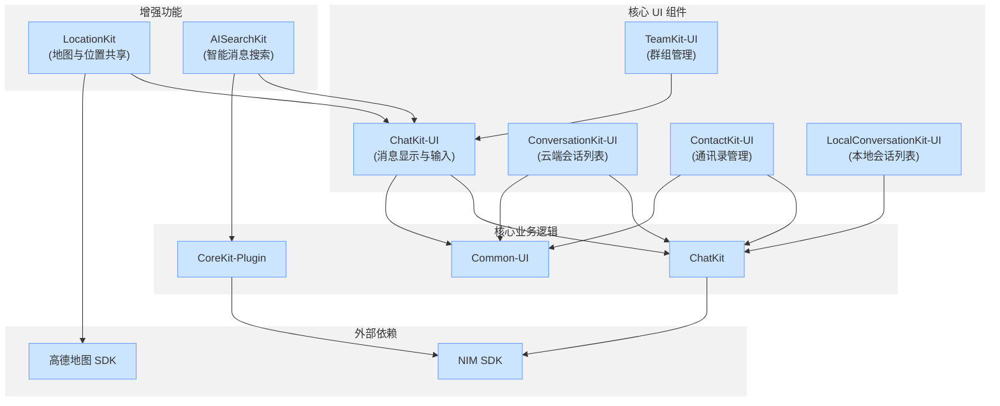
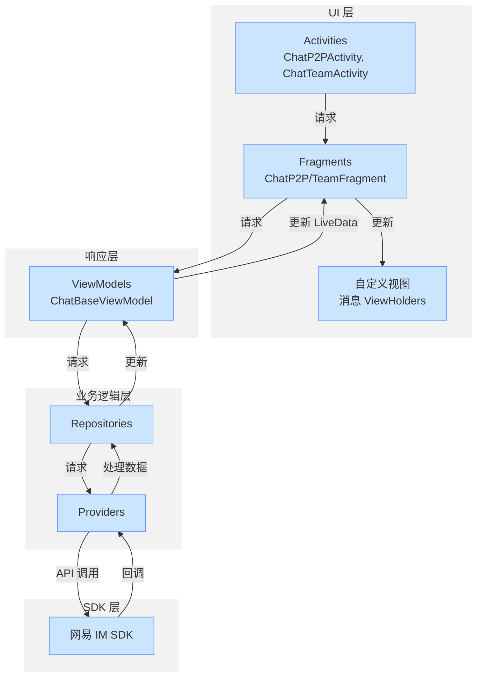

网易云信 IM UIKit for Android 是一个基于网易 IM SDK 构建的综合即时通讯 UI 组件库。该工具包提供了即用型 UI 组件，涵盖聊天、会话、通讯录、群组（Teams）以及位置共享和 AI 智能搜索等增强功能。通过使用 IM UIKit，您可以快速将功能完善的消息界面集成到他们的 Android 应用中，无需从零开始实现常见的消息 UI 模式。

:::note note
本文是 [DeepWiki - netease-kit/nim-uikit-android](https://deepwiki.com/netease-kit/nim-uikit-android/1-overview) 项目概述的英译中翻译版本，为您介绍 IM Demo 源码项目。您可以前往 [DeepWiki - netease-kit/nim-uikit-android](https://deepwiki.com/netease-kit/nim-uikit-android/1-overview) 查看更多内容，如需实现相关功能，可调用 DeepSearch 参考实现。


:::

## 产品特性

IM UIKit 通过提供 UI 组件和底层业务逻辑，简化了即时通讯应用的开发。该工具包将 UI 层与业务逻辑层解耦，使开发者能够专注于定制 UI 体验，而与网易 IM SDK 的复杂交互则由系统自动处理。

有关各个组件的具体实现细节，请参考 [架构](https://deepwiki.com/netease-kit/nim-uikit-android/2-architecture) 和 [核心组件](https://deepwiki.com/netease-kit/nim-uikit-android/4-core-components)。



| 特性 | 说明 |
| ---- | ---- |
| UI 组件解耦 | 各组件可独立使用，减少不必要的依赖。 |
| 清晰的 UI 实现 | UI 层只专注于视图显示和事件处理，数据流清晰。 |
| 强大的定制化支持 | 在组件初始化期间配置自定义 UI，包括 Fragment 和 View 封装。 |
| 全面的业务逻辑 | 简化的接口自动处理复杂的 SDK 交互。 |

## 组件概览

IM UIKit 包含几个关键组件，它们协同工作以提供完整的消息体验：



## 技术架构

IM UIKit 使用 MVVM（Model-View-ViewModel）架构模式来分离 UI 和业务逻辑：



数据流遵循这种模式：

1. UI 组件（Activities/Fragments）向 ViewModels 发送请求。
2. ViewModels 将请求转发给业务逻辑层。
3. 业务逻辑与 NIM SDK 交互。
4. 来自 SDK 的数据通过各层流回，更新 UI 组件。

## 可用 UI 主题

IM UIKit 提供两种 UI 风格变体，以匹配不同的应用美学：

- **基础版主题**：遵循常见消息应用模式的标准聊天 UI 设计。
- **通用版主题**：具有不同布局和外观的替代视觉风格。

每个组件都包含两种主题的资源，可在相应的源目录中找到（`res-normal` 和 `res-fun`）。

## 系统要求

- Android SDK：最低 SDK 24（Android 7.0+），目标 SDK 34（Android 14）
- 架构支持：armeabi-v7a、arm64-v8a
- 核心依赖：
    - NIM SDK
    - Common UI 库
    - Glide 用于图片加载
    - Lottie 用于动画
    - 高德地图 SDK 用于位置功能

## 快速入门

要将 IM UIKit 集成到您的应用程序中，您可以添加各个组件作为依赖项，示例中的 `{LATEST_VERSION}`，建议使用 10.x.x 系列的最新版本，版本号请参考 [更新日志](https://doc.yunxin.163.com/messaging-uikit/concept/zMzNDI4MDI)：

```Groovy
implementation("com.netease.yunxin.kit.contact:contactkit-ui:${LATEST_VERSION}")
implementation("com.netease.yunxin.kit.conversation:conversationkit-ui:${LATEST_VERSION}")
implementation("com.netease.yunxin.kit.localconversation:localconversationkit-ui:${LATEST_VERSION}")
implementation("com.netease.yunxin.kit.team:teamkit-ui:${LATEST_VERSION}")
implementation("com.netease.yunxin.kit.chat:chatkit-ui:${LATEST_VERSION}")
implementation("com.netease.yunxin.kit.locationkit:locationkit:${LATEST_VERSION}")
implementation("com.netease.yunxin.kit.aisearchkit:aisearchkit:${LATEST_VERSION}")
```

有关完整的集成说明，请参考 [配置和定制化](https://deepwiki.com/netease-kit/nim-uikit-android/6-configuration-and-customization) 部分。

<!-- 在以下部分中，您将找到有关 IM UIKit 的架构、组件交互和实现细节的详细信息。此概述为理解工具包的功能以及如何在您的 Android 应用程序中有效使用它提供了基础。-->