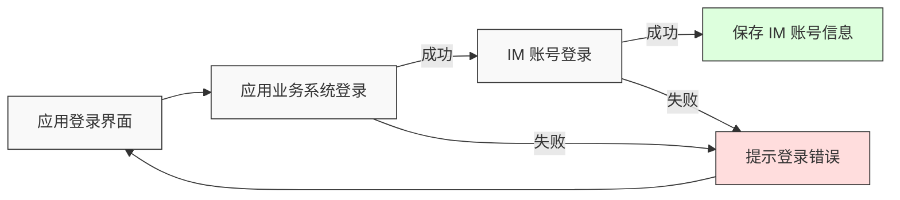
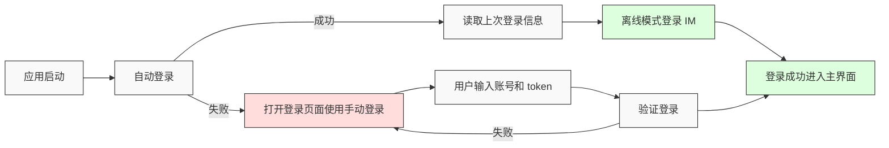
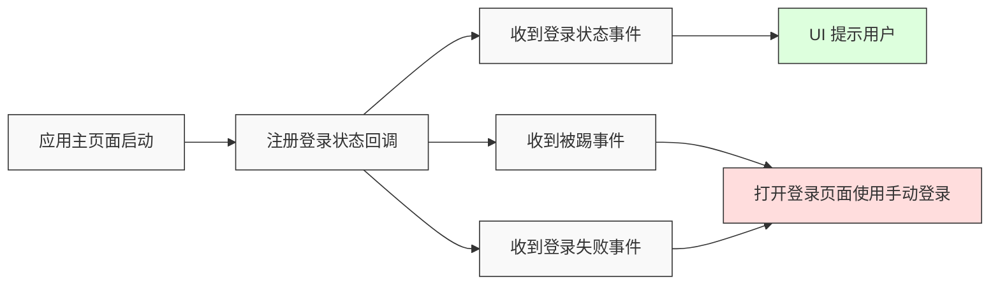

登录对于 IM 产品来说至关重要，是后续业务顺利进行的前提条件。开发者集成 NIM SDK 的各项能力时，如果未能正确使用登录接口或处理登录状态，将引发不必要的问题，影响开发进度。本文详细介绍如何以最佳方式实现 IM 登录功能。

<div id="notes">

## 注意事项

- 本文主要介绍 **移动端** 的登录流程。
- 本文以静态 Token 鉴权为例。

</div>

<div id="prerequisites">

## 准备工作

根据本文操作前，请确保您已经完成了以下设置：

- 已在 [网易云信控制台](https://app.yunxin.163.com/global/home) 上，[创建应用](https://doc.yunxin.163.com/console/guide/TIzMDE4NTA?platform=console)，获取 App Key。
- 已 [集成 IM UIKit](https://doc.yunxin.163.com/messaging-uikit/guide/DU4NzAzNzQ?platform=android)。
- 已通过服务端 [注册 IM 账号](https://doc.yunxin.163.com/messaging2/server-apis/TQyNjgyMzc?platform=server)，获取 IM 账号和对应的静态 `token`。

    如果仅需要测试和调试，您可通过控制台注册 IM 测试账号。测试账号及对应的静态 `token` 仅适用于调试环境，线上生产环境必须将测试账号及其 `token` 替换为云信服务端生成的正式 `account_id` 和 `token`。

</div>

<!--待树鑫提供
## Demo 体验

您可以参考 [登录 Demo]() 体验完整登录流程。
-->

<div id="main-content">

## 登录流程

常见的登录流程一般分为三个部分，首次登录、自动登录以及登录状态处理。

### 首次登录

用户首次打开应用进行登录时，一般需要用户输入账号密码，进行用户自身业务系统的登录，成功后再使用云信返回的 IM 账号和 `token` 进行 IM 登录。

**首次登录流程：**



**接口调用：**

1. 调用 `login` 方法手动登录 IM。

  ::: note note
  在登录时 **关闭离线模式**。
  :::

2. 调用后处理逻辑：

    - 如果登录成功，保存 IM 账号和 `token` 到本地，便于下次应用启动时使用。
    - 如果登录失败，提示用户登录失败。

**示例代码：**

:::::: div linked-codes
::: code 安卓
```Java
V2NIMLoginOption option = new V2NIMLoginOption();
//关闭离线模式
option.setOfflineMode(false);

IMKitClient.login(
        account,
        token,
        option,
        new FetchCallback<Void>() {
            @Override
            public void onError(int errorCode, @NonNull String errorMsg) {
                //登录失败
                Toast.makeText(LoginActivity.this, R.string.tip_login_fail, Toast.LENGTH_SHORT).show();
            }

            @Override
            public void onSuccess(@Nullable Void data) {
                //保存accid、token，用于下次自动登录。
                Preferences.saveUserAccount(accid);
                Preferences.saveUserToken(token);
                // TODO: 登录成功跳转到主页面
            }
        }
);
```
:::
::: code iOS
```Objective-C
let loginOption = V2NIMLoginOption()
        loginOption.offlineMode = false;
        IMKitClient.instance.login("ceshi3", "123456", loginOption) { [weak self] error in
          if let err = error {
            //登录失败
          } else {
            //登录成功保存账号密码
          }
        }
```
:::
::::::

### 自动登录

用户登录成功后，再次打开应用，一般无需用户输入账号密码，而是程序内部获取上次登录的 IM 的账号和 `token`，通过离线方式登录 IM，此次登录会优先打开本地数据库，即使无网络的情况下也可以正常访问本地数据。

**自动登录流程：**



**接口调用：**

1. 获取上次登录的 IM 账号和 `token`。

2. 调用 `login` 方法登录 IM。

  ::: note note
  在登录时 **开启离线模式**。
  :::

3. 开启离线模式后，登录会统一走失败回调，当状态码为 191008 时表示进入离线模式，可以进入主页面。

**示例代码：**

:::::: div linked-codes
::: code 安卓
```Java
V2NIMLoginOption option = new V2NIMLoginOption();
//本次登录采用离线登录，无网络下也可以登录成功，后面 SDK 内部会自动重连
option.setOfflineMode(true);
IMKitClient.login(
        account,
        token,
        option,
        new FetchCallback<Void>() {
            @Override
            public void onError(int errorCode, @NonNull String errorMsg) {
                Log.e(TAG, "login  onFailure:" + errorCode + "," + errorMsg);
                if (191008 == errorCode) {
                    //进入离线模式，数据已经打开，跳转到主页面
                } else {
                    //自动登录失败，清理登录缓存信息,返回登录页面
                    Preferences.saveUserAccount("");
                    Preferences.saveUserToken("");
                }
            }

            @Override
            public void onSuccess(@Nullable Void data) {
                Log.e(TAG, "login  onSuccess");
                // 登录成功跳转到主页面
            }
        }
);
```
:::
::: code iOS
```Objective-C
let loginOption = V2NIMLoginOption()
        loginOption.offlineMode = true;
        IMKitClient.instance.login("ceshi3", "123456", loginOption) { error in
          if let err = error {
              if (err.code == 191008) {
                  //进入离线模式，数据已经打开，跳转到主页面
              } else {
                  //自动登录失败，清理登录缓存信息,返回登录页面
              }
          } else {
              // 登录成功跳转到主页面
          }
        }
```
:::
::::::

### 登录状态处理

在 IM 初始接口调用之后，可以在应用的主页面注册 IM 的登录回调，处理一些业务逻辑，如 UI 层提示用户当前连接状态、被踢、多端登录等。

**登录状态处理流程：**



**接口调用：**

1. 进入应用主页面。

2. 调用 `addLoginListener` 添加登录状态监听。

3. 收到被踢、登录失败等事件后，清理当前登录信息，并返回登录页面。

**示例代码：**

:::::: div linked-codes
::: code 安卓
```Java
IMKitClient.addLoginListener(
        new V2NIMLoginListener() {
            @Override
            public void onLoginStatus(V2NIMLoginStatus status) {
                switch (status) {
                    case V2NIM_LOGIN_STATUS_LOGOUT:
                        //用户登出，清理登录缓存信息返回登录页面
                        Preferences.saveUserAccount("");
                        Preferences.saveUserToken("");
                        break;
                    case V2NIM_LOGIN_STATUS_UNLOGIN:
                        tvLoginStatus.setText("未登录");
                        break;
                    case V2NIM_LOGIN_STATUS_LOGINING:
                        tvLoginStatus.setText("登录中");
                        break;
                    case V2NIM_LOGIN_STATUS_LOGINED:
                        tvLoginStatus.setText("登录成功");
                        break;
                }
                Log.e(TAG, "loginListener onLoginStatus:" + status.toString());
            }

            @Override
            public void onLoginFailed(V2NIMError error) {
                //登录失败，清理登录缓存信息,返回登录页面
                Preferences.saveUserAccount("");
                Preferences.saveUserToken("");
            }

            @Override
            public void onKickedOffline(V2NIMKickedOfflineDetail detail) {
                //用户被踢，清理登录缓存信息返回登录页面
                Preferences.saveUserAccount("");
                Preferences.saveUserToken("");
            }

            @Override
            public void onLoginClientChanged(
                    V2NIMLoginClientChange change, List<V2NIMLoginClient> clients) {
            }
        });
```
:::
::: code iOS
```Objective-C
public func onLoginFailed(_ error: V2NIMError) {
    //登录失败，清理登录缓存信息,返回登录页面
}

public func onKickedOffline(_ detail: V2NIMKickedOfflineDetail) {
    //用户被踢，清理登录缓存信息返回登录页面
}

public func onLoginStatus(_ status: V2NIMLoginStatus) {
    //根据返回的登录状态做页面轻提示
}
```
:::
::::::

</div>