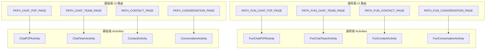

<!--keywords: 界面跳转,路由,配置路由,UIKit,demo,IM UIKit,IMUIKit,Kit -->

网易云信 IM UIKit 提供统一路由（`XKitRouter`），支持参数传递和回调，实现界面的跳转与模块之间的解耦。该路由系统设计灵活，可满足各种复杂场景下的导航需求。

<a id="接口介绍"></a>

## 接口介绍

在 IM UIKit 中，您可以通过统一的路由机制实现界面跳转：

- **场景一**：在 IM UIKit 内置界面之间跳转
- **场景二**：从 IM UIKit 跳转至您应用中的自定义界面

所有界面跳转都可通过调用 `navigate` 方法实现，方法原型如下：

```Java
// 带参数的界面跳转
XKitRouter.withKey(path)
    .withParam(paramKey, param)
    .withContext(context)
    .navigate();

// 不带参数的界面跳转
XKitRouter.withKey(path)
    .withContext(context)
    .navigate();
```

| <div style="width:100px">参数</div> | 类型 | 说明
| ---- | ---- | ----
| `path` | String | 目标界面的路由地址：|\
| | | - IM UIKit 内置界面的路由地址，参考下文 [内置界面路由地址列表](#内置界面路由地址列表)（基础版 \| 通用版）。 |\
| | | - 如需跳转到自定义界面，请先注册该界面的路由地址，具体参考下文 [跳转至新增界面](#跳转至新增界面)。 |
| `paramKey` | String | 传递到目标界面的参数名称。
| `param` | Serializable | 传递到目标界面的参数值，支持基本数据类型、字符串、序列化对象等。
| `context` | Context | Activity 上下文。

## 跳转至内置界面

本节介绍 IM UIKit 内置界面的路由地址列表以及部分界面的跳转示例。

<a id="内置界面路由地址列表"></a>
<a id="basic"></a>

网易云信 IM UIKit 提供两套风格的 [UI 组件库](https://doc.yunxin.163.com/messaging-uikit/guide/TI3NTgyNDA?platform=android)，可任意选择一种使用。两种风格 UI 界面的路由地址不同，请按需选择对用风格的对应界面路由地址，实现跳转。

- **路由地址组成**：`imkit://{所属模块}/{Endpoint}`

- **UIKit 变量所属类**：`RouterConstant`

每个 UI 服务都注册了两个版本的路由，从而允许应用程序选择偏好的样式。



详细的使用示例如下所示：

:::::: div linked-codes
::: code 基础版 UI 风格

<div class="route-list">
  <div class="route-item">
    <div class="route-header">
      <div class="route-title">通讯录界面</div>
      <!-- <div class="route-var">UIKit 变量：PATH_CONTACT_PAGE</div> -->
    </div>
    <div class="route-body">
      <div class="route-left">
        <div class="route-img">
          
        </div>
      </div>
      <div class="route-right">
        <div class="route-info">
          <div class="route-page">ContactActivity</div>
          <div class="route-desc"><code>contact/contactList.page</code></div>
          <div class="route-param">需传递目标界面参数：否</div>
        </div>
        <div class="route-code">
          <div class="route-code-title">使用示例：</div>
          <pre><code class="language-java">// 跳转到通讯录界面
XKitRouter.withKey(RouterConstant.PATH_CONTACT_PAGE).withContext(context).navigate();</code></pre>
        </div>
      </div>
    </div>
  </div>

  <div class="route-item">
    <div class="route-header">
      <div class="route-title">通讯录人员选择器</div>
      <!-- <div class="route-var">UIKit 变量：PATH_CONTACT_SELECTOR_PAGE</div> -->
    </div>
    <div class="route-body">
      <div class="route-left">
        <div class="route-img">
          
        </div>
      </div>
      <div class="route-right">
        <div class="route-info">
          <div class="route-page">ContactSelectorActivity</div>
          <div class="route-desc"><code>contact/selector.page</code></div>
          <div class="route-param">需传递目标界面参数：否</div>
        </div>
        <div class="route-code">
          <div class="route-code-title">使用示例：</div>
          <pre><code class="language-java">// 跳转到通讯录人员选择器
XKitRouter.withKey(RouterConstant.PATH_CONTACT_SELECTOR_PAGE)
    // 选择列表是需要过滤的账号 ID，可不传，默认不过滤
    .withParam(RouterConstant.SELECTOR_CONTACT_FILTER_KEY, accountList)
    // 单次选择数量限制，可不传
    .withParam(RouterConstant.KEY_CONTACT_SELECTOR_MAX_COUNT, 20)
    // 选择数量限制检查，true 如果超过则 Toast 提示，默认 false
    .withParam(RouterConstant.KEY_CONTACT_SELECTOR_FINAL_CHECK_COUNT_ENABLE, true)
    .withContext(BaseTeamSettingActivity.this)
    .navigate(launcher);</code></pre>
<details><summary>单击展开查看如何获取通讯录用户选择结果 Java 示例代码。</summary>
          <pre><code class="language-java">// 声明选择结果的 launcher
private ActivityResultLauncher<Intent> launcher = registerForActivityResult(
    new ActivityResultContracts.StartActivityForResult(),
    result -> {
        if (result.getResultCode() != RESULT_OK) {
            return;
        }
        Intent data = result.getData();
        if (data == null) {
            return;
        }
        // 选择用户
        ArrayList<String> selectedUser =
            data.getStringArrayListExtra(REQUEST_CONTACT_SELECTOR_KEY);
    });</code></pre></details>
        </div>
      </div>
    </div>
  </div>

  <div class="route-item">
    <div class="route-header">
      <div class="route-title">添加好友界面</div>
      <!-- <div class="route-var">UIKit 变量：PATH_ADD_FRIEND_PAGE</div> -->
    </div>
    <div class="route-body">
      <div class="route-left">
        <div class="route-img">
          
        </div>
      </div>
      <div class="route-right">
        <div class="route-info">
          <div class="route-page">AddFriendActivity</div>
          <div class="route-desc"><code>contact/addFriend.page</code></div>
          <div class="route-param">需传递目标界面参数：否</div>
        </div>
        <div class="route-code">
          <div class="route-code-title">使用示例：</div>
          <pre><code class="language-java">// 跳转到添加好友界面
XKitRouter.withKey(RouterConstant.PATH_ADD_FRIEND_PAGE).withContext(context).navigate();</code></pre>
        </div>
      </div>
    </div>
  </div>

  <div class="route-item">
    <div class="route-header">
      <div class="route-title">用户信息界面</div>
      <!-- <div class="route-var">UIKit 变量：PATH_USER_INFO_PAGE</div> -->
    </div>
    <div class="route-body">
      <div class="route-left">
        <div class="route-img">
          
        </div>
      </div>
      <div class="route-right">
        <div class="route-info">
          <div class="route-page">UserInfoActivity</div>
          <div class="route-desc"><code>contact/userInfo.page</code></div>
          <div class="route-param">需传递目标界面参数：是</div>
        </div>
        <div class="route-code">
          <div class="route-code-title">使用示例：</div>
          <pre><code class="language-java">// 跳转到用户信息界面
String accoutId = "user123456"; // 用户 ID
XKitRouter.withKey(RouterConstant.PATH_USER_INFO_PAGE)
          // 选择列表是需要过滤的账号 ID，可不传，默认不过滤
          .withParam(RouterConstant.KEY_ACCOUNT_ID_KEY, accoutId).withContext(context).navigate()</code></pre>
        </div>
      </div>
    </div>
  </div>

  <div class="route-item">
    <div class="route-header">
      <div class="route-title">黑名单界面</div>
      <!-- <div class="route-var">UIKit 变量：PATH_MY_BLACK_PAGE</div> -->
    </div>
    <div class="route-body">
      <div class="route-left">
        <div class="route-img">
          
        </div>
      </div>
      <div class="route-right">
        <div class="route-info">
          <div class="route-page">BlackListActivity</div>
          <div class="route-desc"><code>contact/blackList.page</code></div>
          <div class="route-param">需传递目标界面参数：否</div>
        </div>
        <div class="route-code">
          <div class="route-code-title">使用示例：</div>
          <pre><code class="language-java">// 跳转到黑名单界面
XKitRouter.withKey(RouterConstant.PATH_MY_BLACK_PAGE).withContext(context).navigate();</code></pre>
        </div>
      </div>
    </div>
  </div>

  <div class="route-item">
    <div class="route-header">
      <div class="route-title">我的群组界面</div>
      <!-- <div class="route-var">UIKit 变量：PATH_MY_TEAM_PAGE</div> -->
    </div>
    <div class="route-body">
      <div class="route-left">
        <div class="route-img">
          
        </div>
      </div>
      <div class="route-right">
        <div class="route-info">
          <div class="route-page">TeamListActivity</div>
          <div class="route-desc"><code>contact/teamList.page</code></div>
          <div class="route-param">需传递目标界面参数：否</div>
        </div>
        <div class="route-code">
          <div class="route-code-title">使用示例：</div>
          <pre><code class="language-java">// 跳转到我的群组界面
XKitRouter.withKey(RouterConstant.PATH_MY_TEAM_PAGE).withContext(context).navigate();</code></pre>
        </div>
      </div>
    </div>
  </div>

  <div class="route-item">
    <div class="route-header">
      <div class="route-title">系统通知界面</div>
      <!-- <div class="route-var">UIKit 变量：PATH_MY_NOTIFICATION_PAGE</div> -->
    </div>
    <div class="route-body">
      <div class="route-left">
        <div class="route-img">
          
        </div>
      </div>
      <div class="route-right">
        <div class="route-info">
          <div class="route-page">VerifyListActivity</div>
          <div class="route-desc"><code>contact/verifyList.page</code></div>
          <div class="route-param">需传递目标界面参数：否</div>
        </div>
        <div class="route-code">
          <div class="route-code-title">使用示例：</div>
          <pre><code class="language-java">// 跳转到系统通知界面
XKitRouter.withKey(RouterConstant.PATH_MY_NOTIFICATION_PAGE).withContext(context).navigate();</code></pre>
        </div>
      </div>
    </div>
  </div>

  <div class="route-item">
    <div class="route-header">
      <div class="route-title">单聊界面</div>
      <!-- <div class="route-var">UIKit 变量：PATH_CHAT_P2P_PAGE</div> -->
    </div>
    <div class="route-body">
      <div class="route-left">
        <div class="route-img">
          
        </div>
      </div>
      <div class="route-right">
        <div class="route-info">
          <div class="route-page">ChatP2PActivity</div>
          <div class="route-desc"><code>chat/p2pChat.page</code></div>
          <div class="route-param">需传递目标界面参数：是</div>
        </div>
        <div class="route-code">
          <div class="route-code-title">使用示例：</div>
          <pre><code class="language-java">// 跳转到单聊界面
String accoutId = "user123456" // 用户 ID
XKitRouter.withKey(RouterConstant.PATH_CHAT_P2P_PAGE).withParam(RouterConstant.CHAT_ID_KRY, accoutId).withContext(context).navigate();</code></pre>
        </div>
      </div>
    </div>
  </div>

  <div class="route-item">
    <div class="route-header">
      <div class="route-title">群聊界面</div>
      <!-- <div class="route-var">UIKit 变量：PATH_CHAT_TEAM_PAGE</div> -->
    </div>
    <div class="route-body">
      <div class="route-left">
        <div class="route-img">
          
        </div>
      </div>
      <div class="route-right">
        <div class="route-info">
          <div class="route-page">ChatTeamActivity</div>
          <div class="route-desc"><code>chat/teamChat.page</code></div>
          <div class="route-param">需传递目标界面参数：是</div>
        </div>
        <div class="route-code">
          <div class="route-code-title">使用示例：</div>
          <pre><code class="language-java">// 跳转到群聊界面
String teamId = "team123456" // 群组 ID
XKitRouter.withKey(RouterConstant.PATH_CHAT_TEAM_PAGE).withParam(RouterConstant.CHAT_ID_KRY, teamId).withContext(context).navigate();</code></pre>
        </div>
      </div>
    </div>
  </div>

  <div class="route-item">
    <div class="route-header">
      <div class="route-title">聊天内容搜索界面</div>
      <!-- <div class="route-var">UIKit 变量：PATH_CHAT_SEARCH_PAGE</div> -->
    </div>
    <div class="route-body">
      <div class="route-left">
        <div class="route-img">
          
        </div>
      </div>
      <div class="route-right">
        <div class="route-info">
          <div class="route-page">ChatSearchActivity</div>
          <div class="route-desc"><code>chat/searchMessage.page</code></div>
          <div class="route-param">需传递目标界面参数：是</div>
        </div>
        <div class="route-code">
          <div class="route-code-title">使用示例：</div>
          <pre><code class="language-java">// 跳转到聊天内容搜索界面
V2NIMTeam team = ... //群信息
XKitRouter.withKey(RouterConstant.PATH_CHAT_SEARCH_PAGE).withParam(RouterConstant.CHAT_KRY, team).withContext(context).navigate();</code></pre>
        </div>
      </div>
    </div>
  </div>

  <div class="route-item">
    <div class="route-header">
      <div class="route-title">群设置界面</div>
      <!-- <div class="route-var">UIKit 变量：PATH_TEAM_SETTING_PAGE</div> -->
    </div>
    <div class="route-body">
      <div class="route-left">
        <div class="route-img">
          
        </div>
      </div>
      <div class="route-right">
        <div class="route-info">
          <div class="route-page">TeamSettingActivity</div>
          <div class="route-desc"><code>team/teamSetting.page</code></div>
          <div class="route-param">需传递目标界面参数：是</div>
        </div>
        <div class="route-code">
          <div class="route-code-title">使用示例：</div>
          <pre><code class="language-java">// 跳转到群设置界面
String teamId = "team123456"; // 群组 ID
XKitRouter.withKey(RouterConstant.PATH_TEAM_SETTING_PAGE).withParam(RouterConstant.KEY_TEAM_ID, teamId).withContext(context).navigate();</code></pre>
        </div>
      </div>
    </div>
  </div>

  <div class="route-item">
    <div class="route-header">
      <div class="route-title">好友搜索界面</div>
      <!-- <div class="route-var">UIKit 变量：PATH_GLOBAL_SEARCH_PAGE</div> -->
    </div>
    <div class="route-body">
      <div class="route-left">
        <div class="route-img">
          
        </div>
      </div>
      <div class="route-right">
        <div class="route-info">
          <div class="route-page">GlobalSearchActivity</div>
          <div class="route-desc"><code>search/search.page</code></div>
          <div class="route-param">需传递目标界面参数：否</div>
        </div>
        <div class="route-code">
          <div class="route-code-title">使用示例：</div>
          <pre><code class="language-java">// 跳转到好友搜索界面
XKitRouter.withKey(RouterConstant.PATH_GLOBAL_SEARCH_PAGE)
          .withContext(context)
          .navigate();</code></pre>
        </div>
      </div>
    </div>
  </div>

  <div class="route-item">
    <div class="route-header">
      <div class="route-title">会话列表界面</div>
      <!-- <div class="route-var">UIKit 变量：PATH_CONVERSATION_PAGE</div> -->
    </div>
    <div class="route-body">
      <div class="route-left">
        <div class="route-img">
          
        </div>
      </div>
      <div class="route-right">
        <div class="route-info">
          <div class="route-page">ConversationActivity</div>
          <div class="route-desc"><code>conversation/conversation.page</code></div>
          <div class="route-param">需传递目标界面参数：否</div>
        </div>
        <div class="route-code">
          <div class="route-code-title">使用示例：</div>
          <pre><code class="language-java">// 跳转到会话列表界面
XKitRouter.withKey(RouterConstant.PATH_CONVERSATION_PAGE).withContext(context).navigate();</code></pre>
        </div>
      </div>
    </div>
  </div>
</div>

:::
::: code 通用版 UI 风格

<div class="route-list">
  <div class="route-item">
    <div class="route-header">
      <div class="route-title">通讯录界面</div>
      <!-- <div class="route-var">UIKit 变量：PATH_FUN_CONTACT_PAGE</div> -->
    </div>
    <div class="route-body">
      <div class="route-left">
        <div class="route-img">
          
        </div>
      </div>
      <div class="route-right">
        <div class="route-info">
          <div class="route-page">FunContactActivity</div>
          <div class="route-desc"><code>contact/contactList.page</code></div>
          <div class="route-param">需传递目标界面参数：否</div>
        </div>
        <div class="route-code">
          <div class="route-code-title">使用示例：</div>
          <pre><code class="language-java">// 跳转到通讯录界面
XKitRouter.withKey(RouterConstant.PATH_FUN_CONTACT_PAGE).withContext(context).navigate();</code></pre>
        </div>
      </div>
    </div>
  </div>

  <div class="route-item">
    <div class="route-header">
      <div class="route-title">通讯录人员选择器</div>
      <!-- <div class="route-var">UIKit 变量：PATH_FUN_CONTACT_SELECTOR_PAGE</div> -->
    </div>
    <div class="route-body">
      <div class="route-left">
        <div class="route-img">
          
        </div>
      </div>
      <div class="route-right">
        <div class="route-info">
          <div class="route-page">FunContactSelectorActivity</div>
          <div class="route-desc"><code>contact/selector.page</code></div>
          <div class="route-param">需传递目标界面参数：否</div>
        </div>
        <div class="route-code">
          <div class="route-code-title">使用示例：</div>
          <pre><code class="language-java">// 跳转到通讯录人员选择器
XKitRouter.withKey(RouterConstant.PATH_FUN_CONTACT_SELECTOR_PAGE)
    // 选择列表是需要过滤的账号 ID，可不传，默认不过滤
    .withParam(RouterConstant.SELECTOR_CONTACT_FILTER_KEY, accountList)
    // 单次选择数量限制，可不传
    .withParam(RouterConstant.KEY_CONTACT_SELECTOR_MAX_COUNT, 20)
    // 选择数量限制检查，true 如果超过则 Toast 提示，默认 false
    .withParam(RouterConstant.KEY_CONTACT_SELECTOR_FINAL_CHECK_COUNT_ENABLE, true)
    .withContext(BaseTeamSettingActivity.this)
    .navigate(launcher);</code></pre>
<details><summary>单击展开查看如何获取通讯录用户选择结果 Java 示例代码。</summary>
          <pre><code class="language-java">// 声明选择结果的 launcher
private ActivityResultLauncher<Intent> launcher = registerForActivityResult(
    new ActivityResultContracts.StartActivityForResult(),
    result -> {
        if (result.getResultCode() != RESULT_OK) {
            return;
        }
        Intent data = result.getData();
        if (data == null) {
            return;
        }
        // 选择用户
        ArrayList<String> selectedUser =
            data.getStringArrayListExtra(REQUEST_CONTACT_SELECTOR_KEY);
    });</code></pre></details>
        </div>
      </div>
    </div>
  </div>

  <div class="route-item">
    <div class="route-header">
      <div class="route-title">添加好友界面</div>
      <!-- <div class="route-var">UIKit 变量：PATH_FUN_ADD_FRIEND_PAGE</div> -->
    </div>
    <div class="route-body">
      <div class="route-left">
        <div class="route-img">
          
        </div>
      </div>
      <div class="route-right">
        <div class="route-info">
          <div class="route-page">FunAddFriendActivity</div>
          <div class="route-desc"><code>contact/addFriend.page</code></div>
          <div class="route-param">需传递目标界面参数：否</div>
        </div>
        <div class="route-code">
          <div class="route-code-title">使用示例：</div>
          <pre><code class="language-java">// 跳转到添加好友界面
XKitRouter.withKey(RouterConstant.PATH_FUN_ADD_FRIEND_PAGE).withContext(context).navigate();</code></pre>
        </div>
      </div>
    </div>
  </div>

  <div class="route-item">
    <div class="route-header">
      <div class="route-title">用户信息界面</div>
      <!-- <div class="route-var">UIKit 变量：PATH_FUN_USER_INFO_PAGE</div> -->
    </div>
    <div class="route-body">
      <div class="route-left">
        <div class="route-img">
          
        </div>
      </div>
      <div class="route-right">
        <div class="route-info">
          <div class="route-page">FunUserInfoActivity</div>
          <div class="route-desc"><code>contact/userInfo.page</code></div>
          <div class="route-param">需传递目标界面参数：是</div>
        </div>
        <div class="route-code">
          <div class="route-code-title">使用示例：</div>
          <pre><code class="language-java">// 跳转到用户信息界面
String accoutId = "user123456"; // 用户 ID
XKitRouter.withKey(RouterConstant.PATH_FUN_USER_INFO_PAGE)
          // 选择列表是需要过滤的账号 ID，可不传，默认不过滤
          .withParam(RouterConstant.KEY_ACCOUNT_ID_KEY, accoutId).withContext(context).navigate()</code></pre>
        </div>
      </div>
    </div>
  </div>

  <div class="route-item">
    <div class="route-header">
      <div class="route-title">黑名单界面</div>
      <!-- <div class="route-var">UIKit 变量：PATH_FUN_MY_BLACK_PAGE</div> -->
    </div>
    <div class="route-body">
      <div class="route-left">
        <div class="route-img">
          
        </div>
      </div>
      <div class="route-right">
        <div class="route-info">
          <div class="route-page">FunBlackListActivity</div>
          <div class="route-desc"><code>contact/blackList.page</code></div>
          <div class="route-param">需传递目标界面参数：否</div>
        </div>
        <div class="route-code">
          <div class="route-code-title">使用示例：</div>
          <pre><code class="language-java">// 跳转到黑名单界面
XKitRouter.withKey(RouterConstant.PATH_FUN_MY_BLACK_PAGE).withContext(context).navigate();</code></pre>
        </div>
      </div>
    </div>
  </div>

  <div class="route-item">
    <div class="route-header">
      <div class="route-title">我的群组界面</div>
      <!-- <div class="route-var">UIKit 变量：PATH_FUN_MY_TEAM_PAGE</div> -->
    </div>
    <div class="route-body">
      <div class="route-left">
        <div class="route-img">
          
        </div>
      </div>
      <div class="route-right">
        <div class="route-info">
          <div class="route-page">FunTeamListActivity</div>
          <div class="route-desc"><code>contact/teamList.page</code></div>
          <div class="route-param">需传递目标界面参数：否</div>
        </div>
        <div class="route-code">
          <div class="route-code-title">使用示例：</div>
          <pre><code class="language-java">// 跳转到我的群组界面
XKitRouter.withKey(RouterConstant.PATH_FUN_MY_TEAM_PAGE).withContext(context).navigate();</code></pre>
        </div>
      </div>
    </div>
  </div>

  <div class="route-item">
    <div class="route-header">
      <div class="route-title">系统通知界面</div>
      <!-- <div class="route-var">UIKit 变量：PATH_FUN_MY_NOTIFICATION_PAGE</div> -->
    </div>
    <div class="route-body">
      <div class="route-left">
        <div class="route-img">
          
        </div>
      </div>
      <div class="route-right">
        <div class="route-info">
          <div class="route-page">FunVerifyListActivity</div>
          <div class="route-desc"><code>contact/verifyList.page</code></div>
          <div class="route-param">需传递目标界面参数：否</div>
        </div>
        <div class="route-code">
          <div class="route-code-title">使用示例：</div>
          <pre><code class="language-java">// 跳转到系统通知界面
XKitRouter.withKey(RouterConstant.PATH_FUN_MY_NOTIFICATION_PAGE).withContext(context).navigate();</code></pre>
        </div>
      </div>
    </div>
  </div>

  <div class="route-item">
    <div class="route-header">
      <div class="route-title">单聊界面</div>
      <!-- <div class="route-var">UIKit 变量：PATH_FUN_CHAT_P2P_PAGE</div> -->
    </div>
    <div class="route-body">
      <div class="route-left">
        <div class="route-img">
          
        </div>
      </div>
      <div class="route-right">
        <div class="route-info">
          <div class="route-page">FunChatP2PActivity</div>
          <div class="route-desc"><code>chat/p2pChat.page</code></div>
          <div class="route-param">需传递目标界面参数：是</div>
        </div>
        <div class="route-code">
          <div class="route-code-title">使用示例：</div>
          <pre><code class="language-java">// 跳转到单聊界面
String accoutId = "user123456" // 用户 ID
XKitRouter.withKey(RouterConstant.PATH_FUN_CHAT_P2P_PAGE).withParam(RouterConstant.CHAT_ID_KRY, accoutId).withContext(context).navigate();</code></pre>
        </div>
      </div>
    </div>
  </div>

  <div class="route-item">
    <div class="route-header">
      <div class="route-title">群聊界面</div>
      <!-- <div class="route-var">UIKit 变量：PATH_FUN_CHAT_TEAM_PAGE</div> -->
    </div>
    <div class="route-body">
      <div class="route-left">
        <div class="route-img">
          
        </div>
      </div>
      <div class="route-right">
        <div class="route-info">
          <div class="route-page">FunChatTeamActivity</div>
          <div class="route-desc"><code>chat/teamChat.page</code></div>
          <div class="route-param">需传递目标界面参数：是</div>
        </div>
        <div class="route-code">
          <div class="route-code-title">使用示例：</div>
          <pre><code class="language-java">// 跳转到群聊界面
String teamId = "team123456" // 群组 ID
XKitRouter.withKey(RouterConstant.PATH_FUN_CHAT_TEAM_PAGE).withParam(RouterConstant.CHAT_ID_KRY, teamId).withContext(context).navigate();</code></pre>
        </div>
      </div>
    </div>
  </div>

  <div class="route-item">
    <div class="route-header">
      <div class="route-title">聊天内容搜索界面</div>
      <!-- <div class="route-var">UIKit 变量：PATH_FUN_CHAT_SEARCH_PAGE</div> -->
    </div>
    <div class="route-body">
      <div class="route-left">
        <div class="route-img">
          
        </div>
      </div>
      <div class="route-right">
        <div class="route-info">
          <div class="route-page">FunChatSearchActivity</div>
          <div class="route-desc"><code>chat/searchMessage.page</code></div>
          <div class="route-param">需传递目标界面参数：是</div>
        </div>
        <div class="route-code">
          <div class="route-code-title">使用示例：</div>
          <pre><code class="language-java">// 跳转到聊天内容搜索界面
V2NIMTeam team = ... //群信息
XKitRouter.withKey(RouterConstant.PATH_FUN_CHAT_SEARCH_PAGE).withParam(RouterConstant.CHAT_KRY, team).withContext(context).navigate();</code></pre>
        </div>
      </div>
    </div>
  </div>

  <div class="route-item">
    <div class="route-header">
      <div class="route-title">群设置界面</div>
      <!-- <div class="route-var">UIKit 变量：PATH_FUN_TEAM_SETTING_PAGE</div> -->
    </div>
    <div class="route-body">
      <div class="route-left">
        <div class="route-img">
          
        </div>
      </div>
      <div class="route-right">
        <div class="route-info">
          <div class="route-page">FunTeamSettingActivity</div>
          <div class="route-desc"><code>team/teamSetting.page</code></div>
          <div class="route-param">需传递目标界面参数：是</div>
        </div>
        <div class="route-code">
          <div class="route-code-title">使用示例：</div>
          <pre><code class="language-java">// 跳转到群设置界面
String teamId = "team123456"; // 群组 ID
XKitRouter.withKey(RouterConstant.PATH_FUN_TEAM_SETTING_PAGE).withParam(RouterConstant.KEY_TEAM_ID, teamId).withContext(context).navigate();</code></pre>
        </div>
      </div>
    </div>
  </div>

  <div class="route-item">
    <div class="route-header">
      <div class="route-title">好友搜索界面</div>
      <!-- <div class="route-var">UIKit 变量：PATH_FUN_GLOBAL_SEARCH_PAGE</div> -->
    </div>
    <div class="route-body">
      <div class="route-left">
        <div class="route-img">
          
        </div>
      </div>
      <div class="route-right">
        <div class="route-info">
          <div class="route-page">FunSearchActivity</div>
          <div class="route-desc"><code>search/search.page</code></div>
          <div class="route-param">需传递目标界面参数：否</div>
        </div>
        <div class="route-code">
          <div class="route-code-title">使用示例：</div>
          <pre><code class="language-java">// 跳转到好友搜索界面
XKitRouter.withKey(RouterConstant.PATH_FUN_GLOBAL_SEARCH_PAGE)
          .withContext(context)
          .navigate();</code></pre>
        </div>
      </div>
    </div>
  </div>

  <div class="route-item">
    <div class="route-header">
      <div class="route-title">会话列表界面</div>
      <!-- <div class="route-var">UIKit 变量：PATH_FUN_CONVERSATION_PAGE</div> -->
    </div>
    <div class="route-body">
      <div class="route-left">
        <div class="route-img">
          
        </div>
      </div>
      <div class="route-right">
        <div class="route-info">
          <div class="route-page">FunConversationActivity</div>
          <div class="route-desc"><code>conversation/conversation.page</code></div>
          <div class="route-param">需传递目标界面参数：否</div>
        </div>
        <div class="route-code">
          <div class="route-code-title">使用示例：</div>
          <pre><code class="language-java">// 跳转到会话列表界面
XKitRouter.withKey(RouterConstant.PATH_FUN_CONVERSATION_PAGE).withContext(context).navigate();</code></pre>
        </div>
      </div>
    </div>
  </div>
</div>

:::
::::::

<a id="跳转至新增界面"></a>

## 跳转至新增界面

IM UIKit 提供的路由能力，支持根据业务需求新增界面，并实现从 IM UIKit 的内置界面跳转至新增界面。

1. 在通过路由实现跳转前，需调用 `registerRouter` 方法注册该新增界面的路由地址。

    方法原型如下：

    ```Java
    XKitRouter.registerRouter(path, clazz)
    ```

      参数 | 类型 | 说明
      ---- | ---- | ----
      `path` | String | 注册界面对应的路由地址。
      `clazz` | Class<? extends Activity> | Activity 界面类。

    ::: note notice
    路由的界面注册机制采用覆盖模式，即相同的 `Path`，后注册的界面会覆盖之前注册的界面。
    :::

2. 调用 `navigate` 方法进行界面跳转，具体参数说明参考上文的 [接口介绍](#接口介绍)。

<style>
.route-list {
  margin: 20px 0;
  font-size: 14px;
}

.route-item {
  border-radius: 6px;
  border: 1px solid #e6e6e6;
  margin-bottom: 20px;
  overflow: hidden;
  background-color: #fff;
  box-shadow: 0 2px 6px rgba(0,0,0,0.05);
}

.route-header {
  padding: 12px 15px;
  background-color: #f7f9ff;
  border-bottom: 1px solid #e6e6e6;
}

.route-title {
  font-size: 15px;
  font-weight: 600;
  color: #333;
  margin-bottom: 6px;
}

.route-var {
  color: #4a6ee0;
  font-family: Consolas, monospace;
  font-size: 13px;
}

.route-body {
  display: flex;
  padding: 15px;
}

.route-left {
  display: flex;
  flex-direction: column;
  flex: 0 0 180px;
  margin-right: 20px;
}

.route-img {
  text-align: center;
  margin-bottom: 15px;
}

.route-img img {
  max-width: 100%;
  height: auto;
  border: 1px solid #e6e6e6;
  border-radius: 4px;
  box-shadow: 0 2px 5px rgba(0,0,0,0.1);
}

.route-right {
  flex: 1;
  min-width: 280px;
  display: flex;
  flex-direction: column;
}

.route-info {
  margin-bottom: 15px;
}

.route-page {
  font-weight: 500;
  margin-bottom: 8px;
}

.route-desc {
  color: #666;
  margin-bottom: 8px;
}

.route-param {
  color: #555;
  font-size: 13px;
}

.route-code {
  margin-top: auto;
}

.route-code-title {
  font-weight: 500;
  margin-bottom: 10px;
  color: #333;
  font-size: 14px;
}

.route-code pre {
  background-color: #f5f7fa;
  border-radius: 4px;
  padding: 12px;
  margin: 0;
  overflow-x: auto;
}

.route-code code {
  font-family: Consolas, Monaco, 'Andale Mono', monospace;
  font-size: 13px;
  color: #333;
}

@media (max-width: 750px) {
  .route-body {
    flex-direction: column;
  }

  .route-left {
    margin-right: 0;
    margin-bottom: 15px;
    flex: 0 0 auto;
  }
}

.section-title {
  font-size: 18px;
  font-weight: 600;
  color: #333;
  margin: 30px 0 15px 0;
  padding-bottom: 8px;
  border-bottom: 1px solid #eee;
}
</style>