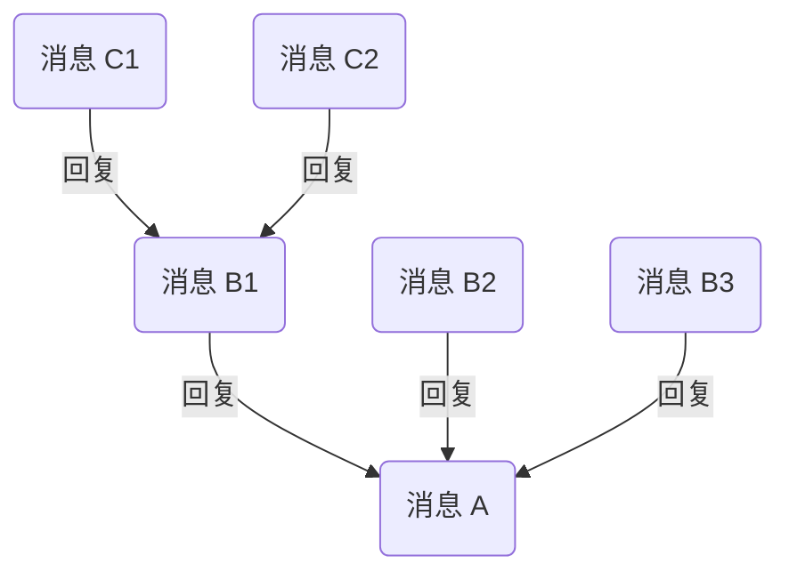

IM UIKit 目前通过 **Thread 消息** 以实现简单的类微信的消息回复功能。

## 前提条件

1. 在 [网易云信控制台](https://app.yunxin.163.com/global/home) 首页 **应用管理** 中选择应用，然后单击 **IM 即时通讯** 下的 **功能配置** 按钮进入功能配置页。

    

2. 在顶部选择 **全局功能** 页签，开启 **会话消息回复** 功能。

## 实现原理

消息回复指，引用收到的某条消息并进行针对性的回复，形成以该消息为根消息的 Thread 树状结构。通过该功能，用户可针对某一条消息进行提问、反馈或补充相关背景信息，且不会对会话造成干扰。

<!--对外不提供此方案
::: note note 
若您坚持自行实现回复消息功能（**不推荐**），请参考 [消息回复方案-扩展字段](https://doc.yunxin.163.com/messaging-uikit/guide/zI0MDg2Njc?platform=flutter)。扩展字段方案存在潜在的问题，例如长度限制、与用户自定义扩展字段冲突等，为提供更稳定可靠的消息回复体验，网易云信推荐您升级为基于 Thread 的标准方案。扩展字段方案的实现逻辑和文档已不维护，若有问题，需自行解决。
:::
-->

Thread 消息树状结构示例见下图：



<!--  -->

上图中：

- 消息 A 是消息 B 的 **父消息**，消息 B1 是消息 C 的 **父消息**
- 消息 C 是消息 B1 的 **子消息**
- 消息 A 是消息 B 和消息 C 的 **根消息**
- 消息 A、B、C 统称为 **Threaded Message（串联起来的消息）**

::: note note :::
一条 Threaded Message 必须有一条父消息或至少一条子消息。如果一条消息既没有父消息，也没有子消息，则为普通消息。
:::

## 实现流程

### 发送方

1. 调用 `replyMessage` 方法回复消息。

```dart
///  [message]: 需要发送的消息体
///  [replyMsg]: 被回复的消息，可以是任何类型消息
///  [params]: 参数，同 sendMessage 参数一样
NimCore.instance.messageService.replyMessage(
        msg: message, replyMsg: replyMsg, params: params)
    .then((result) {
//todo 回复消息成功
}
});
```

2. 调用上述回复接口后，会触发 `onSendMessage` 回调，可以在此回调中将消息上屏。

```dart
NimCore.instance.messageService.onSendMessage.listen((msg) {
    //上屏操作
});
```

### 接收方

接收回复消息与接收普通消息相同，都通过 `onReceiveMessages` 回调接收消息。

```dart
NimCore.instance.messageService.onReceiveMessages.listen((event)  {
    //处理接收到的消息
});
```

### 消息渲染

无论是发送方还是接收方，在渲染消息时，一般都需要渲染被回复的消息。您可以在上屏时根据消息中的 `threadReply` 字段获取被回复消息的内容，然后进行渲染。

```dart
//获取被回复的消息，其中 Message 是待上屏的消息
if(message.threadReply != null){
    replyMsg = (await NimCore.instance.messageService
        .getMessageListByRefers(messageRefers: [message.threadReply!]))
    .data
    ?.first;
    if(replyMsg != null){
        //渲染被回复的消息    
    }
}
```