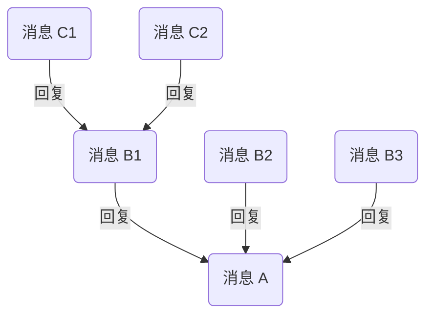

若您需要实现回复功能，可以参考网易云信 IM SDK 的消息回复（thread）逻辑，以实现简单的类微信的消息回复功能。

## 方案介绍

引用收到的某条消息并进行针对性的回复，形成以该消息为根消息的 Thread 树状结构。通过该功能，用户可针对某一条消息进行提问、反馈或补充相关背景信息，且不会对会话造成干扰。

Thread 消息树状结构示例见下图：

## 开通方案

请参考 [扩展消息](https://doc.yunxin.163.com/messaging2/guide/jQ2MTkzODg?platform=client#%E5%BC%80%E9%80%9A%E5%8A%9F%E8%83%BD) 查看开通方式，开通 **会话消息回复** 后，可通过 Thread 方案实现消息回复。

## 实现流程

请参考 [聊天扩展](https://doc.yunxin.163.com/messaging/guide/TczNDY0OTE?platform=flutter#%E6%B6%88%E6%81%AF%E5%9B%9E%E5%A4%8Dthread) 消息回复（thread）章节。