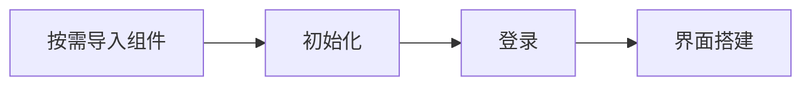

<!--keywords: 快速开始,快速集成 IM UIkit,UIKit,IM UIKit,IMUIKit,Kit -->

网易云信 IM UIKit 是基于 NIM SDK（网易云信 IM SDK）开发的一款即时通讯 UI 组件库，包括聊天、会话、搜索、群管理等组件。本文介绍如何快速跑通 IM UIKit 的集成流程。


## 前提条件

在开始集成 IM UIKit 前，请确保：

- 已在 [网易云信控制台](https://app.yunxin.163.com/global/home) [创建应用](https://doc.yunxin.163.com/console/docs/TIzMDE4NTA?platform=console)，获取 App Key。
- 已 [注册网易云信 IM 账号](https://doc.yunxin.163.com/messaging2/guide/jU0Mzg0MTU?platform=client#第二步注册-im-账号)，获取 accid 和 token。
- 准备如下开发环境/工具：
    - Flutter-dart 3.10.0 及以上版本。
    - Android 端开发：
        - Android Studio Bumblebee。
        - App 要求 Android 5.0 API 21 及以上版本设备。
        - 1.6.10 以上版本的 `kotlin-gradle-plugin`。
    - iOS 端开发：
        - Xcode 12.0 及以上版本。
        - App 要求 iOS 12.0 以上版本设备。
        - 请确保您的项目已设置有效的开发者签名。

## 实现流程



### 步骤 1：按需导入组件

根据业务需要，在您的项目的 `pubspec.yaml` 中，以添加依赖的形式添加相应的 IM UIKit 组件。

例如，需要通讯录功能和会话列表功能，可添加 `nim_contactkit_ui: ^9.7.1` 和 `nim_conversationkit_ui: ^9.7.1`。

::: note note
- 各组件相互独立，添加或删除均不影响项目编译。
- 以下示例代码中的 `{LATEST_VERSION}`，建议使用最新版本，请参考 [更新日志](https://doc.yunxin.163.com/messaging-uikit/concept/jEzMjM1MDM?platform=flutter)。
- 更多组件导入说明，请参考 <a href="https://doc.yunxin.163.com/messaging-uikit/guide/TAwOTEwNzA?platform=flutter" target="_blank">组件导入</a>。
:::

```YAML
dependencies:
    # 通讯录功能
    nim_contactkit_ui: ^{LATEST_VERSION}
    # 会话列表功能组件
    nim_conversationkit_ui: ^{LATEST_VERSION}
    # 群组功能组件
    nim_teamkit_ui: ^{LATEST_VERSION}
    # 聊天功能组件
    nim_chatkit_ui: ^{LATEST_VERSION}
    # 搜索功能组件
    nim_searchkit_ui: ^{LATEST_VERSION}
```

### 步骤 2：初始化

1. 在应用的根 `Widget` 中，初始化您所使用到的模块组件，`init` 方法主要做了模块路由注册。

2. 配置路由表 `IMKitRouter.instance.routes` 到 `MaterialApp` 的 `routes` 参数。

3. 在根组件的 `MaterialApp` 中配置 `supportedLocales` 为 `IMKitClient.supportedLocales`。

4. 将使用到的模块多语言 `delegate` 配置到 `localizationsDelegates`。

    ```Dart
    class MyApp extends StatelessWidget {
      const MyApp({Key? key}) : super(key: key);

      void initPlugins() {
        ChatKitClient.init();
        TeamKitClient.init();
        ConversationKitClient.init();
        ContactKitClient.init();
        SearchKitClient.init();
      }

      // This widget is the root of your application.
      @override
      Widget build(BuildContext context) {
        // 1. 初始化您使用到的模块组件
        initPlugins();
        return MaterialApp(
          title: 'IM UIKit',
          // 2. 添加路由表配置
          routes: IMKitRouter.instance.routes,
          // 3. 添加支持的语言
          supportedLocales: IMKitClient.supportedLocales,
          // 4. 添加模块支持
          localizationsDelegates: [
            CommonUILocalizations.delegate,
            ConversationKitClient.delegate,
            ChatKitClient.delegate,
            ContactKitClient.delegate,
            TeamKitClient.delegate,
            SearchKitClient.delegate,
            ...GlobalMaterialLocalizations.delegates,
          ],
          home: const MyHomePage(title: 'IM UIKit'),
        );
      }
    }
    ```

3. 准备好 App Key，并在 IM UIKit 项目主页的 `initState` 中添加如下代码。

    ```Dart
    // 这里以 Android 平台为例，填入 APPKEY
    NIMAndroidSDKOptions options = NIMAndroidSDKOptions(appKey: "App KEY");
    IMKitClient.init(appKey, options).then((success) {
        if (success) {
            // 初始化成功
        } else {
            // 初始化失败
        }
    }));
    ```

    ::: note note
    更多初始化说明，请参考 <a href="https://doc.yunxin.163.com/messaging-uikit/guide/DgwNDU2Mjg?platform=flutter" target="_blank">初始化</a>。
    :::

### 步骤 3：登录

调用 `IMKitClient` 类中的如下方法进行登录。

方法名 | 参数 | 说明
---- | ---- | ----
`loginIM` | `NIMLoginInfo` | 登录 IM

调用登录的方法时，将如下示例代码中的 `accId` 和 `token` 分别替换为您的网易云信账号 ID （即 `accId`）和 Token。

登录 IM 的示例代码如下： 

```Dart
IMKitClient.loginIM(NIMLoginInfo(account: "accId", token: "token")).then((success) {
    if (success) {
        //登录成功
    } else {
        //登录失败
    }
});
```

:::note note
如果使用 [自动登录](https://doc.yunxin.163.com/messaging/guide/zk5NTg0NTg?platform=flutter#方式-2自动登录) 方式进行登录，那么在初始化时需要设置用户信息。初始化成功后再调用 `getIt<LoginService>().syncUserInfo(account)` 方法同步数据。
:::

### 步骤 4：界面搭建

以搭建会话列表界面为例，您可以直接创建 `ConversationPage` 组件到您的应用中，还可以选择传入 `onUnreadCountChanged` 接口以获取当前未读消息数量信息。

示例代码如下：

```Dart
class _MyHomePageState extends State<MyHomePage> {
  @override
  Widget build(BuildContext context) {
    return Scaffold(
      appBar: AppBar(
        title: Text(widget.title),
      ),
      body: ConversationPage(
        onUnreadCountChanged: (unreadCount) {
          setState(() {
            chatUnreadCount = unreadCount;
          });
        },
      ),
    );
  }
}
```

会话列表界面最终搭建效果参考图如下：


## 界面集成详情

IM UIKit 中提供的常用业务场景界面及相关详细集成说明如下：

界面 | 所属组件 | 描述
---- | ---- | ----
`ConversationPage` | nim_conversationkit_ui | 会话列表界面（创建或者跳转到该界面需要传入参数，请参考 <a href="https://doc.yunxin.163.com/messaging-uikit/guide/DM5ODIzNTI?platform=flutter" target="_blank">集成会话列表界面</a>）。
`ContactPage` | nim_contactkit_ui | 通讯录界面 （创建或者跳转到该界面需要传入参数，请参考 <a href="https://doc.yunxin.163.com/messaging-uikit/guide/TQ3NjQ1Njg?platform=flutter" target="_blank">集成通讯录界面</a>）。
`ChatPage` | nim_chatkit_ui | 单聊/群聊会话界面（创建或者跳转到该界面需要传入参数，请参考 <a href="https://doc.yunxin.163.com/messaging-uikit/guide/TUxNTQzMTc?platform=flutter" target="_blank">集成会话消息界面</a>）。

## 后续步骤

为保障通信安全，如果您在调试环境中的使用的是网易云信控制台生成的 IM 账号（测试用），请确保在后续的正式生产环境中，将其替换为 <a href="https://doc.yunxin.163.com/TM5MzM5Njk/docs/DQ3Nzk1MTY?platform=server" target="_blank">通过 IM 服务端 API</a> 生成的正式 IM 账号。    