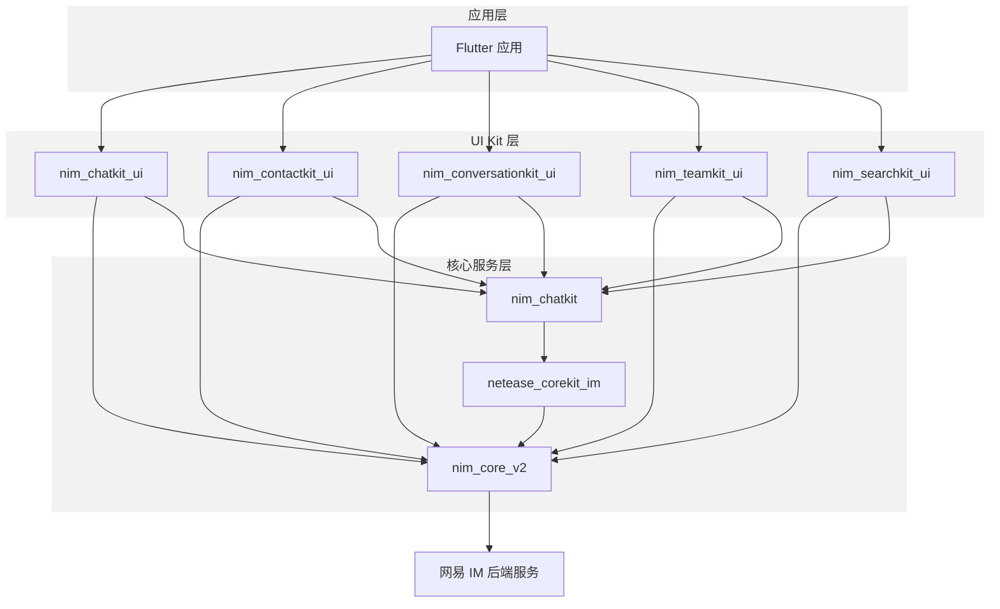
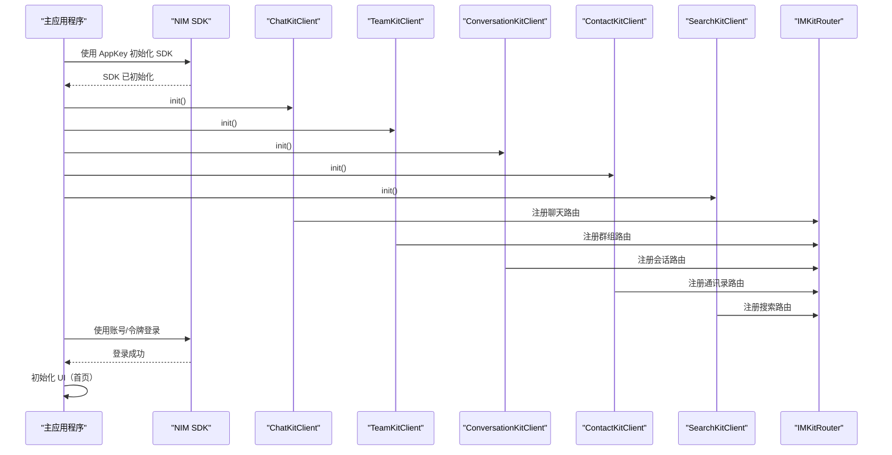
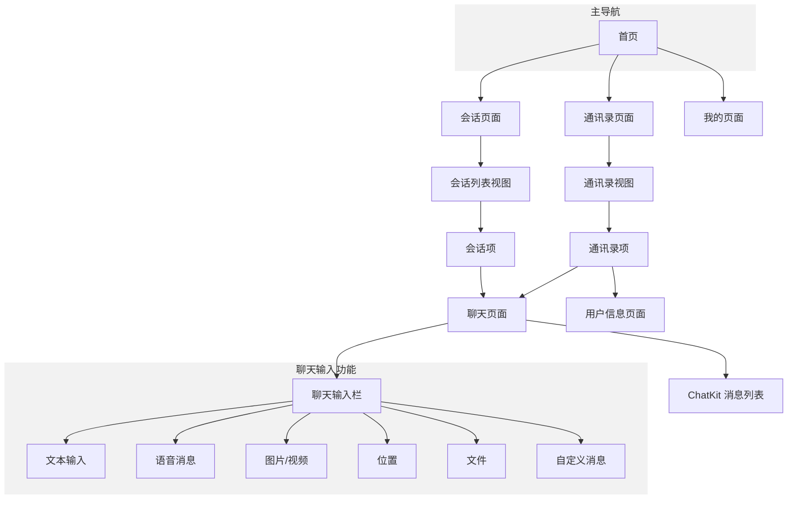
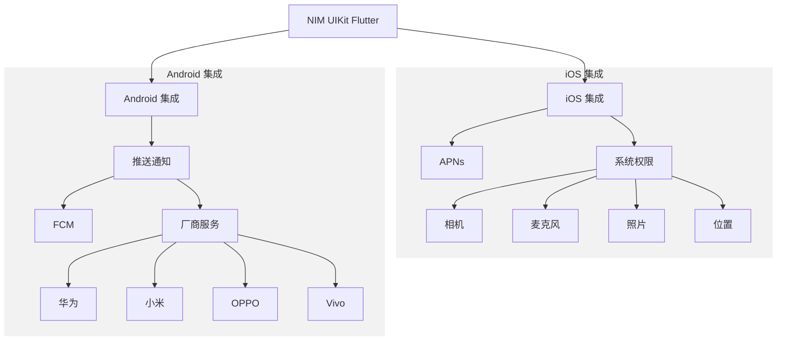

本文提供了网易云信 Flutter UI Kit 的技术概述，这是一套用于构建即时通讯应用的完整用户界面工具包。该工具包提供即用型 UI 组件，用于实现基于网易即时通讯(NIM)核心 SDK 的消息功能。

关于实现架构的详细信息，请参考 [架构](https://deepwiki.com/netease-kit/nim-uikit-flutter/2-architecture)。有关特定组件的文档，请参考 [UI Kit 组件](https://deepwiki.com/netease-kit/nim-uikit-flutter/3-ui-kit-components)。

:::note note
本文是 [DeepWiki - netease-kit/nim-uikit-flutter](https://deepwiki.com/netease-kit/nim-uikit-flutter/1-overview) 项目概述的英译中翻译版本，为您介绍 IM Demo 源码项目。您可以前往 [DeepWiki - netease-kit/nim-uikit-flutter](https://deepwiki.com/netease-kit/nim-uikit-flutter/1-overview) 查看更多内容，如需实现相关功能，可调用 DeepSearch 参考实现。


:::

## 核心组件

网易云信 Flutter UI Kit 由五个主要 UI 模块组成，提供不同方面的消息功能：

| 模块 | 包名 | 用途 |
| ---- | ---- | ---- |
| 聊天 UI | `nim_chatkit_ui` | 一对一和群组消息的聊天界面 |
| 通讯录 UI | `nim_contactkit_ui` | 好友、黑名单等功能 |
| 会话 UI | `nim_conversationkit_ui` | 会话列表和最近聊天显示 |
| 群组 UI | `nim_teamkit_ui` | 群组/团队创建和管理功能 |
| 搜索 UI | `nim_searchkit_ui` | 好友和消息的搜索功能 |

根据您的需求，每个模块可以独立使用或组合使用，以构建完整的消息应用。

## 系统架构

以下图表说明了网易云信 UI Kit 的架构结构以及组件之间的关系：



该架构采用分层方法：
- UI Kit 层包含五个主要 UI 组件
- 核心服务层提供底层通信基础设施
- 每个 UI 组件与 NIM 核心 SDK (`nim_core_v2`)通信，实现后端服务集成

## 初始化流程

要将 NIM UIKit 集成到应用程序中，必须正确初始化组件。以下时序图展示了这个过程：



这种初始化在应用程序的启动代码中执行。在演示应用程序中，初始化由 `_initPlugins()` 方法处理：

```Dart
void _initPlugins() {
  ChatKitClient.init();
  TeamKitClient.init();
  ConversationKitClient.init();
  ContactKitClient.init();
  SearchKitClient.init();

  IMKitRouter.instance.registerRouter(
      RouterConstants.PATH_MINE_INFO_PAGE, (context) => UserInfoPage());
}
```

## UI 结构

NIM UIKit 提供一个典型的消息应用结构，应用程序包含以下组件：



主要 UI 结构在 `HomePage` 中实现，使用底部导航栏在三个主要部分之间切换：
- 会话列表（最近聊天）
- 通讯录
- 用户资料（**我的**）

每个 UI kit 模块提供渲染应用程序不同部分所需的组件。

## 功能支持

NIM UIKit 支持广泛的消息功能，包括：

| 功能 | 说明 | 相关组件 |
| ---- | ---- | ---- |
| 消息类型 | 文本、图片、语音、视频、位置、文件 | `ChatKitClient` |
| 消息操作 | 复制、回复、转发、置顶、删除、撤回 | `ChatKitMessageItem` |
| 群组管理 | 创建、加入、邀请、管理群组成员 | `TeamKitClient` |
| 通讯录管理 | 添加、删除、搜索好友 | `ContactKitClient` |
| 会话管理 | 最近聊天、未读计数、会话设置 | `ConversationKitClient` |
| 搜索 | 搜索好友和消息 | `SearchKitClient` |
| 推送通知 | 支持各种平台，包括 iOS、Android、华为 | `ChatKitClient.chatUIConfig.getPushPayload` |

该工具包还提供消息显示、输入操作和主题的自定义选项。

## 国际化支持

NIM UIKit 通过 Flutter 的本地化系统提供全面的国际化支持。每个 UI 组件都包含自己的本地化代理，必须添加到应用程序的配置中：

```Dart
MaterialApp(
  localizationsDelegates: [
    S.delegate,
    CommonUILocalizations.delegate,
    ConversationKitClient.delegate,
    ChatKitClient.delegate,
    ContactKitClient.delegate,
    TeamKitClient.delegate,
    SearchKitClient.delegate,
    ...GlobalMaterialLocalizations.delegates,
  ],
  supportedLocales: IMKitClient.supportedLocales,
  // ...
)
```

目前支持英语和中文：

```Dart
static const List<Locale> supportedLocales = <Locale>[
  Locale('en'),
  Locale('zh')
];
```

## 入门指南

要在 Flutter 应用程序中使用网易云信 UIKit，请将所需依赖项添加到您的 `pubspec.yaml` 文件：

```yaml
dependencies:
  nim_chatkit_ui: ^10.1.0
  nim_contactkit_ui: ^10.1.0
  nim_conversationkit_ui: ^10.1.0
  nim_teamkit_ui: ^10.1.0
  nim_searchkit_ui: ^10.1.0
```

然后在您的应用程序中初始化组件：

```Dart
// 初始化所有 UI 工具包
ChatKitClient.init();
TeamKitClient.init();
ConversationKitClient.init();
ContactKitClient.init();
SearchKitClient.init();

// 如需注册自定义路由
IMKitRouter.instance.registerRouter(
    'custom_route_path', (context) => YourCustomPage());
```

`im_demo` 目录中的演示应用程序提供了可以作为参考的完整实现示例。

## 平台集成

NIM UIKit 包括基本功能的平台特定集成：



演示应用程序展示了如何实现平台特定功能（如推送通知）并处理设备权限：

1. **推送通知**：`im_demo` 应用程序实现了 Android 和 iOS 平台的推送通知处理
2. **权限**：UIKit 处理各种权限，包括相机、麦克风和存储
3. **平台依赖**：通过 Podfile（iOS）和 build.gradle（Android）集成所需的原生库

## 下一步

网易云信 Flutter UI Kit 为在 Flutter 应用程序中实现即时通讯功能提供了全面解决方案。其模块化设计允许开发者只使用他们需要的组件，而共享依赖确保了整个 UI 工具包的一致性。

有关特定组件和实现细节的更详细信息，请参考以下部分：

- [组件架构](https://deepwiki.com/netease-kit/nim-uikit-flutter/2.1-component-architecture)
- [初始化流程](https://deepwiki.com/netease-kit/nim-uikit-flutter/2.2-initialization-flow)
- [平台集成](https://deepwiki.com/netease-kit/nim-uikit-flutter/2.3-platform-integration)
- [ChatKit UI](https://deepwiki.com/netease-kit/nim-uikit-flutter/3.1-chatkit-ui)
- [ContactKit UI](https://deepwiki.com/netease-kit/nim-uikit-flutter/3.2-contactkit-ui)
- [ConversationKit UI](https://deepwiki.com/netease-kit/nim-uikit-flutter/3.3-conversationkit-ui)
- [TeamKit UI](https://deepwiki.com/netease-kit/nim-uikit-flutter/3.4-teamkit-ui)
- [SearchKit UI](https://deepwiki.com/netease-kit/nim-uikit-flutter/3.5-searchkit-ui)