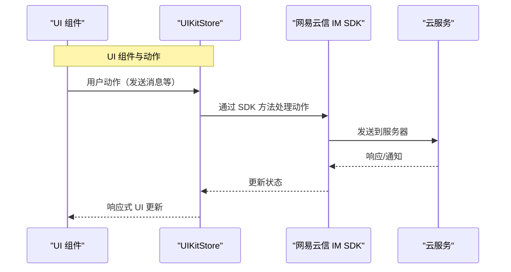

在 IM UIKit 中，`store` 是一个基于 [MobX](https://mobx.js.org/README.html "Mobx 官网文档") 封装的全局上下文对象，它提供了数据和 UI 之间的双向绑定能力。`store` 包含多个子模块，每个子模块负责管理不同的数据领域，如会话、消息、通讯录、群组等。通过 `store`，您可以方便地获取数据、响应数据变化，并更新 UI。

## 技术原理



上述时序图展示了一个典型的消息传递流程：

1. 从 UI 组件开始，用户进行动作（如发送消息）。
2. UIKitStore 接收，并通过网易云信 IM SDK 处理。
3. SDK 将消息发送到云服务，云服务返回响应或通知。
4. SDK 接收响应并更新状态。
5. UIKitStore 获取更新的状态。
6. UI 组件根据状态更新进行响应式更新。

## 适用场景

`store` 在 IM UIKit 中的使用场景包括但不限于：

- **消息发送与管理**：使用 `store` 管理会话消息，发送文本、图片、视频等类型的消息。
- **状态同步**：同步用户在线状态、群组信息、好友列表等。
- **数据绑定**：在 UI 组件中使用 `store` 的数据进行数据绑定，实现 UI 的自动更新。
- **自定义消息**：发送自定义消息格式，满足特定业务需求。
- **扩展功能**：在特定的场景下，如群聊，添加扩展字段或处理特定业务逻辑。

## 前提条件

在使用 IM UIKit `store` 前，请确保您已完成 IM UIKit 的初始化。详情请参考 [初始化](https://doc.yunxin.163.com/messaging-uikit/guide/DA5MjEzOTY?platform=h5#第三步集成并初始化组件)。

## 第一步：初始化 store

```JavaScript
// 初始化 nim sdk
const nim = V2NIM.getInstance(
    {
      appkey: "your appkey",
      needReconnect: true,
      debugLevel: "debug",
      apiVersion: "v2",
      enableV2CloudConversation: enableV2CloudConversation,
    },
    {
      V2NIMLoginServiceConfig: {
        lbsUrls: ["https://lbs.netease.im/lbs/webconf.jsp"],
        linkUrl: "weblink.netease.im",
      },
    }
  );
// 初始化store
  const store = new RootStore(
    // @ts-ignore
    // 参数一：NIMSDK，必填
    nim,
    //参数二：本地化配置，必填，详细参数说明请参考底部常见问题
    {
      // 添加好友是否需要验证
      addFriendNeedVerify: false,
      // 是否需要显示 p2p 消息、p2p会话列表消息已读未读，默认 false
      p2pMsgReceiptVisible: true,
      // 是否需要显示群组消息已读未读，默认 false
      teamMsgReceiptVisible: true,
      // 群组被邀请模式，默认需要验证
      teamAgreeMode:
        V2NIMConst.V2NIMTeamAgreeMode.V2NIM_TEAM_AGREE_MODE_NO_AUTH,
      // 发送消息前回调，可对消息体进行修改，添加自定义参数
      sendMsgBefore: async (options: {
        msg: V2NIMMessage;
        conversationId: string;
        serverExtension?: Record<string, unknown>;
      }) => {
        return { ...options };
      },
    },
    //参数三：平台，可选
    "H5"
  );
```

本项目将 store 挂载到 `Context.Provider` 中，便于后续的组件获取此对象。

您可以参考 [示例工程](https://github.com/netease-kit/nim-uikit-H5/blob/main/nim-kit-react-ui-h5/src/NEUIKit/common/contextManager/Provider.tsx) 的 `nim-kit-react-ui-h5/src/NEUIKit/common/contextManager/Provider.tsx`。

```ts
export const Provider: FC<ProviderProps> = memo(function Main({
  // ...
  return (
    <Context.Provider
      value={{
        store: rootStore,
        nim,
        localOptions: finalLocalOptions,
        locale,
        t
      }}
    >
      <App>{children}</App>
    </Context.Provider>
  )
})
```

## 第二步：数据渲染

在组件中获取 store 用于数据渲染。

```ts
import { useContext } from "react";
import { observer } from 'mobx-react-lite'
import { Context, ContextProps } from "@/NEUIKit/common/hooks/useStateContext.ts";

// 注意 observer，意味着组件内部的 mobx 可观察对象，若有变更会直接再次渲染本组件.
const ATeamComponent: React.FC = observer(() => {
  const { store } = useContext<ContextProps>(Context);

  // 从 store 获取群组列表数据，这是一个 mobx 对象
  // 此数据已经能在更改时，重新渲染本组件
  // store.uiStore.teamList

  return (
    <div>
      {teamList.length === 0 ? (
        <Empty text={'empty'} />
      ) : (
        store.uiStore.teamList.map((team) => (
          <div className="team-item" key={team.teamId}>
            <Avatar account={team.teamId} avatar={team.avatar} />
            <span className="team-name">{team.name}</span>
          </div>
        ))
      )}
    </div>
  )
})

```

调用 `store` 相较于直接调用 NIM SDK 方法，具备数据与 UI 双向绑定的能力，无需您额外处理 UI 的增删。

`store` API 说明：

| 返回值 | 类型 | 说明 |
| ---- | ---- | ---- |
| [`UiStore`](https://doc.yunxin.163.com/messaging2/references/web/typedoc//IMUIKit/Latest/classes/UiStore.html) | Object | Mobx 可观察对象，负责 UI 会用到的属性的子 `store`。 |
| [`ConnectStore`](https://doc.yunxin.163.com/messaging2/references/web/typedoc//IMUIKit/Latest/classes/ConnectStore.html) | Object | Mobx 可观察对象，负责连接的子 `store`。 |
| [`MsgStore`](https://doc.yunxin.163.com/messaging2/references/web/typedoc//IMUIKit/Latest/classes/MsgStore.html) | Object | Mobx 可观察对象，负责管理会话消息的子 `store`。 |
| [`SysMsgStore`](https://doc.yunxin.163.com/messaging2/references/web/typedoc//IMUIKit/Latest/classes/SysMsgStore.html) | Object | Mobx 可观察对象，负责管理好友申请、群申请相关系统消息的子 `store`。 |
| [`ConversationStore`](https://doc.yunxin.163.com/messaging2/references/web/typedoc//IMUIKit/Latest/classes/ConversationStore.html) | Object | Mobx 可观察对象，负责管理会话相关的子 `store`。 |
| [`FriendStore`](https://doc.yunxin.163.com/messaging2/references/web/typedoc//IMUIKit/Latest/classes/FriendStore.html) | Object | Mobx 可观察对象，负责管理好友信息的子 `store`。 |
| [`UserStore`](https://doc.yunxin.163.com/messaging2/references/web/typedoc//IMUIKit/Latest/classes/UserStore.html) | Object | Mobx 可观察对象，负责管理用户信息（包含陌生人）的子 `store`。 |
| [`RelationStore`](https://doc.yunxin.163.com/messaging2/references/web/typedoc//IMUIKit/Latest/classes/RelationStore.html) | Object | Mobx 可观察对象，负责管理黑名单和静音列表的子 `store`。 |
| [`TeamStore`](https://doc.yunxin.163.com/messaging2/references/web/typedoc//IMUIKit/Latest/classes/TeamStore.html) | Object | Mobx 可观察对象，负责管理群组的子 `store`。 |
| [`TeamMemberStore`](https://doc.yunxin.163.com/messaging2/references/web/typedoc//IMUIKit/Latest/classes/TeamMemberStore.html) | Object | Mobx 可观察对象，负责管理群组成员的子 `store`。 |

例如您想在创建群聊的同时添加群扩展字段，可调用群组 `store`（[`TeamStore`](https://doc.yunxin.163.com/messaging2/references/web/typedoc//IMUIKit/Latest/classes/TeamStore.html)）中的创建群组接口实现，具体参数请参考 [`createTeamActive`](https://doc.yunxin.163.com/messaging2/references/web/typedoc//IMUIKit/Latest/classes/TeamStore.html#createTeamActive)。

**示例代码**：

```JavaScript
store.teamStore.createTeamActive({
    name: '测试群',
    avatar: 'https:xxxxxxxxxxx',
    accounts: ['account1', 'account2'],
    serverExtension: JSON.stringify({ test: 'test' })
}).then(res => {
    console.log('======创建群成功=======');
    console.log(res);
}).catch(err => {
    console.log('======创建群失败=======');
    console.log(err);
})
```

## 常见问题

### 如何监听 store 的数据变更？

通过 `observer` 方法进行监听，例如监听会话列表的变更的示例代码如下：

```JavaScript
import { useContext } from "react";
import { observer } from 'mobx-react-lite'
import { Context, ContextProps } from "@/NEUIKit/common/hooks/useStateContext.ts";

// 注意 observer，意味着组件内部的 mobx 可观察对象，若有变更会直接再次渲染本组件.
const ATeamComponent: React.FC = observer(() => {
  const { store } = useContext<ContextProps>(Context);

  // 从 store 获取群组列表数据，这是一个 mobx 对象
  // 此数据已经能在更改时，重新渲染本组件
  // store.uiStore.teamList

  return (
    <div>
      {teamList.length === 0 ? (
        <Empty text={'empty'} />
      ) : (
        store.uiStore.teamList.map((team) => (
          <div className="team-item" key={team.teamId}>
            <Avatar account={team.teamId} avatar={team.avatar} />
            <span className="team-name">{team.name}</span>
          </div>
        ))
      )}
    </div>
  )
})
```

### 如何进行 store 本地化配置？

请参考以下参数进行本地化配置。

```ts
export interface LocalOptions {
  /**
   添加好友模式，默认需要验证
   */
  addFriendNeedVerify?: boolean
  /**
   群组更新模式，默认管理员可修改
   */
  teamUpdateTeamMode?: V2NIMTeamUpdateInfoMode
  /**
   群组更新自定义字段模式，默认所有人可修改
   */
  teamUpdateExtMode?: V2NIMTeamUpdateExtensionMode
  /**
   是否需要@消息提醒，默认 true
   */
  needMention?: boolean
  /**
   转让群主的同时是否退出群聊，默认 false
   */
  leaveOnTransfer?: boolean
  /**
   是否允许群主转让，默认 false
   */
  allowTransferTeamOwner?: boolean
  /**
    是否需要显示单聊消息、单聊会话列表消息已读未读，默认 false
    */
  p2pMsgReceiptVisible?: boolean
  /**
    是否需要显示群组消息已读未读，默认 false
  */
  teamMsgReceiptVisible?: boolean
  /**
    是否需要显示群管理员相关主动功能，默认 false
  */
  teamManagerVisible?: boolean
  /**
    是否开启数字人功能，默认 true
   */
  aiVisible?: boolean
  /**
    单个群管理员默认数量限制，默认 10 个
  */
  teamManagerLimit?: number

  /**
     发送消息前的钩子函数，异步函数，返回 false 则不发送消息
   */
  sendMsgBefore?: (params: any) => Promise<V2NIMSendMessageParams | false>
  /**
     AI 机器人提供者
   */
  aiUserAgentProvider?: AIUserAgentProvider
  /**
     会话列表拉取会话数量，默认 100
   */
  conversationLimit?: number
  /**
   * 是否开启日志打印
   */
  debug?: 'off' | 'debug'
}
```