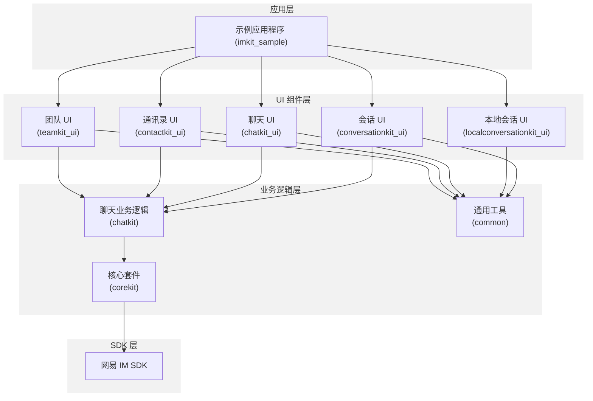
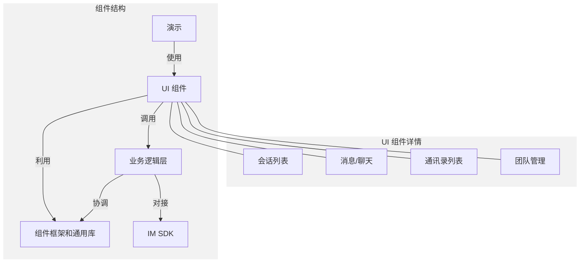
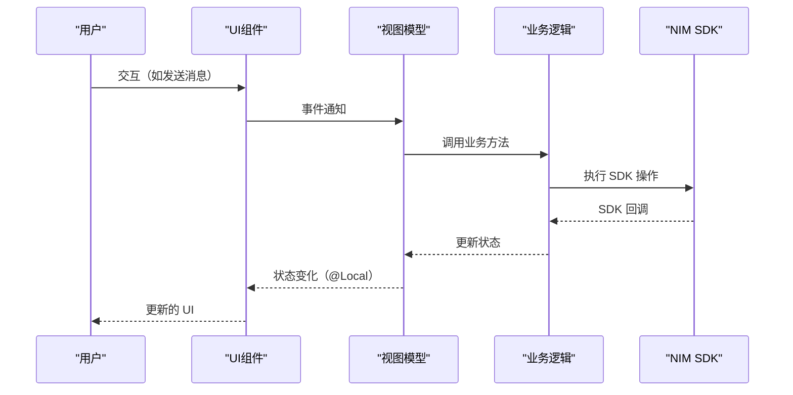
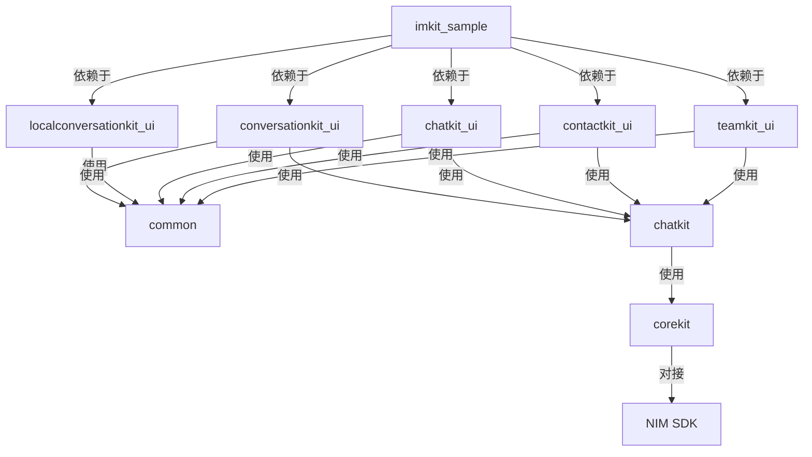

网易云信即时通讯 UI Kit（NIM UIKit）是一个构建在网易云信 SDK（NIM SDK）之上的综合性 UI 组件库。它提供了即时通讯应用的即用型 UI 组件，使开发者能够以最小的工作量快速集成聊天、会话、通讯录和团队管理功能。本文介绍了 NIM UIKit 的目的、架构和关键特性，作为了解整个系统的入口点。

有关特定组件的详细信息，请参考 [UI 组件](https://deepwiki.com/netease-kit/nim-uikit-harmony/3)，有关实施指南，请参考 [集成指南](https://deepwiki.com/netease-kit/nim-uikit-harmony/6)。

:::note note
本文是 [DeepWiki - netease-kit/nim-uikit-harmony](https://deepwiki.com/netease-kit/nim-uikit-harmony/1-overview) 项目概述的英译中翻译版本，为您介绍 IM Demo 源码项目。您可以前往 [DeepWiki - netease-kit/nim-uikit-harmony](https://deepwiki.com/netease-kit/nim-uikit-harmony/1-overview) 查看更多内容，如需实现相关功能，可调用 DeepSearch 参考实现。

:::

## 主要功能

NIM UIKit 提供了丰富的功能，组织为几个 UI 子组件：

- **会话管理**：显示和管理带有消息预览、时间戳和未读计数的会话列表
- **聊天界面**：支持文本、图片、视频、音频、文件共享和其他消息类型，具有丰富的交互能力
- **通讯录管理**：用户资料、好友列表和黑名单操作
- **团队/群组管理**：创建、加入和管理团队设置及成员
- **搜索功能**：跨会话、消息和好友进行搜索

该系统提供了显著的优势：

1. **组件解耦**：每个组件可以独立运行，允许选择性集成
2. **使用简化**：UI 和业务逻辑层之间的明确分离
3. **自定义能力**：在初始化期间配置 UI 组件
4. **全面的业务逻辑**：简化的接口，抽象了复杂的 SDK 交互

## 架构概述

NIM UIKit 遵循 Model-View-ViewModel（MVVM）架构模式，将 UI 展示与业务逻辑分离。这种架构使代码结构更清晰，维护更容易。

### 架构图

该架构由四个主要层次组成：

1. **应用层**：展示 UIKit 组件使用方法的示例应用程序
2. **UI 组件层**：处理用户交互和显示的表现组件
3. **业务逻辑层**：处理数据，管理状态，并与 SDK 协调
4. **SDK 层**：提供核心通信能力的底层网易 IM SDK

### 组件结构

NIM UIKit 组件的结构如下：

- **示例**：使用 UIKit 组件展示完整 IM 应用，包括初始化、登录和主 UI 构建
- **UI 组件**：四个主要组件（会话、消息、通讯录和团队）可以单独或一起集成
- **业务逻辑层**：优化并组合 SDK 接口，为 UI 组件提供便捷的 API
- **框架和通用库**：提供共享服务，如组件通信、初始化和通用工具
- **IM SDK**：支持所有通信功能的底层网易 IM SDK

## 数据流

NIM UIKit 使用 HarmonyOS 的 `@Local` 装饰器来管理组件状态，实现了响应式 UI 方法。当业务逻辑层的数据发生变化时，UI 组件会自动刷新以反映更新后的状态。

数据流遵循以下步骤：
1. 用户与 UI 组件交互
2. UI 触发由视图模型处理的事件
3. 视图模型调用适当的业务逻辑方法
4. 业务逻辑与 NIM SDK 交互
5. SDK 将结果返回给业务逻辑
6. 业务逻辑更新视图模型状态
7. UI 根据 `@Local` 装饰器通过状态变化自动刷新

## 模块结构

NIM UIKit 的代码库组织为几个模块，每个模块具有特定的职责：

| 模块 | 用途 | 类型 |
| ---- | ---- | ---- |
| imkit_sample | 展示使用方法的示例应用程序 | 应用程序 |
| common | 共享工具和组件 | 库 |
| conversationkit_ui | 会话列表 UI 组件 | UI 组件 |
| localconversationkit_ui | 本地会话 UI 组件 | UI 组件 |
| chatkit_ui | 聊天界面 UI 组件 | UI 组件 |
| chatkit | 聊天业务逻辑 | 业务逻辑 |
| corekit | 核心功能和 SDK 交互 | 业务逻辑 |
| contactkit_ui | 通讯录管理 UI 组件 | UI 组件 |
| teamkit_ui | 团队/群组管理 UI 组件 | UI 组件 |

模块结构允许灵活集成，您可以仅包含他们需要的组件，同时保持一致的用户体验。

## 集成方法

要在 HarmonyOS 应用中使用 NIM UIKit，您需要：

1. 添加所需的 UIKit 组件作为依赖项
2. 使用适当的凭证初始化 IM SDK
3. 根据需要配置 UI 组件
4. 将组件集成到应用程序的 UI 流程中

有关详细的集成说明，请参考 [集成指南](https://deepwiki.com/netease-kit/nim-uikit-harmony/6) 和 [配置](https://deepwiki.com/netease-kit/nim-uikit-harmony/6.1) 章节。

## 底层依赖

NIM UIKit 是网易云通信产品更广泛生态系统的一部分。它专注于即时通讯的 UI 组件，构建在核心 NIM SDK 之上。NIM SDK 处理底层通信协议、数据同步和服务器交互，而 UIKit 提供面向用户的组件。

对于高级功能或自定义需求，您可以通过 UIKit 提供的业务逻辑层直接访问 NIM SDK。