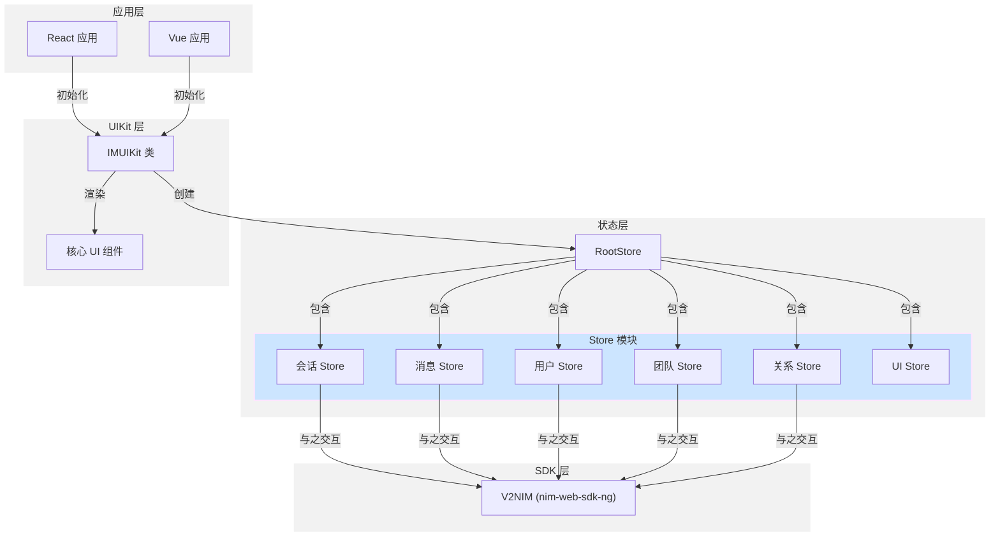

IM Web Demo 是基于网易云信 IM UIKit（NEUIKit）打造的一款 Demo，托管在 GitHub 开源代码仓库 [nim-uikit-web](https://github.com/netease-kit/nim-uikit-web)。该 Demo 提供了一些通用的功能，包含会话、聊天、群组等，您可以基于源码搭建您的即时通讯业务逻辑。

## 项目介绍

nim-uikit-web 仓库提供了一套完整的 UI 工具包，用于在 Web 应用中集成即时通讯功能。该工具包基于网易即时通讯(NIM) SDK 构建，提供预制组件，简化会话、消息界面和通讯录管理等聊天功能的实现。该工具包同时支持 React 和 Vue 框架，使开发者能够快速部署功能齐全的消息界面，而无需从零开始构建 UI 组件。

## 核心功能

- **会话管理**：单聊/群聊会话、消息状态显示、会话置顶、消息免打扰
- **实时聊天**：文字、图片、语音等多种消息类型、实时同步、多端漫游、@消息、消息撤回/转发/回复/更新等
- **群组管理**：群组创建/解散/退出、群成员管理、群权限分级
- **通讯录**：用户信息管理、好友管理
- **跨框架支持**：兼容 React 和 Vue 框架
- **高级消息功能**：包括消息转发、已读回执和@提及功能
- **自定义选项**：灵活的样式和行为配置

更详细的功能列表请参见 [功能概览](https://doc.yunxin.163.com/messaging-uikit/concept/zMzMDQ2MTg?platform=client)。

## 系统架构

以下图表展示了 IM UIKit 的高级架构：



该架构由四个主要层次组成：

1. **应用层**：集成 UIKit 的 React 或 Vue 宿主应用
2. **UIKit 层**：包含核心 UI 组件的主要接口层
3. **状态层**：管理应用状态的基于 MobX 的存储
4. **SDK 层**：处理核心消息功能的 NIM SDK

## 工程结构

```
src 
├─ chat                                    # 聊天模块
│  ├─ Container.tsx                        # 聊天容器组件
│  ├─ components                           # 聊天相关组件
│  │  ├─ ChatAISearch                     # AI 搜索功能组件
│  │  ├─ ChatAITranslate                  # 消息翻译功能组件
│  │  ├─ ChatActionBar                    # 聊天操作栏组件
│  │  ├─ ChatAddMembers                   # 添加群成员组件
│  │  ├─ ChatCollectionList               # 消息收藏列表组件
│  │  ├─ ChatForwardModal                 # 消息转发弹窗
│  │  ├─ ChatGroupTransferModal           # 群主转让弹窗
│  │  ├─ ChatHeader                       # 聊天窗口头部组件
│  │  ├─ ChatMessageInput                 # 消息输入框组件
│  │  ├─ ChatMessageItem                  # 单条消息组件
│  │  ├─ ChatP2pMessageList              # 单聊聊天消息列表
│  │  ├─ ChatP2pSetting                  # 单聊聊天设置
│  │  ├─ ChatSettingDrawer               # 聊天设置抽屉组件
│  │  ├─ ChatTeamMemberModal             # 群成员管理弹窗
│  │  ├─ ChatTeamMessageList             # 群聊消息列表
│  │  ├─ ChatTeamSetting                 # 群聊设置组件
│  │  └─ ChatTopMsg                      # 置顶消息组件
│  └─ containers                          # 聊天容器组件
      ├─ p2pChatContainer.tsx             # 点对点聊天容器，负责单聊数据处理
      └─ teamChatContainer.tsx            # 群聊容器，负责群聊数据处理

├─ common                                 # 通用组件
│  ├─ components
│  │  ├─ CommonIcon                      # 通用图标组件
│  │  ├─ CommonParseSession             # 会话消息解析组件，负责解析各种消息类型
│  │  ├─ ComplexAvatar                  # 复杂头像组件
│  │  ├─ CreateTeamModal                # 创建群组弹窗
│  │  ├─ CrudeAvatar                    # 基础头像组件
│  │  ├─ FriendSelect                   # 好友选择组件
│  │  ├─ GroupAvatarSelect             # 群头像选择组件
│  │  ├─ MyAvatar                      # 个人头像组件
│  │  ├─ MyUserCard                    # 个人名片组件
│  │  ├─ ReadPercent                   # 消息已读百分比组件
│  │  ├─ RichText                      # 富文本组件
│  │  ├─ SearchInput                   # 搜索输入框组件
│  │  ├─ SelectModal                   # 通用选择弹窗
│  │  ├─ UserCard                      # 用户名片组件
│  │  └─ Welcome                       # 欢迎页组件

├─ contact                               # 通讯录模块
│  ├─ ai-list                           # AI 助手列表
│  ├─ black-list                        # 黑名单列表
│  ├─ contact-info                      # 用户信息
│  ├─ contact-list                      # 通讯录列表
│  ├─ friend-list                       # 好友列表
│  ├─ group-list                        # 群组列表
│  └─ msg-list                          # 消息通知列表

├─ conversation                          # 会话列表模块
│  ├─ components
│  │  ├─ ConversationItem              # 会话列表项组件
│  │  ├─ ConversationList              # 会话列表组件
│  │  ├─ GroupItem                     # 群会话项组件
│  │  ├─ P2PItem                       # 点对点会话项组件
│  │  ├─ pinAIItem                     # 置顶 AI 会话项组件
│  │  └─ pinAIList                     # 置顶 AI 会话列表组件

├─ search                               # 搜索模块
│  ├─ add                              # 添加好友/群组
│  │  ├─ components
│  │  │  ├─ AddFriendModal            # 添加好友弹窗
│  │  │  ├─ AddItem                   # 搜索结果项
│  │  │  ├─ AddList                   # 搜索结果列表
│  │  │  ├─ AddPanel                  # 添加面板
│  │  │  └─ JoinTeamModal            # 加入群组弹窗
│  └─ search                          # 搜索功能
      └─ components
          └─ SearchModal                # 搜索弹窗

├─ uploadingTask.ts                    # 文件上传任务管理
├─ urlToBlob.ts                       # URL 转 Blob 工具
└─ utils.ts                           # 通用工具函数
```

## 环境要求

以适配 React 框架的项目为例，IM UIKit 支持以下环境：

| 配置项 | 要求 |
| --- | --- |
| 框架 | React 16.8 |
| 语言 | TypeScript |
| 组件 | mobx、mobx-react、less |

## 依赖介绍

以适配 React 框架的项目为例，IM UIKit 依赖于以下组件：

| 依赖 | 说明 |
| --- | --- |
| `nim-web-sdk-ng` | [网易云信 NIM SDK](https://doc.yunxin.163.com/messaging2/concept?platform=client)，提供了一整套即时通讯基础能力。 |
| `@xkit-yx/im-store-v2` | store 用于 **全局状态管理**，基于 mobx 和 NIM SDK 封装的全局上下文对象，它提供了数据和 UI 之间的双向绑定能力。<br>包含多个子模块，每个子模块负责管理不同的数据领域，如会话、消息、通讯录、群组等。通过 store，您可以方便地获取数据、响应数据变化，并更新 UI。更多 store 相关信息。请参见 [全局上下文](https://doc.yunxin.163.com/messaging-uikit/guide/DI1NzE1ODA?platform=web)。 |
| `@xkit-yx/utils` | 项目中的工具库，提供 `getFileType`、`parseFileSize` 等函数。 |
| `mobx` & `mobx-react` | 主要用于全局数据状态管理。<li>mobx：负责存储和管理数据，比如聊天记录、好友列表、在线状态等。<li>mobx-react：用于把 mobx 管理的数据和 React 组件连接起来，当数据变化时（比如收到新消息），相关的组件会自动更新，不需要手动进行 setState。 |
| `react-markdown` & `rehype-highlight` & `rehype-raw` & `remark-gfm` | 主要用于 AI Markdown 格式消息渲染。 |

:::note note 
store 在 IM UIKit 中的使用场景包括但不限于：
- 消息发送与管理：使用 store 管理会话消息，发送文本、图片、视频等类型的消息。
- 状态同步：同步用户在线状态、群组信息、好友列表等。
- 数据绑定：在 UI 组件中使用 store 的数据进行数据绑定，实现 UI 的自动更新。
- 自定义消息：发送自定义消息格式，满足特定业务需求。
- 扩展功能：在特定的场景下，如群聊，添加扩展字段或处理特定业务逻辑。
:::

## 核心配置

IM UIKit 支持多种配置选项来自定义其行为：

| 选项 | 说明 | 默认值 |
| ---- | ---- | ---- |
| `addFriendNeedVerify` | 是否需要验证才能添加好友 | `true` |
| `teamAgreeMode` | 处理团队邀请的模式 | `NO_AUTH` |
| `p2pMsgReceiptVisible` | 是否显示 P2P 消息的已读回执 | `false` |
| `teamMsgReceiptVisible` | 是否显示团队消息的已读回执 | `false` |
| `needMention` | 是否启用@提及功能 | `true` |
| `loginStateVisible` | 是否显示在线/离线状态 | `true` |
| `allowTransferTeamOwner` | 是否允许转让团队所有权 | `true` |
| `enableV2CloudConversation` | 是否启用云端会话 | `false` |

## 集成源码

您可以参考 [集成源码（React）](https://doc.yunxin.163.com/messaging-uikit/guide/TU3MDEwODY?platform=web) 将 IM Web UIKit 源码集成至您的项目。

集成后，您可以参考以下实践方案快速实现核心功能。

- [全局上下文](https://doc.yunxin.163.com/messaging-uikit/guide/DI1NzE1ODA?platform=web)
- [账号登录登出](https://doc.yunxin.163.com/messaging-uikit/guide/jQ0MjEyMzc?platform=web)
- [实现音视频通话](https://doc.yunxin.163.com/messaging-uikit/guide/jE3MTM5ODA?platform=web)
- [收发自定义消息](https://doc.yunxin.163.com/messaging-uikit/guide/jE1MTI2NDI?platform=webp)
- [单独集成聊天界面](https://doc.yunxin.163.com/messaging-uikit/guide/TgxNjQyOTM?platform=web)
- [定制会话列表界面](https://doc.yunxin.163.com/messaging-uikit/guide/DI1Mzk4ODg?platform=web)

## 了解更多（DeepWiki）

如需了解更多详细信息，请参考 DeepWiki 相关文档：

- [组件概述](https://deepwiki.com/netease-kit/nim-uikit-web/1) 了解项目概览
- [核心组件](https://deepwiki.com/netease-kit/nim-uikit-web/3) 了解组件详情

:::note note
[DeepWiki - netease-kit/nim-uikit-web](https://deepwiki.com/netease-kit/nim-uikit-web/1-overview) 同样介绍了网易云信 IM UIKit Demo 源码项目。如需实现相关功能，可调用 DeepSearch 参考实现。


:::