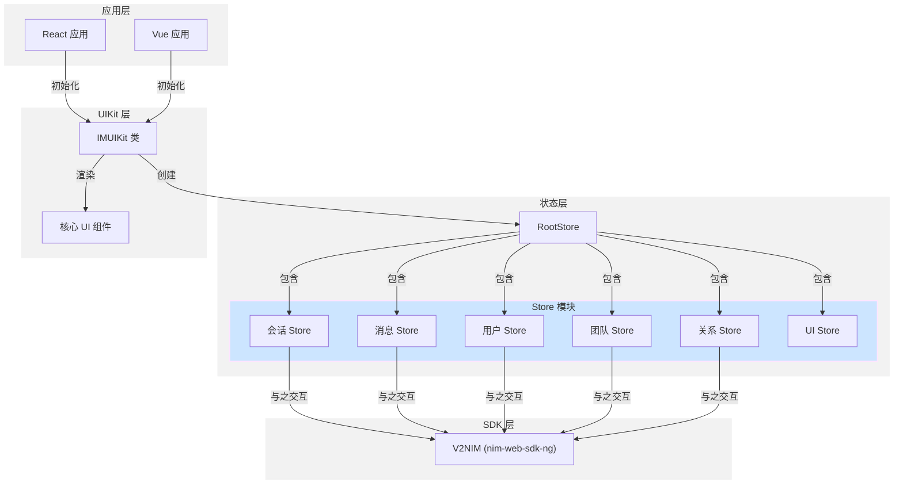
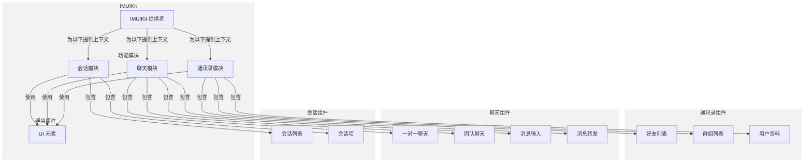
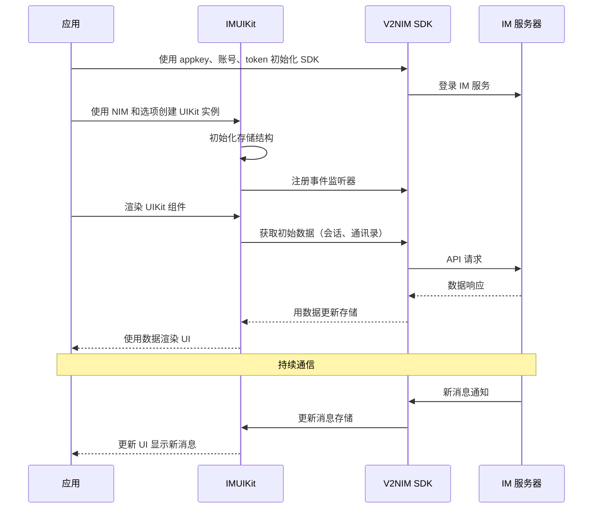
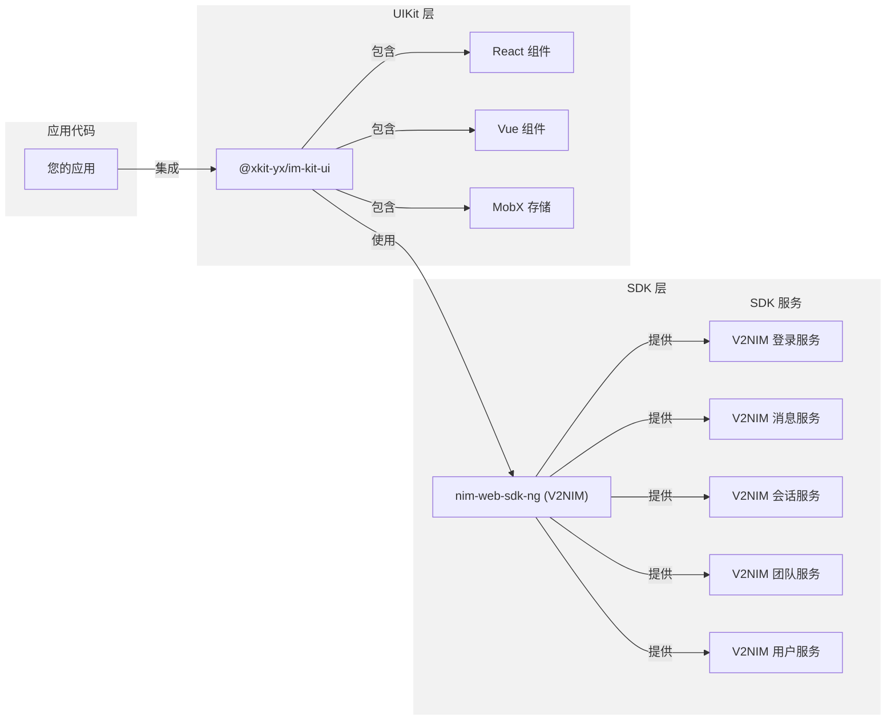

nim-uikit-web 仓库提供了一套完整的 UI 工具包，用于在 Web 应用中集成即时通讯功能。该工具包基于网易即时通讯(NIM) SDK 构建，提供预制组件，简化会话、消息界面和通讯录管理等聊天功能的实现。该工具包同时支持 React 和 Vue 框架，使开发者能够快速部署功能齐全的消息界面，而无需从零开始构建 UI 组件。

本文介绍了 IM UIKit 的高级架构、核心组件和主要概念。有关特定框架的集成详情，请参考 [React 集成](https://deepwiki.com/netease-kit/nim-uikit-web/2.1-react-integration) 和 [Vue 集成](https://deepwiki.com/netease-kit/nim-uikit-web/2.2-vue-integration)。

:::note note
本文是 [DeepWiki - netease-kit/nim-uikit-web](https://deepwiki.com/netease-kit/nim-uikit-web/1-overview) 项目概述的英译中翻译版本，为您介绍 IM Demo 源码项目。您可以前往 [DeepWiki - netease-kit/nim-uikit-web](https://deepwiki.com/netease-kit/nim-uikit-web/1-overview) 查看更多内容，如需实现相关功能，可调用 DeepSearch 参考实现。

:::

## 主要特性

- **跨框架支持**：兼容 React 和 Vue 框架
- **完整的消息 UI**：为所有核心消息功能提供预制组件
- **状态管理**：通过 MobX stores 实现集中状态处理
- **聊天类型**：支持一对一(P2P)和团队/群组聊天
- **通讯录管理**：好友和群组管理功能
- **高级消息功能**：包括消息转发、已读回执和@提及功能
- **自定义选项**：灵活的样式和行为配置

## 系统架构

以下图表展示了 IM UIKit 的高级架构：

该架构由四个主要层次组成：

1. **应用层**：集成 UIKit 的 React 或 Vue 宿主应用
2. **UIKit 层**：包含核心 UI 组件的主要接口层
3. **状态层**：管理应用状态的基于 MobX 的存储
4. **SDK 层**：处理核心消息功能的 NIM SDK

## 组件组织

UIKit 将其组件组织为功能模块，如下图所示：

主要组件组包括：

1. **会话组件**：显示和管理用户会话
2. **聊天组件**：处理一对一和团队聊天
3. **通讯录组件**：管理好友和群组
4. **通用组件**：整个工具包中使用的共享 UI 元素

## 集成流程

以下时序图展示了应用如何集成并与 IM UIKit 交互：

该图展示了应用如何初始化 SDK、创建 UIKit 实例并渲染组件。它还说明了接收新消息的数据流。

## 核心配置选项

IM UIKit 支持多种配置选项来自定义其行为：

| 选项 | 说明 | 默认值 |
| ---- | ---- | ---- |
| `addFriendNeedVerify` | 是否需要验证才能添加好友 | `true` |
| `teamAgreeMode` | 处理团队邀请的模式 | `NO_AUTH` |
| `p2pMsgReceiptVisible` | 是否显示 P2P 消息的已读回执 | `false` |
| `teamMsgReceiptVisible` | 是否显示团队消息的已读回执 | `false` |
| `needMention` | 是否启用@提及功能 | `true` |
| `loginStateVisible` | 是否显示在线/离线状态 | `true` |
| `allowTransferTeamOwner` | 是否允许转让团队所有权 | `true` |
| `enableV2CloudConversation` | 是否启用云端会话 | `false` |

这些选项可以在初始化 UIKit 时提供，以根据应用需求自定义其功能。

## 入门指南

要开始使用 IM UIKit，您需要：

1. 有效的网易 IM AppKey
2. 用户账号和令牌凭证
3. React 或 Vue 开发环境

基本实现包括：

1. 安装适合您框架的软件包
2. 使用您的凭证初始化 NIM SDK
3. 使用 SDK 和选项创建 IMUIKit 实例
4. 在您的应用中渲染 UIKit 组件

有关详细的设置说明，请参考 [入门](https://deepwiki.com/netease-kit/nim-uikit-web/2-getting-started) 页面，以及特定框架的指南，如 [React 集成](https://deepwiki.com/netease-kit/nim-uikit-web/2.1-react-integration) 和 [Vue 集成](https://deepwiki.com/netease-kit/nim-uikit-web/2.2-vue-integration)。

## 与 NIM SDK 的关系

IM UIKit 基于 NIM SDK (nim-web-sdk-ng) 构建，如下图所示：

UIKit 通过以下方式抽象 NIM SDK 的复杂性：

1. 提供与 SDK 服务交互的即用 UI 组件
2. 通过与 SDK 数据同步的 MobX 存储管理状态
3. 处理来自 SDK 的事件监听器和数据更新
4. 提供常见消息操作的高级 API

这种分层方法允许开发者实现功能完备的消息功能，而无需直接与低级 SDK API 交互。

## 下一步

有关 IM UIKit 特定方面的更详细信息，请参考：

- [关键概念和术语](https://deepwiki.com/netease-kit/nim-uikit-web/1.1-key-concepts-and-terminology) - 重要术语的定义
- [系统架构](https://deepwiki.com/netease-kit/nim-uikit-web/1.2-system-architecture) - 深入了解技术架构
- [核心组件](https://deepwiki.com/netease-kit/nim-uikit-web/3-core-components) - 主要组件类别的详细信息
- [状态管理](https://deepwiki.com/netease-kit/nim-uikit-web/4-state-management) - 有关如何使用 MobX 处理状态的信息