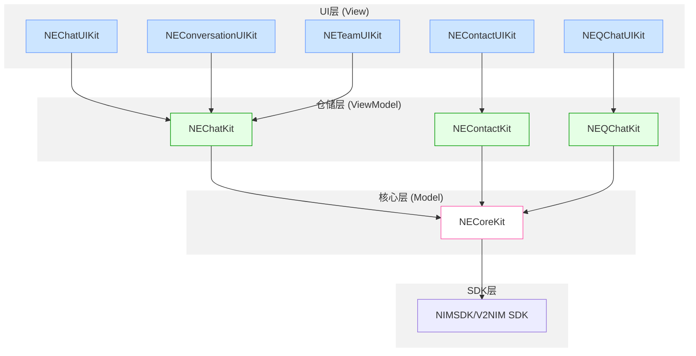
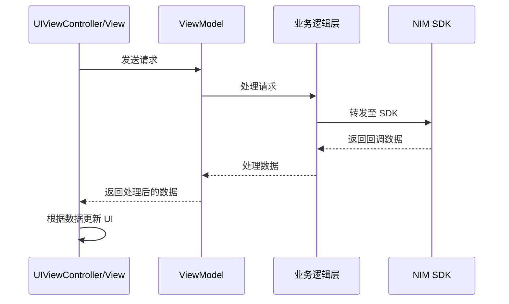
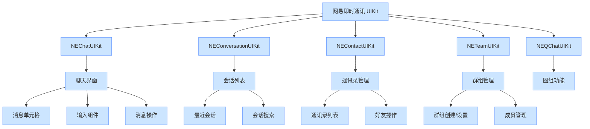

本文介绍了基于 NIM SDK（网易即时通讯 SDK）构建的网易即时通讯 UIKit iOS 版，这是一个 UI 组件库。本文提供了系统架构、核心组件和设计原则的全面概述，帮助开发者快速构建功能丰富的即时通讯应用。

:::note note
本文是 [DeepWiki - netease-kit/nim-uikit-ios](https://deepwiki.com/netease-kit/nim-uikit-ios/1-overview) 项目概述的英译中翻译版本，为您介绍 IM Demo 开源项目。您可以前往 [DeepWiki - netease-kit/nim-uikit-ios](https://deepwiki.com/netease-kit/nim-uikit-ios/1-overview) 查看更多内容，如需实现相关功能，可调用 DeepSearch 参考实现。

:::

## 产品介绍

网易即时通讯 UIKit 是一套与 NIM SDK 配合使用的 UI 组件集合，为常见的即时通讯功能提供现成的用户界面。它包含了聊天、会话、通讯录、群组管理、搜索等组件。通过使用 IM UIKit，您可以快速实现功能完善的消息界面，而无需从零开始构建。

IM UIKit 的主要目标是通过处理 UI 展示和复杂业务逻辑，简化开发过程，让开发者能够专注于他们特定的应用需求。

## 主要优势

| 优势 | 说明 |
| ---- | ---- |
| 解耦的 UI 组件 | 不同组件可以独立运行，允许开发者仅选择应用所需的组件，减少不必要的依赖。 |
| 简洁的 UI 层 | 业务逻辑和 UI 层相互独立。UI 层仅专注于视图展示和事件处理，清晰的数据流处理使 UI 代码更加简洁易懂。 |
| 全面的业务逻辑 | 业务逻辑层提供完整的处理能力，将复杂的 SDK 交互简化为直观的接口。 |

## 系统架构

IM UIKit 采用 MVVM（Model-View-ViewModel）架构模式构建，将 UI 展示与业务逻辑分离。

### 架构图

该架构包含四个不同层次：

1. **UI 层**：包含处理用户界面展示和交互的视图控制器和 UI 组件
2. **仓储层**：实现处理业务逻辑并与核心层通信的 ViewModels
3. **核心层**：提供通用功能并抽象与 SDK 的交互
4. **SDK 层**：提供核心消息功能的底层网易 IM SDK

### 数据流

IM UIKit 中的数据流遵循以下步骤：

1. UI 层的 View/ViewController 向响应层的 ViewModel 发送请求
2. ViewModel 通过业务逻辑层将请求转发给 NIM SDK
3. NIM SDK 处理请求并返回回调数据
4. 回调数据通过业务逻辑层和响应层流回 View/ViewController
5. View 根据数据中的标识符确定适当的 UI 表示

有关架构的更详细信息，请参考 [架构](https://deepwiki.com/netease-kit/nim-uikit-ios/2-architecture)。

## 核心组件

IM UIKit 由几个专业的 UI 组件库组成，每个组件库在消息应用中都有特定用途：

- **NEChatUIKit**：提供聊天界面的 UI 组件，包括消息单元格、输入视图和消息操作菜单
- **NEConversationUIKit**：处理会话列表界面，包含最近聊天和搜索功能
- **NEContactUIKit**：管理通讯录列表显示和好友操作
- **NETeamUIKit**：提供群组创建、设置和成员管理界面
- **NEQChatUIKit**：实现社区式交互的圈组功能

这些组件与其对应的仓储层模块（NEChatKit、NEContactKit 等）交互以处理业务逻辑。

有关各个组件的详细信息，请参考 [主要 UI 组件](https://deepwiki.com/netease-kit/nim-uikit-ios/4-main-ui-components)。

## 快速开始

要在您的 iOS 应用中开始使用网易即时通讯 UIKit：

1. 使用 CocoaPods 安装所需组件
2. 使用您的应用程序密钥初始化 IM UIKit
3. 在应用程序流程中实现必要的 UI 控制器

有关详细集成步骤，请参考 [快速开始](https://deepwiki.com/netease-kit/nim-uikit-ios/3-getting-started) 和 [安装](https://deepwiki.com/netease-kit/nim-uikit-ios/3.1-installation)。

## 界面预览

IM UIKit 为消息应用程序提供现代、简洁的界面，支持各种消息类型、会话管理和社交功能。这些 UI 组件可以自定义以匹配您应用程序的设计。

以下是 IM UIKit 提供的一些关键界面：

| 组件 | 主要功能 |
| ---- | ---- |
| 聊天界面 | 文本消息、媒体共享、文件传输、表情支持 |
| 会话列表 | 最近聊天、未读指示器、最后消息预览 |
| 通讯录 | 好友管理、用户资料、搜索功能 |
| 群组管理 | 群创建、成员管理、设置 |

有关实现示例，请参考 [实现示例](https://deepwiki.com/netease-kit/nim-uikit-ios/8-implementation-examples)。

## 自定义选项

IM UIKit 提供广泛的自定义选项，包括：

- 在 UI 风格之间切换（基础版和通用版）。
- 创建自定义消息单元格、通讯录单元格和会话单元格。
- 为各种事件实现自定义行为。
- 支持多语言本地化。

有关自定义的更多信息，请参考 [自定义](https://deepwiki.com/netease-kit/nim-uikit-ios/6-customization)。