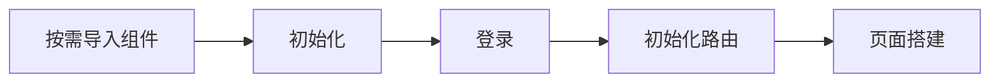

<!--keywords: UIKit,IM,UI,UI 组件库,UI 界面,集成,SDK 集成,新手 -->

网易云信 IM UIKit 是基于 [网易云信即时通讯 SDK（简称 NIM SDK）V10](https://doc.yunxin.163.com/messaging2/concept?platform=client) 开发的一款 [即时通讯 UI 组件库](https://doc.yunxin.163.com/messaging-uikit/concept/TU0NTc4MjM?platform=iOS)，包括聊天、会话列表、通讯录、群管理等组件。

本文介绍如何快速跑通 IM UIKit（V10）的集成流程。

## 前提条件

在开始集成 IM UIKit 前，请确保您已完成了以下准备工作：

- 已在 [网易云信控制台](https://app.yunxin.163.com/global/home) 上，[创建应用](https://doc.yunxin.163.com/console/concept/TIzMDE4NTA?platform=console)，并获取 App Key。
- 已 [注册网易云信 IM 账号](https://doc.yunxin.163.com/messaging2/quick-start/jU0Mzg0MTU?platform=client#第二步注册-im-账号)，获取账号 ID（account_id）和授权（token）。
- 已 [前往 GitHub 获取示例项目](https://github.com/netease-kit/nim-uikit-ios) 或者 [前往 Gitee 获取示例项目](https://gitee.com/netease-yunxin/nim-uikit-ios)。
- 已准备如下开发环境和工具：
    - iOS 13.0 及以上版本
    - Xcode 11.0 及以上版本

## 注意事项

由于 IM UIKit 的初始化与登录是通过底层调用 NIM SDK 接口来实现的，因此重复调用 IM UIKit 和 NIM SDK 的初始化与登录接口会相互覆盖传入的信息（包括 **推送配置信息**）。

所以若用户同时集成 IM UIKit 和 NIM SDK，只需要调用一次初始化与登录接口即可。

## 实现流程

<!--
@startuml
!include https://raw.githubusercontent.com/bschwarz/puml-themes/master/themes/cerulean-outline/puml-theme-cerulean-outline.puml
(*) -right-> "按需导入组件"
-right-> "初始化"
-right-> "登录"
-right-> "初始化路由"
-right-> "页面搭建"
-right-> (*)
@enduml
-->



### <span id="步骤1">步骤 1：按需导入组件</div>

1. 根据业务需要，在 **Podfile** 文件中，以添加依赖的形式添加相应的 IM UIKit 组件。

    例如，需要会话聊天功能，可添加 `pod 'NEChatUIKit'` 和 `pod 'NEChatKit'`。

    ```Swift
    # Uncomment the next line to define a global platform for your project
    platform :ios, '13.0'

    # 请使用您的真实项目名称替换 your project name
    target 'your project name' do
    # Comment the next line if you don't want to use dynamic frameworks
    use_frameworks!

    # 基础库
    pod 'NEChatKit', '10.9.0'

    # UI 组件
    pod 'NEChatUIKit', '10.9.0'               # 会话（聊天）组件
    pod 'NEContactUIKit', '10.9.0'            # 通讯录组件
    pod 'NEConversationUIKit', '10.9.0'       # 云端会话列表组件。如果使用云端会话，则不需要依赖下面本地会话列表组件，与本地会话组件二者选其一
    pod 'NELocalConversationUIKit', '10.9.0'  # 本地会话列表组件,。如果使用本地会话，则不需要依赖上面云端会话列表组件，与云端会话组件二者选其一
    pod 'NETeamUIKit', '10.9.0'               # 群相关设置组件

    # 扩展库-地理位置组件
    pod 'NEMapKit', '10.9.0'

    # 扩展库 - AI 划词搜索
    pod 'NEAISearchKit', '10.9.0'

    # 扩展库 - 呼叫组件
    pod 'NERtcSDK/RtcBasic'                   #  RTC 音视频基础组件
    pod 'NERtcSDK/Nenn'                       #  RTC 音视频神经网络组件（使用背景虚化功能需要集成）
    pod 'NERtcSDK/Segment'                    #  RTC 音视频背景分割组件（使用背景虚化功能需要集成）
    pod 'NERtcCallKit', '3.7.1'
    pod 'NERtcCallUIKit', '3.7.1'             # (源码地址：https://github.com/netease-kit/NEVideoCall-1to1/tree/main/NLiteAVDemo-iOS-ObjC/CallKit)

    # 可选 - 图片选择库
    pod 'ZLPhotoBrowser'
    end
    ```

    ::: note note 
    默认引入最新版本的第三方库，若需要指定版本，请参考 [组件导入](https://doc.yunxin.163.com/messaging-uikit/guide/TA5MzA4ODU?platform=iOS)。
    :::

2. 配置完 **Podfile** 文件后执行 `pod install` 命令导入组件。

    ::: note note
    - 各 UI 组件相互独立，添加或删除均不影响项目编译。
    - 如果出现类似 **版本不存在** 的报错，可执行 `pod update` 命令，然后双击 `.xcworkspace` 文件，启动项目即可。
    - 暂不支持 bitcode。
    :::

### 步骤 2：初始化

1. 在项目中引入需要的组件。

    **示例代码**：

    :::::: div custom-tabs
    ::: tab Swift
    ```Swift
    import NECoreKit
    import NECoreIM2Kit
    import NEChatKit
    import NEChatUIKit
    ...
    ```
    :::
    ::: tab Objective-C
    ```Objective-C
    #import <NECoreKit/NECoreKit-Swift.h>
    #import <NECoreIM2Kit/NECoreIM2Kit-Swift.h>
    #import <NEChatKit/NEChatKit-Swift.h>
    #import <NEChatUIKit/NEChatUIKit-Swift.h>
    ...
    ```
    :::
    ::::::

2. 在应用启动后，调用 `setupIM2` 方法进行初始化。

    `NIMSDKOption` 参数说明如下：

    `NIMSDKOption` 参数 | 是否必传 | 说明
    --- | ---- | ----
    `appKey` | 是 | 网易云信控制台获取到的 App Key。
    `apnsCername` | 否 | APNs 推送证书名，如不需要实现离线推送可不配置。
    `pkCername` | 否 | PushKit 推送证书名，如不需要实现离线推送可不配置。
    `avoidNosAccelerationBuckets` | 否 | 不走 NOS 域名加速的桶名集合。
    `v2` | 否 | 启用 V2 版本的 API。<note type=notice>该字段自 V10.6.1 版本起废弃。若仍需要使用 V1 的登录接口，请设置 `V2NIMSDKOption.useV1Login` 字段

    `V2NIMSDKOption` 参数说明如下：

    `V2NIMSDKOption` 参数 | 是否必传 | 说明
    --- | ---- | ----
    `useV1Login` |否 | 是否使用旧的登录接口，默认 NO，不使用
    `enableV2CloudConversation` | 否 | 是否使用 V2 云端会话，默认 NO，不使用

    ::: note notice
    SDK 默认使用本地会话，若需要使用云端会话功能，除了在组件导入时，引入云端会话外，还需要在初始化时，将 `enableV2CloudConversation` 设置为 YES。只有设置为 YES 后，才能正常使用云端会话服务。
    :::

    **示例代码**：

    :::::: div custom-tabs
    ::: tab Swift
    ```Swift
    // init
    // 设置IM SDK的配置项，包括AppKey，推送配置和一些全局配置等
    let option = NIMSDKOption()
    option.appKey = "your app key"
    option.apnsCername = "网易云信控制台配置的 APNS 推送证书名称"
    option.pkCername = "网易云信控制台配置的 PushKit 推送证书名称"

    // 设置IM SDK V2的配置项，包括是否使用旧的登录接口和是否使用云端会话
    let v2Option = V2NIMSDKOption()
    v2Option.enableV2CloudConversation = false

    // 初始化IM UIKit，初始化Kit层和IM SDK，将配置信息透传给IM SDK。无需再次初始化IM SDK
    IMKitClient.instance.setupIM2(option, v2Option)
    ```
    :::
    ::: tab Objective-C
    ```Objective-C
    // 设置IM SDK的配置项，包括AppKey，推送配置和一些全局配置等
    NIMSDKOption *option = [NIMSDKOption optionWithAppKey:AppKey];

    // 设置IM SDK V2的配置项，包括是否使用旧的登录接口和是否使用云端会话
    V2NIMSDKOption *v2Option = [[V2NIMSDKOption alloc] init];
    v2Option.enableV2CloudConversation = NO;

    // 初始化IM UIKit，初始化Kit层和IM SDK，将配置信息透传给IM SDK。无需再次初始化IM SDK
    [IMKitClient.instance setupIM2:option :v2Option];
    ```
    :::
    ::::::

::: note notice

更多初始化说明，请参考 [初始化](https://doc.yunxin.163.com/messaging-uikit/guide/TIxNDM3NTc?platform=iOS#初始化)。
:::

### 步骤 3：登录

在完成初始化后，调用 `login` 方法登录 IM。

**示例代码**：

:::::: div custom-tabs
::: tab Swift

```Swift
    IMKitClient.instance.login(account, token, nil) { error in
        if let err = error {
            print("IMKitClient login error : ", err)
        }else {
            //在登录成功回调中初始化路由以及配置各个模块首页
            /*
             weakSelf?.setupTabbar()
             */
        }
    }
```
:::
::: tab Objective-C
```Objective-C
[[IMKitClient instance] login:@"account" :@"token" :nil :^(NSError * _Nullable error) {
    if (error != nil) {
        NSLog(@"IMKitClient login error : %@", [error description]);
    } else {
        //在登录成功回调中初始化路由以及配置各个模块首页
        /*
        [weakSelf setupTabbar];
        */
    }
}];
```
:::
::::::

::: note notice
调用登录的方法时，将示例代码中的 `account` 和 `token` 分别替换为您的网易云信账号 ID 和 Token。
:::

### 步骤 4：初始化路由

如果未在登录成功回调中初始化路由，需要单独初始化路由，才能进行后续的界面搭建。在初始化路由时可同时初始化地图 Map，初始化后，您的应用即可实现地理位置消息功能。具体请参考 [实现地理位置消息功能](https://doc.yunxin.163.com/messaging-uikit/guide/TE3MzA3ODk?platform=iOS)。

**示例代码**：

:::::: div custom-tabs
::: tab Swift
```Swift
 func loadService() {
        // 注册路由
        // isFun: 是否使用通用版皮肤
        ChatKitClient.shared.setupInit(isFun: false)
        
        // 注册【个人信息】页面，用于实现单击头像后跳转至个人信息页面功能
        Router.shared.register(MeSettingRouter) { param in
            if let nav = param["nav"] as? UINavigationController {
                let me = PersonInfoViewController()
                nav.pushViewController(me, animated: true)
            }
        }
    }
```
:::
::: tab Objective-C
```Objective-C
- (void)registerRouter {
    // 注册路由
    // isFun: 是否使用通用版皮肤
    [ChatKitClient.shared setupInitWithIsFun:NO];

    // 注册【个人信息】页面，用于实现单击头像后跳转至个人信息页面功能
    [[Router shared] register:MeSettingRouter
                      closure:^(NSDictionary<NSString *, id> *_Nonnull param) {
        NSObject *param1 = [param objectForKey:@"nav"];
        if ([param1 isKindOfClass:[UINavigationController class]]) {
        UINavigationController *nav = (UINavigationController *)param1;
        PersonInfoViewController *me =
            [[PersonInfoViewController alloc] init];

        [nav pushViewController:me animated:YES];
        }
    }];
}
```
:::
::::::

:::note notice
- 若需要注册【个人信息】页面，实现单击头像后跳转至个人设置页面的功能，首先需要在 XCode 中拖入相关的源码文件至您的工程。相关的源码文件包括：
    - app 下的 [Mine](https://github.com/netease-kit/nim-uikit-ios/tree/master/app) 文件
    - app 下 Assets 中的 [Mine](https://github.com/netease-kit/nim-uikit-ios/tree/master/app/Assets.xcassets) 文件
:::

### 步骤 5：界面搭建

:::::: div custom-tabs
::: tab 搭建基础版 UI 界面

以搭建单聊群聊页面为例，示例代码如下（更多详情请参考下文的 [界面集成详情](#界面集成详情)）：

**示例代码**：

- Swift 示例：

    ```Swift
    func chatExample(){
        // 单聊
        let p2pChatVC = P2PChatViewController(conversationId: "会话 ID", anchor: nil)

        // 群聊
        let groupVC = TeamChatViewController(conversationId: "会话 ID", anchor: nil)
    }
    ```
- Objective-C 示例：

    ```Objective-C
    - (void)chatExample {
        // 单聊
        P2PChatViewController *p2pChatVC = [[P2PChatViewController alloc] initWithConversationId:@"会话 ID" anchor:nil];

        // 群聊
        TeamChatViewController *groupVC = [[TeamChatViewController alloc] initWithConversationId:@"会话 ID" anchor:nil];
    }
    ```

**参数说明**：

参数 | 说明
---- | ----
`conversationId` | 会话 ID，拼接方式如下：<br>发送者用户账号（accountId）\| 会话类型（[`V2NIMConversationType`](https://doc.yunxin.163.com/messaging2/client-apis/DAxNjk0Mzc?platform=client#V2NIMConversationType)）\| 聊天对象账号（accountId）或群组 ID
`anchor` | 锚点消息

**效果参考**：


:::
::: tab 搭建通用版 UI 界面

以搭建单聊群聊页面为例，示例代码如下：

**示例代码**：

- Swift 示例：

    ```Swift
    func chatExample(){
        // 单聊
        let p2pChatVC = FunP2PChatViewController(conversationId: "会话 ID", anchor: nil)

        // 群聊
        let groupVC = FunTeamChatViewController(conversationId: "会话 ID", anchor: nil)
    }
    ```

- Objective-C 示例：

    ```Objective-C
    - (void)chatExample {
        // 单聊
        FunP2PChatViewController *p2pChatVC = [[FunP2PChatViewController alloc] initWithConversationId:@"会话 ID" anchor:nil];

        // 群聊
        FunTeamChatViewController *groupVC = [[FunTeamChatViewController alloc] initWithConversationId:@"会话 ID" anchor:nil];
    }
    ```

**参数说明**：

参数 | 说明
---- | ----
`conversationId` | 会话 ID，拼接方式如下：<br>发送者用户账号（accountId）\| 会话类型（[`V2NIMConversationType`](https://doc.yunxin.163.com/messaging2/client-apis/DAxNjk0Mzc?platform=client#V2NIMConversationType)）\| 聊天对象账号（accountId）或群组 ID
`anchor` | 锚点消息。

**效果参考**：


:::
::::::

## 后续步骤

为保障通信安全，如果您在调试环境中的使用的是网易云信控制台生成的测试用 IM 账号和 token，请确保在后续的正式生产环境中，将其替换为通过 [IM 服务端 API](https://doc.yunxin.163.com/messaging2/server-apis/TQyNjgyMzc?platform=server) 生成的正式 IM 账号（account_id）和 token。


## 相关参考

### 界面集成详情

IM UIKit 中提供的常用业务场景界面及相关集成说明如下：
页面 | 所属组件 | 描述
---- | ---- | ----
`ConversationController` | NEConversationUIKit | 云端会话列表页面（创建或者跳转到该界面需要传入参数，请参考 [集成会话列表界面](https://doc.yunxin.163.com/messaging-uikit/guide/TkwMDY4MTM?platform=iOS)）。<br/>修改界面 UI 请参考 [自定义会话列表 UI](https://doc.yunxin.163.com/messaging-uikit/guide/TA3MzQ4Njc?platform=iOS)。
`LocalConversationController` | NELocalConversationUIKit | 本地会话列表页面（创建或者跳转到该界面需要传入参数，请参考 [集成会话列表界面](https://doc.yunxin.163.com/messaging-uikit/guide/TkwMDY4MTM?platform=iOS)）。<br/>修改界面 UI 请参考 [自定义会话列表 UI](https://doc.yunxin.163.com/messaging-uikit/guide/TA3MzQ4Njc?platform=iOS)。
`ContactViewController` | NEContactUIKit | 通讯录页面（创建或者跳转到该界面需要传入参数，请参考 [集成通讯录界面](https://doc.yunxin.163.com/messaging-uikit/guide/DM5ODQ3NjY?platform=iOS)）。<br/>修改界面 UI 请参考 [自定义通讯录 UI](https://doc.yunxin.163.com/messaging-uikit/guide/zM4NTM3OTg?platform=iOS)。
`P2PChatViewController`<br>`TeamChatViewController` | NEChatUIKit | 单聊、群聊会话页面（创建或者跳转到该界面需要传入参数，请参考 [集成会话消息界面](https://doc.yunxin.163.com/messaging-uikit/guide/jgzMzgwNTY?platform=iOS)）。<br/>修改界面 UI 请参考 [自定义会话消息 UI](https://doc.yunxin.163.com/messaging-uikit/guide/DEzODYxOTI?platform=iOS)。
`TeamSettingViewController` | NETeamKit | 群组设置页面。

### 音视频通话

集成会话界面后，如果需要在会话消息界面实现音视频通话功能，请参考 [实现音视频通话功能](https://doc.yunxin.163.com/messaging-uikit/guide/TA2MTk0Njg?platform=iOS)。

## 常见问题

- [集成报错处理](https://doc.yunxin.163.com/messaging-uikit/faq/TEzNzYyMTA?platform=iOS)
- [iOS 系统支持的最低版本](https://doc.yunxin.163.com/messaging-uikit/faq/zg2NTA4NTE?platform=iOS)
- [如何在模拟器（Apple 芯片）上运行](https://doc.yunxin.163.com/messaging-uikit/faq/DEyMjI1MTI?platform=iOS)
- [如何在消息发送前后拦截消息](https://doc.yunxin.163.com/messaging-uikit/faq/DIwODIxMDQ?platform=iOS)
- [如何实现底部栏未读数角标](https://doc.yunxin.163.com/messaging-uikit/faq/jcwODA4MDU?platform=iOS)
- [如何调整自定义消息高度](https://doc.yunxin.163.com/messaging-uikit/faq/TMyNDYxNzQ?platform=iOS)