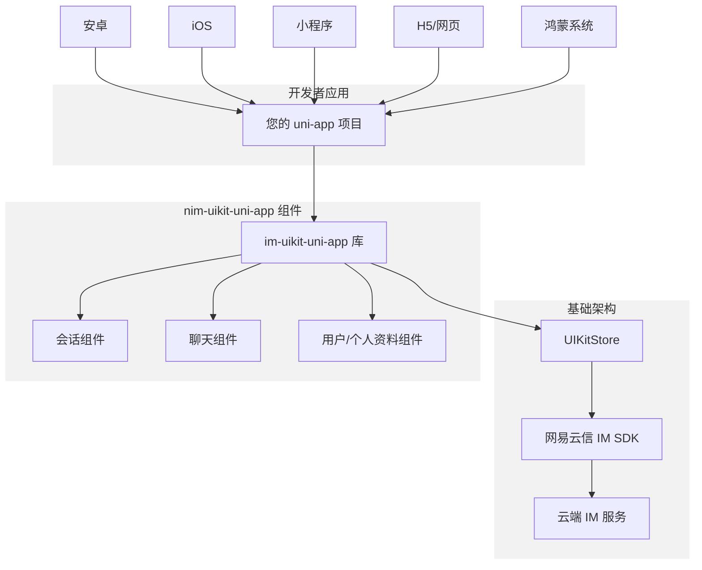
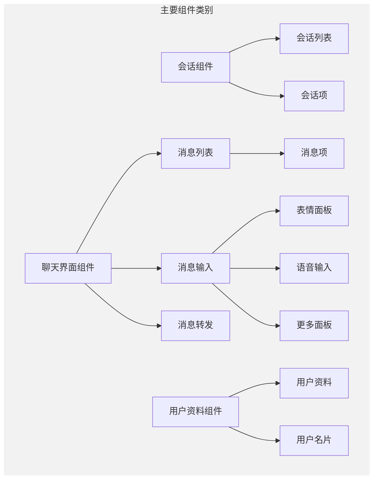
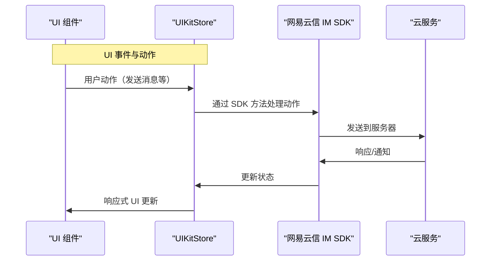
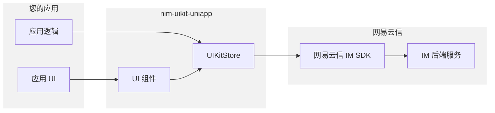

IM uni-app Demo 是基于网易云信 IM UIKit（NEUIKit）打造的一款 uni-app Demo，托管在 GitHub 开源代码仓库 [nim-uikit-uniapp](https://github.com/netease-kit/nim-uikit-uniapp)。该 Demo 提供了一些通用的功能，包含会话、聊天、群组等，您可以基于源码搭建您的即时通讯业务逻辑。

## 项目介绍

`nim-uikit-uniapp` 使开发者能够在跨平台 uni-app 应用中快速实现全功能即时通讯能力，支持一套代码编译到安卓、iOS、小程序、H5/网页、鸿蒙系统应用中。它提供了一套完整的 UI 组件，处理常见的 IM 使用场景，同时抽象底层 IM SDK 的复杂性。



## 核心功能

- 会话管理：单聊/群聊会话、消息状态显示、会话置顶、消息免打扰
- 实时聊天：文字、图片、语音等多种消息类型、实时同步、多端漫游、@消息、消息撤回/转发/回复/更新等
- 群组管理：群组创建/解散/退出、群成员管理、群权限分级
- 通讯录：用户信息管理、好友管理

更细详细的功能列表请参见 [功能概览](https://doc.yunxin.163.com/messaging-uikit/concept/zMzMDQ2MTg?platform=client)。

<!-- ## 主要特点

- **即用型 UI 组件**：用于会话、聊天和用户资料
- **跨平台支持**：支持安卓、iOS、小程序、H5 和鸿蒙系统
- **一致的 UI/UX**：在各平台保持一致体验
- **可自定义界面**：可适配以匹配您应用的设计风格
- **无缝集成**：与网易云信 IM 基础设施完美对接 -->

## 环境要求

配置项 | 要求
--- | ---
IDE | HBuilderX
框架 | Vue 3
语言 | TypeScript
CSS | Sass（Sass-loader 版本 <= 10.1.1）
Node.js | v16+
JavaScript 包管理器 | NPM（版本请与 Node.js 版本匹配）

## 集成要求

要在您的 uni-app 项目中使用 `nim-uikit-uniapp`，您需要以下账号信息：

需求 | 说明 | 获取方式 |
---- | ---- | ---- |
开发者账号 | 网易云信开发者账号 | 在 [网易云信控制台](https://app.yunxin.163.com/global/home) 注册 |
AppKey | 应用的唯一标识符 | 在 [网易云信控制台](https://app.yunxin.163.com/global/home) 创建应用 |
账号 | IM 用户账号 | 通过 [网易云信 API](https://doc.yunxin.163.com/messaging2/server-apis/TQyNjgyMzc?platform=server) 注册 |
令牌 | 账号的认证令牌 | 通过 [网易云信 API](https://doc.yunxin.163.com/messaging2/server-apis/TQyNjgyMzc?platform=server) 生成 |

## 组件架构

该库遵循结构化的组件架构，将即时通讯的不同功能区域分开：



## 数据层

`nim-uikit-uniapp` 中的 UI 组件建立在 `UIKitStore` 之上，后者作为数据和逻辑层。这种架构实现了响应式 UI 更新和一致的状态管理。



## 系统边界

以下图表说明了 `nim-uikit-uniapp` 系统的边界，以及它如何与您的应用和网易云信基础设施交互：



## 工程结构

```JSON
NEUIKit                                    # NEUIKit 项目根目录
├─ App.vue                                 # 应用入口文件
├─ components                              # 公共组件目录
│  ├─ Appellation.vue                      # 称谓组件，用于显示用户称谓
│  ├─ Avatar.vue                          # 头像组件
│  ├─ Badge.vue                           # 徽标组件，用于显示未读消息数量等
│  ├─ Empty.vue                           # 空状态组件
│  ├─ FormInput.vue                       # 输入组件
│  ├─ Icon.vue                            # 图标组件
│  ├─ MessageOneLine.vue                  # 单行消息展示组件
│  ├─ Modal.vue                           # 模态框组件
│  ├─ NavBar.vue                          # 导航栏组件
│  ├─ NetworkAlert.vue                    # 网络状态提示组件
│  ├─ PersonSelect.vue                    # 人员选择组件
│  ├─ Tooltip.vue                         # 文字提示组件
│  ├─ UserCard.vue                        # 用户信息卡片组件
│  └─ uni-components                      # uni-app 官方组件

├─ esmNim.js                              # NIM SDK ESM 模块封装 ESM模式使用
├─ locale                                 # 国际化资源目录
├─ pages                                  # 页面目录
│  ├─ Chat                               # 聊天相关页面
│  │  ├─ forward.vue                     # 转发页面
│  │  ├─ index.vue                       # 聊天主页面
│  │  ├─ message                         # 消息相关组件
│  │  │  ├─ face.vue                    # 表情组件
│  │  │  ├─ mention-member-list.vue     # @成员列表组件
│  │  │  ├─ message-audio.vue           # 语音消息组件
│  │  │  ├─ message-bubble.vue          # 消息气泡组件
│  │  │  ├─ message-file.vue            # 文件消息组件
│  │  │  ├─ message-forward-modal.vue   # 消息转发弹窗
│  │  │  ├─ message-g2.vue              # 音视频消息组件
│  │  │  ├─ message-input.vue           # 消息输入组件
│  │  │  ├─ message-item.vue            # 消息Item组件
│  │  │  ├─ message-list.vue            # 消息列表组件
│  │  │  ├─ message-notification.vue     # 消息通知组件
│  │  │  ├─ message-pin-card.vue        # 消息置顶卡片
│  │  │  ├─ message-read.vue            # 消息已读状态组件
│  │  │  ├─ message-reply.vue           # 消息回复组件
│  │  │  ├─ message-text.vue            # 文本消息组件
│  │  │  ├─ nav-bar.vue                 # 导航栏组件
│  │  │  ├─ p2p-set.vue                 # 单聊设置组件
│  │  │  ├─ pin-list.vue                # 置顶消息列表
│  │  │  └─ voice-panel.vue             # 语音面板组件

│  ├─ Contact                           # 通讯录页面
│  └─ index.vue                         # 通讯录入口页面
│  │  ├─ contact-list                   # 通讯录列表
│  │  ├─ black-list.vue                 # 黑名单列表
│  │  ├─ friend-list.vue                # 好友列表
│  │  ├─ group-list.vue                 # 群组列表
│  │  ├─ index.vue                      # 通讯录首页
│  │  └─ valid-list.vue                 # 验证消息列表
                      
├─ Conversation                          # 会话列表模块
│  │  ├─ conversation-list                  # 会话列表组件
│  │  │  ├─ conversation-item-isRead.vue    # 会话已读状态组件
│  │  │  ├─ conversation-item-last-msg-content.vue  # 最后一条消息内容组件
│  │  │  ├─ conversation-item.vue           # 会话Item组件
│  │  │  └─ index.vue                      # 会话列表首页
│  │  ├─ conversation-search               # 会话搜索
│  │  │  ├─ index.vue                      # 搜索首页
│  │  │  └─ search-result-item.vue         # 搜索结果项组件
│  └─ index.vue                         # 会话模块入口页面

│  ├─ Team                               # 群组相关模块
│  │  ├─ team-add                         # 加入群组
│  │  └─ index.vue                      # 加入群组页面
│  ├─ team-create                      # 创建群组
│  │  └─ index.vue                      # 创建群组页面
│  ├─ team-member                      # 群成员管理
│  │  └─ index.vue                      # 群成员管理页面
│  └─ team-set                         # 群设置
│  │  ├─ add-team-manager.vue          # 添加群管理员
│  │  ├─ team-avatar-edit.vue          # 群头像编辑
│  │  ├─ team-info-edit.vue            # 群资料编辑
│  │  ├─ team-intro-edit.vue           # 群简介编辑
│  │  ├─ team-manage.vue               # 群管理设置
│  │  ├─ team-manager-list.vue         # 群管理员列表
│  │  ├─ team-name-edit.vue            # 群名称编辑
│  │  ├─ index.vue                      # 群设置首页
│  │  ├─ nick-in-team.vue               # 群昵称设置
│  │  └─ transform-team.vue             # 群转让

└─ User                            # 用户卡片模块
│  ├─ detail-item                       # 详情项组件
│  │  └─ index.vue                      # 详情项页面
│  ├─Friend                               # 好友相关模块
│  │  ├─ add-friend                        # 添加好友
│  │  └─ index.vue                         # 添加好友页面
│  │  └─ friend-info-edit.vue              # 好友信息编辑页面
│  ├─ my                                # 个人信息
│  │  │  ├─ about.vue                      # 关于页面
│  │  │  ├─ collection-card.vue            # 收藏卡片
│  │  │  ├─ collection-list.vue            # 收藏列表
│  │  │  ├─ index.vue                      # 个人信息首页
│  │  │  └─ setting.vue                    # 设置页面
│  └─ my-detail                         # 个人详细信息
│  │  │  └─ index.vue                      # 个人详细信息页面

├─ pages.json                            # 页面路由配置
├─ tsconfig.json                         # TypeScript 配置文件
├─ typings.d.ts                          # 类型声明文件
├─ uni.scss                              # 全局样式文件
└─ utils                                 # 工具类目录
  ├─ constants.ts                       # 常量定义
  ├─ customNavigate.ts                  # 自定义导航
  ├─ date.ts                           # 日期处理
  ├─ emoji.ts                          # 表情处理
  ├─ encodeText.ts                     # 文本编码
  ├─ friend.ts                         # 好友相关工具
  ├─ i18n.ts                           # 国际化工具
  ├─ index.ts                          # 工具入口文件
  ├─ matrix.ts                         # 矩阵计算工具
  ├─ msg.ts                            # 消息处理工具
  ├─ nim.ts                            # NIM SDK 工具
  ├─ parseText.ts                      # 文本解析工具
  ├─ permission.ts                     # 权限处理工具
  └─ reporter.ts                       # 埋点上报工具
```

## 路由页面

以下是 `page.json` 中的具体路由页面，可根据您的业务需求，注册您需要的页面。

```JSON
{
  "pages": [
    {
      "path": "pages/Conversation/index", // 会话列表首页：展示所有聊天会话
      "style": {
        "navigationStyle": "custom"
      }
    },
    {
      "path": "pages/index/index", // 应用首页
      "style": {
        "navigationStyle": "custom"
      }
    },
    {
      "path": "pages/Conversation/conversation-search/index", // 会话搜索页：搜索历史会话
      "style": {
        "navigationStyle": "custom"
      }
    },
    {
      "path": "pages/Login/index", // 登录页面
      "style": {
        "navigationStyle": "custom"
      }
    },
    {
      "path": "pages/Chat/message/p2p-set", // 单聊设置页：设置单聊相关选项
      "style": {
        "navigationStyle": "custom"
      }
    },
    {
      "path": "pages/Chat/message/pin-list", // 置顶消息列表页
      "style": {
        "navigationStyle": "custom"
      }
    },
    {
      "path": "pages/Team/team-set/index", // 群设置首页
      "style": {
        "navigationStyle": "custom"
      }
    },
    {
      "path": "pages/Team/team-set/team-info-edit", // 群资料编辑页
      "style": {
        "navigationStyle": "custom"
      }
    },
    {
      "path": "pages/Team/team-set/team-name-edit", // 群名称编辑页
      "style": {
        "navigationStyle": "custom"
      }
    },
    {
      "path": "pages/Team/team-set/team-intro-edit", // 群简介编辑页
      "style": {
        "navigationStyle": "custom"
      }
    },
    {
      "path": "pages/Team/team-set/team-avatar-edit", // 群头像编辑页
      "style": {
        "navigationStyle": "custom"
      }
    },
    {
      "path": "pages/Contact/index", // 通讯录首页：展示好友列表
      "style": {
        "navigationStyle": "custom"
      }
    },
    {
      "path": "pages/Contact/contact-list/group-list", // 群组列表页
      "style": {
        "navigationStyle": "custom"
      }
    },
    {
      "path": "pages/Contact/contact-list/valid-list", // 验证消息列表页：好友申请等
      "style": {
        "navigationStyle": "custom"
      }
    },
    {
      "path": "pages/Contact/contact-list/black-list", // 黑名单列表页
      "style": {
        "navigationStyle": "custom"
      }
    },
    {
      "path": "pages/Chat/index", // 聊天页面：消息收发界面
      "style": {
        "navigationBarBackgroundColor": "#F6F8FA",
        "navigationBarTextStyle": "black",
        "navigationStyle": "custom",
        "enablePullDownRefresh": false,
        "app-plus": {
          "softinputNavBar": "none",
          "bounce": "none"
        }
      }
    },
    {
      "path": "pages/Chat/video-play", // 视频播放页
      "style": {
        "navigationStyle": "custom"
      }
    },
    {
      "path": "pages/Team/team-member/index", // 群成员管理页
      "style": {
        "navigationStyle": "custom"
      }
    },
    {
      "path": "pages/Team/team-create/index", // 创建群组页
      "style": {
        "navigationStyle": "custom"
      }
    },
    {
      "path": "pages/Team/team-add/index", // 加入群组页
      "style": {
        "navigationStyle": "custom"
      }
    },
    {
      "path": "pages/User/friend/add-friend",, // 添加好友页
      "style": {
        "navigationStyle": "custom"
      }
    },
    {
      "path": "pages/User/friend/friend-edit", // 好友资料编辑页
      "style": {
        "navigationStyle": "custom"
      }
    },
    {
      "path": "pages/User/friend/index", // 好友资料卡片页
      "style": {
        "navigationStyle": "custom"
      }
    },
    {
      "path": "pages/User/my/index", // 个人资料页
      "style": {
        "navigationStyle": "custom"
      }
    },
    {
      "path": "pages/User/my/about", // 关于页面
      "style": {
        "navigationStyle": "custom"
      }
    },
    {
      "path": "pages/User/my/setting", // 设置页面
      "style": {
        "navigationStyle": "custom"
      }
    },
    {
      "path": "pages/User/my/collection-card", // 收藏内容卡片页
      "style": {
        "navigationStyle": "custom"
      }
    },
    {
      "path": "pages/User/my/collection-list", // 收藏列表页
      "style": {
        "navigationStyle": "custom"
      }
    },
    {
      "path": "pages/User/my-detail/index", // 个人详细资料页
      "style": {
        "navigationStyle": "custom"
      }
    },
    {
      "path": "pages/User/detail-item/index", // 详细信息项页面
      "style": {
        "navigationStyle": "custom"
      }
    },
    {
      "path": "pages/Team/team-set/nick-in-team", // 群昵称设置页
      "style": {
        "navigationStyle": "custom"
      }
    },
    {
      "path": "pages/Team/team-set/team-manage", // 群管理设置页
      "style": {
        "navigationStyle": "custom"
      }
    },
    {
      "path": "pages/Team/team-set/transform-team", // 群转让页面
      "style": {
        "navigationStyle": "custom"
      }
    },
    {
      "path": "pages/Team/team-set/team-manager-list", // 群管理员列表页
      "style": {
        "navigationStyle": "custom"
      }
    },
    {
      "path": "pages/Team/team-set/add-team-manager", // 添加群管理员页
      "style": {
        "navigationStyle": "custom"
      }
    },
    {
      "path": "pages/Chat/forward", // 消息转发页
      "style": {
        "navigationStyle": "custom"
      }
    },
    {
      "path": "pages/Chat/message-read-info", // 消息已读信息页
      "style": {
        "navigationStyle": "custom"
      }
    }
  ],
  "globalStyle": {
    "navigationBarTextStyle": "black"
  },
  "tabBar": { // 底部导航栏配置
    "backgroundColor": "#F6F8FA",
    "color": "#999999",
    "selectedColor": "#337EFF",
    "height": "60px",
    "list": [
      {
        "text": "%messageText%", // 消息标签
        "iconPath": "static/conversation.png",
        "selectedIconPath": "static/conversation-selected.png",
        "pagePath": "pages/Conversation/index"
      },
      {
        "text": "%cantactsText%", // 通讯录标签
        "iconPath": "static/contact.png",
        "selectedIconPath": "static/contact-selected.png",
        "pagePath": "pages/Contact/index"
      },
      {
        "text": "%mineText%", // 我的标签
        "pagePath": "pages/user-card/my/index",
        "iconPath": "static/me.png",
        "selectedIconPath": "static/me-selected.png"
      }
    ]
  }
}
```

## 依赖介绍

依赖 | 说明
--- | ---
`nim-web-sdk-ng` | [网易云信 NIM SDK](https://doc.yunxin.163.com/messaging2/concept?platform=client)，提供了一整套即时通讯基础能力。
`@xkit-yx/im-store-v2` | store 用于 **全局状态管理**，基于 MobX 和 NIM SDK 封装的全局上下文对象，它提供了数据和 UI 之间的双向绑定能力。<br>包含多个子模块，每个子模块负责管理不同的数据领域，如会话、消息、通讯录、群组等。通过 store，您可以方便地获取数据、响应数据变化，并更新 UI。更多 store 相关信息。请参见 [全局上下文](https://doc.yunxin.163.com/messaging-uikit/guide/jE5NzM1MjY?platform=uniapp)。
`@xkit-yx/utils` | 项目中的工具库，提供 `getFileType`、`parseFileSize` 等函数。
`pinyin` | 主要用于好友列表的拼音排序功能。

:::note note 
store 在 IM UIKit 中的使用场景包括但不限于：
- 消息发送与管理：使用 store 管理会话消息，发送文本、图片、视频等类型的消息。
- 状态同步：同步用户在线状态、群组信息、好友列表等。
- 数据绑定：在 UI 组件中使用 store 的数据进行数据绑定，实现 UI 的自动更新。
- 自定义消息：发送自定义消息格式，满足特定业务需求。
- 扩展功能：在特定的场景下，如群聊，添加扩展字段或处理特定业务逻辑。
:::

## 集成源码

您可以参考 [集成源码（Vue3）](https://doc.yunxin.163.com/messaging-uikit/guide/jgwMDI2NTU?platform=uniapp) 将 IM uni-app UIKit 源码集成至您的项目。

集成后，您可以参考以下实践方案快速实现核心功能：

- [全局上下文](https://doc.yunxin.163.com/messaging-uikit/guide/jE5NzM1MjY?platform=uniapp)
- [账号登录登出](https://doc.yunxin.163.com/messaging-uikit/guide/jc2MzAyMzQ?platform=uniapp)
- [实现音视频通话](https://doc.yunxin.163.com/messaging-uikit/guide/TA5NjkwNzk?platform=uniapp)
- [收发自定义消息](https://doc.yunxin.163.com/messaging-uikit/guide/TEzOTM1OTE?platform=uniapp)
- [单独集成聊天界面](https://doc.yunxin.163.com/messaging-uikit/guide/DAzMjUxNTc?platform=uniapp)
- [发送消息前添加配置参数](https://doc.yunxin.163.com/messaging-uikit/guide/jg3MzYwMjU?platform=uniapp)

## 了解更多（DeepWiki）

如需了解更多详细信息，请参考 DeepWiki 相关文档：

- [核心组件](https://deepwiki.com/netease-kit/nim-uikit-uniapp/2) 了解组件详情
- [核心功能](https://deepwiki.com/netease-kit/nim-uikit-uniapp/3) 了解功能说明
- [初始化与认证](https://deepwiki.com/netease-kit/nim-uikit-uniapp/4) 了解设置流程
- [UIKitStore API](https://deepwiki.com/netease-kit/nim-uikit-uniapp/6) 了解数据层 API 参考

:::note note
[DeepWiki - netease-kit/nim-uikit-uniapp](https://deepwiki.com/netease-kit/nim-uikit-uniapp/1-overview) 同样介绍了网易云信 IM UIKit Demo 源码项目。如需实现相关功能，可调用 DeepSearch 参考实现。


:::

<!-- ## 支持与帮助

使用 Demo 过程中如果遇到任何问题，请 [提交工单](https://app.yunxin.163.com/global/service/ticket/create) 联系网易云信技术支持工程师或参考 [常见问题](https://doc.yunxin.163.com/messaging-uikit/guide/DY3Mjc2Njk?platform=uniapp)。 -->