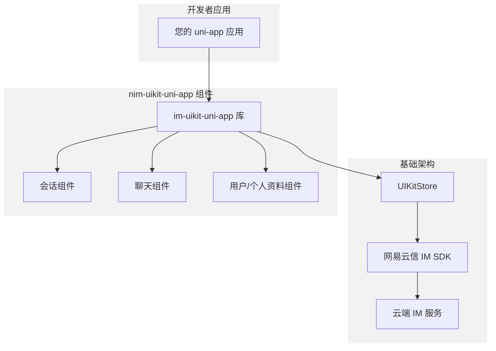
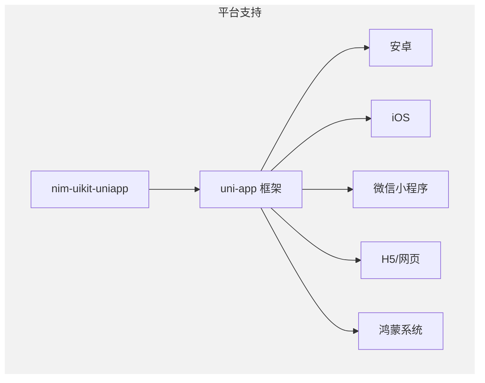
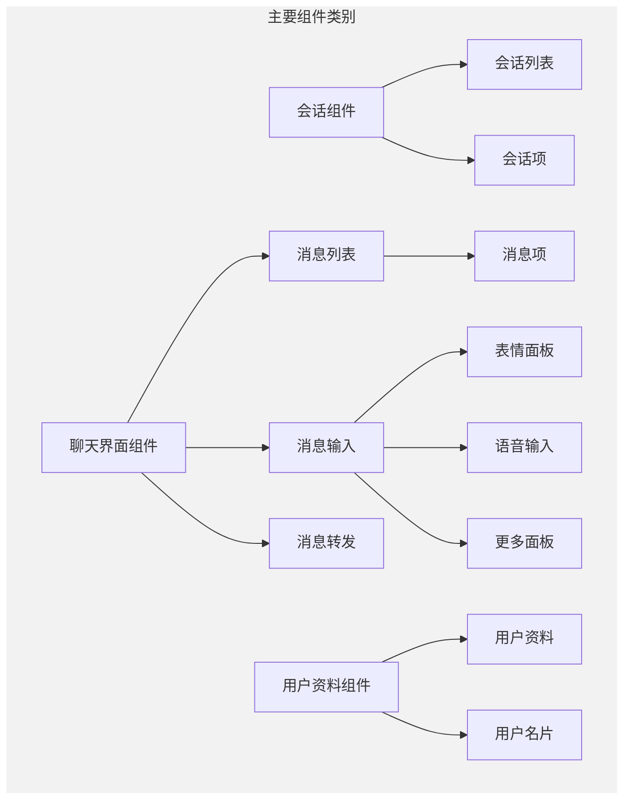
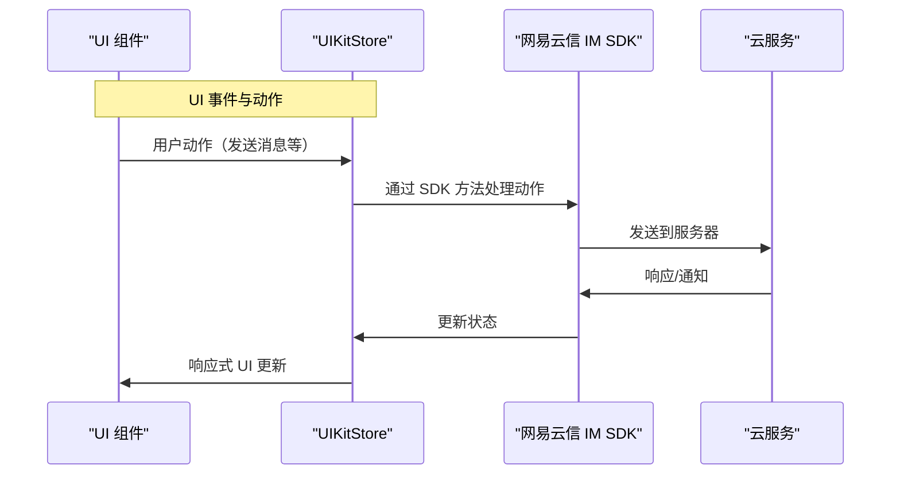
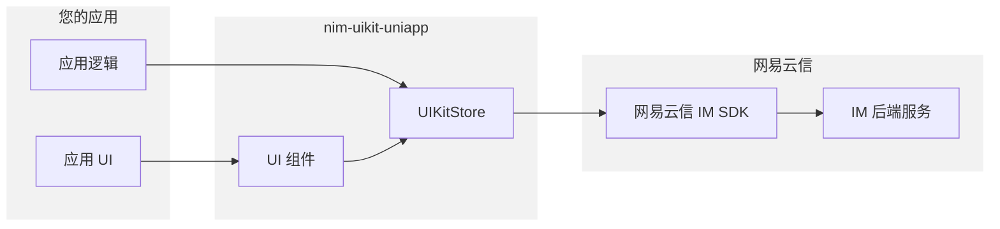

本文介绍了 `nim-uikit-uniapp`，这是一个为 uni-app 项目集成即时通讯（IM）功能而设计的 UI 组件库。它利用网易云信 IM SDK 提供预构建的、可自定义的 UI 组件，用于常见的消息功能，包括会话列表、聊天界面和用户管理。

详细的安装说明，请参考 [安装与设置](https://deepwiki.com/netease-kit/nim-uikit-uniapp/1.1)。有关架构的深入信息，请参考 [架构概述](https://deepwiki.com/netease-kit/nim-uikit-uniapp/1.2)。

:::note note
本文是 [DeepWiki - netease-kit/nim-uikit-uniapp](https://deepwiki.com/netease-kit/nim-uikit-uniapp/1-overview) 项目概述的英译中翻译版本，为您介绍 IM Demo 源码项目。您可以前往 [DeepWiki - netease-kit/nim-uikit-uniapp](https://deepwiki.com/netease-kit/nim-uikit-uniapp/1-overview) 查看更多内容，如需实现相关功能，可调用 DeepSearch 参考实现。

:::

## 产品介绍

`nim-uikit-uniapp` 使开发者能够在跨平台 uni-app 应用中快速实现全功能即时通讯能力。它提供了一套完整的 UI 组件，处理常见的 IM 使用场景，同时抽象底层 IM SDK 的复杂性。

## 主要特点

- **即用型 UI 组件**：用于会话、聊天和用户资料
- **跨平台支持**：支持安卓、iOS、微信小程序、H5 和鸿蒙系统
- **一致的 UI/UX**：在各平台保持一致体验
- **可自定义界面**：可适配以匹配您应用的设计风格
- **无缝集成**：与网易云信 IM 基础设施完美对接

## 组件架构

该库遵循结构化的组件架构，将即时通讯的不同功能区域分开：

## 数据层

`nim-uikit-uniapp` 中的 UI 组件建立在 `UIKitStore` 之上，后者作为数据和逻辑层。这种架构实现了响应式 UI 更新和一致的状态管理。

## 集成要求

要在您的 uni-app 项目中使用 `nim-uikit-uniapp`，您需要：

1. 一个网易云信账号
2. 来自网易云信控制台的 AppKey
3. 已注册的带有账号和令牌凭证的 IM 账号

| 需求 | 说明 | 获取方式 |
| ---- | ---- | ---- |
| AppKey | 应用的唯一标识符 | 在 [网易云信控制台](https://app.yunxin.163.com/global/home) 创建应用 |
| 账号 | IM 用户账号 | 通过网易云信 API 注册 |
| 令牌 | 账号的认证令牌 | 通过网易云信 API 生成 |

## 系统边界

以下图表说明了 `nim-uikit-uniapp` 系统的边界，以及它如何与您的应用和网易云信基础设施交互：

## 界面示例

`nim-uikit-uniapp` 库提供了全面的消息 UI，在各平台上保持一致：

| 组件 | 用途 |
| ---- | ---- |
| 会话列表 | 显示所有用户会话 |
| 聊天界面 | 显示消息历史和输入选项 |
| 用户资料 | 显示用户信息和设置 |
| 消息类型 | 支持文本、图片、音频、视频和文件 |

## 更多信息

有关特定组件和功能的详细信息，请参考：

- [核心组件](https://deepwiki.com/netease-kit/nim-uikit-uniapp/2) 了解组件详情
- [核心功能](https://deepwiki.com/netease-kit/nim-uikit-uniapp/3) 了解功能说明
- [初始化与认证](https://deepwiki.com/netease-kit/nim-uikit-uniapp/4) 了解设置流程
- [UIKitStore API](https://deepwiki.com/netease-kit/nim-uikit-uniapp/6) 了解数据层 API 参考