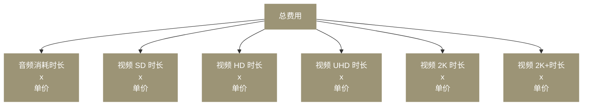

当您开通网易云信音视频通话 2.0 服务后，默认采用按量付费模式。本文为您介绍音视频通话 2.0 按量计费的计费方式。

## 计费组成

网易云信音视频通话 2.0 涉及的功能计费组成方式如下图所示，本文重点讲解 **音视频时长费用** 部分：

<!--  -->

## 音视频时长费用

网易云信音视频通话 2.0 按照当月内所有用户产生的音视频通话时长进行计费。把应用中当前月份消耗的音频时长和各个档位的视频时长分别相加，乘以对应的单价，就是当月音视频通话 2.0 的费用。

### 时长统计

时长统计，根据单个用户订阅音视频流的时长统计。如果用户在同一时刻：

- 既订阅了音频流，也订阅了视频流，只统计视频订阅时长。
- 订阅了多条音频流，音频流时长不会叠加统计，只统计一路音频流时长。
- 订阅了多条视频流，视频流时长不会叠加统计，只统计一路视频流时长，计费单价会根据每一条视频流的分辨率之和确定计费档位。

::: note important
时长统计最小结算单位为 **千分钟**，不满 1000 分钟按照 1 千分钟结算。例如，假设您某月的时长统计为 1888 分钟，向上取整后，按 2 千分钟计费。
:::

### 计费单价

计费单价，根据单个用户订阅的集合分辨率计算。集合分辨率指用户订阅的所有视频流的分辨率之和。下表单价不包含小程序开发框架报价，小程序端报价请参考 [资费说明](https://yunxin.163.com/pay#pay2)。

| 媒体档位 | 集合分辨率规格 | 单价（元/千分钟） |
| ---- | ---- | ---- |
| 音频 | 标准语音规格 | 5.9 |
| 视频 SD（标清） | 集合分辨率 ≤ 307,200(640 × 480) | 15 |
| 视频 HD（高清） | 307,200(640 × 480) ＜ 集合分辨率 ≤ 921,600(1280 × 720) | 25 |
| 视频 UHD（超清） | 921,600(1280 × 720)＜ 集合分辨率 ≤ 2,073,600(1920 × 1080) | 60 |
| 视频 2K | 2,073,600 (1920 × 1080)＜ 集合分辨率 ≤ 3,686,400 (2560 × 1440) | 105 |
| 视频 2K+ | 3,686,400 (2560 × 1440)＜ 集合分辨率 | 245 |

例如，用户同时订阅三路分辨率为 640 × 480 的视频流，则该用户订阅的视频集合分辨率为 640 × 480 + 640 × 480 + 640 × 480 = 921,600，其视频时长按视频 HD 档位单价计费。

::: note important
2023 年 9 月 1 日起，原 **视频 HD+** 档位被拆分为 视频 UHD、视频 2K、视频 2K+ 三个档位。

2023 年 9 月 1 日前，开通音视频通话 2.0 服务的应用，其视频 UHD、视频 2K、视频 2K+ 单价与其原视频 HD+ 档位保持一致。
:::

### 付费方式

网易云信采用按量付费（即先使用后付费）的方式结算，根据每个月的时长进行月结。请确保账户中有足够的余额，当账户发生欠费时会自动关停音视频通话 2.0 服务。欠费后请及时充值付费，完成后，账户会自动恢复为正常使用状态。更多详情，请参考 [费用中心](https://doc.yunxin.163.com/console/concept/TI1NTkzODk?platform=console) 相关文档。

### 计费示例

:::::: div custom-tabs
::: tab 多人语音房间

假设用户 A、B、C 三人一起在音视频通话 2.0 房间内持续停留了 999 分钟。A、B、C 三人只进行音频通话，彼此订阅相互的音频流。

- 用户同时订阅了多条音频流，只计算一路音频流时长。
- 不足 1000 分钟，按照 1000 分钟计算。

该房间的费用计算如下表所示：

| 收流方 | 订阅用户 | 订阅分辨率 | 时长(分钟) | 单价(元/千分钟) | 费用(元)
| --- | --- | --- | --- | --- |
| A | B | 音频 | 999 | 参考 [上文](#unit)，为 5.9 | 5.9
| ^^ | C | ^^ | ^^ | ^^ | ^^
| B | A | ^^ | ^^ | ^^ | 5.9
| ^^ | C | ^^ | ^^ | ^^ | ^^
| C | A | ^^ | ^^ | ^^ | 5.9
| ^^ | B | ^^ | ^^ | ^^ | ^^

**该房间产生的语音时长总费用为**：语音时长单价 × 所有用户语音时长之和 = 17.7 元。

:::
::: tab 多人音视频房间

假设用户 A、B、C 三人一起在音视频通话 2.0 房间内持续停留了 1000 分钟。A、B、C 三人进行视频通话，彼此订阅相互的音频流和视频流。如下图所示:

该房间的费用计算如下表所示：

| 收流方 | 订阅用户 | 订阅分辨率 | 集合分辨率 | 时长(分钟) | 单价(元/千分钟) | 费用(元)
| --- | --- | --- | --- | --- | --- | --- |
| A | B | 640 × 480 | 640 × 480 | 1000 | 参考 [上文](#unit)，为 15 | 15
| ^^ | C | 音频 | ^^ | ^^ | ^^| ^^
| B | A | 640 × 480 | 640 × 480 | ^^ | ^^ | 15
| ^^ | C | 音频 | ^^ | ^^ | ^^| ^^
| C | A | 640 × 480 | 640 × 480 + 640 × 480 = 614,400 | ^^ | 25 | 25
| ^^ | B | 640 × 480 | ^^ | ^^ | ^^ | ^^

**该房间产生的音视频时长总费用为**：用户 A 的费用 + 用户 B 的费用 + 用户 C 的费用 = 55 元。
:::
::::::

## 增值功能费用

- [AI 服务计费说明](https://doc.yunxin.163.com/nertc/server-apis/TYxNjMwNTg?platform=server)
- [云端播放计费说明](https://doc.yunxin.163.com/nertc/server-apis/zMxOTY2MzU?platform=server)
- [云端录制计费说明](https://doc.yunxin.163.com/nertc/server-apis/zMyODc1ODg?platform=server)
- [安全通计费说明](https://doc.yunxin.163.com/nertc/server-apis/jUyMTM1NDg?platform=server)
- [旁路推流计费说明](https://doc.yunxin.163.com/nertc/server-apis/jY2NjUxNjE?platform=server)