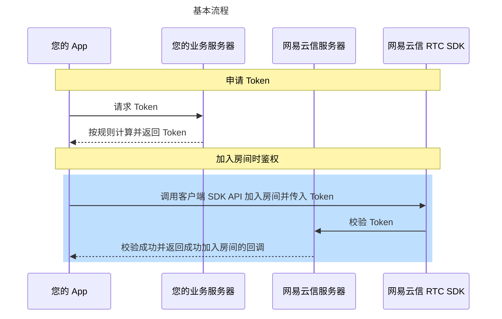
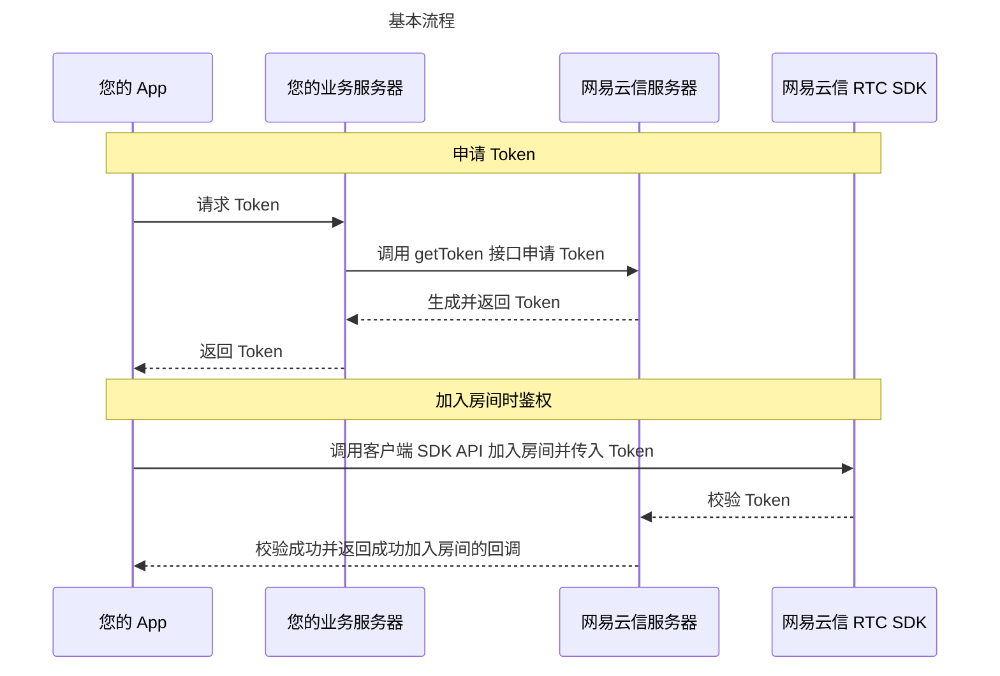

<!--和互动直播对应文档完全相同，可直接替换-->

网易云信 [**音视频通话**](https://doc.yunxin.163.com/nertc/concept/zY0MjQ5NjE?platform=android) 和 [**互动直播**](https://doc.yunxin.163.com/interactive-streaming/concept/jE5NDc4OTc?platform=android) 产品中，鉴权方式分为安全模式和调试模式。如果您在 [网易云信控制台](https://app.yunxin.163.com/global/home) 中为指定应用开启了安全模式，则对应应用的用户在加入房间时，需要通过 Token 进行身份校验。

本文介绍了网易云信支持的 [鉴权方式](#鉴权方式)，以及如何 [生成 Token](#获取Token)。

## <span id="鉴权方式">鉴权方式对比</span>

鉴权方式分为安全模式和调试模式，其区别如下：

<table>
    <tr>
        <th width="10%"><b>对比项</b></th>
        <th width="30%"><b>安全模式</b></th>
        <th width="30%"><b>调试模式</b></th>
    </tr>
    <tr>
        <td>鉴权方式</td>
        <td>加入房间时，必须设置正确、可用的 <a href="#获取Token">Token</a>，以便网易云信服务器对登录用户进行身份和权限认证。</td>
        <td>加入房间时，无需设置 Token，即不对登录用户进行鉴权。</td>
    </tr>
    <tr>
        <td>开启状态</td>
        <td>默认开启。</td>
        <td>-</td>
    </tr>
    <tr>
        <td>安全性</td>
        <td><b>安全性较高</b>。</td>
        <td><b>安全性较低，可能会有盗刷风险</b>。</td>
    </tr>
    <tr>
        <td>应用场景</td>
        <td>适用于正式上线的应用。</td>
        <td>适用于调试、测试阶段的应用。</td>
    </tr>
</table>

## 修改鉴权方式

创建应用并开通音视频通话服务后，应用默认的鉴权方式为安全模式。网易云信建议您在应用接入和测试期间使用调试模式，并在正式上线前改为安全模式。

<note type="note">请谨慎选择鉴权方式，若您在 [网易云信控制台](https://app.yunxin.163.com/global/home) 设置应用的鉴权方式为安全模式，但该 App 用户加入房间时未设置 Token，会导致用户加入房间失败，同时报错 403。</note>

修改鉴权方式的操作步骤请参考 [开启或关闭功能](https://doc.yunxin.163.com/console/concept/TQ2NzE5MzQ?platform=console)，修改路径为 **音视频通话 2.0** > **功能配置** > **基础功能** > **鉴权方式**。


## <span id="获取Token"> **获取 Token** </span>

**安全模式** 下，需要使用 NERTC Token 才能加入房间。您可以参考下文中的 **两种方式** 获取 NERTC Token。

### **方式一：自行计算 NERTC Token（推荐）**

您可以在您的业务服务器中，根据规则自行计算 NERTC Token。流程如下所示：



流程说明如下：

1. 客户端向应用服务器发起安全认证签名的请求。

    该步骤交互由您自行完成，具体请参考 [搭建 Token 服务器](#搭建Token服务器)。

2. 应用服务器根据规则自行计算出 NERTC Token 并返回给客户端。

    该步骤由您自行实现，相应的示例代码和实现方式请参考 [生成 Token](#生成Token) 和 [搭建 Token 服务器](#搭建Token服务器)。

3. 客户端通过以上步骤获取 NERTC Token 之后，可以携带 NERTC Token 加入房间。

**<span id="生成Token"> **生成 Token** </span>**

请参考网易云信在 GitHub 上提供的示例代码，在您的应用服务器上生成 NERTC Token。示例代码的地址如下：

语言 | 示例代码 | 关键函数
---- | ---- | ---- |
Java | [生成 Token-Java](https://github.com/netease-im/G2-API-Examples/tree/main/server/token_server/java) | `getToken` |
Go | [生成 Token-Go](https://github.com/netease-im/G2-API-Examples/tree/main/server/token_server/go) | `GetToken` |
Node.js | [生成 Token-Nodejs](https://github.com/netease-im/G2-API-Examples/tree/main/server/token_server/nodejs) | `GetToken` |
PHP | [生成 Token-PHP](https://github.com/netease-im/G2-API-Examples/tree/main/server/token_server/php) | `getToken` |
Python | [生成 Token-Python](https://github.com/netease-im/G2-API-Examples/tree/main/server/token_server/python3) | `get_token` |
C++ | [生成 Token-C++](https://github.com/netease-im/G2-API-Examples/tree/main/server/token_server/cpp) | `getBasicToken` |
C#(dotnet) | [生成 Token-C#](https://github.com/netease-im/G2-API-Examples/tree/main/server/token_server/dotnet) | `GetToken` |

生成 NERTC Token 的关键参数说明如下表所示。

参数 | 类型 | 描述
---- | ---- | ----
channelName | String | RTC 房间名称。channelName 可以为空, 表示该 uid 可以使用这个 token 加入任意房间。 |
uid | Long | 用户在您应用中的 ID，请在您的业务服务器上自行管理并维护。 |
curTime | Long | 当前 Unix 时间戳，单位为毫秒，若传参有误会导致报错 414。 |
ttlSec | Integer | Token 过期时间，单位为秒，最大为 86400 秒（1 天）。 |
appKey | String | 请登录网易云信控制台查看您的应用对应的 **AppKey** 和 **AppSecret**，具体请参考 [创建应用并获取 AppKey](https://doc.yunxin.163.com/console/guide/TIzMDE4NTA?platform=console#%E8%8E%B7%E5%8F%96%E5%87%AD%E8%AF%81)。 |
appSecret | String | ^^ |

以 Java 语言为例，生成 Token 的示例代码如下：

```Java
public String getToken(String channelName, long uid, int ttlSec) throws Exception {
        long curTimeMs = System.currentTimeMillis();
        return getTokenWithCurrentTime(channelName, uid, ttlSec, curTimeMs);
    }

    public String getTokenWithCurrentTime(String channelName, long uid, int ttlSec, long curTimeMs) throws Exception {
        if (ttlSec <= 0) {
            ttlSec = defaultTTLSec;
        }
        DynamicToken tokenModel = new DynamicToken();
        //生成 signature，将 appkey、uid、curTime、ttl、appsecret 五个字段拼成一个字符串，进行 sha1 编码
        tokenModel.signature = sha1(String.format("%s%d%d%d%s%s", appKey, uid, curTimeMs, ttlSec, channelName, appSecret));
        tokenModel.curTime = curTimeMs;     //获取当前时间戳，单位为毫秒
        tokenModel.ttl = ttlSec;      //设置 Token 的过期时间，单位为秒
        ObjectMapper objectMapper = new ObjectMapper();
        String signature = objectMapper.writeValueAsString(tokenModel);
        return Base64.getEncoder().encodeToString(signature.getBytes(StandardCharsets.UTF_8));   // 对 JSON 字符串进行 Base64 编码，返回生成的 Token 字符串
    }

    private String sha1(String input) throws NoSuchAlgorithmException {
        MessageDigest mDigest = MessageDigest.getInstance("SHA-1");
        byte[] result = mDigest.digest(input.getBytes(StandardCharsets.UTF_8));
        StringBuilder sb = new StringBuilder();
        for (byte b : result) {
            sb.append(String.format("%02x", b));
        }
        return sb.toString();
    }

    public static class DynamicToken {
        public String signature;
        public long curTime;
        public int ttl;
    }
}
```

**<span id="搭建Token服务器"> **搭建 Token 服务器** </span>**

以 Golang 语言为例，您可以参考以下步骤在您的业务服务器搭建 Token Server。

::: note notice
此示例仅供测试使用，不建议用于生产环境。
:::

**步骤一：准备运行文件**

准备一个 `tokenserver.go` 文件，使用如下代码：

```GoLang
package main

import (
    "encoding/json"
    "fmt"
    "io/ioutil"
    "log"
    "net/http"
)

const (
    appkey    = "<Your App Key>"    // TODO 替换为您的应用 App Key
    appsecret = "<Your App Secret>" // TODO 替换为您的应用 App Secret
)

var (
    // NewTokenServer 实现见 https://github.com/netease-im/G2-API-Examples/blob/main/server/token_server/go/token/token.go
    // 说明见 https://github.com/netease-im/G2-API-Examples/tree/main/server/token_server/go
    tokenServer, _ = NewTokenServer(appkey, appsecret, 86400)
)

type TokenRequest struct {
    ChannelName string `json:"channelName"`
    Uid         uint64 `json:"uid"`
    TTL         int    `json:"ttl"`
}

func tokenHandler(w http.ResponseWriter, r *http.Request) {
    w.Header().Set("Content-Type", "application/json; charset=UTF-8")
    if r.Method != "POST" {
        http.Error(w, http.StatusText(http.StatusMethodNotAllowed), http.StatusMethodNotAllowed)
        return
    }
    content, err := ioutil.ReadAll(r.Body)
    if err != nil {
        http.Error(w, fmt.Sprintf("error to read http body, %v", err), http.StatusBadRequest)
        return
    }

    tokenReq := &TokenRequest{}
    if err = json.Unmarshal(content, &tokenReq); err != nil {
        http.Error(w, fmt.Sprintf("error to parse http body, %v", err), http.StatusBadRequest)
        return
    }

    token, err := tokenServer.GetToken(tokenReq.ChannelName, tokenReq.Uid, tokenReq.TTL)
    if err != nil {
        http.Error(w, fmt.Sprintf("error to generate NERtc token, %v", err), http.StatusInternalServerError)
        return
    }

    resp := make(map[string]interface{})
    resp["token"] = token
    resp["code"] = http.StatusOK
    respBody, err := json.Marshal(resp)
    if err != nil {
        http.Error(w, fmt.Sprintf("error to compose NERtc token response, %v", err), http.StatusInternalServerError)
        return
    }

    w.WriteHeader(http.StatusOK)
    w.Write(respBody)
    return
}

func main() {
    http.HandleFunc("/nertc-token", tokenHandler)
    if err := http.ListenAndServe(":8088", nil); err != nil {
        log.Fatal(err)
    }
}
```

**步骤二：本地运行服务**

在本地运行以下命令。

```Bash
go run server.go
```

**步骤三：请求并获取 NERTC Token**

可以使用如下示例中的 curl 命令请求 Token Server 并获得 NERTC Token。

```cURL
curl --location --request POST 'localhost:8088/nertc-token' \
--header 'Content-Type: application/json' \
--data-raw '{
    "channelName":"channel-881",
    "uid":66******5,
    "ttl":3600
}'
```

请求发起成功后，会得到如下响应体。

```JSON
{
    "code": 200,
    "token": "eyJjdXJUaW1lIjoxN******lZDRhZTRhOGVjMWIwIiwidHRsIjozNjAwfQ=="
}
```

### **方式二：申请 NERTC Token**

您也可以向网易云信服务器申请 NERTC Token。流程如下所示：



1. 客户端向应用服务器发起安全认证签名的请求。

    该步骤交互由您自行完成。

2. 应用服务器调用接口 <a href="#API参考">getToken</a>，向网易云信服务器申请 NERTC Token。

    请求成功，网易云信服务器会将 NERTC Token 返回给应用服务器。

3. 应用服务器将获取到的 NERTC Token 返回给客户端。

4. 客户端通过以上步骤获取 NERTC Token 之后，可以携带 NERTC Token 加入房间。

**<span id="API参考"> 服务端 getToken 接口说明</span>**

::: note notice
- **请求 Header 的相关说明** （包括 **CurTime**、**CheckSum**）请参考 <a href="https://doc.yunxin.163.com/nertc/server-apis/TYyNjA3MzQ?platform=server" target="_blank">服务端 API 请求结构</a>。
- 请注意此接口的 **Content-Type** 与其他音视频服务端接口有所差异，为 `application/x-www-form-urlencoded;charset=utf-8`。
:::

**接口地址信息**

```HTML
POST https://api.yunxinapi.com/nimserver/user/getToken.action HTTP/1.1
Content-Type:application/x-www-form-urlencoded;charset=utf-8
```

**请求参数**

<table>
    <tr>
        <th width="10%"><b>参数名称</b></th>
        <th width="10%"><b>类型</b></th>
        <th width="10%"><b>是否必选</b></th>
        <th width="10%"><b>示例值</b></th>
        <th width="40%"><b>描述</b></th>
    </tr>
    <tr>
        <td>uid</td>
        <td>Long</td>
        <td>必选</td>
        <td>123456</td>
        <td>用户 ID。<note type="notice">此 uid 为用户在您应用中的 ID，请在您的业务服务器上自行管理并维护。</note></td>
    </tr>
    <tr>
        <td>channelName</td>
        <td>String</td>
        <td>可选</td>
        <td>abc</td>
        <td>绑定的房间名称。未指定 channelName 时，获取的 Token 可以用于加入任何房间。<note type="note">如果首次获取 Token 时通过 channelName 设置了 Token 对应的房间名称，并使用该 Token 加入房间，之后该用户加入该房间的 Token 都应绑定此房间名称。</note></td>
    </tr>
    <tr>
        <td>repeatUse</td>
        <td>Boolean</td>
        <td>可选</td>
        <td>true</td>
        <td>在 Token 有效期内该用户是否可以多次使用该 Token，默认为 true。<ul>
                <li>true：有效期内可多次使用。
                <li>false：有效期内只能使用一次。</td>
    </tr>
    <tr>
        <td>expireAt</td>
        <td>int</td>
        <td>可选</td>
        <td>640</td>
        <td>NERTC Token 的过期时间，过期后，该用户将无法通过此 Token 加入房间。<br>取值范围为 1~86400 秒，默认为 600 秒。</td>
    </tr>
</table>

::: note note
如果需要更新 NERTC Token 有效期，可以在该 Token 过期之前，重复使用同样的 uid 和 channelName 再次调用该接口，通过 `expireAt` 参数修改 Token 有效期。服务端不会返回新的 Token，但会更新此 Token 的有效期。
:::

**请求示例**

cURL 请求示例如下：

```cURL
curl -X POST -H "AppKey: go9dnk********" -H "Nonce: 4tggger********" -H "CurTime: 1443592222" -H "CheckSum: 9e9db3b6c9ab********************" -H "Content-Type: application/x-www-form-urlencoded" -d 'uid=123456' 'https://api.yunxinapi.com/nimserver/user/getToken.action'
```

HttpClient 请求示例如下，此处以 Java 为例。

```Java
import org.apache.http.HttpResponse;
import org.apache.http.NameValuePair;
import org.apache.http.client.entity.UrlEncodedFormEntity;
import org.apache.http.client.methods.HttpPost;
import org.apache.http.impl.client.DefaultHttpClient;
import org.apache.http.message.BasicNameValuePair;
import org.apache.http.util.EntityUtils;

import java.util.ArrayList;
import java.util.Date;
import java.util.List;

public class Test {
    public static void main(String[] args) throws Exception{
        DefaultHttpClient httpClient = new DefaultHttpClient();
        String url = "https://api.yunxinapi.com/nimserver/user/getToken.action";
        HttpPost httpPost = new HttpPost(url);

        String appKey = "94kid09c9ig9k1loimjg012345123456";
        String appSecret = "123456789012";
        String nonce = "12345";
        String curTime = String.valueOf((new Date()).getTime() / 1000L);
        String checkSum = CheckSumBuilder.getCheckSum(appSecret, nonce ,curTime);/// checkSum 的计算方式请参考《服务端 API-服务端 API 说明-调用方式》

        // 设置请求的 header
        httpPost.addHeader("AppKey", appKey);
        httpPost.addHeader("Nonce", nonce);
        httpPost.addHeader("CurTime", curTime);
        httpPost.addHeader("CheckSum", checkSum);
        httpPost.addHeader("Content-Type", "application/x-www-form-urlencoded;charset=utf-8");

        // 设置请求的参数
        List<NameValuePair> nvps = new ArrayList<NameValuePair>();
        nvps.add(new BasicNameValuePair("uid", "123456"));
        httpPost.setEntity(new UrlEncodedFormEntity(nvps, "utf-8"));

        // 执行请求
        HttpResponse response = httpClient.execute(httpPost);

        // 打印执行结果
        System.out.println(EntityUtils.toString(response.getEntity(), "utf-8"));
    }
}
```

**返回参数**

<table>
<tr>
<th width="10%"><b>参数名称</b></th>
<th width="10%"><b>类型</b></th>
<th width="10%"><b>示例值</b></th>
<th width="40%"><b>描述</b></th>
</tr>
<tr>
<td>code</td>
<td>Number</td>
<td>200</td>
<td>状态码。200 表示成功调用。</td>
</tr>
<tr>
<td>token</td>
<td>String</td>
<td>xxxxx</td>
<td>服务端返回的 Token。</td>
</tr>
</table>

**返回示例**

JSON 格式的返回示例如下：

```JSON
"Content-Type": "application/json; charset=utf-8"
{
   "code":200,
   "token":"xxxxx" //安全认证模式下的签名。
}
```

## 下一步：传递 Token 给 NERTC SDK

传递 Token 给客户端 NERTC SDK 目的是为了加入房间等操作。用户携带获取到的 `uid`、`channelName` 和 `token`，调用 NERTC SDK 具体的开发平台或者开放框架版本的 `joinChannel`<!--<a href="https://doc.yunxin.163.com/docs/interface/nertc/harmonyos/typedoc/Latest/zh/interfaces/NERtc.NERtc.html#joinChannel" target="_blank">`joinChannel`</a>--> 方法加入房间，相关 API 请参考对应的客户端 API 文档。

::: note note
加入房间时，用户 ID 和房间名称需要与申请 Token 时使用的用户 ID 和房间名称一致。
:::

```Java
NERtcEx.getInstance().joinChannel("your_token", "your_channel_name", yourUid，null);
```

## 常见问题

::: details Token 过期了怎么办？

Token 过期时，NERTC SDK 不会触发任何回调。若用户已加入房间内，不会被踢出房间，也不会影响用户的推拉流动作。再次加入房间时，若仍使用的是过期 Token，NERTC SDK 会在触发的 `onJoinChannel`<!--[`onJoinChannel`](https://doc.yunxin.163.com/docs/interface/nertc/harmonyos/typedoc/Latest/zh/interfaces/NERtcCallback.NERtcCallback.html#onJoinChannel)--> 回调中返回相关错误码。
:::

## 相关文档

您也可以参考并尝试 [高级 Token 鉴权](https://doc.yunxin.163.com/nertc/server-apis/DU3Mjk0MzQ?platform=server)。