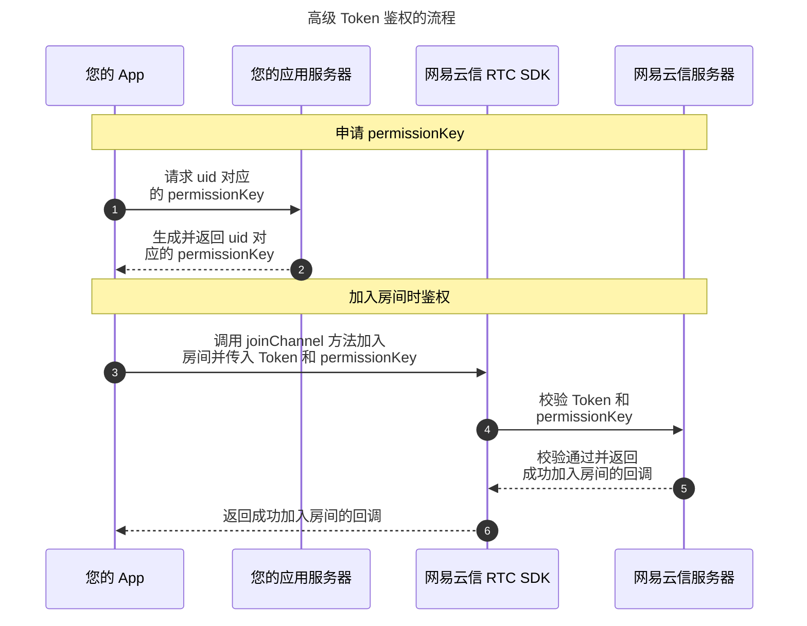

网易云信 [**音视频通话**](https://doc.yunxin.163.com/nertc/concept/zY0MjQ5NjE?platform=android) 和 [**互动直播**](https://doc.yunxin.163.com/interactive-streaming/concept/jE5NDc4OTc?platform=android) 产品中，鉴权方式分为安全模式和调试模式。如果您在 <a href="https://app.yunxin.163.com/index#/" target="_blank">网易云信控制台</a> 中为指定应用开启了安全模式，则对应应用的用户在加入房间时，需要通过 Token 进行身份校验。

## 鉴权方式

您可以选择在您的 App 中实现 [基础 Token 鉴权](https://doc.yunxin.163.com/nertc/server-apis/TcxNDAxMTI?platform=server) 或者高级 Token 鉴权，两种鉴权模式的区别如下表所示。

| 身份校验项     | 基础 Token 鉴权     | 高级 Token 鉴权     |
| --- | --- | --- |
| 检查 App ID     | ✔️     | ✔️     |
| 校验用户加入房间的权限     | ✔️     | ✔️    |
| 校验用户创建房间的权限     | -     | ✔️    |
| 校验用户发送音、视频流的权限     | -     | ✔️     |

若您的应用中存在 **对安全性要求较高的语音或视频通话场景，或者对观众上麦有权限控制的场景**，建议您选择高级 Token 鉴权模式，能有效避免客户端遭遇破解攻击的问题。

## 鉴权原理

开启用户权限控制后，当用户加入房间时，网易云信服务器会在校验 Token 的同时也校验 **权限密钥（`permissionKey`）**，若符合约定的算法规则，则会允许用户加入房间且赋予指定的发流权限。

`PermissionKey` 中的权限使用了一个字节（Byte）的前六个比特位来表示，其中每个比特位均代表一个权限，权限列表如下：

| 位数 | 二进制表示 | 十进制数字<br>（privilege 参数的值） | 权限含义 |
| --- | --- | --- | --- |
| 第 1 位 | 0000 0001     | 1 | 仅有发送音频流的权限 |
| 第 2 位 | 0000 0010     | 2 | 仅有发送视频流的权限 |
| 第 3 位 | 0000 0100     | 4 | 仅有订阅音频流的权限 |
| 第 4 位     | 0000 1000     | 8 | 仅有订阅视频流的权限 |
| 第 5 位 | 0001 0000 | 16 | 仅有创建房间的权限 |
| 第 6 位 | 0010 0000 | 32 | 仅有加入房间的权限 |

因此可以推算出，表示无权限的十进制参数为 0，表示仅有订阅音、视频流权限的十进制参数为 12，表示既可以发送又可以订阅视频流权限的十进制参数为 15，表示拥有全部权限的十进制参数为 63。

::: note note
- Token 由网易云信服务器或者由您自行计算生成，具体生成逻辑请参考 [获取 Token](https://doc.yunxin.163.com/nertc/server-apis/TcxNDAxMTI?platform=server#%E8%8E%B7%E5%8F%96Token)。
- 用户权限由您的应用服务器在生成 `permissionKey` 时确定，所以您需要在您的服务器管理好用户权限列表。
:::

## 鉴权流程



## 第一步：开通功能

您需要为指定应用设置用户权限控制，开通 **高级 Token 鉴权** 功能。

::: note notice
- 若您开启了用户权限控制开关，使用该 App Key 的所有用户都必须要在加入房间时传入权限密钥参数，否则无法正常加入房间。
- 若您关闭了用户权限控制开关，网易云信服务器默认不会校验权限密钥。
:::

<a id="permSecret"></a>

开通高级 Token 鉴权功能的操作步骤请参考 [开启或关闭功能](https://doc.yunxin.163.com/console/concept/TQ2NzE5MzQ?platform=console)，修改路径为 **音视频通话 2.0** > **功能配置** > **基础功能** > **鉴权方式**。


设置完成后，在 **子功能配置** 里，单击 **permKeySecret** 右侧的按钮复制 permKeySecret。


::: note note
在您的服务器生成 permissionKey 时，需要用到该 permKeySecret，对应 `GetPermissionKey` 中的 `permSecret` 参数的值。具体请参考下文 [第二步的示例代码](#permissionKey)。
:::

## 第二步：生成 permissionKey

为了防止客户端遭遇破解攻击的问题，由 `permissionKey` 定义的权限控制只能由您的服务器计算并返回给您的客户端。

::: note note 
网易云信 NERTC 的 `permissionKey` 使用了自定义的 Base64 编码方案，而非标准 Base64 或 Base64URL 编码，请参考以下云信提供的示例生成 `permissionKey`。
:::

请参考网易云信在 GitHub 上提供的示例代码，在您的应用服务器上生成 NERTC Token 和 permissionKey。示例代码的地址如下：

语言 | 示例代码 | 关键函数
---- | ---- | ---- |
Java | [生成 Token-Java](https://github.com/netease-im/G2-API-Examples/tree/main/server/token_server/java) | `getPermissionKey`
Go | [生成 Token-Go](https://github.com/netease-im/G2-API-Examples/tree/main/server/token_server/go) | `GetPermissionKey`
Node.js | [生成 Token-Nodejs](https://github.com/netease-im/G2-API-Examples/tree/main/server/token_server/nodejs) | `GetPermissionKey`
PHP | [生成 Token-PHP](https://github.com/netease-im/G2-API-Examples/tree/main/server/token_server/php) | `getPermissionKey`
Python | [生成 Token-Python](https://github.com/netease-im/G2-API-Examples/tree/main/server/token_server/python3) | `get_permission_key`
C++ | [生成 Token-C++](https://github.com/netease-im/G2-API-Examples/tree/main/server/token_server/cpp) | `getPermissionKey`
C#(dotnet) | [生成 Token-C#](https://github.com/netease-im/G2-API-Examples/tree/main/server/token_server/dotnet) | `GetPermissionKey`

<a id="permissionKey"></a>

生成 NERTC permissionKey 的关键参数说明如下表所示。

参数 | 类型 | 描述
---- | ---- | ----
channelName | String | RTC 房间名称。channelName 可以为空, 表示该 uid 可以使用这个 Token 加入任意房间。 |
permSecret | String | 权限密钥。请从云信控制台获取对应 **permKeySecret**，具体请参考 [获取 `permSecret` 的值](#permSecret)。 <br>
uid | Long | 用户在您应用中的 ID，请在您的业务服务器上自行管理并维护。 |
privilege | Integer | 权限等级。取值范围 [1,63]，具体参数的含义请参考 [鉴权原理](#鉴权原理)。例如，设置为 63 表示拥有全部权限。
ttlSec | Integer | permissionKey 过期时间，单位为秒，最大为 86400 秒（1 天）。 |
appKey | String | 请登录网易云信控制台查看您的应用对应的 **AppKey**，具体请参考 [创建应用并获取 AppKey](https://doc.yunxin.163.com/console/guide/TIzMDE4NTA?platform=console#获取-appkey)。 |

以 GO 语言为例，`permissionKey` 的计算代码如下：

```GoLang
package token

import (
    "bytes"
    "compress/zlib"
    "crypto/hmac"
    "crypto/sha1"
    "crypto/sha256"
    "encoding/base64"
    "encoding/json"
    "errors"
    "fmt"
    "time"
)
// GetPermissionKey 根据传入的参数生成权限密钥并返回
func (t *TokenServer) GetPermissionKey(channelName, permSecret string, uid uint64, privilege uint8, ttlSec int64) (string, error) {
    curTime := time.Now().Unix()
    return t.getPermissionKeyWithCurrentTime(channelName, permSecret, uid, privilege, ttlSec, curTime)
}

func (t *TokenServer) getPermissionKeyWithCurrentTime(channelName, permSecret string, uid uint64, privilege uint8, ttlSec, curTime int64) (string, error) {
    permKeyMap := make(map[string]interface{})
    permKeyMap["appkey"] = t.AppKey
    permKeyMap["uid"] = uid
    permKeyMap["cname"] = channelName
    permKeyMap["privilege"] = privilege
    permKeyMap["expireTime"] = ttlSec
    permKeyMap["curTime"] = curTime

    // 计算 checksum
    permKeyMap["checksum"] = hmacsha256(t.AppKey, fmt.Sprintf("%d", uid), fmt.Sprintf("%d", curTime),
        fmt.Sprintf("%d", ttlSec), channelName, permSecret, fmt.Sprintf("%d", privilege))

    // 转换为 JSON 格式
    data, err := json.Marshal(permKeyMap)
    if err != nil {
        return "", err
    }

    // 压缩数据
    var b bytes.Buffer
    w := zlib.NewWriter(&b)
    if _, err = w.Write(data); err != nil {
        return "", err
    }
    if err = w.Close(); err != nil {
        return "", err
    }

    // 编码为 base64 格式
    return base64Endoding.EncodeToString(b.Bytes()), nil
}

// hmacsha256 计算权限密钥签名
func hmacsha256(appidStr, uidStr, curTimeStr, expireTimeStr, cname, permSecret, privilegeStr string) string {
    var contentToBeSigned string
    contentToBeSigned = "appkey:" + appidStr + "\n"
    contentToBeSigned += "uid:" + uidStr + "\n"
    contentToBeSigned += "curTime:" + curTimeStr + "\n"
    contentToBeSigned += "expireTime:" + expireTimeStr + "\n"
    contentToBeSigned += "cname:" + cname + "\n"
    contentToBeSigned += "privilege:" + privilegeStr + "\n"

    h := hmac.New(sha256.New, []byte(permSecret))
    h.Write([]byte(contentToBeSigned))
    return base64.StdEncoding.EncodeToString(h.Sum(nil))
}
```

::: note note
`PermissionKey` 的有效期默认为 24 小时，您可以根据业务调整，区间为 [1s，24h]。
:::

## 下一步：传递密钥给 NERTC SDK

权限控制参数 Token 和 `permissionKey` 共同组成了高级 Token 鉴权的鉴权关键参数，其中 `permissionKey` 生命周期如下所示：


您可以在 **用户加入房间**、**用户角色变更** 或 **用户权限密钥需要更新** 时，将权限控制参数 Token 和 `permissionKey` 传递给 NERTC SDK 具体的开发平台或者开放框架版本，以对用户进行鉴权。

三种场景下鉴权的具体实现方式，以安卓端 Java 开发语言为例如下文所述。

### 场景一：用户加入房间

在用户调用 `joinChannel`<!--<a href="https://doc.yunxin.163.com/docs/interface/nertc/harmonyos/typedoc/Latest/zh/interfaces/NERtc.NERtc.html#joinChannel" target="_blank">`joinChannel`</a>--> 方法加入房间时，需要设置 `token` 和 `NERtcJoinChannelOptions` 中的 `permissionKey`。
<br>适用于加入房间前就明确用户权限的情况。

**示例代码** 如下：

```Java
//加入房间
String channelName;
String token;
long uid;
String permissionKey;

NERtcJoinChannelOptions channelOptions = new NERtcJoinChannelOptions();
channelOptions.permissionKey = permissionKey;

int ret = NERtcEx.getInstance().joinChannel(token, channelName, uid, channelOptions);
```

::: note note
加入房间时，用户 ID 和房间名称需要与申请 Token 时使用的用户 ID 和房间名称一致。
:::

### 场景二：用户角色变更

在用户需要连麦时，需要将自己的角色从观众切换到主播，此时需要再次校验用户的发流权限。因此在用户调用 <!-- <a href="https://doc.yunxin.163.com/docs/interface/nertc/harmonyos/typedoc/Latest/zh/interfaces/NERtc.NERtc.html#setClientRole" target="_blank">`setClientRole`</a> -->`setClientRole` 方法切换角色时，需要调用 `updatePermissionKey` 方法设置新的权限密钥。

**示例代码** 如下：

```Java
//更新权限密钥
String permissionKey = getServerToken();
NERtcEx.getInstance().updatePermissionKey(permissionKey);

//SDK 返回回调
//收到 updatePermissionKey 回调
void onUpdatePermissionKey(String key, int error, int timeout) {

}
```

### 场景三：用户权限密钥需要更新

- 在 `permissionKey` 过期前 30 秒，SDK 会触发 `onPermissionKeyWillExpire` 回调，此时用户客户端可以从您的业务服务器获取新的 `permissionKey` 并调用 `updatePermissionKey` 方法将新生成的 `permissionKey` 传递给 SDK，更新成功后 SDK 会触发 `onUpdatePermissionKey` 回调。

    **示例代码** 如下：

    ```Java
    //收到 onPermissionKeyWillExpire 回调时，向业务服务器重新申请一个 permissionKey，并调用 updatePermissionKey 将新的 permissionKey 传递给 SDK
    public void onPermissionKeyWillExpire() {
        Log.i(TAG, "密钥即将过期");
        String permissionKey = getServerToken(); //向业务服务器重新申请一个 permissionKey
        NERtcEx.getInstance().updatePermissionKey(permissionKey);
    }
    ```

- 若在 `permissionKey` 过期前仍未完成上述操作，则 SDK 会触发 `onDisconnect`<!-- [`onDisconnect`](https://doc.yunxin.163.com/docs/interface/nertc/harmonyos/typedoc/Latest/zh/interfaces/NERtcCallback.NERtcCallback.html#onDisconnect) --> 回调，返回 `ENGINE_ERROR_CHANNEL_PERMISSION_KEY_TIMEOUT` 错误码，同时客户端会与音视频服务器断开连接。若用户需要再次加入房间，则需要从您的业务服务器获取新的 `token` 和 `permissionKey` 并调用 `joinChannel`<!-- <a href="https://doc.yunxin.163.com/docs/interface/nertc/harmonyos/typedoc/Latest/zh/interfaces/NERtc.NERtc.html#joinChannel" target="_blank">`joinChannel`</a> --> 方法，再使用新的 `token` 和 `permissionKey` 重新加入房间。

    **示例代码** 如下：

    ```Java
    //收到 onDisconnect（ENGINE_ERROR_CHANNEL_PERMISSION_KEY_TIMEOUT）回调时，向业务服务器重新申请一个 permissionKey，并调用 joinChannel 重新加入房间
    public void onDisconnect(int reason) {
        Log.i(TAG, "onDisconnect reason: " + reason);
        if (reason == ENGINE_ERROR_CHANNEL_PERMISSION_KEY_TIMEOUT) {
            String permissionKey = getServerToken(); //向业务服务器重新申请一个 permissionKey
            channelOptions.permissionKey = permissionKey;
            postToUI->(NERtcEx.getInstance().joinChannel(token, channelName, uid, channelOptions););
        }
    }
    ```

## 错误码

| 错误码（ErrorCode） | 错误原因 |
| --- | --- |
| ENGINE_ERROR_USER_PERM_KEY_AUTH_FAILED = 30121 | 可能原因包括：| \
| | - 应用已开通高级 Token 鉴权，但用户鉴权时没有传入 permissionKey 参数。 | \
| | - 应用已开通高级 Token 鉴权，且用户鉴权时传入了 permissionKey 参数，但用户没有对应权限。 | \
| | - 应用已开通高级 Token 鉴权，且用户鉴权时传入了 permissionKey 参数，但用户的 permissionKey 已失效。 |
| ENGINE_ERROR_CHANNEL_PERMISSION_KEY_ERROR = 30901 | 权限密钥错误。 |
| ENGINE_ERROR_CHANNEL_PERMISSION_KEY_TIMEOUT = 30902 | 权限密钥超时。 |
| ENGINE_ERROR_ChannelNoPublishPermission = 30911 | 用户无发流权限。 |
| ENGINE_ERROR_ChannelNoSubscribePermission = 30912 | 用户无订阅权限。 |