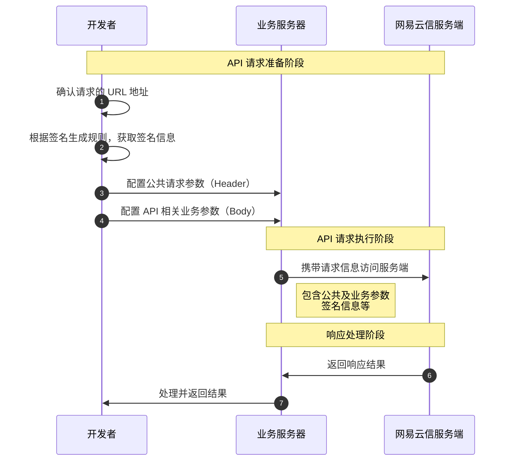

网易云信音视频通话 2.0 产品提供了一整套服务端接口（RESTful API），可配合客户端 NERTC SDK 的特性，构建完整、丰富的业务体验。您可以向网易云信服务端发起 HTTP/HTTPS 网络请求，通过使用 GET、POST 或 DELETE 方法调用服务端 API 实现与网易云信服务端的信息交互，实现房间信令、媒体服务、音视频混流等一系列后台服务。

## 功能介绍

服务端 API 具备以下功能：

- App 用户接入网易云信实时音视频服务。

    您需要从您的业务服务器调用服务端 API 的申请 Token 接口，使用 uid（用户在您应用中的 ID） 申请 Token。用户在客户端登录时必须持有有效的 Token 才能连接网易云信服务器。具体请参考 [Token 鉴权](https://doc.yunxin.163.com/nertc/server-apis/TQ0MTI2ODQ)。

- 提供高级、扩展特性。

    您可以根据业务需求选择使用服务端提供的服务，例如 [房间管理](https://doc.yunxin.163.com/nertc/server-apis/TE0NDI4MjY)、[旁路推流](https://doc.yunxin.163.com/nertc/server-apis/TI2ODQxOTU)、[安全通审核](https://doc.yunxin.163.com/nertc/server-apis/DQ3NDg2MzA)（增值服务）、[云端播放](https://doc.yunxin.163.com/nertc/server-apis/DgwNTY0NDg) （增值服务）、[云端录制](https://doc.yunxin.163.com/nertc/server-apis/zE4NDg0NTM) （增值服务）等，可配合客户端 SDK 特性，构建完整、丰富的业务体验。

## 回调介绍

调用服务端 API 后，网易云信服务器会实时返回相关回调并抄送至您指定的回调地址。支持的服务器回调类型如下：

| 回调类型 | 功能描述 | 使用场景 | 前置条件 |
|---------|---------|---------|---------|
| [**房间事件通知**](https://doc.yunxin.163.com/nertc/server-apis/DUyOTg1NDI) | 音视频房间状态变化及房间用户状态变化实时同步 | 房间管理、用户状态监控 | 无 |
| [**安全通审核结果通知**](https://doc.yunxin.163.com/nertc/server-apis/DQ3NDg2MzA) | 音视频、云端录制审核任务检测到的违规事件以及审核任务状态实时同步 | 内容安全审核、合规监管 | [开通安全通审核服务](https://doc.yunxin.163.com/nertc/server-apis/zMzMTYzNDM?platform=server) |
| [**云端播放事件通知**](https://doc.yunxin.163.com/nertc/server-apis/DgwNTY0NDg) | 云端播放任务状态变化实时同步 | 播放任务监控、状态追踪 | 调用云端播放 API |
| [**云端录制事件通知**](https://doc.yunxin.163.com/nertc/server-apis/zE4NDg0NTM) | 云端录制任务状态变化实时同步 | 录制任务监控、文件管理 | [开通云端录制服务](https://doc.yunxin.163.com/nertc/server-apis/TE3MTkxNjQ?platform=server) |
| [**旁路推流事件通知**](https://doc.yunxin.163.com/nertc/server-apis/TI2ODQxOTU) | 推流至第三方 CDN 的状态变化实时同步 | CDN 推流监控、直播状态管理 | [配置第三方 CDN 推流](https://doc.yunxin.163.com/nertc/server-apis/zQ1MDM1MjQ?platform=server) |

:::note note
- **回调地址配置**：需要在 [网易云信控制台](https://app.yunxin.163.com/global/home) 或通过 API 配置回调接收地址。
- **云端录制审核**：接收云端录制审核任务结果需要同时开通云端录制服务，请参考 [实现云端录制](https://doc.yunxin.163.com/nertc/server-apis/DI2OTE0ODI)。
- **回调验证**：建议验证回调请求的合法性，确保数据安全。
:::

## 请求流程

请参考以下流程，快速向网易云信服务端发起请求：



## **第一步：确认 URL 地址**

网易云信服务端根据不同的 URL 地址区分不同的业务请求，各 URL 地址由三个部分的参数拼接而成。

::: note note
在访问网易云信服务端之前，请先到对应功能的接口文档中获取对应的请求 URL 地址。
:::

以 [创建房间](https://doc.yunxin.163.com/nertc/server-apis/jg3NjcyNTE?platform=server) 的 URL 地址为例：

```
https://rtc.yunxinapi.com/v2/api/room
```

- **`https`**：指定请求通信协议。网易云信所有服务端接口均支持通过 HTTPS 协议进行通信，保障更高的安全性。

- **`rtc.yunxinapi.com/v2/api`**：指定网易云信服务端的接入地址。详情列表请参考 [调用方式](https://doc.yunxin.163.com/nertc/server-apis/TYyNjA3MzQ?platform=server#%E6%9C%8D%E5%8A%A1%E5%9C%B0%E5%9D%80)。

- **`room`**：指定要调用的 API 接口为 `room`。

## <span id="第二步：生成签名信息"> **第二步：生成签名信息** </span>

为保证服务端 API 的安全调用，网易云信服务端会对每个 API 的访问请求进行身份验证。您在调用每个服务端 API 前，需要先生成签名 CheckSum 信息。

您可以参考 [调用方式](https://doc.yunxin.163.com/nertc/server-apis/TYyNjA3MzQ?platformId=50326#Header) 里的示例代码计算 CheckSum，使用 [创建应用](/docs/Tk5NzkwOTY/TA1ODMzMDc) 后获取到的 AppSecret，生成您自己的签名信息。

## **第三步：配置公共请求头**

您在调用网易云信服务端 API 时，需要在请求头中配置 API 的公共请求参数。

公共请求参数指调用每个服务端接口都需要使用到的请求参数，包含了 App Key、CheckSum（指 <a href="#第二步：生成签名信息">生成的签名信息</a>、Nonce（随机数）、CurTime（时间戳）等鉴权参数，具体参数介绍请参考 [调用方式](https://doc.yunxin.163.com/nertc/server-apis/TYyNjA3MzQ?platformId=50326#Header)。

## **第四步：配置关业务请求体**

配置完请求的公共参数后，您需要根据业务需求选择是否继续配置 API 相关的业务参数，因为部分服务端 API 的 Body 部分无需传参。

## **第五步：发起请求**

在您完成以上配置后，即可通过指定 URL 地址向网易云信服务端发起业务请求。

以创建房间的业务请求为例，请求示例如下：

```
curl --location --request POST 'https://rtc.yunxinapi.com/v2/api/room' \
--header 'AppKey: 6acf024e********85905444b6e57dd7' \
--header 'Nonce: frujy' \
--header 'CurTime: 1658298498' \
--header 'CheckSum: cd018042********6ababe33e97e5ef9031fbf48' \
--header 'RequestId: b0******-3f33-44c9-8fd4-f4b217b3aa20' \
--header 'Content-Type: application/json' \
--data-raw '{
    "channelName": "c58d016674d043e08260d|0|215!@#$%^&*()_+=-09",
    "uid":1111
}'
```

## **第六步：响应请求**

网易云信服务端接收到您发起的业务请求并解析请求信息后，会向您返回响应信息，您可根据返回的错误码或状态码判断接口调用是否成功。

以创建房间的请求响应为例，返回示例如下：

```JSON
{
    "code": 200, //返回 code 为 200 表示调用成功
    "cid": 12345
}
```

至此，您与网易云信服务端成功完成一次信息交互，实现了一次业务请求。