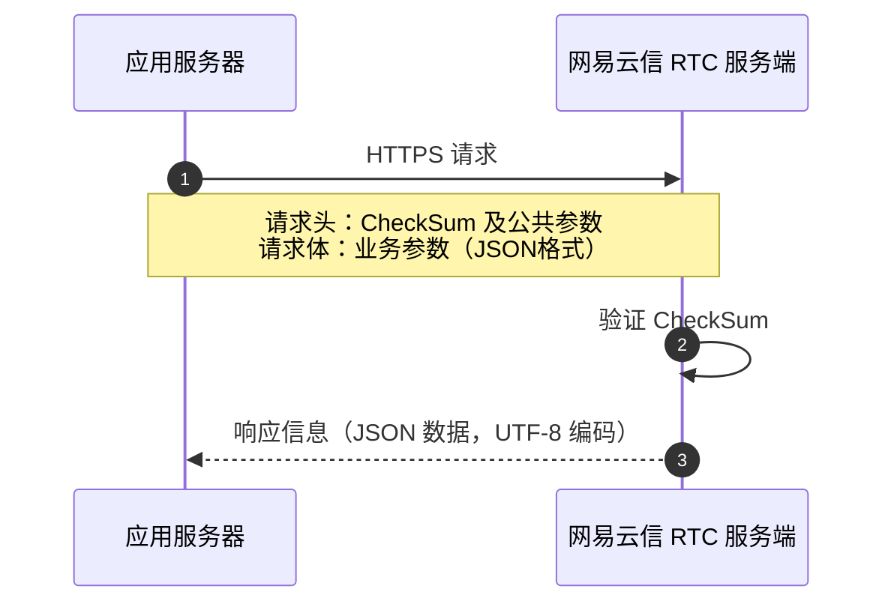

音视频通话 2.0（NetEase Real-Time Communication，NERTC）是网易云信推出的实时音视频开发平台。网易云信基于网易多年的即时通讯和实时音视频通话能力的技术积累，为您提供稳定流畅、高品质、全平台的点对点和多人实时音视频通话服务。

## <span id="使用限制">使用限制</span>

通过服务端或客户端 API 接口使用音视频通话 2.0 服务时，您需要注意房间人数、连麦人数等限制，详细说明请参考 [使用限制](https://doc.yunxin.163.com/nertc/server-apis/jE0MjM3MjQ?platform=android#业务限制)。

## <span id="适用场景">适用场景</span>

音视频通话 2.0 提供客户端和服务端 RESTful API 供您调用：

- **服务端 API**：使用 HTTP/HTTPS 协议，支持 GET 和 POST 方法，适用于服务端管理和控制场景。
- **客户端 SDK**：提供完整的开发包，适用于快速二次开发，详情请参考 [集成 SDK](https://doc.yunxin.163.com/nertc/guide/DcyNDc0ODI?platform=android) 指南。

部分功能支持客户端和服务端两种实现方式，请根据您的实际需求选择合适的调用方式。

## 请求概述

应用服务端调用 API 向网易云信 RTC 服务端发起的请求需遵循固定的请求结构和请求方式。

<style>
table th:first-of-type {
    width: 17%;
}
</style>



### 请求方式

- **通信协议**：网易云信 RTC 服务端 API 使用 HTTP/HTTPS 网络请求协议。

- **请求方式**：应用服务端向网易云信 RTC 服务端发起的请求支持 POST、DELETE、GET 三种方式，分别对应资源的增加、删除、修改和查询操作。

### 服务地址

- **基础接入地址**

     服务区域 | 接入地址 | 说明 |
    ---------|---------|------|
     中国大陆 | `https://rtc.yunxinapi.com/v2/api` | 默认配置 |
     海外地区 | `https://rtc-ap.yunxinapi.com/v2/api` | 海外用户专用 |

    海外业务接入说明请参考 [接入海外数据中心](https://doc.yunxin.163.com/Overseas/guide/DgyODU1ODI?platform=others)。

- **高可用域名配置**（**推荐**，为保障业务稳定性，建议配置主备域名）

     服务区域 | 主域名 | 备用域名 | 默认域名（兼容） |
    ---------|--------|----------|-----------------|
     中国大陆 | `rtc-pri.yunxinapi.com` | `rtc-bak.yunxinapi.com` | `rtc.yunxinapi.com` |
     海外地区 | `rtc-ap.yunxinapi.com` | `rtc-ap-bak.yunxinapi.com` | `rtc-ap.yunxinapi.com` |

    :::note note
    为确保服务的高可用性，网易云信建议：
    - **配置多域名访问**：在业务系统中同时配置主备域名，当检测到主域名无法访问时，自动切换至备用域名。
    - **定期检查域名可用性**：建议在应用中实现定期检查域名可用性的机制，以便及时发现并应对可能的域名访问问题。
    :::

## 请求结构

### 请求 URL

完整的 API 请求 URL 由以下部分组成：

| 组成部分 | 必选 | 描述 | 示例 |
|---------|------|------|------|
| **基础 URL** | 是 | 服务接入地址 + 接口路径 | [`https://rtc.yunxinapi.com/v2/api/room`](https://doc.yunxin.163.com/nertc/server-apis/jg3NjcyNTE?platform=server) |
    **路径参数** | 否 | URL 中的动态参数，需 URL 编码 | `/rooms/{cid}` 中的 `{cid}` |
    **查询参数** | 否 | URL 中的查询字符串，GET/DELETE 请求必需<ul><li>GET、DELETE 操作必须使用查询参数，不能使用请求体参数</li><li>查询参数为 key-value 形式，没有二级结构。所有参数和值需要经过 url 编码</li><li>当查询参数出现 List 类型时，每个参数以逗号进行拼接</li></ul> | `?page=1&size=10` |

### <span id="Header">请求头（Header）</span>

Header 中包括用于鉴权的相关公共参数，用于标识用户和接口签名。如非必要，每个单独的接口文档中不再对这些参数进行说明，但每次请求均需要携带这些参数，才能正常发起请求。

| 参数名称 | 类型 | 必选 | 示例 | 说明 |
| -- | -- | -- | -- | -- |
| AppKey | String | 是 | b2e***fcc155e7d26c4 | 通过网易云信控制台获取，请参考 <a href="https://doc.yunxin.163.com/console/concept/TIzMDE4NTA?platform=console">获取 App Key</a>。
| Nonce | String | 是 | 8dfdb33d2840 | 随机数，最大长度 128 个字符。
| CurTime | String | 是 | 1443592222 | 当前 UTC 时间戳，从 1970 年 1 月 1 日 0 时 0 分 0 秒开始到 **现在** 的秒数。<note type="notice">该时间用于计算 CheckSum 的有效期，请确保与标准时间同步，例如 NTP 服务。</note>
| CheckSum | String | 是 | b404199cdb06d20xxxdc61016d | `SHA1(AppSecret + Nonce + CurTime)`，将该三个参数拼接的字符串进行 SHA1 哈希计算从而生成 16 进制字符（小写）。<ul><li>出于安全性考虑，每个 `CheckSum` 的 **有效期** 为 **5 分钟**，即服务端接收到请求的时间与请求中的 `CurTime` 相差不能超过 5 分钟，建议每次请求都生成新的 `CheckSum`。</li><li>`CheckSum` 检验失败时会返回 401 错误码，更多错误码信息请参考 [错误码](https://doc.yunxin.163.com/nertc/server-apis/TQ3Njc1Nzg?platform=server)。</li> </ul>

::: note important
请妥善保管用于计算 `CheckSum` 的 `AppSecret`，可在应用服务器存储和使用，但不应存储或传递到客户端，也不应在网页等前端代码中嵌入。
:::

<a id="CheckSumSample"></a>

**CheckSum 计算示例**

您可以参考以下代码计算 CheckSum。

:::::: div linked-codes
::: code Java
```Java
package com.netease.im.rtctoken;

import java.nio.charset.StandardCharsets;
import java.security.MessageDigest;

public class RestApiAuth {
    // 计算并获取 CheckSum
    public static String getChecksum(String appSecret, String nonce, long curTime) {
        return sha1(appSecret + nonce + curTime);
    }

    // 对输入字符串进行 SHA1 哈希计算
    private static String sha1(String input) {
        try {
            MessageDigest mDigest = MessageDigest.getInstance("SHA-1");
            byte[] result = mDigest.digest(input.getBytes(StandardCharsets.UTF_8));
            StringBuilder sb = new StringBuilder();
            for (byte b : result) {
                sb.append(String.format("%02x", b));
            }
            return sb.toString();
        } catch (Exception e) {
            throw new RuntimeException(e);
        }
    }
}
```
:::

::: code Node.js
```JavaScript
const crypto = require('crypto');

var GetChecksum = function (appSecret, nonce, curTime) {
    return sha1(`${appSecret}${nonce}${curTime}`);
}

const sha1 = function (input) {
    const sha1 = crypto.createHash('sha1');
    sha1.update(input, 'utf8');
    return sha1.digest('hex');
}
```
:::
::: code Go
```Golang
package token

import (
    "crypto/sha1"
    "fmt"
)

func GetChecksum(appSecret, nonce string, curtime int64) string {
    raw := fmt.Sprintf("%s%s%d", appSecret, nonce, curtime)
    return fmt.Sprintf("%x", sha1.Sum([]byte(raw)))
}

```

:::
::: code PHP
```PHP
<?php
function getChecksum(string $appSecret, string $nonce, int $curtime):string {
    return sha1($appSecret . $nonce . $curtime);
}
?>
```

:::
::: code Python
```Python
import hashlib

def get_checksum(app_secret: str, nonce: str, timestamp: int):
    return hashlib.sha1(f'{app_secret}{nonce}{timestamp}'.encode()).hexdigest()
```

:::
::: code C#

```C#
using System.Security.Cryptography;
using System.Text;

namespace TokenBuilder
{
    public class RestApiAuth
    {
        public static string GetChecksum(string appSecret, string nonce, long curtime)
        {
            return ComputeSHA1($"{appSecret}{nonce}{curtime}");
        }
        private static string ComputeSHA1(string input)
        {
            using var sha1 = SHA1.Create();
            var hash = sha1.ComputeHash(Encoding.UTF8.GetBytes(input));
            var sb = new StringBuilder(hash.Length * 2);

            foreach (byte b in hash)
            {
                sb.Append(b.ToString("x2"));
            }

            return sb.ToString();
        }
    }
}
```
:::

::: code C++

```C++
#include <iostream>
#include <iomanip>
#include <string>
#include <sstream>
#include <openssl/sha.h>

std::string sha1(const std::string &input)
{
    unsigned char hash[SHA_DIGEST_LENGTH];
    SHA1(reinterpret_cast<const unsigned char *>(input.c_str()), input.length(), hash);
    std::ostringstream oss;
    oss << std::hex << std::setfill('0');
    for (auto c : hash)
    {
        oss << std::setw(2) << static_cast<int>(c);
    }
    return oss.str();
}

std::string getChecksum(const std::string appSecret, std::string nonce, long curtime)
{
    return sha1(appSecret + nonce + std::to_string(curtime));
}
```
:::
::::::

### <span id="Body">请求体（Body）</span>

- **Content-Type**：`application/json`
- **格式**：JSON
- **编码**：UTF-8
- **适用请求**：POST、PUT 等需要传递业务参数的请求

## 响应结果

API 返回结果的格式统一。Header 中返回 2xx HTTP 状态码代表接口调用成功。Header 中返回 4xx 或 5xx HTTP 状态码代表接口调用失败。调用失败时，部分接口会同时在 Body 中返回该调用的相关错误信息供您排查问题。

### <span id="正常返回示例">正常返回示例</span>

接口调用成功后会返回接口返回参数，这样的返回为正常返回。正常返回的 HTTP Header 中的状态码为 2xx。

正常返回示例如下：

```JSON
{
    "code": 200,
    "cid": 12345,
    ...
}
```

### <span id="异常返回示例">异常返回示例</span>

接口调用出错后，会返回错误码、错误信息，这样的返回为异常返回。HTTP Header 中的状态码为 4xx 或者 5xx。部分接口会在 Body 中返回具体的业务错误码和错误信息供您排查问题。

您可以根据接口调用后返回的错误码，参考 [Header 中的状态码](https://doc.yunxin.163.com/nertc/server-apis/TQ3Njc1Nzg?platformId=50326#Header%20%E4%B8%AD%E7%9A%84%E7%8A%B6%E6%80%81%E7%A0%81) 或 [Body 中的错误码](https://doc.yunxin.163.com/interactive-streaming/server-apis/TUwNzYyODE?platform=server)排查问题。当您无法排查问题时，可以 [提交工单](https://app.yunxin.163.com/global/service/ticket/create) 联系网易云信技术支持工程师。

异常返回示例如下：

- **Header 中返回状态码，且 Body 中返回错误码（code）**：

    请参考 [Header 中的状态码](https://doc.yunxin.163.com/nertc/server-apis/TQ3Njc1Nzg?platformId=50326#Header%20%E4%B8%AD%E7%9A%84%E7%8A%B6%E6%80%81%E7%A0%81) 和 [Body 中的错误码](https://doc.yunxin.163.com/interactive-streaming/server-apis/TUwNzYyODE?platform=server) 排查问题。

    ```JSON
    {
        "code": 400,
        "errmsg": invalid params
    }
    ```
- **仅在 Header 中返回状态码**：

    请参考 [Header 中的状态码](https://doc.yunxin.163.com/nertc/server-apis/TQ3Njc1Nzg?platformId=50326#Header%20%E4%B8%AD%E7%9A%84%E7%8A%B6%E6%80%81%E7%A0%81) 排查问题。