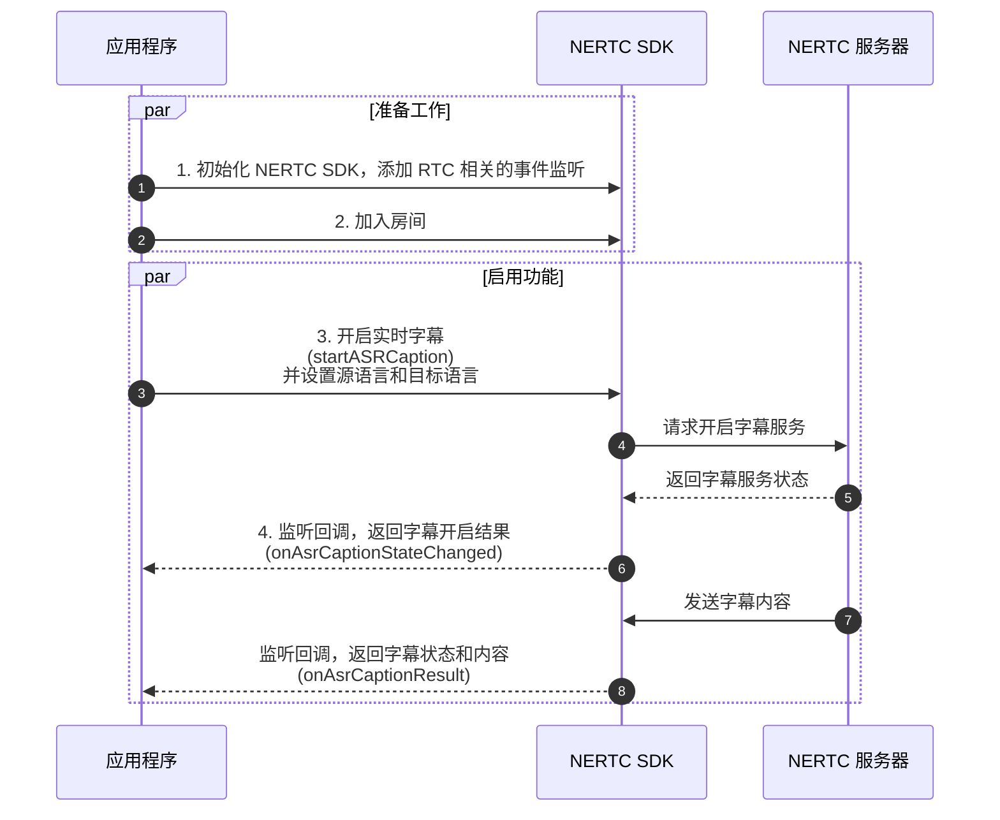
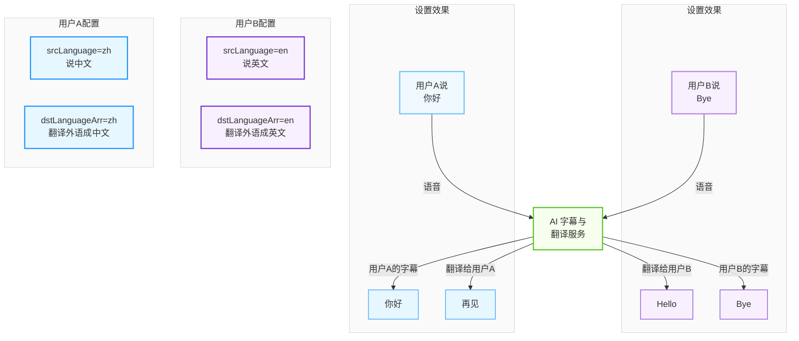

网易云信音视频通话 2.0（NERTC）实时字幕功能允许用户在音视频通话中，实时显示语音转文本的字幕，而字幕翻译支持将实时字幕同时翻译为目标语言。本文详细介绍如何开启实时字幕、开启字幕翻译、关闭实时字幕功能，并提供示例代码和接口参考。

<style>
table th:first-of-type {
    width: 30%;
}
</style>

## 功能特性

字幕功能适用于将语音实时转换为文本字幕，字幕翻译功能适用于多语言会议、跨国交流、无障碍沟通、在线教育课程、会议记录与归档等场景。

- **实时多语种字幕**：将语音即时转换为精准文本字幕，支持多种主流语言。
- **智能语言翻译**：自动将字幕翻译成目标语言，实现跨语言无缝沟通。
- **状态回调**：提供字幕开启、关闭、失败等状态回调。
- **字幕展示**：支持自定义字幕展示样式和位置。
- **字幕下载**：支持通过服务端 [云端录制事件抄送](https://doc.yunxin.163.com/nertc/server-apis/Tg5OTI0ODA?platform=server#3) 下载 `.txt` 字幕文件。

## 准备工作

根据本文操作前，请确保您已经完成了以下设置：

1. **开通功能权限**：如果您需要使用实时字幕和字幕翻译功能，请联系您的网易云信客户经理或 [提交工单](https://app.yunxin.163.com/global/service/ticket/create) 联系网易云信技术支持工程师开通。
2. **集成 NERTC SDK**：项目已集成最新版本的 NERTC SDK。详情请参考 [集成 SDK](https://doc.yunxin.163.com/nertc/guide/jMwMjEyODE?platform=flutter)。
3. **初始化 NERTC SDK**：在使用实时字幕和字幕翻译功能前，初始化 NERTC SDK 并将用户加入音视频房间。详情请参考 [实现音视频通话](https://doc.yunxin.163.com/nertc/guide/jMwNzY0NjM?platform=flutter)。

    ```dart
    // 创建一个自定义的事件回调类
    class MyChannelEventCallback extends NERtcChannelEventCallback {
      @override
      void onJoinChannel(int result, int channelId, int elapsed, int uid) {
        if (result == 0) {
          // 加入房间成功；result 为 0 表示成功,其他值见 [NERtcErrorCode]
          print('onJoinChannel 成功: channelId=$channelId, uid=$uid, 耗时=${elapsed}ms');
        } else {
          print('onJoinChannel 失败: result=$result');
        }
      }
      
      @override
      void onUserJoined(int uid, NERtcUserJoinExtraInfo joinExtraInfo) {
        print('远端用户加入 - uid: $uid');
      }

      // ... 其他回调
    }

    // 初始化 NERTC SDK
    final rtcEngine = await NERtcEngine.create(appKey: yourAppKey);

    // 设置事件监听
    rtcEngine.setChannelEventCallback(MyChannelEventCallback());

    // 加入 RTC 房间
    await rtcEngine.joinChannel(
    token: token,
    channelName: channelName,
    uid: uid,
    );
    ```

## 场景一：开启实时字幕

您可以在完成准备工作后，调用 [`startASRCaption`](https://pub.dev/documentation/nertc_core/latest/nertc/NERtcEngine/startASRCaption.html) 接口开启实时字幕功能。功能调用流程如下图所示，涉及的接口请参考下文 [相关接口](#apiList) 章节：



相关示例代码如下所示：

```dart
// 创建一个自定义的事件回调类
class MyChannelEventCallback extends NERtcChannelEventCallback {
  // 监听字幕状态
  @override
  onAsrCaptionStateChanged: (int asrState, int code, String message) {
    switch (asrState) {
      case 0:
        print('开启字幕失败: $message');
        break;
      case 1:
        print('关闭字幕失败: $message');
        break;
      case 2:
        print('开启字幕成功');
        break;
      case 3:
        print('关闭字幕成功');
        break;
    }
  }

  // 监听字幕内容
  @override
  onAsrCaptionResult: (List<NERtcAsrCaptionResult> results) {
    for (var result in results) {
      print('收到字幕: ${result.content}');
      // 在此处将字幕内容展示到 UI
    }
  }

  // ... 其他回调
}


// 开启实时字幕
final config = NERtcASRCaptionConfig(
  srcLanguage: 'AUTO', // 源语言，默认为 'AUTO'，表示自动识别中英文
  // dstLanguageArr: ['EN'], // 如需开启字幕翻译，您需要设置目标语言
);

await rtcEngine.startASRCaption(config);

// 监听字幕状态
rtcEngine.setChannelEventCallback(MyChannelEventCallback());
```

**参数说明**

| 参数 | 说明 |
| --- | --- |
| [`NERtcASRCaptionConfig`](https://pub.dev/documentation/nertc_core/latest/nertc/NERtcASRCaptionConfig-class.html) | 字幕语言配置对象。 |
    `srcLanguage` | 字幕的源语言，默认为 `AUTO`，支持的语言列表请参考下文 [语言列表](#language)。 |
    `dstLanguageArr` | 字幕翻译的目标语言列表，默认为空，不翻译。支持的语言列表请参考下文 [语言列表](#language)。 |
| `asrState` | 请求开启字幕的状态： |\
| | - **0**：请求开启字幕失败，建议 App 重新调用接口开启字幕。 |\
| | - **1**：请求关闭字幕失败，建议 App 重新调用接口关闭字幕。 |\
| | - **2**：请求开启字幕成功，App 可以接收字幕内容的回调。 |\
| | - **3**：请求关闭字幕成功，App 停止接收字幕内容的回调。 |
| `code` | 状态码，详情请参考 [开启实时音频互动](https://doc.yunxin.163.com/nertc/server-apis/jQzOTE2NTc?platform=server#%E7%8A%B6%E6%80%81%E7%A0%81) 状态码章节。 |

## 场景二：开启字幕翻译

### 开启方式

开启实时字幕功能后，可以开启字幕翻译功能。您只需要调用 [`startASRCaption`](https://pub.dev/documentation/nertc_core/latest/nertc/NERtcEngine/startASRCaption.html) 接口开启实时字幕翻译功能，并设置源语言和目标语言。

```dart
// 开启字幕翻译
final config = NERtcASRCaptionConfig(
  srcLanguage: 'AUTO', // 源语言，默认为 'AUTO'，表示自动识别中英文
  dstLanguageArr: ['EN'], // 设置目标语言，与开启实时字幕的源语言有关联
);

await rtcEngine.startASRCaption(config);
```

### 语言设置

翻译字幕时，源语言（`srcLanguage`）和目标语言列表（`dstLanguageArr`）需要根据用户的说话语言和期望看到的翻译语言分别设置这两个参数，而非根据通话对方的语言来设置。

- **srcLanguage (源语言)**：指的是 **本端用户说话使用的语言**，即需要被识别和转换为文字的语音所使用的语言。
- **dstLanguageArr (目标语言)**：指的是 **本端用户希望看到的翻译后的语言**，即字幕翻译后展示的语言。



### 示例一：不同语言日常交流

- 中国用户（说中文，并需要把对方说的英文翻译成中文）设置：

    ```dart
    final configCN = NERtcASRCaptionConfig(
    srcLanguage: 'zh', // 源语言设为中文，因为我说中文
    dstLanguageArr: ['zh'], // 目标语言设为中文，所以我看到对方说话的英文会被翻译成中文
    );
    await rtcEngine.startASRCaption(configCN);
    ```

- 美国用户（说英文，并需要把对方说的中文翻译成英文）设置：

    ```dart
    final configUS = NERtcASRCaptionConfig(
    srcLanguage: 'en', // 源语言设为英文，因为我说英文
    dstLanguageArr: ['en'], // 目标语言设为英文，所以我看到对方说话的中文会被翻译成英文
    );
    await rtcEngine.startASRCaption(configUS);
    ```

### 示例二：多国语言会议

- 中文用户设置：

    ```dart
    final configZH = NERtcASRCaptionConfig(
    srcLanguage: 'zh', //源语言设为中文，因为我说中文
    dstLanguageArr: ['zh'], // 目标语言设为中文，所以我看到其他语言会被翻译成中文
    );
    ```

- 英文用户设置：

    ```dart
    final configEN = NERtcASRCaptionConfig(
    srcLanguage: 'en', // 我说英文
    dstLanguageArr: ['en'], // 需要把对方说的语言翻译成英文
    );
    ```

- 日文用户设置：

    ```dart
    final configJA = NERtcASRCaptionConfig(
    srcLanguage: 'ja', // 我说日文
    dstLanguageArr: ['ja'], // 需要把对方说的语言翻译成日文
    );
    ```

## 场景三：关闭实时字幕

调用 [`stopASRCaption`](https://pub.dev/documentation/nertc_core/latest/nertc/NERtcEngine/stopASRCaption.html) 接口关闭实时字幕功能。

```dart
// 关闭实时字幕
await rtcEngine.stopASRCaption();
```

<a id="apiList"></a>

## 相关接口

本文涉及的接口和事件如下所示：

| 接口/事件 | 说明 |
| --- | --- |
| [`create`](https://pub.dev/documentation/nertc_core/latest/nertc/NERtcEngine/create.html) | 创建 NERtc 实例。 |
| [`joinChannel`](https://pub.dev/documentation/nertc_core/latest/nertc/NERtcChannel/joinChannel.html) | 加入音视频房间。 |
| [`startASRCaption`](https://pub.dev/documentation/nertc_core/latest/nertc/NERtcEngine/startASRCaption.html) | 开启实时字幕功能。 |
| [`stopASRCaption`](https://pub.dev/documentation/nertc_core/latest/nertc/NERtcEngine/stopASRCaption.html) | 关闭实时字幕功能。 |
| [`onJoinChannel`](https://pub.dev/documentation/nertc_core/latest/nertc/NERtcChannelEventCallback/onJoinChannel.html) | 本端加入房间的回调。 |
| [`onUserJoined`](https://pub.dev/documentation/nertc_core/latest/nertc/NERtcChannelEventCallback/onUserJoined.html) | 远端用户加入房间的回调。 |
| [`onAsrCaptionStateChanged`](https://pub.dev/documentation/nertc_core/latest/nertc/NERtcChannelEventCallback/onAsrCaptionStateChanged.html) | 字幕状态变化的回调。 |
| [`onAsrCaptionResult`](https://pub.dev/documentation/nertc_core/latest/nertc/NERtcChannelEventCallback/onAsrCaptionResult.html) | 收到字幕内容的回调。 |

<a id="language"></a>

## 语言列表

`startASRCaption` 接口中源语言 `srcLanguage` 和目标语言 `dstLanguageArr` 支持的语言代码列表如下所示：

| 语言类型 | 语言代码 | 名称 | 源语言 | 目标语言 |
| --- | :---: | --- | --- | --- |
| 常见语言 | AUTO | 中英文自动识别 | ✔️️ | - |
| ^^ | ar | 阿拉伯语 | ✔️️ | ✔️️ |
| ^^ | de | 德语 | ✔️️ | ✔️️ |
| ^^ | en | 英语 | ✔️️ | ✔️️ |
| ^^ | es | 西班牙语 | ✔️️ | ✔️️ |
| ^^ | fr | 法语 | ✔️️ | ✔️️ |
| ^^ | hi | 印地语 | ✔️️ | ✔️️ |
| ^^ | id | 印度尼西亚语 | ✔️️ | ✔️️ |
| ^^ | it | 意大利语 | ✔️️ | ✔️️ |
| ^^ | ja | 日语 | ✔️️ | ✔️️ |
| ^^ | ko | 韩语 | ✔️️ | ✔️️ |
| ^^ | nl | 荷兰语 | ✔️️ | ✔️️ |
| ^^ | pt | 葡萄牙语 | ✔️️ | ✔️️ |
| ^^ | ru | 俄语 | ✔️️ | ✔️️ |
| ^^ | th | 泰语 | ✔️️ | ✔️️ |
| ^^ | vi | 越南语 | ✔️️ | ✔️️ |
| ^^ | zh | 简体中文 | ✔️️ | ✔️️ |
| 汉语方言 | db | 东北话 | ✔️️ | - |
| ^^ | nan | 闽南语 | ✔️️ | - |
| ^^ | sc | 四川话 | ✔️️ | - |
| ^^ | yue | 粤语 | ✔️️ | - |
| ^^ | zj | 浙江话 | ✔️️ | - |
| 非常见语言 | bn | 孟加拉语 | ✔️️ | ✔️️ |
| ^^ | fa | 波斯语 | ✔️️ | ✔️️ |
| ^^ | he | 希伯来语 | ✔️️ | ✔️️ |
| ^^ | km | 高棉语 | ✔️️ | ✔️️ |
| ^^ | lo | 老挝语 | ✔️️ | ✔️️ |
| ^^ | ms | 马来语 | ✔️️ | ✔️️ |
| ^^ | tl | 菲律宾语 | ✔️️ | ✔️️ |
| ^^ | tr | 土耳其语 | ✔️️ | ✔️️ |

## 常见问题

### 服务端如何获取翻译后的字幕文件？

您可以通过 [云端录制事件抄送（`eventType` = `3`）](https://doc.yunxin.163.com/nertc/server-apis/Tg5OTI0ODA?platform=server#3) 获取翻译后的 `.txt` 字幕文件。

### 开启实时字幕失败怎么办？

- 检查是否已初始化 NERTC SDK 并成功加入房间。
- 确认音频配置是否正确，应用权限（麦克风）是否已正确授予。
- 检查网络连接是否正常。
- 验证您的网易云信开发者账号的应用密钥（`APP_KEY`）是否有效且开启了字幕服务权限。

### 翻译不准确怎么办？

- 请确保您选择了正确的源语言和目标语言。
- 清晰、规范地发音有助于提高识别率，同时使用外置麦克风可提高录音质量。
- 专业术语可能需要手动校正。

### 字幕显示延迟较高怎么办？

- 确保网络环境良好，避免高延迟或丢包。
- 调整音频配置，使用较低的采样率和码率。

### 如何自定义字幕样式？

- 在 `onAsrCaptionResult` 回调中获取字幕内容后，使用自定义 UI 组件展示字幕。