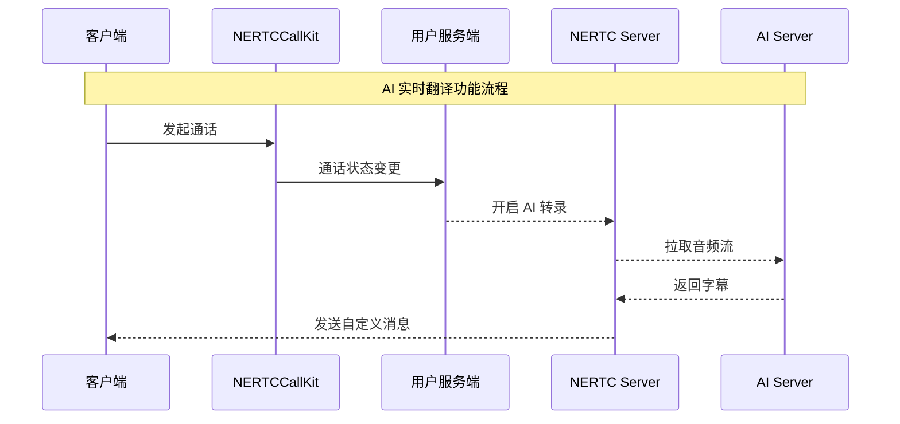

网易云信呼叫组件（NERTCCallKit）的实时翻译能力基于 AI 转录能力与翻译引擎实现。

使用 AI 实时翻译功能需要单独购买，具体购买和费用详情请参考 [AI 服务计费规则](https://doc.yunxin.163.com/nertc/server-apis/TYxNjMwNTg?platform=server)。

## 效果展示

 

## 实现原理

实现 AI 实时翻译功能的基本流程如下：



当客户端通过 NERTCCallKit 开始通话后，呼叫组件服务端的通话状态会发生变化。客户需要在自己的服务端订阅通话状态，并在通话状态变为 **通话中** 时，在服务端开启 AI 转录功能。开启 AI 转录后，AI Server 会从 NERTC Server 拉取通话房间的音频流，并通过大模型进行翻译。翻译结果会返回至 NERTC Server，然后通过自定义消息发送至客户端。客户端的 NERTCCallKit 组件会解析信息并展示实时翻译结果。

## 接入流程

### 步骤一：监听 NERTCCallKit 通话状态

若您在 Android 上封装了开源的展示字幕的 UI 组件（组件已将字幕监听进行封装），可以参考如下代码，将 UI 组件添加到需要的位置。如果修改样式可以修改 **AISubtitle** 中相关的代码。

```Java
<com.netease.yunxin.nertc.ui.view.AISubtitle
    android:id="@+id/subtitle"
    android:layout_width="match_parent"
    android:layout_height="100dp"
    android:layout_marginTop="10dp"
    app:layout_constraintStart_toStartOf="parent"
    app:layout_constraintEnd_toEndOf="parent"
    app:layout_constraintBottom_toTopOf="@id/llOnTheCallOperation"/>
```

如果不使用组件，则可以参考如下代码实现。

```Java
NERtcCallbackEx() {
    override fun onAsrCaptionResult(
        result: Array<out NERtcAsrCaptionResult>?,
        resultCount: Int
    ) {
        if (result != null) {
            for (ret in result) {
                if (ret.isFinal && isShowTranslation == ret.haveTranslation) {
                    val translationInfoItem = TranslationInfo().apply {
                        uid = ret.uid
                        text = if (isShowTranslation) ret.translatedText else ret.content
                        haveTranslation = ret.haveTranslation
                    }
                    translationInfo.add(translationInfoItem)
                    // 只保留最新的两条字幕
                    if (translationInfo.size > 2) {
                        translationInfo.removeAt(0)
                    }

                    val accId =
                        NECallEngine.sharedInstance().getUserWithRtcUid(ret.uid)?.accId
                    if (accId != null) {
                        accId.fetchNickname { name ->
                            translationInfoItem.displayName = name
                            updateView()
                        }
                    } else {
                        translationInfoItem.displayName = ret.uid.toString()
                        updateView()
                    }
                }
            }
        }
    }
```

### 步骤二：开启/关闭 AI 翻译


开启 AI 翻译：

```Java
val config = NERtcASRCaptionConfig()
config.dstLanguageArr = arrayOf("en") // 指定字幕的目标语言，zh表示简体中文
NERtcEx.getInstance().startASRCaption(config)
```

关闭 AI 翻译：

```Java
NERtcEx.getInstance().stopASRCaption()
```