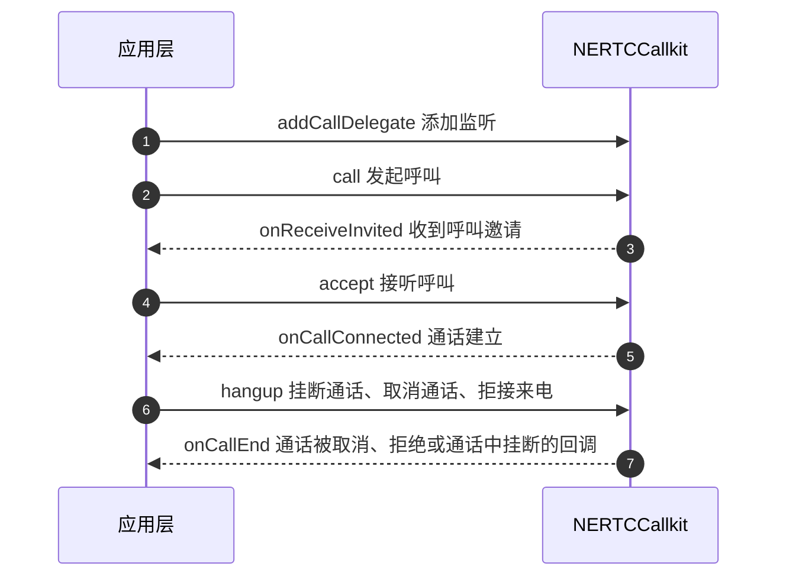

<!--- keywords: 集成呼叫组件,集成 NERtcCallKit,点对点呼叫,1 对 1 呼叫--->

本文介绍如何通过集成呼叫组件（NERTCCallkit）基础包（不含 UI），实现单聊（1 对 1）呼叫相关业务逻辑。根据业务需求，您需要自行实现相关 UI 界面。本文介绍呼叫组件的集成和实现方法。

::: note note
推荐使用含 UI 集成呼叫组件，请参考 [实现 1 对 1 呼叫（含 UI）](https://doc.yunxin.163.com/nertccallkit/guide/jcyNDE3MDM?platform=android)。
:::

## 注意事项

- 呼叫组件（NERTCCallkit）基于网易云信 NIM SDK 和 NERTC SDK 实现通话呼叫，呼叫组件中已集成 NIM SDK，NERTC SDK。
- 针对呼叫组件中的回调信息，开发者要做好相应回调数据的上报及存储，以便于后期上线之后排查问题。

## 基本概念

- **account_id**：account_id 是 IM 账号 ID，用于登录 IM。[注册 IM 账号时](https://doc.yunxin.163.com/messaging2/server-apis/TQyNjgyMzc?platform=server)，IM 服务器会返回对应的账号 ID（account_id）和密钥（Token），应用客户端需要负责保存 account_id 和 IM Token 的映射关系。
- **Token**：呼叫组件中涉及的 Token 包括 IM Token，用于登录 IM 时进行 IM 账号鉴权。应用服务器调用 IM 服务器的 [注册账号 API](https://doc.yunxin.163.com/messaging2/server-apis/TQyNjgyMzc?platform=server)，获取的 IM Token。

## 开发环境

| 环境要求 | 说明 |
| :---- | :---- |
| Android Studio 版本 | Android Studio 5.0 及以上版本。<note type="note">Android Studio 版本编号系统的变更请参考 [Android Studio 版本说明](https://developer.android.google.cn/studio/releases/index.html)。</note> |
| Android API 版本 | Level 为 21 及以上版本。 |
| Android SDK 版本 | Android SDK 31、Android SDK Platform-Tools 31.x.x 及以上版本。 |
| Gradle 及所需的依赖库 | 在 [Gradle Services](https://services.gradle.org/distributions/) 页面下载对应版本的 Gradle 及所需的依赖库。<ul> <li>Gradle 版本：7.4.1<li>Android Gradle 插件版本: 7.1.3<br>关于 Android Gradle 插件、Gradle、SDK Tool 之间的版本依赖关系，请参考 [Android Gradle 插件版本说明](https://developer.android.com/studio/releases/gradle-plugin)。 |
| [kotlin](https://blog.jetbrains.com/kotlin/category/releases/) | 1.6.21 及以上版本。 |
| CPU 架构 | ARM 64、ARMV7。 |
| IDE | Android Studio。 |
| 其他 | 依赖 Androidx，不支持 support 库。<br>Android 系统 5.0 及以上版本的真机。<note type="note">由于模拟器缺少摄像头及麦克风能力，因此工程需要在真机运行。</note> |

## 准备工作

根据本文操作前，请确保您已经完成了以下设置：

- 在 [网易云信控制台](https://app.yunxin.163.com/global/home) [创建应用](https://doc.yunxin.163.com/console/concept/TIzMDE4NTA?platform=console)，并获取了对应的 App Key。
- [开通](https://doc.yunxin.163.com/console/concept/zc3NDYzNzc?platform=console) IM 即时通讯、音视频通话 2.0、信令产品以及话单功能。

## 集成呼叫组件

呼叫组件（NERTCCallkit）基于网易云信 NIM SDK 和 NERTC SDK 实现通话呼叫，呼叫组件中已集成 NERTC SDK。您只需集成 NERTCCallkit 即可。

1. 在项目根目录下的 **build.gradle** 文件中，配置 `repositories`（使用 maven）。示例代码如下：

    ```Groovy
    allprojects {
        repositories {
            //...
            mavenCentral()
            //...
        }
    }
    ```

2. 在 **app** 目录下的 **build.gradle** 文件中，配置支持的 SO 库架构。示例代码如下：

    ```Groovy
    android {
    defaultConfig {
        ndk {
            //设置支持的 SO 库架构
            abiFilters "armeabi-v7a", "x86","arm64-v8a","x86_64"
            }
    }
    }
    ```

3. 根据开发者项目的需求，添加对应 IM 相关的依赖。

    ::: note notice
    **SDK 版本限制**：

    呼叫组件与 NIM SDK、NERTC SDK 之间存在映射关系，使用呼叫组件时，必须使用指定版本的 NIM SDK 和 NERTC SDK。当前最新版本 V3.3.0 适配 NIM SDK V10.6.0 和 NERTC SDK V5.6.50，其他版本的适配关系请参考 [更新日志](https://doc.yunxin.163.com/nertccallkit/concept/DMzOTI3NTA?platform=client)。

    ```Groovy
    dependencies {
        compile fileTree(dir: 'libs', include: '*.jar')
        // 添加依赖。

        // 基础功能 (必需)
        implementation "com.netease.nimlib:basesdk:${LATEST_VERSION}"

        // 聊天室需要
        implementation "com.netease.nimlib:chatroom:${LATEST_VERSION}"

        // 通过网易云信来集成小米等厂商推送需要
        implementation "com.netease.nimlib:push:${LATEST_VERSION}"

        // 超大群需要
        implementation "com.netease.nimlib:superteam:${LATEST_VERSION}"

        // 全文检索插件
        implementation "com.netease.nimlib:lucene:${LATEST_VERSION}"
    }
    ```

4. 在主工程 `build.gradle` 文件中添加如下代码，引入呼叫组件。

    ```Groovy
    // 若出现 More than one file was found with OS independent path 'lib/arm64-v8a/libc++_shared.so'.
    // 可以在主 module 的 build.gradle 文件中 android 闭包内追加如下 packageOptions 配置
    android{
        //......
        packagingOptions {
        pickFirst 'lib/arm64-v8a/libc++_shared.so'
        pickFirst 'lib/armeabi-v7a/libc++_shared.so'
        }
    }
    // 引入呼叫组件安装包，导入以下其中一个
    dependencies {

        implementation 'com.netease.yunxin.kit.call:call:3.3.0'     // 基础组件包，不含 UI 集成时请导入这个包

    }
    ```

5. （可选）去除呼叫组件依赖的 SDK。

    ::: note note
    如果因业务需求或其他原因无法使用指定版本 SDK，您可以参考如下步骤去除呼叫组件依赖的 IM 和 RTC 的 SDK。
    :::

    ```Groovy
    implementation('com.netease.yunxin.kit.call:call:3.3.0') {
            exclude group: 'com.netease.nimlib'// 去除组件依赖的 IM sdk
            exclude group: 'com.netease.yunxin', module: 'nertc-base' // 去除组件依赖的 NERTC sdk
    }
    ```

6. 添加权限。

    根据实际应用需求，在 `AndroidManifest.xml` 中添加以下配置，并请将 `com.netease.nim.demo` 替换为自己的包名。

    ::: details 具体示例代码
    ```XML
    <?xml version="1.0" encoding="utf-8"?>
    <manifest xmlns:android="http://schemas.android.com/apk/res/android"
            package="com.netease.nim.demo">

        <!-- 权限声明 -->
        <!-- 访问网络状态-->
        <uses-permission android:name="android.permission.INTERNET" />
        <uses-permission android:name="android.permission.ACCESS_NETWORK_STATE" />
        <uses-permission android:name="android.permission.ACCESS_WIFI_STATE" />

        <uses-permission android:name="android.permission.CHANGE_WIFI_STATE"/>

        <!-- 外置存储存取权限 -->
        <uses-permission android:name="android.permission.READ_EXTERNAL_STORAGE"/>
        <uses-permission android:name="android.permission.WRITE_EXTERNAL_STORAGE"/>

        <!-- 多媒体相关 -->
        <uses-permission android:name="android.permission.CAMERA"/>
        <uses-permission android:name="android.permission.RECORD_AUDIO"/>
        <!-- **Android11：V8.6.1 及之后的版本不需要。其他**：V4.4.0 及之后的版本不需要。-->
        <uses-permission android:name="android.permission.READ_PHONE_STATE"/>

        <!-- 控制呼吸灯，振动器等，用于新消息提醒 -->
        <uses-permission android:name="android.permission.FLASHLIGHT" />
        <uses-permission android:name="android.permission.VIBRATE" />

        <!-- 8.0+系统需要-->
        <uses-permission android:name="android.permission.FOREGROUND_SERVICE" />

        <!-- 下面的 uses-permission 一起加入到您的 AndroidManifest 文件中。-->
        <permission
            android:name="${applicationId}.permission.RECEIVE_MSG"
            android:protectionLevel="signature"/>
        <uses-permission android:name="${applicationId}.permission.RECEIVE_MSG"/>

        <application
            ...>
            <!-- App Key, 可以在这里设置，也可以在 SDKOptions 中提供。
                如果 SDKOptions 中提供了，则取 SDKOptions 中的值。-->
            <meta-data
                android:name="com.netease.nim.appKey"
                android:value="key_of_your_app" />

            <!-- 网易云信后台服务，请使用独立进程。-->
            <service
                android:name="com.netease.nimlib.service.NimService"
                android:process=":core"/>
            <!-- 网易云信后台服务，使用 V10 接口需要添加以下代码。-->
            <service
                android:name="com.netease.nimlib.service.NimServiceV2" />

            <!-- 网易云信后台辅助服务 -->
            <service
                android:name="com.netease.nimlib.job.NIMJobService"
                android:exported="false"
                android:permission="android.permission.BIND_JOB_SERVICE"
                android:process=":core"/>

            <!-- 网易云信监视系统启动和网络变化的广播接收器，保持和 NimService 同一进程 -->
            <receiver android:name="com.netease.nimlib.service.NimReceiver"
                android:process=":core"
                android:exported="false">
                <intent-filter>
                    <action android:name="android.net.conn.CONNECTIVITY_CHANGE"/>
                </intent-filter>
            </receiver>

            <!-- 网易云信进程间通信 Receiver -->
            <receiver android:name="com.netease.nimlib.service.ResponseReceiver"/>

            <!-- 网易云信进程间通信 service -->
            <service android:name="com.netease.nimlib.service.ResponseService"/>

            <!-- 网易云信进程间通信 provider -->
            <provider
                android:name="com.netease.nimlib.ipc.NIMContentProvider"
                android:authorities="${applicationId}.ipc.provider"
                android:exported="false"
                android:process=":core" />
            <!-- 网易云信内部使用的进程间通信 provider -->
            <!-- SDK 启动时会强制检测该组件的声明是否配置正确，如果检测到该声明不正确，SDK 会主动抛出异常引发崩溃 -->
            <provider
                android:name="com.netease.nimlib.ipc.cp.provider.PreferenceContentProvider"
                android:authorities="${applicationId}.ipc.provider.preference"
                android:exported="false" />

            <!-- 网易云信内部使用的进程间通信 provider -->
            <!-- SDK 启动时会强制检测该组件的声明是否配置正确，如果检测到该声明不正确，SDK 会主动抛出异常引发崩溃 -->
            <provider
                android:name="com.netease.nimlib.ipc.cp.provider.PreferenceContentProvider"
                android:authorities="com.netease.nim.demo.ipc.provider.preference"
                android:exported="false" />
        </application>
    </manifest>
    ```
    :::

7. 配置防代码混淆。

    代码混淆是指使用简短无意义的名称重命名类、方法、属性等，增加逆向工程的难度，保障 Android 程序源码的安全性。为了避免因重命名类，导致调用呼叫组件异常，您需要配置防代码混淆。

    请在 `proguard-rules.pro` 配置文件中加入以下代码防止混淆：

    ```
    # NIM SDK 的类，如果集成 IM 时已经添加，请忽略
    -dontwarn com.netease.nim.**
    -keep class com.netease.nim.** {*;}

    -dontwarn com.netease.nimlib.**
    -keep class com.netease.nimlib.** {*;}

    -dontwarn com.netease.share.**
    -keep class com.netease.share.** {*;}

    -dontwarn com.netease.mobsec.**
    -keep class com.netease.mobsec.** {*;}

    # NERTC SDK 的类
    -keep class com.netease.lava.** {*;}
    -keep class com.netease.yunxin.** {*;}

    # 呼叫组件的类
    -dontwarn com.netease.yunxin.kit.**
    -keep class com.netease.yunxin.kit.** {*;}
    -keep public class * extends com.netease.yunxin.kit.corekit.XKitInitOptions
    -keep class * implements com.netease.yunxin.kit.corekit.XKitService {*;}
    ```

::: note notice
如果您已经集成了 NIM SDK 和 NERTC SDK，或因业务需求等原因无法使用指定版本 SDK，请联系网易云信技术支持确认是否能替换 SDK 版本，并参考上述步骤 5 去除呼叫组件依赖的版本。
:::

## 初始化呼叫组件

您可以在应用代码的任意位置进行初始化。

1. 调用 [`NIMClient#initV2`](https://doc.yunxin.163.com/messaging2/references/android/doxygen/Latest/zh/classcom_1_1netease_1_1nimlib_1_1sdk_1_1_n_i_m_client.html#aa8e0e524f223d29e8f2499557a2ae2e5) 方法进行 IM 的初始化。

    SDK 的配置信息请参考 [`SDKOptions`](https://doc.yunxin.163.com/messaging2/references/android/doxygen/Latest/zh/classcom_1_1netease_1_1nimlib_1_1sdk_1_1_s_d_k_options.html)。

    示例代码如下：

    ```Java
    // 激活 V10 API 后，可以根据该字段选项选择是否禁用 V10 API 登录，默认 false，即使用 V10 API 登录
    // sdkOptions.disableV2Login = true;
    ...
    // 按需设置其它 SDKOptions 设置项

    NIMClient.initV2(context, sdkOptions);
    ```

    以上提供了一个简化的初始化示例，更多初始化信息请参考 [初始化 SDK](https://doc.yunxin.163.com/messaging2/guide/TY4OTgyMDk?platform=client)。

2. 调用 [`setup`](https://doc.yunxin.163.com/nertccallkit/references/android/doxygen/Latest/zh/html/classcom_1_1netease_1_1yunxin_1_1kit_1_1call_1_1p2p_1_1_n_e_call_engine.html#ad22e1f2f78cf76a2b300cf6a1e0a2348) 接口进行呼叫组件的初始化。

    App 用户在本端完成初始化后才可以正常接收其他人的的呼叫，或主动发起呼叫。若未完成初始化，组件可能会提示应用进行初始化，或被叫方 App 在被呼叫时无提示。若 App 重复调用初始化接口，受内部依赖的 RTC SDK 以及 IM SDK 限制，会出现崩溃，需要重新初始化需要先完成组件的销毁。

    呼叫组件初始化相关代码内容可以放在工程的 `MainActivity` 中执行，尽量避免在 `MainActivity#onDestroy()` 方法中做组件的释放。建议在 App 用户登出时释放，登入时进行初始化。

    ::: note note
    核心功能参数说明请参考 [初始化参数配置](https://doc.yunxin.163.com/nertccallkit/guide/DI5Nzg0OTM?platform=android)。
    :::

    `NESetupConfig` 参数说明如下表所示。

    参数 | 类型 | 是否必选 | 说明 |
    ---- | ---- | ---- | ---- |
    appKey | String | 是 | appKey，在 [网易云信控制台](https://app.yunxin.163.com/global/home)  获取。 |
    currentUserRtcUid | Long | 否 | 设置对应 RTC SDK uid 长整形，默认为 0L 时组件会自动生成。 |
    rtcConfig | NERtcOption | 否 | NERTC SDK 初始化配置。 |
    enableAutoJoinSignalChannel | Boolean | 否 | 是否允许被叫用户收到呼叫邀请后自动加入 IM 信令通道，默认 false。**注意：此功能和多端登录功能互斥。** |
    enableJoinRtcWhenCall | Boolean | 否 | 主叫呼叫时是否直接加入 RTC 房间，默认 false。 |
    initRtcMode | Integer | 否 | RTC SDK 初始化模式，默认为 `GLOBAL`。<ul><li>`GLOBAL`(1)：全局初始化 RTC 一次。<li>`IN_NEED`（2）：按需初始化，主叫在呼叫时初始化 RTC，被叫在收到呼叫时初始化 RTC，通话结束销毁 RTC。<li> `IN_NEED_DELAY_TO_ACCEPT`（3）：被叫接听时才初始化 RTC，通话结束销毁 RTC。 |
    rtcCallExtension | CallExtension | 否 | 主要用于设置分辨率，或者修改组件使用 RTC 的行为。 |

    具体初始化代码如下，可通过 `NESetupConfig.Builder` 实现参数设置。

    ```Java
    // NERTC SDK 初始化配置
    NERtcOption rtcOption = new NERtcOption();
    NESetupConfig config = new NESetupConfig.Builder(appKey)
      .rtcOption(rtcOption)
      .build();
    // 在 IM sdk 初始化并完成登录后，调用呼叫组件初始化
    NECallEngine.sharedInstance().setup(this,config);
    ```

## 登录

调用 [`login`](https://doc.yunxin.163.com/messaging2/client-apis/TQ5NTUwNzQ?platform=client#login) 方法登录 IM。

本文以实现 **静态 Token** 登录为例，动态 Token 登录以及自动登录的实现方法请参考 [登录 IM](https://doc.yunxin.163.com/messaging2/guide/Dk1MTY4MzA?platform=client)。

示例代码如下：

```Java
NIMClient.getService(V2NIMLoginService.class).login("account", "token", null, new V2NIMSuccessCallback<Void>() {
    @Override
    public void onSuccess(Void unused) {
        // TODO
    }
},
    new V2NIMFailureCallback() {
    @Override
    public void onFailure(V2NIMError error) {
        int code = error.getCode();
        String desc = error.getDesc();
        // TODO
    }
});
```

## 实现 1 对 1 呼叫（点对点呼叫）

### API 时序图



### 实现方法

1. 添加呼叫监听。

    在初始化呼叫组件后，调用 [`addCallDelegate`](https://doc.yunxin.163.com/nertccallkit/references/android/doxygen/Latest/zh/html/classcom_1_1netease_1_1yunxin_1_1kit_1_1call_1_1p2p_1_1_n_e_call_engine.html#a030ee77edc8b533502ce89f9f6430ac7) 方法，添加回调监听。

    ```Java
    // 监听呼叫邀请，此处可在全局处设置，避免被意外释放导致来电丢失
    NECallEngine.sharedInstance().addCallDelegate(new NECallEngineDelegateAbs() {
      @Override
      public void onReceiveInvited(NEInviteInfo info) {
        // 收到来电后可进行展示 notification，或者将 info 传入被叫页面并调起被叫页面。
      }
    });
    ```

2. 主叫发起呼叫。

    进入自己的呼叫页面，调用 `addCallDelegate` 方法添加通话中监听，页面销毁时调用 `removeCallDelegate` 避免内存泄漏，并调用 [`call`](https://doc.yunxin.163.com/nertccallkit/references/android/doxygen/Latest/zh/html/classcom_1_1netease_1_1yunxin_1_1kit_1_1call_1_1p2p_1_1_n_e_call_engine.html#a5a6e58fb772f1621cd12caecb200b22e) 接口发起呼叫。

    `NECallParam` 相关参数说明如下表所示。

    参数 | 类型 | 是否必选 | 示例 | 说明 |
    ---- | ---- | ---- | ---- | ---- |
    accId | String | 是 | "12345" | 被叫用户的 IM 账号。[注册 IM 账号](https://doc.yunxin.163.com/messaging2/server-apis/TQyNjgyMzc?platform=server)，IM 服务器会返回对应的账号和 Token。 |
    callType | ChannelType | 是 | NECallType.VIDEO | 呼叫类型。包括：<ul><li>NECallType.AUDIO: 音频 <li>NECallType.VIDEO：视频 |
    extraInfo | String | 否 | - | 扩展信息，透传到到被叫 onReceiveInvited。 |
    globalExtraCopy | String | 否 | - | 自定义的呼叫全局抄送信息，用户服务端接收抄送时设置自己的业务标识。 |
    rtcChannelName | String | 否 | - | 自定义 channelName，不传会默认生成。 |
    pushConfig | NECallPushConfig | 否 | - | 用户推送自定义内容，为空时使用内部默认推送配置。 |

    `NECallPushConfig` 相关参数说明如下表所示。

    参数 | 类型 | 是否必选 | 说明 |
    ---- | ---- | ---- | ---- |
    needPush | String | 否 | 是否需要推送，默认 true。 |
    pushTitle | ChannelType | 是 | 推送标题。 |
    pushContent | String | 是 | 推送内容。 |
    pushPayload | String | 否 | 推送 payload 内容，自行添加键值对。 |

    示例代码如下：

    ```Java
    // 构建视频呼叫参数
    NECallParam param = new NECallParam.Builder("calledUserAccId")
      .callType(NECallType.VIDEO)
      .build();
    NEResultObserver<CommonResult<NECallInfo>> observer = new NEResultObserver<CommonResult<NECallInfo>>() {
      @Override
      public void onResult(CommonResult<NECallInfo> result) {
        // 呼叫成功
        if (result.isSuccessful()) {
          // 返回通话详情
          NECallInfo callInfo = result.data;
        } else {
          // 呼叫失败，错误码
          int code = result.code;
          // 呼叫失败，错误信息
          String message = result.msg;
        }
      }
    };
    // 发起呼叫，可在此时做呼叫提示音
    NECallEngine.sharedInstance().call(param, observer);
    ```

3. 被叫收到呼叫邀请。

    当收到呼叫邀请时，被叫会收到 [`onReceiveInvited`](https://doc.yunxin.163.com/nertccallkit/references/android/doxygen/Latest/zh/html/interfacecom_1_1netease_1_1yunxin_1_1kit_1_1call_1_1p2p_1_1model_1_1_n_e_call_engine_delegate.html#a5a7bb5be3fc4f1a412ca7489f1dedf20) 回调，并在回调中告知主叫的相关信息，包括主叫的账号 ID、呼叫类型、信令通道的 ID、自定义信息。

    详细的回调参数 `NEInviteInfo` 如下：

    参数 | 类型 | 说明 |
    ---- | ---- | ---- |
    callerAccId | String | 主叫用户的 IM 账号 ID。[注册 IM 账号](https://doc.yunxin.163.com/messaging2/server-apis/TQyNjgyMzc?platform=server)，IM 服务器会返回对应的账号和 Token。 |
    callType | String | 呼叫类型。包括：<ul><li>NECallType.AUDIO: 音频 <li>NECallType.VIDEO：视频 |
    extraInfo | Integer | 扩展信息，透传到到被叫 onReceiveInvited。 |
    channelId | String | IM 信令通道 ID。 |

    被叫用户在收到邀请信息时可根据呼叫类型（VIDEO/AUDIO）来调用不同的方法直接启动被叫页面的 Activity。

    若被叫方系统在 **Android Q** 及以上时，系统限制不允许后台弹出页面，此时会弹出对应的 Notification，被叫方可通过单击 Notification 跳转至对应的被叫页面。若用户通过 launcher 或其他方式唤起 app 时，通话仍有效则同样会展示被叫页面，进入被叫页面后同样可以调用 `addCallDelegate` 方法用于监听通话中相关回调，页面销毁时调用 `removeCallDelegate` 避免内存泄漏。

4. 被叫接听。

    被叫调用 [NECallEngine#accept](https://doc.yunxin.163.com/nertccallkit/references/android/doxygen/Latest/zh/html/classcom_1_1netease_1_1yunxin_1_1kit_1_1call_1_1p2p_1_1_n_e_call_engine.html#ae8d4edb9ada875cdcbaea706df1e5250) 接口，接听当前的呼叫邀请，此时会触发 `onUserEnter` 回调，对方加入 RTC 成功，认为此时通话建立成功。

    当被叫用户单击呼叫页面的接听按钮时，若此时通话仍在呼叫中，则可接通此次通话并加入对应的音视频房间内，和主叫方进行音视频通话。

    ```Java
    NEResultObserver<CommonResult<NECallInfo>> observer = new NEResultObserver<CommonResult<NECallInfo>>() {
      @Override
      public void onResult(CommonResult<NECallInfo> result) {
        // 接听成功
        if (result.isSuccessful()) {
          // 返回通话详情
          NECallInfo callInfo = result.data;
        } else {
          // 接听失败，可做被叫页面销毁等动作，错误码，错误信息等
          int code = result.code;
          String message = result.msg;
        }
      }
    };
    // 执行通话接听动作
    NECallEngine.sharedInstance().accept(observer);
    ```

5. 通话挂断。

    主叫取消/被叫拒绝/通话中挂断均可调用 [`hangup`](https://doc.yunxin.163.com/nertccallkit/references/android/doxygen/Latest/zh/html/classcom_1_1netease_1_1yunxin_1_1kit_1_1call_1_1p2p_1_1_n_e_call_engine.html#a8c371fc832b4f9d55587086b4ca8f7e1) 接口实现通话终止，此时另外一端用户会收到 `onCallEnd` 回调，收到详细的终止信息。

    `NECallEndInfo` 详细参数如下表。

    参数 | 类型 | 说明 |
    ---- | ---- | ---- |
    reasonCode | Integer | 通话终止的错误码，具体请参考 [呼叫结束错误码](#呼叫结束错误码)。 |
    message | String | 通话终止原因。 |
    extraString | String | 挂断时传入的扩展信息。 |

    挂断参数 `NEHangupParam`，详细参数如下表。

    参数 | 类型 | 是否可选 | 说明 |
    ---- | ---- | ---- | ---- |
    channelId | String | 否 | 主叫通过呼叫回调结果获取 channelId 的值，被叫通过 onInvited 回调获取 channelId 的值。<br>若填入 null 则直接挂断当前通话，若填入特定值，则内部校验当前通话和传入的 channelId 是否为同一通话，若不同则挂断失败，否则挂断成功 |
    extraString | String | 否 | 挂断时传入的扩展信息，另外一端用户在 `onCallEnd` 回调的 `NECallEndInfo#extraString` 中可获取到 |

    ```Java
    // 构建挂断参数
    NEHangupParam param = new NEHangupParam("channelId"，"extraString");
    NEResultObserver<CommonResult<Void>> observer = new NEResultObserver<CommonResult<Void>>() {
      @Override
      public void onResult(CommonResult<Void> result) {
        if (result.isSuccessful()) {
          // 挂断成功
        } else {
          // 挂断失败
        }
      }
    };
    // 执行挂断动作
    NECallEngine.sharedInstance().hangup(param, observer);
    ```

6. 忙线。

    当被叫用户不在 `STATE_IDLE` 状态下接收到其他主叫用户的呼叫邀请时，被叫方内部会自动执行 `NECallEngine.sharedInstance().hangup` 动作，主叫方接收到对方的 `reject` 信令消息后会回调 `NECallEngineDelegate.onCallEnd`，其中错误码为 `NEHangupReasonCode.BUSY`，用于 UI 展示，主叫方本地发送忙线话单消息。

## 进阶功能

### 多端登录

网易云信 IM SDK 支持多端或单端登录，若此时正在通过呼叫组件进行音视频通话时，其他端登录相同账号：

1. IM 关闭多端登录：此时由于关闭多端登录，导致信令通道同时被踢出，无法通过信令完成消息通知。此时会直接做离开音视频房间操作，对端用户感知到本端离开动作后，会做挂断挂断操作。
2. IM 开启多端登录：其他端的用户登录不会影响当前通过组件发起的音视频通话。但若多端同时在线时，收到呼叫邀请时会同时展示被邀请页面，如果其中一端接听或拒绝，则其他端会收到相应错误回调。错误码为 `2001` 或 `2002`。

### 呼叫/被叫超时

主叫方发起呼叫被叫方时，若主叫方不取消，被叫方既不接听也不挂断，此时会触发超时限制。触发超时限制后主叫方和被叫方都会触发 `onCallEnd`，其中 `NECallEndInfo` 中错误码为 `NEHangupReasonCode#TIME_OUT` 回调，同时主叫方会做取消动作，被叫方会做挂断操作。用户可通过如下接口实现更改超时时间。发生呼叫或收到呼叫邀请前对本次通话生效，否则对下次通话生效。

```Java
NECallEngine.sharedInstance().setTimeout(long time);// 单位为毫秒
```

### 视频通话设置本地预览与订阅远端画面

用户发起呼叫后可以调用如下接口设置本地预览画面：

```Java
NERtcVideoView videoView;// 用于展示本端画面的布局 UI
NECallEngine.sharedInstance().setupLocalView(videoView);
```

调用如下接口设置远端画面，此方法可在 `onCallConnected` 回调中调用。

```Java
NERtcVideoView videoView;// 用于展示远端画面的布局 UI
NECallEngine.sharedInstance().setupRemoteView(videoView);
```

### 设置通话分辨率及相关参数

通过在初始化设置中 [`rtcCallExtension`](https://doc.yunxin.163.com/nertccallkit/references/android/doxygen/Latest/zh/html/classcom_1_1netease_1_1yunxin_1_1kit_1_1call_1_1p2p_1_1model_1_1_n_e_setup_config.html#ad4c390e526af5817396c5b00e253eb4c) 的参数。

```Java
NESetupConfig config = new NESetupConfig.Builder(appKey)
  .rtcCallExtension(new NERtcCallExtension(){
    @Override
    protected void configAudioProfileBeforeJoin() {
      // 音频设置 standard + speech
      NERtcEx.getInstance().setAudioProfile(NERtcConstants.AudioProfile.STANDARD,
                                            NERtcConstants.AudioScenario.SPEECH);
    }
    @Override
    protected void configVideoConfigBeforeJoin(){
      // 设置一个默认的 videoConfig
      NERtcVideoConfig videoConfig = new NERtcVideoConfig();
      // 帧率：15
      videoConfig.frameRate = NERtcEncodeConfig.NERtcVideoFrameRate.FRAME_RATE_FPS_15;
      // 用户修改分辨率不要使用 profile，应该使用 width/height 修改，两种方式都存在时，profile 方式失效。
      //分辨率：360*640（注意此处需要设置宽大于高不用考虑具体角度旋转)
      videoConfig.width = 640;
      videoConfig.height = 360;
      NERtcEx.getInstance().setLocalVideoConfig(videoConfig);
    }
    @Override
    protected void configChannelProfileBeforeJoin(){
      // 设置 channel profile
      NERtcEx.getInstance().setChannelProfile(NERtcConstants.RTCChannelProfile.COMMUNICATION);
    }
  })
  .build();
// 在 IM sdk 初始化并完成登录后，调用呼叫组件初始化
NECallEngine.sharedInstance().setup(this,config);
```

## 呼叫结束错误码

`NEHangupReasonCode` 列举通话终止错误码。

错误信息 | 错误码 | 说明 |
---- | ---- | ---- |
`NORMAL` | 0 | 通话挂断 |
`TOKEN_ERROR` | 1 | RTC Token 错误。 |
`TIME_OUT` | 2 | 通话超时。 |
`BUSY` | 3 | 被叫用户占线。 |
`RTC_INIT_ERROR` | 4 | RTC 初始化失败。
`JOIN_RTC_ERROR` | 5 | 加入 RTC channel 失败。
`CANCEL_ERROR_PARAM` | 6 | 取消参数错误。
`CALL_FAILED` | 7 | 呼叫失败。
`KICKED` | 8 | 用户被踢出。
`UID_EMPTY` | 9 | accId 对应的 RTC uid 为空。
`SELF_RTC_DISCONNECTED` | 10 | 呼叫的用户为本端 RTC 用户。
`CALLER_CANCEL` | 11 | 主动取消呼叫。
`CALLEE_CANCELED` | 12 | 呼叫被取消。
`CALLEE_REJECT` | 13 | 主动拒绝呼叫。
`CALLER_REJECTED` | 14 | 呼叫被拒绝。
`HANG_UP` | 15 | 通话中主动挂断通话。
`BE_HUNG_UP` | 16 | 通话中被挂断。
`OTHER_REJECTED` | 17 | 多端登录下被其他端拒绝。
`OTHER_ACCEPTED` | 18 | 多端登录下被其他端接听。
`USER_RTC_DISCONNECTED` | 19 | 本端用户 RTC 房间长链接断开。
`USER_RTC_LEAVE` | 20 | 对端用户离开 RTC 房间。
`ACCEPT_FAIL` | 21 | 接听失败。