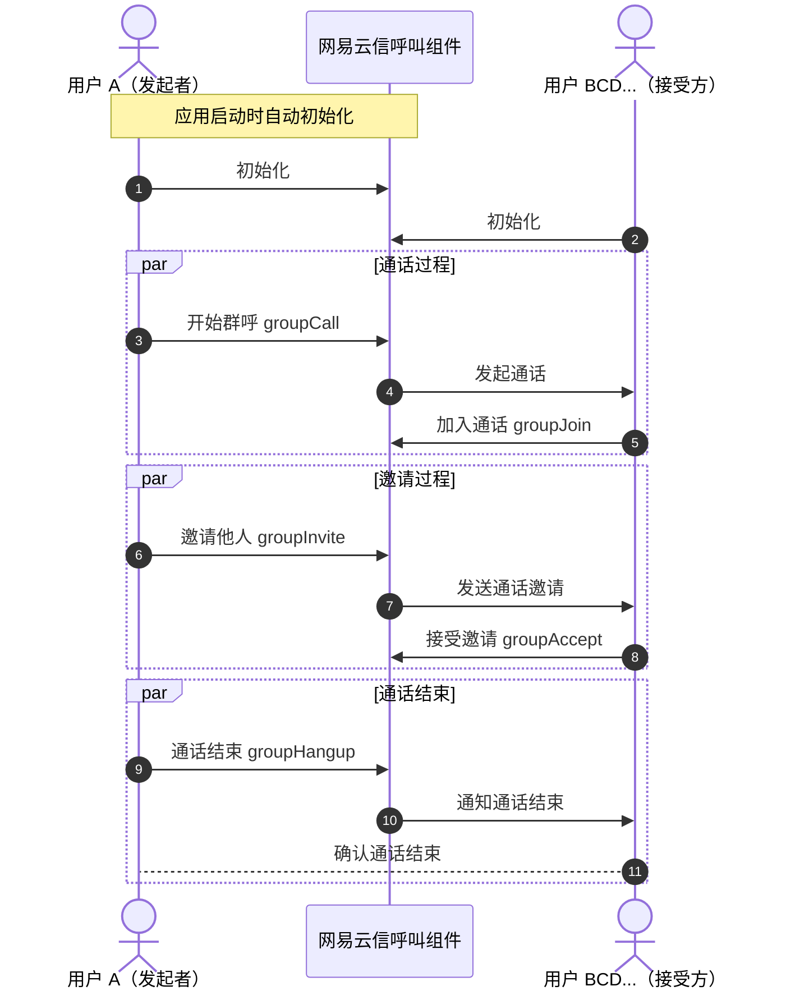

本文介绍了如何通过网易云信呼叫组件（CallKit）提供的 API 进行群组通话功能开发的详细步骤和代码示例。

::: note note
群组通话功能目前在 Beta 测试阶段，若需要使用，请联系您的网易云信商务经理开通。
:::

## 适用场景

群组通话功能是现代通信应用的核心功能之一，它允许多个用户同时进行实时的视频和音频交流。无论是企业会议、在线教育、社交互动还是远程医疗咨询，这一功能都能提供高效的沟通手段，增强团队协作和信息共享。

- **在线教育**：教师和学生可以通过多人视频通话进行实时互动，共享屏幕和文档，提升在线学习体验。
- **企业会议**：团队成员无论身处何地，都能通过视频会议进行有效的远程协作和决策讨论。
- **社交互动**：朋友和家人可以通过群视频通话保持联系，共享生活瞬间。
- **远程医疗咨询**：医生和患者可以进行远程视频咨询，进行初步诊断和健康建议。
- **紧急服务**：紧急服务人员可以与现场人员进行实时视频通话，快速响应紧急情况。

## 前提条件

根据本文操作前，请确保您已经完成了以下设置：

- 在 [网易云信控制台](https://app.yunxin.163.com/global/home) 上创建至少一个应用。详细步骤请参考 [创建应用并获取 AppKey](https://doc.yunxin.163.com/console/concept/TIzMDE4NTA?platform=console)。
- 集成呼叫组件到示例项目。详细步骤请参考 [实现 1 对 1 呼叫（不含 UI 集成 V3）](https://doc.yunxin.163.com/nertccallkit/guide/zEzMTU0NTI?platform=android)。

## 调用时序

以下流程图描述了一个群组通话的基本流程，包括初始化、通话过程、邀请过程和通话结束。



## 初始化

用户登录成功之后，您需要调用 [`NEGroupCall.instance().init(GroupConfigParam)`](https://doc.yunxin.163.com/nertccallkit/references/android/doxygen/Latest/zh/html/classcom_1_1netease_1_1yunxin_1_1kit_1_1call_1_1group_1_1_n_e_group_call.html#a51657e9a1752b501cba27df1060402f4) 接口初始化呼叫组件的群呼功能。

:::note notice
App 用户在本端完成初始化后，才能正常接收其他人的的呼叫，或主动发起呼叫。若未完成初始化，呼叫组件可能会提示应用进行初始化，或被呼叫方 App 在被呼叫时无提示。若 App 重复调用初始化接口，受内部依赖的 RTC SDK 以及 IM SDK 限制，会出现崩溃，需要重新初始化需要先完成呼叫组件的销毁。
:::

`GroupConfigParam` 参数说明如下表所示：

参数 | 类型 | 是否必选 | 说明 |
---- | ---- | ---- | ---- |
appKey | String | 是 | 应用密钥，您在 [网易云信控制台](https://app.yunxin.163.com/global/home) 创建的应用都会有相应的应用密钥。 |
currentUserAccId | String | 是 | 设置当前用户登录 IM SDK 的账号 ID（`accId`）。 |
currentUserRtcUid | Long | 否 | 设置对应的音视频 RTC SDK 用户 ID（`uid`）。默认为 0L 时，呼叫组件会自动生成对应的值。 |
initRtcMode | int | 否 | 音视频房间的加入模式，详情请参考 NEGroupConstants.[RtcSafeMode](https://doc.yunxin.163.com/nertccallkit/references/android/doxygen/Latest/zh/html/interfacecom_1_1netease_1_1yunxin_1_1kit_1_1call_1_1group_1_1_n_e_group_constants_1_1_rtc_safe_mode.html)。 |
timeout | int | 否 | 呼叫的超时时间。 |
rtcCallExtension | CallExtension | 否 | 主要用于设置分辨率，或者修改呼叫组件使用 RTC SDK 的行为。 |

以下示例代码描述了在 Android 应用中如何初始化群组通话功能，包括设置配置参数：

```Java
GroupConfigParam groupConfigParam = new GroupConfigParam.Builder().build();
NEGroupCall.instance().init(groupConfigParam);
```

## 开始群呼

使用 [`NEGroupCall.instance().groupCall(GroupCallParam)`](https://doc.yunxin.163.com/nertccallkit/references/android/doxygen/Latest/zh/html/classcom_1_1netease_1_1yunxin_1_1kit_1_1call_1_1group_1_1_n_e_group_call.html#a10d935fb0921299d2484b2fcd2f4f6b6) 接口进行群呼呼叫。

`GroupConfigParam` 参数说明如下表所示：

参数 | 类型 | 是否必选 | 说明 |
---- | ---- | ---- | ---- |
callId | String | 是 | 群组通话的唯一 ID。 |
calleeList | List<String> | 是 | 被呼叫成员列表。 |
groupId | String | 否 | 群组 ID。 |
groupType | int | 否 | 群组类型，请参考 {@link com.netease.yunxin.kit.call.group.NEGroupConstants.[GroupType](https://doc.yunxin.163.com/nertccallkit/references/android/doxygen/Latest/zh/html/interfacecom_1_1netease_1_1yunxin_1_1kit_1_1call_1_1group_1_1_n_e_group_constants_1_1_group_type.html)}。 |
inviteMode | int | 否 | 邀请模式，请参考 {@link com.netease.yunxin.kit.call.group.NEGroupConstants.[InviteMode](https://doc.yunxin.163.com/nertccallkit/references/android/doxygen/Latest/zh/html/interfacecom_1_1netease_1_1yunxin_1_1kit_1_1call_1_1group_1_1_n_e_group_constants_1_1_invite_mode.html)}。 |
joinMode | String | 否 | 加入模式，请参考 {@link com.netease.yunxin.kit.call.group.NEGroupConstants.[JoinMode](https://doc.yunxin.163.com/nertccallkit/references/android/doxygen/Latest/zh/html/interfacecom_1_1netease_1_1yunxin_1_1kit_1_1call_1_1group_1_1_n_e_group_constants_1_1_join_mode.html)}。 |
extraInfo | String | 否 | 群组呼叫扩展参数。 |

以下示例代码提供了调用 [`groupCall`](https://doc.yunxin.163.com/nertccallkit/references/android/doxygen/Latest/zh/html/classcom_1_1netease_1_1yunxin_1_1kit_1_1call_1_1group_1_1_n_e_group_call.html#a10d935fb0921299d2484b2fcd2f4f6b6) 开始一个群组通话的代码示例，包括设置通话参数和处理通话结果：

```Java
GroupCallParam callParam = new GroupCallParam.Builder().build();
NEGroupCall.instance().groupCall(callParam, new NEResultObserver());
```

## 群呼邀请

使用 [`NEGroupCall.instance().groupInvite(GroupInviteParam)`](https://doc.yunxin.163.com/nertccallkit/references/android/doxygen/Latest/zh/html/classcom_1_1netease_1_1yunxin_1_1kit_1_1call_1_1group_1_1_n_e_group_call.html#a448dad60ab85ac72650e40fd63ff8f81) 接口进行群呼邀请。

`GroupInviteParam` 参数说明如下所示：

参数 | 类型 | 是否必选 | 说明 |
---- | ---- | ---- | ---- |
callId | String | 是 | 群组通话唯一 ID。 |
memberList | List<String> | 是 | 被呼叫成员列表。 |

以下示例代码展示了如何调用 [`groupInvite`](https://doc.yunxin.163.com/nertccallkit/references/android/doxygen/Latest/zh/html/classcom_1_1netease_1_1yunxin_1_1kit_1_1call_1_1group_1_1_n_e_group_call.html#a448dad60ab85ac72650e40fd63ff8f81) 邀请其他用户加入通话：

```Java
GroupInviteParam inviteParam = new GroupInviteParam(callId, memberList);
NEGroupCall.instance().groupInvite(inviteParam, new NEResultObserver());
```

## 接听群呼邀请

使用 [`NEGroupCall.instance().groupAccept(GroupAcceptParam)`](https://doc.yunxin.163.com/nertccallkit/references/android/doxygen/Latest/zh/html/classcom_1_1netease_1_1yunxin_1_1kit_1_1call_1_1group_1_1_n_e_group_call.html#a179c14c536ae0ff12becb5a9ed82bc81) 接口进行主动加入群呼。

`GroupAcceptParam` 参数说明如下所示：

参数 | 类型 | 是否必选 | 说明 |
---- | ---- | ---- | ---- |
callId | String | 是 | 群组通话唯一 ID。 |

以下示例代码展示了如何调用 [`groupAccept`](https://doc.yunxin.163.com/nertccallkit/references/android/doxygen/Latest/zh/html/classcom_1_1netease_1_1yunxin_1_1kit_1_1call_1_1group_1_1_n_e_group_call.html#a179c14c536ae0ff12becb5a9ed82bc81) 接听群呼邀请：

```Java
GroupAcceptParam acceptParam = new GroupAcceptParam(callId);
NEGroupCall.instance().groupAccept(acceptParam, new NEResultObserver());
```

## 加入群呼

使用 [`NEGroupCall.instance().groupJoin(GroupJoinParam)`](https://doc.yunxin.163.com/nertccallkit/references/android/doxygen/Latest/zh/html/classcom_1_1netease_1_1yunxin_1_1kit_1_1call_1_1group_1_1_n_e_group_call.html#ac0adf0e3554c624227e82f0d232ac325) 接口进行主动加入群呼。

`GroupJoinParam` 参数说明如下所示：

参数 | 类型 | 是否必选 | 说明 |
---- | ---- | ---- | ---- |
callId | String | 是 | 群组通话唯一 ID。 |

以下示例代码展示了如何调用 [`groupJoin`](https://doc.yunxin.163.com/nertccallkit/references/android/doxygen/Latest/zh/html/classcom_1_1netease_1_1yunxin_1_1kit_1_1call_1_1group_1_1_n_e_group_call.html#ac0adf0e3554c624227e82f0d232ac325) 加入群组通话：

```Java
GroupJoinParam joinParam = new GroupJoinParam(callId);
NEGroupCall.instance().groupJoin(joinParam, new NEResultObserver());
```

## 挂断群呼

使用 [`NEGroupCall.instance().groupHangup(GroupHangupParam)`](https://doc.yunxin.163.com/nertccallkit/references/android/doxygen/Latest/zh/html/classcom_1_1netease_1_1yunxin_1_1kit_1_1call_1_1group_1_1_n_e_group_call.html#a040a9326a00400b134e8a415f7ffc3f9) 接口进行群呼挂断。

`GroupHangupParam` 参数说明如下所示：

参数 | 类型 | 是否必选 | 说明 |
---- | ---- | ---- | ---- |
callId | String | 是 | 群组通话唯一 ID。 |

以下示例代码展示了如何调用 [`groupHangup`](https://doc.yunxin.163.com/nertccallkit/references/android/doxygen/Latest/zh/html/classcom_1_1netease_1_1yunxin_1_1kit_1_1call_1_1group_1_1_n_e_group_call.html#a040a9326a00400b134e8a415f7ffc3f9) 挂断群呼：

```Java
GroupHangupParam hangupParam = new GroupHangupParam(callId);
NEGroupCall.instance().groupHangup(hangupParam, new NEResultObserver());
```

## 查询群呼详情

使用 [`NEGroupCall.instance().groupQueryCallInfo(GroupQueryCallInfoParam)`](https://doc.yunxin.163.com/nertccallkit/references/android/doxygen/Latest/zh/html/classcom_1_1netease_1_1yunxin_1_1kit_1_1call_1_1group_1_1_n_e_group_call.html#a48e54e565efe4f8e97520e193a76c24b) 接口进行群呼挂断。

`GroupQueryCallInfoParam` 参数说明如下所示：

参数 | 类型 | 是否必选 | 说明 |
---- | ---- | ---- | ---- |
callId | String | 是 | 群组通话唯一 ID。 |

查询的结果 `GroupQueryCallInfoResult.NEGroupCallInfo` 参数说明如下所示：

参数 | 类型 | 说明 |
---- | ---- | ---- |
callId | String | 群组通话唯一 ID。 |
callerAccId | String | 发起多人通话的用户的账号 ID。 |
memberList | List<GroupCallMember> | 多人通话所有参与人员列表。 |
groupId | String | 群组 ID。 |
groupType | int | 群类型，请参考 {@link NEGroupConstants.GroupType}。 |
inviteMode | int | 群组通话的邀请模式，请参考 {@link NEGroupConstants.InviteMode}。 |
joinMode | int | 群组通话的加入模式，请参考 {@link NEGroupConstants.JoinMode}。 |
startTimestamp | Long | 群组通话的开始时间戳。 |
timeout | int | 呼叫的超时时间。 |
rtcChannelName | String | 群组通话时加入的音视频房间名称。 |
extraInfo | String | 群组通话的额外信息。 |

以下示例代码展示了如何调用 [`groupQueryCallInfo`](https://doc.yunxin.163.com/nertccallkit/references/android/doxygen/Latest/zh/html/classcom_1_1netease_1_1yunxin_1_1kit_1_1call_1_1group_1_1_n_e_group_call.html#a48e54e565efe4f8e97520e193a76c24b) 查询群呼详情：

```Java
GroupQueryCallInfoParam param = new GroupQueryCallInfoParam(callId);
NEGroupCall.instance().groupQueryCallInfo(param, new NEResultObserver<GroupQueryCallInfoResult>());
```

## 查询群呼成员列表

使用 [`NEGroupCall.instance().groupQueryMembers(GroupQueryMembersParam)`](https://doc.yunxin.163.com/nertccallkit/references/android/doxygen/Latest/zh/html/classcom_1_1netease_1_1yunxin_1_1kit_1_1call_1_1group_1_1_n_e_group_call.html#a302d7e46fcb3f496e675729fcf12d89e) 接口进行群呼挂断。

`GroupQueryMembersParam` 参数说明如下所示：

参数 | 类型 | 是否必选 | 说明 |
---- | ---- | ---- | ---- |
callId | String | 是 | 群组通话唯一 ID。 |

查询的结果 `GroupQueryMembersResult.GroupCallMember` 参数说明如下所示：

参数 | 类型 | 说明 |
---- | ---- | ---- |
accId | String | 通话用户的账号 ID。 |
uid | Long | 通话加入音视频的用户 ID。 |
state | int | 多人通话用户的状态，请参考 {@link NEGroupConstants.UserState}。 |
action | String | 用户执行的动作。 |
reason | String | 用户执行动作原因。 |

以下示例代码展示了如何调用 [`groupQueryMembers`](https://doc.yunxin.163.com/nertccallkit/references/android/doxygen/Latest/zh/html/classcom_1_1netease_1_1yunxin_1_1kit_1_1call_1_1group_1_1_n_e_group_call.html#a302d7e46fcb3f496e675729fcf12d89e) 查询群呼成员列表：

```Java
GroupQueryMembersParam param = new GroupQueryMembersParam(callId);
NEGroupCall.instance().groupQueryMembers(param, new NEResultObserver<GroupQueryMembersResult>());
```

## 配置群组通话邀请接收监听

使用 [`NEGroupCall.instance().configGroupIncomingReceiver(NEGroupIncomingCallReceiver receiver, boolean register)`](https://doc.yunxin.163.com/nertccallkit/references/android/doxygen/Latest/zh/html/classcom_1_1netease_1_1yunxin_1_1kit_1_1call_1_1group_1_1_n_e_group_call.html#a014c56a188bff03488a133a6bdcfbebc) 接口进行监听邀请通知。

以下示例代码展示了如何调用接口监听邀请：

```Java
NEGroupCall.instance().configGroupIncomingReceiver(new NEGroupIncomingCallReceiver() {
      @Override
      public void onReceiveGroupInvitation(NEGroupCallInfo info) {
        // 收到群组通话邀请时会触发此回调
      }
    }, true);

```

## 配置群组通话通话行为观察

使用 [`NEGroupCall.instance().configGroupActionObserver(NEGroupCallActionObserver receiver, boolean register)`](https://doc.yunxin.163.com/nertccallkit/references/android/doxygen/Latest/zh/html/classcom_1_1netease_1_1yunxin_1_1kit_1_1call_1_1group_1_1_n_e_group_call.html#a89777378c18b1ea149fe5207c71dd4c6) 接口进行监听通话行为通知。

以下示例代码展示了如何调用接口监听通话行为：

```Java
NEGroupCall.instance().configGroupActionObserver(new NEGroupCallActionObserver() {
      @Override
      public void onMemberChanged(String callId, List<GroupCallMember> userList) {
        // 多人通话成员变化回调
      }

      @Override
      public void onGroupCallHangup(GroupCallHangupEvent hangupEvent) {
        // 群通话挂断回调
      }
    }, true);
```