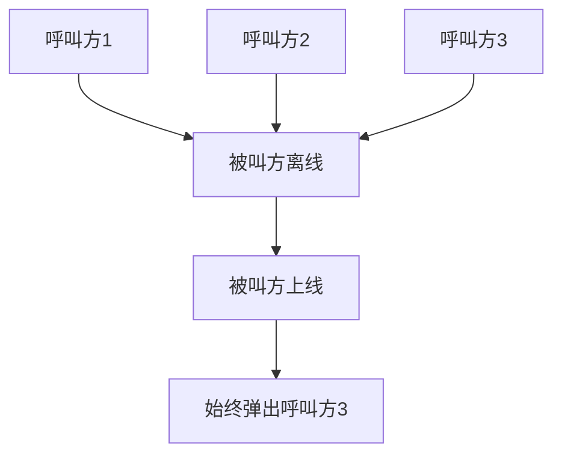
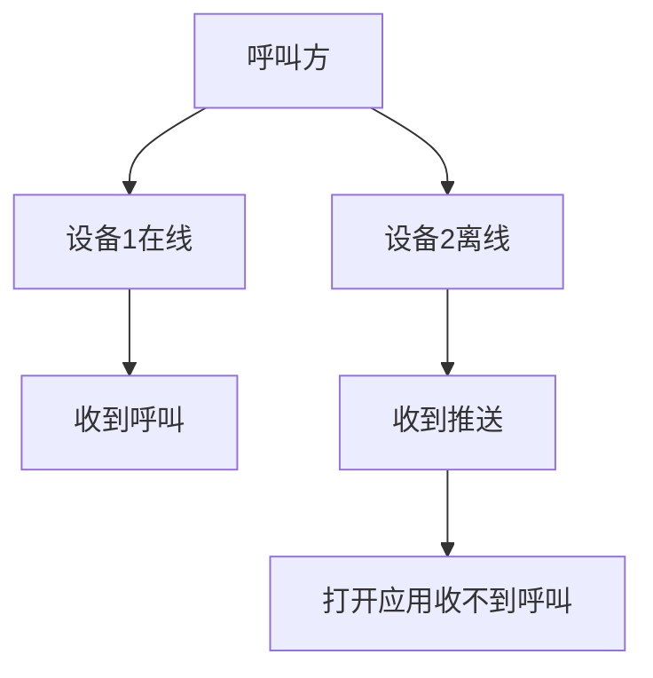

离线推送是指当用户清理掉应用进程（被冻结、主动关闭）、网络不稳定等导致客户端 SDK 无法与云信服务器保持正常连接时，使用手机厂商系统级推送，将主叫用户的呼叫邀请信息推送给被叫用户。本文介绍通过呼叫组件配置离线推送的属性，包括推送标题、推送文案等。

## 前提条件

已在 IM SDK [实现离线推送](https://doc.yunxin.163.com/messaging/docs/zc1OTI2MTM?platform=android)

## 背景信息

- 呼叫组件不提供推送功能，只支持配置推送消息，离线推送能力由 IM SDK 提供。离线推送的详细配置请参见[实现离线推送](https://doc.yunxin.163.com/messaging/docs/zc1OTI2MTM?platform=android) 和 [配置消息的推送属性](https://doc.yunxin.163.com/messaging/docs/TY4MzU5MDc?platform=android)。
- `pushConfigProvider`和 `notificationConfigFetcher` 的区别如下：
	- `pushConfigProvider` 是指在被叫的 App 进程结束时，通过系统推送将主叫用户的呼叫邀请信息推送给被叫用户。主叫用户通过该参数配置离线推送的内容。
	- `notificationConfigFetcher` 为应用在后台或应用进程存活时，控制展示的 notification，是被叫用户进行修改。

## 实现方法（V2）
呼叫组件 V2.0 及之后版本，在发起呼叫时，通过呼叫中的参数`NECallParam.pushConfig`参数，配置离线推送的属性。

示例代码如下：

```
// 离线推送配置
Map<String,Object> pushPayload = new HashMap<>();
String pushTitle = "离线推送标题";
String pushContent = "离线推送内容";
NECallPushConfig pushConfig = new NECallPushConfig(pushTitle, pushContent, pushPayload);
// 构建呼叫参数
CallParam param = new CallParam.Builder()
  .callType(NECallType.VIDEO)
  .calledAccId("calledAccId")
  // 传入离线推送配置
  .pushConfig(pushConfig)
  .build();
CallKitUI.startSingleCall(this, param);
```

## 实现方法 （V1）
呼叫组件 V1.8.2 及之前版本，通过初始化呼叫组件中的 `pushConfigProvider` 参数，配置离线推送的属性。

以下示例代码为 `pushConfigProvider` 的一个实例对象。

```java
new PushConfigProvider() {
		@Override
		public SignallingPushConfig providePushConfig(InvitedInfo info) {
			return null;
		}
}
```
其中 `SignallingPushConfig` 有两个构造函数如下，若推送需要设置 pushPayload 通过 `SignallingPushConfig#pushPayload` 字段完成设置。

```java
/**
 * @param needPush    是否需要push
 * @param pushTitle   推送标题
 * @param pushContent 推送内容
 */
public SignallingPushConfig(boolean needPush, String pushTitle, String pushContent)；

/**
 * @param needPush    是否需要push
 * @param pushTitle   推送标题
 * @param pushContent 推送内容
 * @param pushPayload 推送扩展 ，不需要的话填null
 */
public SignallingPushConfig(boolean needPush, String pushTitle, String pushContent, Map<String, Object> pushPayload）
```

## 常见问题

### 为什么打开应用弹出的总是最新的呼叫邀请？

若用户设置了离线不推送，那么当用户在离线期间收到呼叫，用户将无法感知。若用户设置了离线推送，则会收到呼叫的推送通知。

当您收到通知之后，您可以：

- 点击系统电话小窗进行接听。

	那么小窗只会显示最新一次的呼叫，点击接听也是接听最新一次呼叫。

- 不点击推送通知，通过桌面图标打开 App。
- 点击 Apns 推送通知打开 App。

	虽然都是打开 App，但是根据业务场景的不同，用户需要的实现效果不同。例如收到三个人三次呼叫，用户点击的是第二个人呼叫的通知栏通知。

	但是这里要说明的是，最终打开 App 之后，呼叫组件的逻辑是一样的，只会处理最新一次的呼叫，弹出最新一次呼叫的页面。（注意：如果正处于被叫中的状态，不会再次被叫，只存在呼叫一次取消呼叫或呼叫超时后再被呼叫。）



### 为什么收到推送打开应用后未弹出呼叫页面？

多端登录情况下，若只投递一次呼叫：

- 如果各端都是登录状态，则都能收到呼叫。
- 如果一端登录一端未登录，登录的一端收到了呼叫，其他端可以收到推送，但是再打开应用后就收不到呼叫邀请的回调了。

