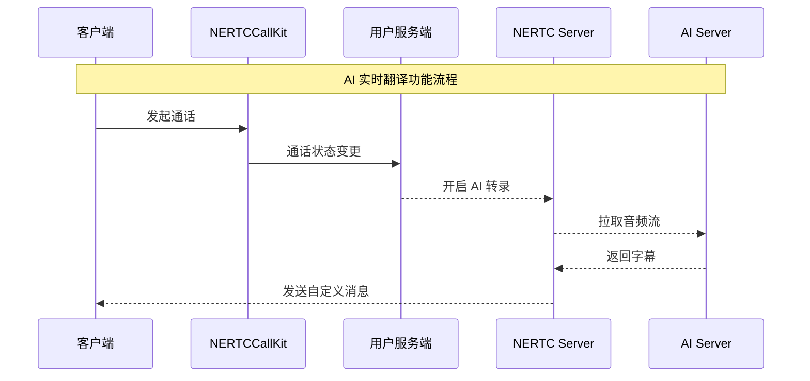

网易云信呼叫组件（NERTCCallKit）的实时翻译能力基于 AI 转录能力与翻译引擎实现。

使用 AI 实时翻译功能需要单独购买，具体购买和费用详情请参考 [AI 服务计费规则](https://doc.yunxin.163.com/nertc/server-apis/TYxNjMwNTg?platform=server)。

## 效果展示

 

## 实现原理

实现 AI 实时翻译功能的基本流程如下：



当客户端通过 NERTCCallKit 开始通话后，呼叫组件服务端的通话状态会发生变化。客户需要在自己的服务端订阅通话状态，并在通话状态变为 **通话中** 时，在服务端开启 AI 转录功能。开启 AI 转录后，AI Server 会从 NERTC Server 拉取通话房间的音频流，并通过大模型进行翻译。翻译结果会返回至 NERTC Server，然后通过自定义消息发送至客户端。客户端的 NERTCCallKit 组件会解析信息并展示实时翻译结果。

## 接入流程

### 步骤一：监听 NERTCCallKit 通话状态

```dart
NECallEngineDelegate(
  onAsrCaptionStateChanged: (asrState, code, message) {
    if (!mounted) return;
    setState(() {
      if (code == 2) {
        // 如果出错，关闭字幕
        _isCaptionEnabled = true;
      } else if (code == 3) {
        _isCaptionEnabled = false;
      }
    });
  },
  onAsrCaptionResult: (results) async {
    if (!mounted) return;

    // 先异步计算所有显示名，避免在 setState 中执行异步操作
    final List<_TranslationInfo> newInfos = [];
    for (var result in results) {
      if (result == null) continue;
      // 仅处理最终结果，避免中间结果频繁刷新
      if (!result.isFinal) continue;
      final displayName = await _resolveDisplayName(result);

      // 构建字幕信息并追加到列表（同时保存原文和翻译，具体展示由 isShowTranslation 决定）
      final info = _TranslationInfo(
        uid: result.uid,
        content: result.content,
        translatedText: result.translatedText,
        haveTranslation: result.haveTranslation,
        displayName: displayName,
      );
      newInfos.add(info);
    }

    if (!mounted || newInfos.isEmpty) return;

    setState(() {
      for (final info in newInfos) {
        _captionInfos.add(info);
        // 只保留最新的两条字幕，和 Android AISubtitle 保持一致
        if (_captionInfos.length > 2) {
          _captionInfos.removeAt(0);
        }
      }
    });
  },
);
```

### 步骤二：开启/关闭 AI 翻译


开启 AI 翻译：

```dart
final config = NEASRCaptionConfig(
  srcLanguage: 'zh', // 指定字幕的源语言，zh表示简体中文，AUTO表示中英文自动识别
);
final result = await NECallEngine.instance.startASRCaption(config);
```

关闭 AI 翻译：

```dart
NECallEngine.instance.stopASRCaption();
```