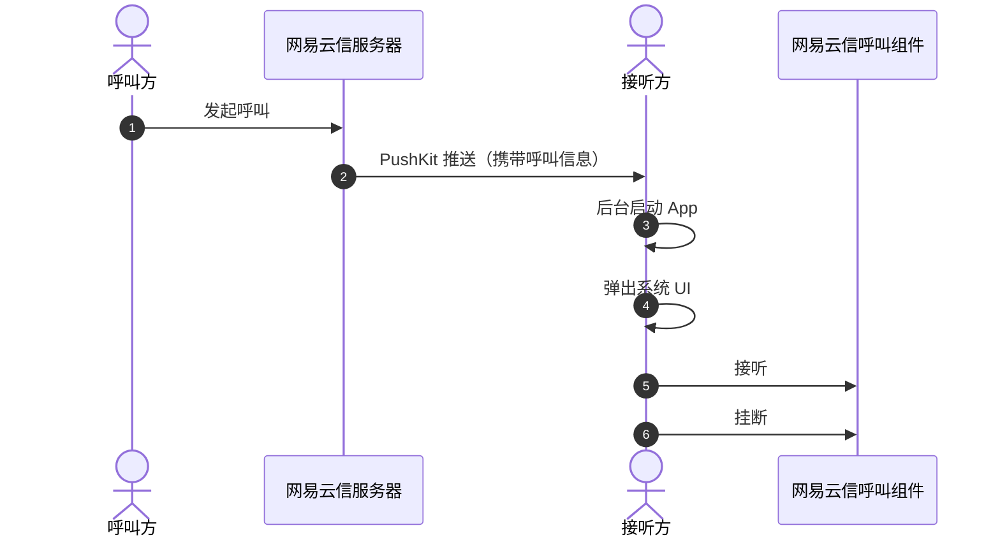

本文主要介绍如何在网易云信呼叫组件（NECallKit）中引入苹果原生 LiveCommunicationKit 库并实现系统电话的接听功能。

## 效果展示

语音通话在实现使用弹窗快捷接听功能后，语音通话也能像普通拨号电话一样接听。当好友来电，在苹果灵动岛界面就会显示好友昵称，提供接受和拒绝两个选项。在接起电话后，也能像系统电话一样切换外放、静音、挂断。没有灵动岛设计的苹果机型，则会在上方弹出卡片，同样具备这些功能。如下图所示：

<br>


## 方案介绍

网易云信呼叫组件将通过 [PushKit](https://developer.apple.com/documentation/pushkit) + [LiveCommunicationKit](https://developer.apple.com/documentation/LiveCommunicationKit) 的方案来代替实现系统电话接听功能。具体的实现原理请参考如下时序图：



## 开发环境

在开始运行工程之前，请您准备以下开发环境：

- Xcode 15.3 及以上版本。
- iOS 17.4 及以上版本的 iOS 设备。

## 前提条件

根据本文操作前，请确保您已经完成了以下设置：

- 在 [网易云信控制台](https://app.yunxin.163.com/global/home) 上创建至少一个应用。详细步骤请参考 [创建应用并获取 AppKey](https://doc.yunxin.163.com/console/concept/TIzMDE4NTA?platform=console)。

- 集成呼叫组件到示例项目。详细步骤请参考 [实现单聊呼叫（含 UI）](https://doc.yunxin.163.com/nertccallkit/guide/TI2NTc0NTA?platform=flutter) 或 [实现单聊呼叫（不含 UI）](https://doc.yunxin.163.com/nertccallkit/guide/DIxNDQ1MzE?platform=flutter)。

- 在实现系统电话接听前需要先配置 [iOS PushKit](https://doc.yunxin.163.com/messaging/guide/Tc4MjEzODA?platform=iOS)，获取到 VoIP 推送证书。

<!--内部，不对外
- 呼叫组件需要定义部分字段，接收方根据该字段解析出呼叫类型以及呼叫者的信息，然后根据信息弹出相应的 UI。因此需要提前在原 `pushPayload` 基础上新增以下数据字段：

    ```
    {
        "nertcCallkit":{
            "callType": 1 //呼叫类型 1:音频 2:视频
            "displayName": @"用户 2568"   //用户 IM 昵称
            "accId": @"897812" //用户 IM 账号 ID
            "requestId": @"761117639228" /信令请求 ID
        }
    }
    ```
-->

## 注意事项

- LiveCommunicationKit 在锁屏状态下不会全屏弹出，也不会再通讯录中留下通话记录。

- 系统电话接听功能需要在 iOS 17.4 及以上版本中使用。

    ::: note notice
    新功能上线，若存在任何疑问需要支持或帮助，您可以 [提交工单](https://app.yunxin.163.com/global/service/ticket/create) 联系网易云信技术支持工程师。
    :::

## 实现流程

### 第一步：完成工程配置

1. 确认您工程的 **Capability** 中是否添加 **Push Notification** 能力。如下图所示：

    <br>

2. 确认您工程的 **Capability** 的 **Background Modes** 中，是否开启了 **Voice over IP** 选项。

    <br>

### 第二步：完成代码配置

#### **使用含 UI 方案接入**

在登录时传入 VoIP 证书及配置 LiveCommunicationKit 功能，即可开启 LiveCommunicationKit 功能。

```
//在 certificateConfig 中指定 pkCername 参数为你的 VoIP 证书 
final certificateConfig: NECertificateConfig(
    apnsCername: 'your_apns_cername',  //  设置 APNS 证书，实现消息推送需要设置
    pkCername: 'your_pk_cername',      //  设置 VoIP 证书，实现 LiveCommunicationKit 需要设置
), 

//设置 extraConfig 中 lckConfig 参数，并指定 enableLiveCommunicationKit 为 true
final extraConfig = NEExtraConfig(
  lckConfig: NELCKConfig(
    enableLiveCommunicationKit: true, //指定打开 LiveCommunicationKit 功能，默认关闭。
    ringtoneName: 'your.mp3', //可选，如果需要自定义需要放到 iOS App main bundle 目录下。如不指定，或无法找到指定铃声文件，默认使用系统来电铃声。
  ),
);

// 登录时传入以上参数 certificateConfig 及 extraConfig
await NECallKitUI.instance.login(
  appKey: 'your_app_key',        // 替换为您的 AppKey
  userId: 'your_user_id',        // 替换为当前用户的 userID
  userSig: 'your_user_sig',      // 替换为当前用户的 userSig，云信IM token
  certificateConfig: certificateConfig, //传入上述证书配置
  extraConfig: extraConfig //传入上述LiveCommunicationKit配置 
);
```

#### **使用不含 UI 方案接入**

1. 在 IM 初始化时传入 VoIP 证书。

    ```
    //IM 初始化
    late NIMSDKOptions options;    
    if (Platform.isAndroid) {
      final directory = await getExternalStorageDirectory();
      options = NIMAndroidSDKOptions(
        appKey: appKey,
      );
    } else if (Platform.isIOS) {
      final directory = await getApplicationDocumentsDirectory();
      options = NIMIOSSDKOptions(
        appKey: "your_app_key",   // 应用的 AppKey，在网易云信控制台获取，String，必填
        apnsCername: 'your_apns_cername',  // iOS 推送证书名，String，实现消息推送需要设置
        pkCername: 'your_pk_cername',      // iOS VoIP 证书名，String， 设置 VoIP 证书，实现 LiveCommunicationKit 需要设置
      );
    }

    final result = await NimCore.instance.initialize(options);
    ```

2. 在呼叫组件初始化时，配置 LiveCommunicationKit 功能。

    ```
    // 呼叫组件初始化
    final result = await callkit.setup((NESetupConfig(
        appKey: "your_app_key", // 替换为您的 AppKey
        lckConfig: NELCKConfig(
          enableLiveCommunicationKit: true, //指定打开 LiveCommunicationKit 功能，默认关闭。
          ringtoneName: 'xxx.mp3', //可选，如果需要自定义需要放到 iOS App main bundle 目录下。如不指定，或无法找到指定铃声文件，默认使用系统来电铃声。  
        ),
    ));
    ```