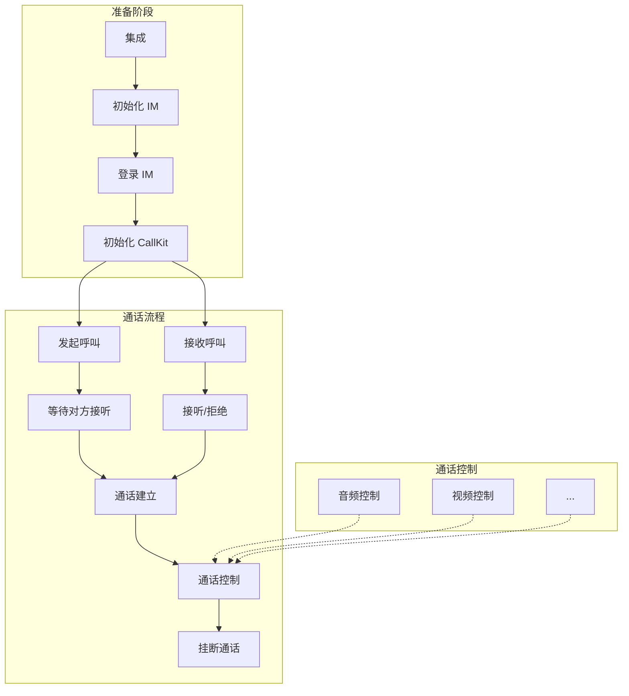

呼叫组件（NECallKit）通过 UI 组件化的方式，简化了呼叫流程，您只需要调用几行代码，就可以实现单聊（1 对 1）呼叫，即点对点呼叫，并包含呼叫的 UI 界面。本文介绍呼叫组件的集成和实现方法。

## 注意事项

- 呼叫组件（NECallKit）基于网易云信 NIM SDK 和 NERTC SDK 实现通话呼叫。
- 针对呼叫组件中的回调信息，开发者要做好相应回调数据的上报及存储，以便于后期上线之后排查问题。

## 基本概念

- `accountId`：IM 账号 ID，用于登录 IM。注册 IM 账号时，IM 服务器会返回对应的账号 ID（`account_id`）和密钥（`Token`），应用客户端需要负责保存 `account_id` 和 `IM Token` 的映射关系。
- `token`：呼叫组件中涉及的 `Token` 包括 IM Token，用于登录 IM 时进行 IM 账号鉴权。应用服务器调用 IM 服务器的 [注册账号 API](https://doc.yunxin.163.com/messaging2/server-apis/TQyNjgyMzc?platform=server)，获取的 IM Token。

## 开发环境

环境要求 | 说明 |
---- | ---- |
JDK 版本 | 1.8.0 及以上版本
Android API 版本 | API 21、Android 5.0 及以上版本
CPU 架构 | ARM64、ARMV7
IDE | Android Studio
调试设备 | 运行 Android 系统 4.3 或以上版本的移动设备
依赖 | 依赖 Androidx，不支持 support 库

## 准备工作

根据本文操作前，请确保您已经完成了以下设置：

- 在 [网易云信控制台](https://app.yunxin.163.com/global/home) [创建应用](https://doc.yunxin.163.com/console/concept/TIzMDE4NTA?platform=console)，并获取了对应的 App Key。
- 开通以下服务，若未开通，请参考 [开通服务](https://doc.yunxin.163.com/console/concept/zc3NDYzNzc?platform=console) 进行开通。

    - IM 即时通讯。当使用呼叫组件自带的话单功能时，需开通 IM。
    - 信令。用于实现点对点呼叫邀请以及音视频通话。
    - 音视频通话 2.0。用于实现实时音视频通话。
    - 如需要抄送，请提前开通消息抄送中的 **话单** 抄送服务，实现在一通通话结束后，发送事件通知消息，标记此次通话是否接通以及通话时间、类型等数据。

## 示例项目源码

网易云信提供 [示例项目源码](https://github.com/netease-kit/NECallKit/tree/main/Flutter)，您可以基于该源码进行修改适配。

## 实现流程

建立呼叫的正常流程如下：



## 集成

1. 在 `pubspec.yaml` 中添加依赖：

    ```yaml
    dependencies:
      netease_callkit: ^latest_version
      nim_core_v2: ^latest_version
    ```

2. 导入 IM 和 CallKit 包。

    ```dart
    import 'package:netease_callkit/netease_callkit.dart';
    import 'package:netease_callkit_ui/ne_callkit_ui.dart';
    import 'package:nim_core_v2/nim_core.dart';
    ```

3. 权限配置。

    - Android：在 `android/app/src/main/AndroidManifest.xml` 中添加权限：

    ```xml
    <uses-permission android:name="android.permission.INTERNET" />
    <uses-permission android:name="android.permission.RECORD_AUDIO" />
    <uses-permission android:name="android.permission.CAMERA" />
    <uses-permission android:name="android.permission.MODIFY_AUDIO_SETTINGS" />
    <uses-permission android:name="android.permission.ACCESS_NETWORK_STATE" />
    <uses-permission android:name="android.permission.WAKE_LOCK" />
    <uses-permission android:name="android.permission.FOREGROUND_SERVICE" />
    ```

    - iOS：在 `ios/Runner/Info.plist` 中添加权限描述：

    ```xml
    <key>NSCameraUsageDescription</key>
    <string>需要访问摄像头进行视频通话</string>
    <key>NSMicrophoneUsageDescription</key>
    <string>需要访问麦克风进行语音通话</string>
    ```

## 初始化 IM

在使用 CallKit 之前，必须先初始化 IM SDK。IM SDK 负责处理用户身份验证、消息传递等基础功能。

```dart
Future<void> initIMSDK(String appKey) async {
  try {
    late NIMSDKOptions options;
    
    if (Platform.isAndroid) {
      final directory = await getExternalStorageDirectory();
      options = NIMAndroidSDKOptions(
        appKey: appKey,
      );
    } else if (Platform.isIOS) {
      final directory = await getApplicationDocumentsDirectory();
      options = NIMIOSSDKOptions(
        appKey: appKey,   // 应用的 AppKey，在网易云信控制台获取，String，必填
        apnsCername: 'your_apns_cername',  // iOS 推送证书名，String，选填
        pkCername: 'your_pk_cername',      // iOS VoIP 证书名，String，选填
      );
    }
    
    final result = await NimCore.instance.initialize(options);
    
    if (result.code == 0) {
      print('IM SDK 初始化成功');
    } else {
      print('IM SDK 初始化失败: ${result.errorDetails}');
    }
  } catch (e) {
    print('IM SDK 初始化异常: $e');
  }
}
```

## 登录 IM

IM SDK 初始化成功后，需要进行用户登录才能使用 CallKit 功能。

```dart
//登录
Future<void> loginIM(String accountId, String token) async {
  try {
    final result = await NimCore.instance.loginService.login(
      accountId,
      token,
      NIMLoginOption(),
    );
    
    if (result.code == 0) {
      print('IM 登录成功');
    } else {
      print('IM 登录失败: ${result.errorDetails}');
    }
  } catch (e) {
    print('IM 登录异常: $e');
  }
}

//登出
Future<void> logoutIM() async {
  try {
    final result = await NimCore.instance.loginService.logout();
    
    if (result.code == 0) {
      print('IM 登出成功');
    } else {
      print('IM 登出失败: ${result.errorDetails}');
    }
  } catch (e) {
    print('IM 登出异常: $e');
  }
}
```

## 初始化 CallKit

IM SDK 登录成功后，需要初始化 CallKit 才能使用通话功能。

```dart
Future<void> initCallKit(String appKey) async {
  try {
    final callkit = NECallEngine.instance;
    
    // 调用 CallKit 初始化接口
    final result = await callkit.setup(NESetupConfig(
      appKey: appKey,
    ));
    
    if (result.code == 0) {
      print('CallKit 初始化成功');
    } else {
      print('CallKit 初始化失败: ${result.msg}');
    }
  } catch (e) {
    print('CallKit 初始化异常: $e');
  }
}
```

## 发起呼叫

调用 `call` 方法发起音频通话或视频通话。

```dart
// 音频通话
await callkit.call(accId, NECallType.audio);

// 视频通话
await callkit.call(accId, NECallType.video);
```

您可以参考以下示例。后者较前者可在呼叫时自行设置自定义信息作为额外信息。

- 基础呼叫

    ```dart
    Future<void> makeCall(String accId, NECallType callType) async {
      try {
        final callkit = NECallEngine.instance;
        
        final result = await callkit.call(
          accId,           // 被叫用户ID
          callType,        // 通话类型：音频/视频
        );
        
        if (result.code == 0) {
          print('呼叫发起成功');
        } else {
          print('呼叫发起失败: ${result.msg}');
        }
      } catch (e) {
        print('呼叫异常: $e');
      }
    }
    ```

-  带额外信息的呼叫

    ```dart
    Future<void> makeCallWithExtra(String accId, NECallType callType) async {
      try {
        final callkit = NECallEngine.instance;
        
        final result = await callkit.call(
          accId,
          callType,
          extraInfo: '自定义信息',           // 额外信息
          rtcChannelName: 'custom_channel', // 自定义RTC频道名
          globalExtraCopy: '全局信息',      // 全局额外信息
          pushConfig: NECallPushConfig(     // 推送配置
            pushTitle: '来电提醒',
            pushBody: '您有一个新的通话',
            pushPayload: 'custom_payload',
          ),
        );
        
        if (result.code == 0) {
          print('呼叫发起成功');
        } else {
          print('呼叫发起失败: ${result.msg}');
        }
      } catch (e) {
        print('呼叫异常: $e');
      }
    }
    ```

## 接听呼叫

1. 设置呼叫代理。

    ```dart
    class CallDelegate extends NECallEngineDelegate {
      CallDelegate({
        super.onReceiveInvited,
        super.onCallEnd,
        super.onCallConnected,
        super.onCallTypeChange,
        super.onVideoAvailable,
        super.onVideoMuted,
        super.onAudioMuted,
        super.onLocalAudioMuted,
        super.onRtcInitEnd,
        super.onRecordSend,
        super.onNERtcEngineVirtualBackgroundSourceEnabled,
      });
    }

    // 创建代理实例
    final delegate = CallDelegate(
      onReceiveInvited: (NEInviteInfo info) {
        print('收到来自 ${info.callerAccId} 的邀请');
        // 显示接听界面
        showIncomingCallUI(info);
      },
      onCallEnd: (NECallEndInfo info) {
        print('通话结束: ${info.reasonCode}');
        // 处理通话结束
        handleCallEnd(info);
      },
      onCallConnected: (NECallInfo info) {
        print('通话已连接');
        // 通话建立成功
        onCallEstablished(info);
      },
    );

    // 添加代理
    callkit.addCallDelegate(delegate);
    ```

2. 接听呼叫。

    ```dart
    Future<void> acceptCall() async {
      try {
        final callkit = NECallEngine.instance;
        
        final result = await callkit.accept();
        
        if (result.code == 0) {
          print('接听成功');
        } else {
          print('接听失败: ${result.msg}');
        }
      } catch (e) {
        print('接听异常: $e');
      }
    }
    ```

## 挂断通话

调用 `hangupCall` 方法挂断通话。

```dart
Future<void> hangupCall(String channelId) async {
  try {
    final callkit = NECallEngine.instance;
    
    final result = await callkit.hangup(channelId);
    
    if (result.code == 0) {
      print('挂断成功');
    } else {
      print('挂断失败: ${result.msg}');
    }
  } catch (e) {
    print('挂断异常: $e');
  }
}
```

## 进阶功能-通话控制

### 设置本地视图

```dart
Future<void> setupLocalView(int viewId) async {
  try {
    final callkit = NECallEngine.instance;
    
    final result = await callkit.setupLocalView(viewId);
    
    if (result.code == 0) {
      print('设置本地视图成功');
    } else {
      print('设置本地视图失败: ${result.msg}');
    }
  } catch (e) {
    print('设置本地视图异常: $e');
  }
}
```

### 设置远程视图

```dart
Future<void> setupRemoteView(int viewId) async {
  try {
    final callkit = NECallEngine.instance;
    
    final result = await callkit.setupRemoteView(viewId);
    
    if (result.code == 0) {
      print('设置远程视图成功');
    } else {
      print('设置远程视图失败: ${result.msg}');
    }
  } catch (e) {
    print('设置远程视图异常: $e');
  }
}
```

### 音频控制

```dart
// 静音/取消静音本地音频
Future<void> muteLocalAudio(bool muted) async {
  try {
    final callkit = NECallEngine.instance;
    
    final result = await callkit.muteLocalAudio(muted);
    
    if (result.code == 0) {
      print('${muted ? "静音" : "取消静音"}成功');
    } else {
      print('${muted ? "静音" : "取消静音"}失败: ${result.msg}');
    }
  } catch (e) {
    print('音频控制异常: $e');
  }
}
```

### 视频控制

```dart
// 启用/禁用本地视频
Future<void> enableLocalVideo(bool enable) async {
  try {
    final callkit = NECallEngine.instance;
    
    final result = await callkit.enableLocalVideo(enable);
    
    if (result.code == 0) {
      print('${enable ? "启用" : "禁用"}本地视频成功');
    } else {
      print('${enable ? "启用" : "禁用"}本地视频失败: ${result.msg}');
    }
  } catch (e) {
    print('视频控制异常: $e');
  }
}

// 静音/取消静音本地视频
Future<void> muteLocalVideo(bool muted) async {
  try {
    final callkit = NECallEngine.instance;
    
    final result = await callkit.muteLocalVideo(muted);
    
    if (result.code == 0) {
      print('${muted ? "静音" : "取消静音"}本地视频成功');
    } else {
      print('${muted ? "静音" : "取消静音"}本地视频失败: ${result.msg}');
    }
  } catch (e) {
    print('视频控制异常: $e');
  }
}
```

### 扬声器控制

```dart
// 设置扬声器状态
Future<void> setSpeakerphoneOn(bool enable) async {
  try {
    final callkit = NECallEngine.instance;
    
    final result = await callkit.setSpeakerphoneOn(enable);
    
    if (result.code == 0) {
      print('${enable ? "开启" : "关闭"}扬声器成功');
    } else {
      print('${enable ? "开启" : "关闭"}扬声器失败: ${result.msg}');
    }
  } catch (e) {
    print('扬声器控制异常: $e');
  }
}

// 获取扬声器状态
Future<bool> isSpeakerphoneOn() async {
  try {
    final callkit = NECallEngine.instance;
    return await callkit.isSpeakerphoneOn();
  } catch (e) {
    print('获取扬声器状态异常: $e');
    return false;
  }
}
```

### 摄像头控制

```dart
// 切换摄像头
Future<void> switchCamera() async {
  try {
    final callkit = NECallEngine.instance;
    
    final result = await callkit.switchCamera();
    
    if (result.code == 0) {
      print('切换摄像头成功');
    } else {
      print('切换摄像头失败: ${result.msg}');
    }
  } catch (e) {
    print('切换摄像头异常: $e');
  }
}
```