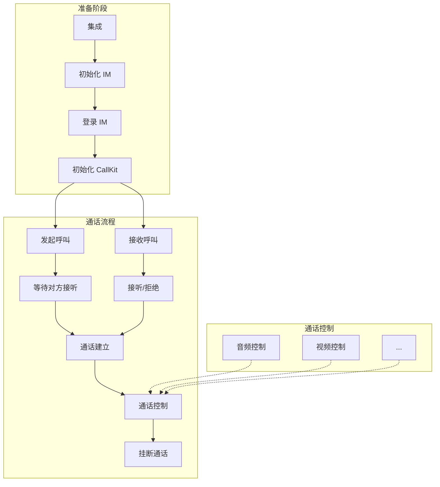

呼叫组件（NECallKit）通过 UI 组件化的方式，简化了呼叫流程，您只需要调用几行代码，就可以实现单聊（1 对 1）呼叫，即点对点呼叫，并包含呼叫的 UI 界面。本文介绍呼叫组件的集成和实现方法。

## 注意事项

- 呼叫组件（NECallKit）基于网易云信 NIM SDK 和 NERTC SDK 实现通话呼叫。
- 针对呼叫组件中的回调信息，开发者要做好相应回调数据的上报及存储，以便于后期上线之后排查问题。

## 基本概念

- `accountId`：IM 账号 ID，用于登录 IM。注册 IM 账号时，IM 服务器会返回对应的账号 ID（`account_id`）和密钥（`Token`），应用客户端需要负责保存 `account_id` 和 `IM Token` 的映射关系。
- `token`：呼叫组件中涉及的 `Token` 包括 IM Token，用于登录 IM 时进行 IM 账号鉴权。应用服务器调用 IM 服务器的 [注册账号 API](https://doc.yunxin.163.com/messaging2/server-apis/TQyNjgyMzc?platform=server)，获取的 IM Token。

## 开发环境

- DevEco Studio 5.0.3.900 及以上版本。
- HarmonyOS SDK API 13 及以上版本。
- Harmony 系统 5.0.0.102 及以上版本的真机。

## 准备工作

根据本文操作前，请确保您已经完成了以下设置：

- 在 [网易云信控制台](https://app.yunxin.163.com/global/home) [创建应用](https://doc.yunxin.163.com/console/concept/TIzMDE4NTA?platform=console)，并获取了对应的 App Key。
- 开通以下服务，若未开通，请参考 [开通服务](https://doc.yunxin.163.com/console/concept/zc3NDYzNzc?platform=console) 进行开通。

    - IM 即时通讯。当使用呼叫组件自带的话单功能时，需开通 IM。
    - 信令。用于实现点对点呼叫邀请以及音视频通话。
    - 音视频通话 2.0。用于实现实时音视频通话。
    - 如需要抄送，请提前开通消息抄送中的 **话单** 抄送服务，实现在一通通话结束后，发送事件通知消息，标记此次通话是否接通以及通话时间、类型等数据。

## 示例项目源码

网易云信提供 [示例项目源码](https://github.com/netease-kit/NECallKit/tree/main/HarmonyOS)，您可以基于该源码进行修改适配。

## 实现流程

建立呼叫的正常流程如下：



## 步骤一：集成

1. 在 `oh-package.json5` 中添加依赖，然后执行 `ohpm install` 命令。

    ```
    {
    "dependencies": {
        "@necallkit/callkit": "4.0.0",
        "@nertc/nertc_sdk": "5.9.11",
        "@nimsdk/message": "10.9.50",
        "@nimsdk/user": "10.9.50",
        "@nimsdk/signalling": "10.9.50",
        "@nimsdk/nim": "10.9.50",
        "@nimsdk/base": "10.9.50"
    }
    }
    ```

2. 在 `module.json5` 中添加权限。

    ```
    {
    "requestPermissions": [
        {
        "name": "ohos.permission.MICROPHONE",
        "reason": "用于音视频通话",
        "usedScene": {
            "abilities": ["EntryAbility"],
            "when": "inuse"
        }
        },
        {
        "name": "ohos.permission.CAMERA",
        "reason": "用于视频通话",
        "usedScene": {
            "abilities": ["EntryAbility"],
            "when": "inuse"
        }
        }
    ]
    }
    ```

## 步骤二：初始化并登录 NIM SDK

在使用 CallKit 之前，必须先初始化 NIM SDK。NIM SDK 负责处理用户身份验证、消息传递等基础功能。

```typescript
// 如果 NIM SDK 未初始化，先创建默认实例
const nim: NIMInterface=NIMSdk.newInstance(context, initializeOptions, serviceOptions)

// 登录 NIM SDK
const accountId = 'your_account_id';
const token = 'your_token';
await nim.loginService.login(accountId, token)
```

## 步骤三：初始化 CallKit

NIM SDK 登录成功后，需要初始化 CallKit 才能使用通话功能。

```typescript
// 创建配置对象
const config: NESetupConfig = new NESetupConfig(
  context,                    // common.Context 对象
  nim,                         // NIM SDK 实例
  "your appkey",               // AppKey
  accountId                    // 当前登录的账号ID
);

// 初始化 CallKit 引擎
await NECallEngine.getInstance().setup(config);
```

## 步骤四：发起呼叫

调用 `NECallUI.call()` 方法发起音频通话或视频通话。

```typescript
// 创建呼叫参数
const param = new NECallParam(
  'target_account_id',  // 被叫用户账号ID
  NECallType.VIDEO      // 通话类型：NECallType.AUDIO（音频）或 NECallType.VIDEO（视频）
);               

// 可选：设置推送配置
const pushConfig = new NECallPushConfig();
pushConfig.pushEnabled = true;
pushConfig.pushTitle = '来电提醒';
pushConfig.pushContent = '您有一个视频通话';
param.pushConfig = pushConfig;

// 发起呼叫
const result = await NECallEngine.getInstance().call(params);
```