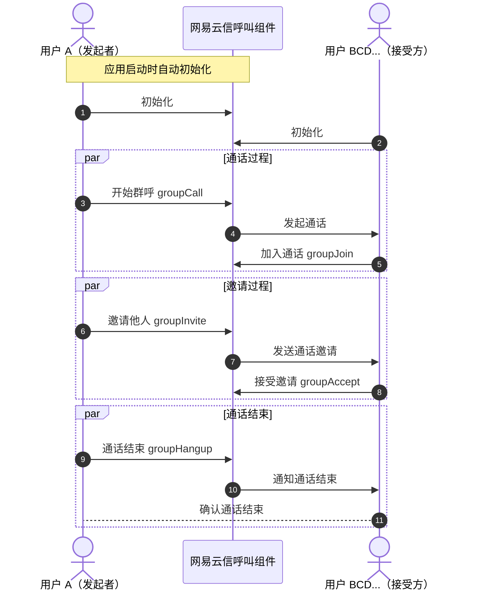

本文介绍了如何通过网易云信呼叫组件（CallKit）提供的 API 进行群组通话功能开发的详细步骤和代码示例。

::: note note 
群组通话功能目前在 Beta 测试阶段，若需要使用，请联系您的网易云信商务经理开通。
:::

## 适用场景

群组通话功能是现代通信应用的核心功能之一，它允许多个用户同时进行实时的视频和音频交流。无论是企业会议、在线教育、社交互动还是远程医疗咨询，这一功能都能提供高效的沟通手段，增强团队协作和信息共享。

- **在线教育**：教师和学生可以通过多人视频通话进行实时互动，共享屏幕和文档，提升在线学习体验。
- **企业会议**：团队成员无论身处何地，都能通过视频会议进行有效的远程协作和决策讨论。
- **社交互动**：朋友和家人可以通过群视频通话保持联系，共享生活瞬间。
- **远程医疗咨询**：医生和患者可以进行远程视频咨询，进行初步诊断和健康建议。
- **紧急服务**：紧急服务人员可以与现场人员进行实时视频通话，快速响应紧急情况。

## 前提条件

根据本文操作前，请确保您已经完成了以下设置：

- 在 [网易云信控制台](https://app.yunxin.163.com/global/home) 上创建至少一个应用。详细步骤请参考 [创建应用并获取 AppKey](https://doc.yunxin.163.com/console/concept/TIzMDE4NTA?platform=console)。
- 集成呼叫组件到示例项目。详细步骤请参考 [实现 1 对 1 通话（V2）](https://doc.yunxin.163.com/nertccallkit/guide/jU5NjA0MzI?platform=web)。

## 调用时序

以下流程图描述了一个群组通话的基本流程，包括初始化、通话过程、邀请过程和通话结束。



## 初始化

以下示例代码介绍了在 Web 应用中如何初始化群组通话功能，包括结合 IM 的初始化和设置 SDK 选项。

IM V9 示例
```JavaScript
// 结合 IM 的初始化 
import NIM from 'xxxx' // IM sdk path
import { NEGroupCall } from '@xkit-yx/call-kit'

let neGroupCall: NEGroupCall

const im = NIM.getInstance({
  appKey: 'xxxx', // IM appkey
  token: 'xxxx', // IM token
  account: 'xxxx', // IM account
  onconnect: () => {
    neGroupCall = new NEGroupCall({
      im: im,
    })
  },
  shouldIgnoreMsg: (msg) => {
    if (msg.type === 'custom') {
      return neGroupCall?.receiveNimMsg(msg.content)
    }
    return false
  },
  ondisconnect: () => {
    neGroupCall?.destroy()
  },
})
```

IM V10 示例
```JavaScript
// 结合 IM 的初始化 
import V2NIM from 'nim-web-sdk-ng'
import { NEGroupCall } from '@xkit-yx/call-kit'

let neGroupCall: NEGroupCall

const nim = V2NIM.getInstance({
        appkey: '',
        token: '',
        account: '',
        debugLevel: 'debug',
        apiVersion: 'v2',
})

  nim.V2NIMLoginService.login('', '', {
        retryCount: 5,
  })

  nim.V2NIMLoginService.on('onDataSync', () => {
    neGroupCall = new NEGroupCall({
      im: nim,
    })
  })

  nim.V2NIMNotificationService.on(
          'onReceiveCustomNotifications',
          (msgs) => {
            msgs.forEach((msg) => {
              neGroupCall?.receiveNimMsg(msg.content)
            })
          }
  )


```

## 开始群呼

以下示例代码介绍了如何调用 [`groupCall`](https://doc.yunxin.163.com/nertccallkit/references/web/typedoc/Latest/zh/classes/NEGroupCall.html#groupCall) 在 Web 端发起群组通话。

```JavaScript
// 发起呼叫
const members = ['accId1', 'accId2'] // 被叫的 IM ID 数组
neGroupCall.groupCall({ calleeList: members })
// 设置自己摄图
const myAccId = 'xxx' // 自己的 IM ID
neGroupCall.setRtcView(dom, myAccId) // dom: 视图的 dom
// 设置被邀请人的视图
members.forEach((accId) => {
  neGroupCall.setRtcView(dom, accId) // dom: 视图的 dom
})
neGroupCall.jionRtc({ video: false }) // 参数为 false 时，只加入音频
// 挂断
neGroupCall.groupHangup()
```

## 加入群呼

以下示例代码展示了如何调用 [`groupAccept`](https://doc.yunxin.163.com/nertccallkit/references/web/typedoc/Latest/zh/classes/NEGroupCall.html#groupAccept) 在 Web 端接受通话邀请并加入通话。

```JavaScript
// 订阅邀请事件
neGroupCall.on('onReceiveInvited', (value) => {
  // 用户可以触发视图，例如弹起邀请页面
})
// 接受邀请
neGroupCall.groupAccept()
// 设置视图
const myAccId = 'xxx' // 自己的 IM ID
neGroupCall.setRtcView(dom, myAccId) // dom: 视图的 dom
// 设置被邀请人的视图
members.forEach((accId) => {
  neGroupCall.setRtcView(dom, accId) // dom: 视图的 dom
})
neGroupCall.jionRtc({ video: false }) // 参数为 false 时，只加入音频
// 拒绝
neGroupCall.groupHangup()
```

## 通话中添加成员

以下示例代码说明了如何调用 [`groupInvite`](https://doc.yunxin.163.com/nertccallkit/references/web/typedoc/Latest/zh/classes/NEGroupCall.html#groupAccept) 在 Web 端邀请其他用户加入通话。

```JavaScript
// 邀请
const members = ['accId1', 'accId2'] // 被叫的 IM ID 数组
neGroupCall.groupInvite({ calleeList: members })
通话中，主叫与被叫

// 订阅用户变化通知
neGroupCall.on('onMembersChange', (value) => {
  // 用户变更
})
// 开关本地视频
neGroupCall.enableLocalVideo(true)
// 开关本地音频
neGroupCall.enableLocalAudio(false)
// 挂断当前通话
neGroupCall.groupHangup()
```

## 其他功能

以下示例代码提供了一些额外的功能说明，如订阅会话结束事件、邀请成员、查询通话信息等，您可以参考 [`NEGroupCall`](https://doc.yunxin.163.com/nertccallkit/references/web/typedoc/Latest/zh/classes/NEGroupCall.html) 查看相关接口说明。

```JavaScript
// 订阅会话结束事件
neCall.on('onCallEnd', (value) => {
  // 通话结束
})
neGroupCall.groupInvite({ calleeList: ['accId1', 'accId2'] }) // 通话中邀请
neGroupCall.groupJoin({ callId: 'xxx' }) // 加入某个通话
neGroupCall.groupQueryCallInfo({ callId: 'xxx' }) // 查询某个通话的信息，参数不传就查询当前通话
```