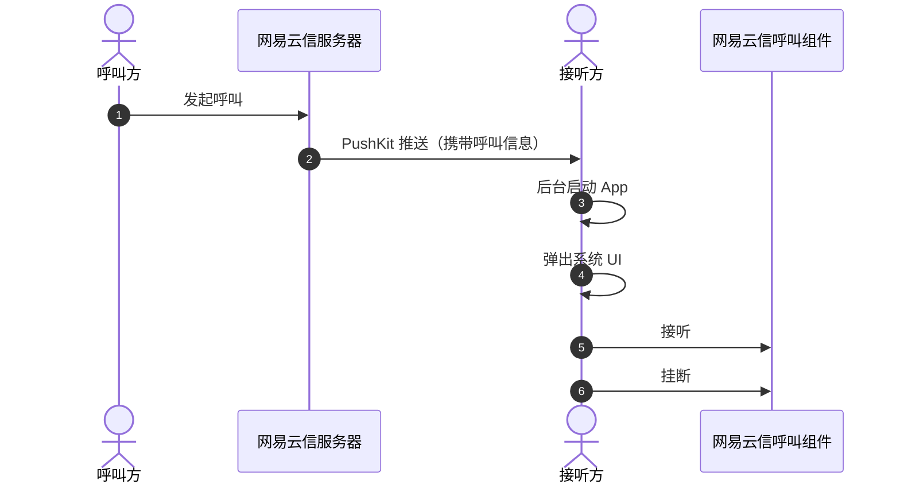

本文主要介绍如何在网易云信呼叫组件（NERtcCallKit）中引入苹果原生 LiveCommunicationKit 库并实现系统电话的接听功能。

## 效果展示

语音通话在实现使用弹窗快捷接听功能后，语音通话也能像普通拨号电话一样接听。当好友来电，在苹果灵动岛界面就会显示好友昵称，提供接受和拒绝两个选项。在接起电话后，也能像系统电话一样切换外放、静音、挂断。没有灵动岛设计的苹果机型，则会在上方弹出卡片，同样具备这些功能。如下图所示：

<br>


## 方案介绍

网易云信呼叫组件将通过 [PushKit](https://developer.apple.com/documentation/pushkit) + [LiveCommunicationKit](https://developer.apple.com/documentation/LiveCommunicationKit) 的方案来代替实现系统电话接听功能。具体的实现原理请参考如下时序图：



## 开发环境

在开始运行工程之前，请您准备以下开发环境：

- Xcode 15.3 及以上版本。
- iOS 17.4 及以上版本的 iOS 设备。

## 前提条件

根据本文操作前，请确保您已经完成了以下设置：

- 在 [网易云信控制台](https://app.yunxin.163.com/global/home) 上创建至少一个应用。详细步骤请参考 [创建应用并获取 AppKey](https://doc.yunxin.163.com/console/concept/TIzMDE4NTA?platform=console)。

- 集成呼叫组件到示例项目。详细步骤请参考 [实现 1 对 1 呼叫（含 UI 集成 V3）](https://doc.yunxin.163.com/nertccallkit/guide/jg0MzU3NjM?platform=iOS)。

- 在实现系统电话接听前需要先配置 [iOS PushKit](https://doc.yunxin.163.com/messaging/guide/Tc4MjEzODA?platform=iOS)，获取到 VoIP 推送证书。

<!--内部，不对外
- 呼叫组件需要定义部分字段，接收方根据该字段解析出呼叫类型以及呼叫者的信息，然后根据信息弹出相应的 UI。因此需要提前在原 `pushPayload` 基础上新增以下数据字段：

    ```
    {
        "nertcCallkit":{
            "callType": 1 //呼叫类型 1:音频 2:视频
            "displayName": @"用户 2568"   //用户 IM 昵称
            "accId": @"897812" //用户 IM 账号 ID
            "requestId": @"761117639228" /信令请求 ID
        }
    }
    ```
-->

## 注意事项

- LiveCommunicationKit 在锁屏状态下不会全屏弹出，也不会再通讯录中留下通话记录。

- 注册 PushKit 时，建议指定子队列，规避可能碰到 UI 弹不出来导致崩溃的情况。

    ```
    self.pushRegistry = [[PKPushRegistry alloc] initWithQueue:dispatch_get_global_queue(DISPATCH_QUEUE_PRIORITY_DEFAULT, 0)];
    ```

- 系统电话接听功能需要在 iOS 17.4 及以上版本中使用。17.4 系统以下的设备不支持注册 Pushkit 和配置证书，否则会出现崩溃。配置证书的示例请参考 [实现 PushKit 推送](#第一步实现-pushkit-推送) 中的第二步。

    ::: note notice
    新功能上线，若存在任何疑问需要支持或帮助，您可以 [提交工单](https://app.yunxin.163.com/global/service/ticket/create) 联系网易云信技术支持工程师。
    :::

## 实现流程

### 第一步：实现 PushKit 推送

1. 在系统中注册 PushKit。

    ```Objective-C
    //这边推荐使用子队列，防止可能出现系统异常情况
    self.pushRegistry = [[PKPushRegistry alloc]
        initWithQueue:dispatch_get_global_queue(DISPATCH_QUEUE_PRIORITY_DEFAULT, 0)];

    self.pushRegistry.delegate = self;
    self.pushRegistry.desiredPushTypes = [NSSet setWithObject:PKPushTypeVoIP];
    ```

2. 在网易云信配置 PushKit 证书。

    ```Objective-C
    NIMSDKOption *option = [NIMSDKOption optionWithAppKey:kAppKey];
    option.apnsCername = @"请输入远程推送证书名字";
    if (@available(iOS 17.4, *)) {
    option.pkCername = @"请输入您的 VoIP 推送证书";
    }
    option.v2 = YES;
    [NIMSDK.sharedSDK registerWithOptionV2:option v2Option:nil];
    ```

3. 将 PushKit token 传给网易云信。

    ```Objective-C
    - (void)pushRegistry:(PKPushRegistry *)registry
        didUpdatePushCredentials:(PKPushCredentials *)credentials
                        forType:(PKPushType)type {
    if ([credentials.token length] == 0) {
        NSLog(@"voip token NULL");
        return;
    }
    //Pushkit token 传给网易云信
    [[NIMSDK sharedSDK] updatePushKitToken:credentials.token];
    }
    ```

### 第二步：解析并弹出接听提示 UI

App 层接受 PushKit 消息后将消息传给 NERtcCallKit，由呼叫组件解析字段，并弹出相应的 UI。

```Objective-C
- (void)pushRegistry:(PKPushRegistry *)registry didReceiveIncomingPushWithPayload:(PKPushPayload *)payload forType:(PKPushType)type withCompletionHandler:(void (^)(void))completion{

    NSDictionary *dictionaryPayload = payload.dictionaryPayload;
    //判断是否是网易云信发的 payload
    if (![dictionaryPayload objectForKey:@"nim"]) {
        NSLog(@"not found nim payload");
        return;
    }

    if (@available(iOS 17.4, *)) {
        //传入 payload
        NECallSystemIncomingCallParam *param = [[NECallSystemIncomingCallParam alloc] init];
        param.payload = dictionaryPayload;
        param.ringtoneName = @"avchat_ring.mp3";

        //若展示信息无法满足需求，可以自定义展示信息
        NECallSystemIncomingCustomCallParam *customPayload = [[NECallSystemIncomingCustomCallParam alloc] init];
        customPayload.displayContent = @"自定义展示信息";
        param.customPayload = customPayload;

        //弹出系统接听 UI
        [[NECallEngine sharedInstance] reportIncomingCallWithParam:param acceptCompletion:^(NSError * _Nullable error, NECallInfo * _Nullable callInfo) {
            if (error) {
                NSLog(@"accept failed %@", error);
            }
            // update 业务 UI
         } hangupCompletion:^(NSError * _Nullable error) {
            if (error) {
                NSLog(@"hangup failed %@", error);
            }
            //update 业务 UI
         } muteCompletion:^(NSError * _Nullable error, BOOL mute) {
           if (error) {
               NSLog(@"mute failed %@", error);
           }
           // update 业务 UI
         }];
    }

    completion();
}
```

## 相关接口

类/方法/回调/错误码 | 说明
--- | ---
`reportIncomingCallWithParam` | 新增接口，根据传入的显示信息，进行解析并弹出系统来电提示/接听提示 UI。
`NECallSystemIncomingCallParam` | 新增参数类，配置来电信息。
`NECallSystemIncomingCustomCallParam` | 新增参数类，自定义来电信息。优先级更高，会覆盖 payload 显示信息，如自定义显示来电信息，来电类型等。