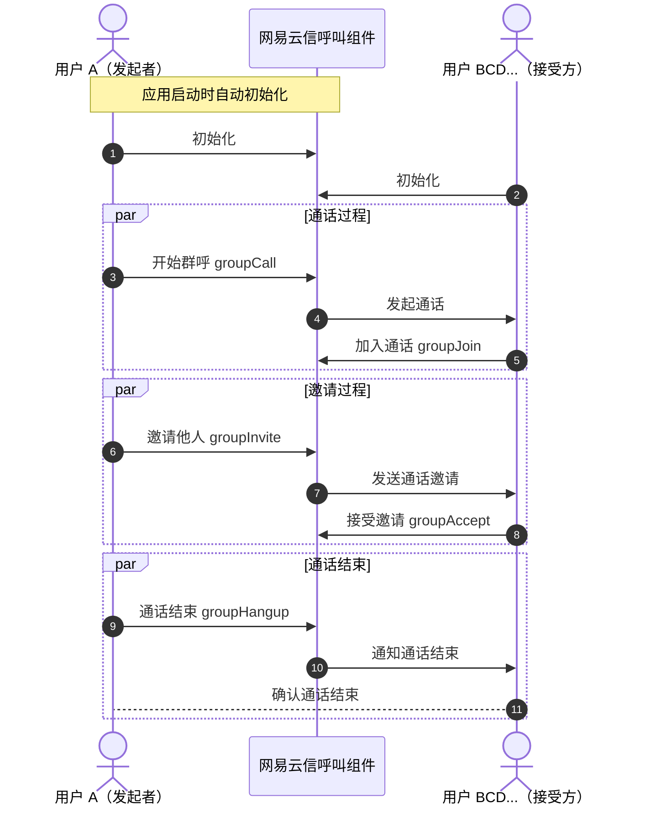

本文介绍了如何通过网易云信呼叫组件（CallKit）提供的 API 进行群组通话功能开发的详细步骤和代码示例。

::: note note
群组通话功能目前在 Beta 测试阶段，若需要使用，请联系您的网易云信商务经理开通。
:::


## 适用场景

群组通话功能是现代通信应用的核心功能之一，它允许多个用户同时进行实时的视频和音频交流。无论是企业会议、在线教育、社交互动还是远程医疗咨询，这一功能都能提供高效的沟通手段，增强团队协作和信息共享。

- **在线教育**：教师和学生可以通过多人视频通话进行实时互动，共享屏幕和文档，提升在线学习体验。
- **企业会议**：团队成员无论身处何地，都能通过视频会议进行有效的远程协作和决策讨论。
- **社交互动**：朋友和家人可以通过群视频通话保持联系，共享生活瞬间。
- **远程医疗咨询**：医生和患者可以进行远程视频咨询，进行初步诊断和健康建议。
- **紧急服务**：紧急服务人员可以与现场人员进行实时视频通话，快速响应紧急情况。

## 前提条件

根据本文操作前，请确保您已经完成了以下设置：

- 在 [网易云信控制台](https://app.yunxin.163.com/global/home) 上创建至少一个应用。详细步骤请参考 [创建应用并获取 AppKey](https://doc.yunxin.163.com/console/concept/TIzMDE4NTA?platform=console)。
- 集成呼叫组件到示例项目。详细步骤请参考 [实现 1 对 1 呼叫（含 UI 集成 V2）](https://doc.yunxin.163.com/nertccallkit/guide/jg0MzU3NjM?platform=iOS)。

## 调用时序

以下流程图描述了一个群组通话的基本流程，包括初始化、通话过程、邀请过程和通话结束。



## 初始化

以下示例代码描述了在 iOS 应用中如何初始化群组通话功能，包括设置配置参数。

```Swift
  GroupConfigParam *param = [[GroupConfigParam alloc] init];
  param.appid = kAppKey;
  param.rtcSafeMode = YES;
  [[NEGroupCallKit sharedInstance] setupGroupCall:param];
```

## 开始群呼

以下示例代码提供了调用 [`groupCall`](https://doc.yunxin.163.com/nertccallkit/references/iOS/doxygen/Latest/zh/html/interface_n_e_group_call_kit.html#a56d560bb0dedaedf52f6f012bc24056a) 开始一个群组通话的代码示例，包括设置通话参数和处理通话结果。

```Swift
GroupCallParam *param = [[GroupCallParam alloc] init];
    NSMutableArray *calleeList = [[NSMutableArray alloc] init];
    for (NEUser *user in self.datas) {
      if ([user.imAccid isEqualToString:self.caller.imAccid]) {
        user.state = GroupMemberStateInChannel;
        continue;
      }
      [calleeList addObject:user.imAccid];
    }
    param.calleeList = calleeList;
    NSString *uuid = [self getRandomString];
    param.callId = uuid;
    self.callId = uuid;
    NSLog(@"call ID : %@", param.callId);
    NSLog(@"call ID length : %lu", (unsigned long)param.callId.length);
    if ([[SettingManager shareInstance] isGroupPush] == YES) {
      param.pushParam.pushMode = GroupPushModeOpen;
      if ([[SettingManager shareInstance] customPushContent].length > 0) {
        param.pushParam.pushContent = [[SettingManager shareInstance] customPushContent];
      }
    } else {
      param.pushParam.pushMode = GroupPushModeClose;
    }

    [[NEGroupCallKit sharedInstance]
         groupCall:param
        completion:^(NSError *_Nullable error, GroupCallResult *_Nullable result) {
          if (error != nil) {
            [UIApplication.sharedApplication.keyWindow ne_makeToast:error.localizedDescription];
            [self didBack];
            return;
          }
          NSLog(@"group call :%@ result : %@", error, result);
        }];
```

## 群呼邀请

以下示例代码展示了如何调用 [`groupInvite`](https://doc.yunxin.163.com/nertccallkit/references/iOS/doxygen/Latest/zh/html/interface_n_e_group_call_kit.html#abd1cd60a7ac48a5bc403b21f756b7952) 邀请其他用户加入通话。

```Swift
[[NEGroupCallKit sharedInstance]
    groupInvite:param
     completion:^(NSError *_Nullable error, GroupInviteResult *_Nullable result) {
       NSLog(@"groupInvite : %@", error);
       if (error != nil) {
         [UIApplication.sharedApplication.keyWindow ne_makeToast:error.localizedDescription];
         return;
       }
     }];
```

## 加入群呼

以下示例代码介绍了如何调用 [`groupAccept`](https://doc.yunxin.163.com/nertccallkit/references/iOS/doxygen/Latest/zh/html/interface_n_e_group_call_kit.html#af32cff48bb53c6406e31c27d9bd6390a) 接受通话邀请并加入通话。

```Swift
GroupAcceptParam *param = [[GroupAcceptParam alloc] init];
  param.callId = self.callId;
  __weak typeof(self) weakSelf = self;
  [self startTimer];
  [[NEGroupCallKit sharedInstance]
      groupAccept:param
       completion:^(NSError *_Nullable error, GroupAcceptResult *_Nullable result) {
         if (error != nil) {
           [UIApplication.sharedApplication.keyWindow ne_makeToast:error.localizedDescription];
           [weakSelf didBack];
           return;
         }
         NSLog(@"call member user list : %@", result.groupCallInfo.calleeList);
         [DataManager.shareInstance
             fetchUserWithMembers:result.groupCallInfo.calleeList
                       completion:^(NSError *_Nullable error, NSArray<NEUser *> *_Nonnull users) {
                         NSLog(@"call neuser list : %@", users);
                         [weakSelf.datas removeAllObjects];
                         [weakSelf.datas addObjectsFromArray:users];
                         [weakSelf refreshCollection];
                       }];
       }];
```

## 挂断群呼

以下示例代码介绍了调用 [`groupHangup`](https://doc.yunxin.163.com/nertccallkit/references/iOS/doxygen/Latest/zh/html/interface_n_e_group_call_kit.html#af6b4571b2f90eb00b2742838fc7f0194) 结束通话的实现方法。

```Swift
  GroupHangupParam *param = [[GroupHangupParam alloc] init];
  param.callId = self.callId;
  [[NEGroupCallKit sharedInstance]
      groupHangup:param
       completion:^(NSError *_Nullable error, GroupHangupResult *_Nullable result) {
         if (error != nil) {
           [[UIApplication sharedApplication].keyWindow ne_makeToast:error.localizedDescription];
           return;
         }
       }];
```

## 通话中添加成员

在通话中添加成员时，如果您需要直接修改对应的交互（UI），请参考 [Github 上的开源示例项目](https://github.com/netease-kit/NECallKit/tree/main/iOS)，在 `NEGroupCallViewController.m` 文件中的 `inviteBtn` 按钮，如需帮助您可以 [提交工单](https://app.yunxin.163.com/global/service/ticket/create) 联系网易云信技术支持工程师。

```Swift
//UI 上添加成员按钮 具体方法参考 inviteUsers
- (NEExpandButton *)inviteBtn {
  if (!_inviteBtn) {
    _inviteBtn = [[NEExpandButton alloc] init];
    [_inviteBtn setImage:[UIImage imageNamed:@"group_add"] forState:UIControlStateNormal];
    [_inviteBtn addTarget:self
                   action:@selector(inviteUsers)
         forControlEvents:UIControlEventTouchUpInside];
  }
  return _inviteBtn;
}
```