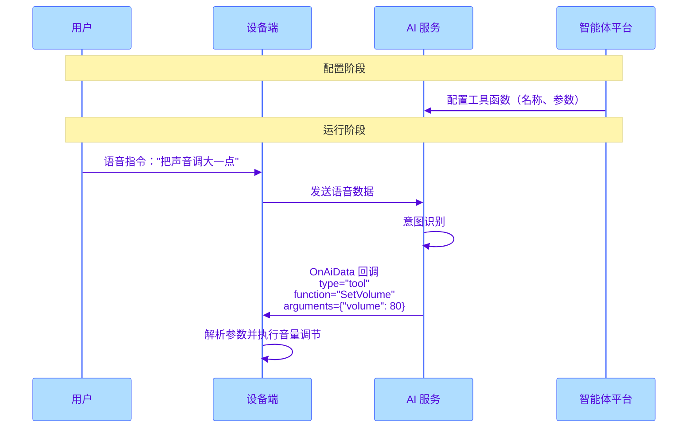

本文介绍使用网易云信嵌入式 SDK（NERTC SDK）在 AI 对话过程中，如何通过 `OnAiData` 回调接收和处理 AI 服务端下发的各类消息，包括工具控制、事件通知和内容传递。

## 消息类型

AI 服务端通过 `OnAiData` 回调向设备端下发消息，主要分为三大消息类型（`type`）：

| 消息类型 | 标识 | 说明 | 典型场景 |
|----------|------|------|----------|
| **工具控制** | `tool` | 执行具体的设备功能调用 | 调节音量、控制播放、设备开关 |
| **事件通知** | `event` | AI 内部状态变化通知 | AI 开始/结束说话、被打断 |
| **内容传递** | `content` | 传递结构化内容 | 情绪识别、表情动画 |

:::note note
这三种类型在单次回调中是**互斥**的，即每次 `OnAiData` 回调的 `type` 字段只会是其中一种。
:::

## 回调数据格式

`on_ai_data` 回调的 `data` 字段是一个 JSON 字符串，其核心结构如下：

```JSON
{
    "uid": 123,
    "type": "tool",  // 消息类型: "tool"、"content"、或 "event"
    "data": {
        "timestamp": 1754654765,
        "request": "把声音调大一点",
        // --- 以下三者根据 type 的值互斥存在 ---
        // 1. type 为 "tool" 时
        "toolCalls": [{
            "id": "call_123",
            "type": "function",
            "function": {
                "name": "SetVolume",
                "arguments": "{\"volume\": 80}"
            }
        }],
        // 2. type 为 "event" 时
        "event": "audio.agent.speech_stopped",
        // 3. type 为 "content" 时
        "content": {
            "type": "emotion",
            "message": "happy"
        }
    }
}
```

## 工具控制（Tool）

工具控制消息用于执行具体的设备功能调用，当 AI 识别到用户意图需要操作设备时，会下发此类消息。

### 使用流程



### 常见工具类型

| 工具功能 | 描述 | `arguments` 参数示例 |
|----------|------|---------------------|
| 音量控制 | 调节设备音量 | `{"volume": 50}` |
| 播放控制 | 控制音乐播放 | `{"action": "play", "song": "歌曲名"}` |
| 设备控制 | 控制智能设备 | `{"device": "light", "state": "on"}` |
| 信息查询 | 查询设备状态 | `{"type": "battery"}` |

### 配置方式

在 [网易云信智能体管理平台](https://rtc-agent-console.netease.im/#/) 中配置工具函数：

<div style="text-align: center;">
    <b>工具控制配置示例</b><br>
    
</div>

### 解析示例

```C++
void MyAppClass::HandleToolCall(cJSON* data_item) {
    cJSON* tool_calls_item = cJSON_GetObjectItem(data_item, "toolCalls");
    if (!cJSON_IsArray(tool_calls_item)) return;

    cJSON* tool_call;
    cJSON_ArrayForEach(tool_call, tool_calls_item) {
        cJSON* function_item = cJSON_GetObjectItem(tool_call, "function");
        if (!cJSON_IsObject(function_item)) continue;

        cJSON* name_item = cJSON_GetObjectItem(function_item, "name");
        cJSON* args_item = cJSON_GetObjectItem(function_item, "arguments");

        if (cJSON_IsString(name_item) && cJSON_IsString(args_item)) {
            std::string func_name = name_item->valuestring;
            std::string func_args = args_item->valuestring;
            
            // 处理音量设置
            if (func_name == "SetVolume") {
                cJSON* args_json = cJSON_Parse(func_args.c_str());
                if (args_json) {
                    cJSON* volume_item = cJSON_GetObjectItem(args_json, "volume");
                    if (cJSON_IsNumber(volume_item)) {
                        int volume = volume_item->valueint;
                        RTC_LOGI(TAG, "Setting volume to %d", volume);
                        SetDeviceVolume(volume);
                    }
                    cJSON_Delete(args_json);
                }
            }
            // 处理其他工具调用...
        }
    }
}
```

## 事件通知（Event）

事件通知消息用于将 AI 的内部状态变化通知给设备端，例如 AI 开始或结束说话。

### 支持的事件类型

| 事件标识 | 说明 | 典型处理 |
|----------|------|----------|
| `audio.agent.speech_started` | AI 开始说话 | 更新 UI 状态、显示说话动画 |
| `audio.agent.speech_stopped` | AI 结束说话 | 恢复待机状态 |
| `audio.agent.interrupted` | AI 被用户打断 | 停止播放、清空缓冲 |

### 解析示例

```C++
void MyAppClass::HandleEvent(cJSON* data_item) {
    cJSON* event_item = cJSON_GetObjectItem(data_item, "event");
    if (!cJSON_IsString(event_item)) return;

    std::string event_str = event_item->valuestring;
    RTC_LOGI(TAG, "Received AI event: %s", event_str.c_str());

    if (event_str == "audio.agent.speech_started") {
        // AI 开始说话
        UpdateUIState(AI_SPEAKING);
        StartSpeakingAnimation();
    } else if (event_str == "audio.agent.speech_stopped") {
        // AI 结束说话
        UpdateUIState(AI_IDLE);
        StopSpeakingAnimation();
    } else if (event_str == "audio.agent.interrupted") {
        // AI 被打断
        HandleAIInterrupted();
    }
}
```

## 内容传递（Content）

内容传递消息用于从服务端向设备端传递结构化的内容，例如情绪识别结果。设备端可以根据这些内容执行相应的表现，如播放动画。

### 情绪识别

情绪识别是内容传递的典型应用：

1. **配置**：在 [网易云信智能体管理平台](https://rtc-agent-console.netease.im/#/) 配置情绪识别规则（如 `happy`、`sad`）。
2. **触发**：当对话内容命中规则时，服务端下发 `content` 消息。
3. **处理**：设备端解析情绪值并执行对应动画或表情。

### 配置方式

<div style="text-align: center;">
    <b>情感识别配置示例</b><br>
    
</div>

### 解析示例

```C++
void MyAppClass::HandleContent(cJSON* data_item) {
    cJSON* content_item = cJSON_GetObjectItem(data_item, "content");
    if (!cJSON_IsObject(content_item)) return;

    cJSON* content_type_item = cJSON_GetObjectItem(content_item, "type");
    cJSON* message_item = cJSON_GetObjectItem(content_item, "message");

    if (cJSON_IsString(content_type_item) && cJSON_IsString(message_item)) {
        std::string content_type = content_type_item->valuestring;
        std::string message = message_item->valuestring;
        RTC_LOGI(TAG, "Content type: %s, message: %s", content_type.c_str(), message.c_str());

        // 处理情绪内容
        if (content_type == "emotion") {
            PlayEmotionAnimation(message);  // happy, sad, angry, etc.
        }
    }
}
```

## 完整解析代码

以下是完整的 `OnAiData` 回调处理代码，整合了三种消息类型的解析逻辑：

```C++
#include "cJSON.h"

void MyAppClass::OnAiData(const nertc_sdk_callback_context_t* ctx, 
                          nertc_sdk_ai_data_result_t* ai_data) {
    if (!ai_data || ai_data->data_len == 0) {
        return;
    }

    std::string payload(ai_data->data, ai_data->data_len);
    RTC_LOGI(TAG, "NERtc OnAiData payload: %s", payload.c_str());

    cJSON* root_json = cJSON_Parse(payload.c_str());
    if (!root_json) {
        RTC_LOGE(TAG, "Failed to parse root JSON.");
        return;
    }

    cJSON* type_item = cJSON_GetObjectItem(root_json, "type");
    cJSON* data_item = cJSON_GetObjectItem(root_json, "data");

    if (!cJSON_IsString(type_item) || !cJSON_IsObject(data_item)) {
        RTC_LOGE(TAG, "Invalid data structure.");
        cJSON_Delete(root_json);
        return;
    }

    std::string type_str = type_item->valuestring;

    if (type_str == "tool") {
        // 处理工具调用
        HandleToolCall(data_item);
    } else if (type_str == "event") {
        // 处理事件通知
        HandleEvent(data_item);
    } else if (type_str == "content") {
        // 处理内容传递
        HandleContent(data_item);
    }

    cJSON_Delete(root_json);
}
```

<!-- ## 相关文档

- [基础实现流程](https://doc.yunxin.163.com/ai-hardware/guide/jUyMDgyNTQ?platform=client)
- [配置智能体](https://doc.yunxin.163.com/ai-hardware/guide/TU3MjE3NjE?platform=client)
- [AI 打断](https://doc.yunxin.163.com/ai-hardware/guide/Dc0MjYyMjA?platform=client) -->
