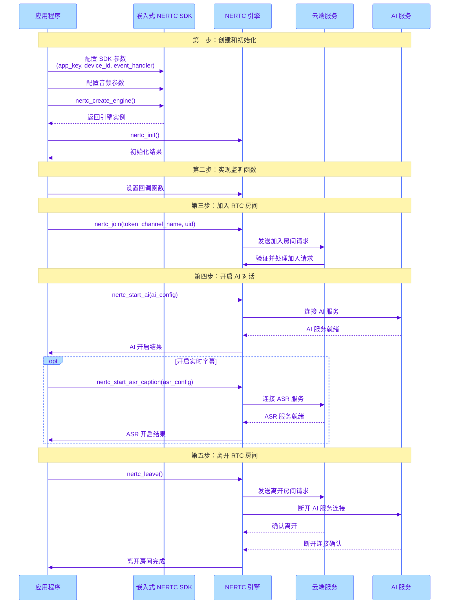

本文介绍使用网易云信嵌入式 SDK（NERTC SDK）完成 AI 对话功能的核心实现步骤，包括 SDK 的初始化、事件监听、加入与离开房间等关键操作。

## 名词解释

- **NERTC SDK**：网易云信嵌入式实时通信软件开发工具包，专为硬件设备设计的轻量级音视频通信解决方案，提供实时音频传输、AI 对话、语音识别等核心功能。
- **引擎**：NERTC SDK 的核心控制实例，负责管理整个音视频通信会话的生命周期，包括初始化配置、房间管理、媒体流处理等所有底层操作的统一入口。
- **房间**：实时通信的虚拟空间，由唯一的房间名称标识。同一房间内的用户可以进行实时音视频交互，支持多用户同时在线并参与 AI 对话。
- **用户**：房间内的参与者，由唯一的用户 ID（uid）标识。每个用户可以发送和接收音频流，并与 AI 服务进行实时对话交互。
- **AI 服务**：云端智能对话服务，提供语音识别、自然语言理解、对话生成和语音合成等 AI 能力，实现与用户的智能语音交互。
- **ASR 服务**：自动语音识别（Automatic Speech Recognition）服务，将用户的语音实时转换为文字字幕，为用户提供可视化的语音内容显示。
- **安全模式**：房间加入的身份验证机制。安全模式下需要通过业务服务器生成的有效凭证（Token）进行身份验证。与安全模式相对的是调试模式，调试模式下可直接加入房间，但存在串房风险，仅适用于概念验证的原型阶段。更多有关两种模式对比的详情，请参考《音视频通话 2.0》[基础 Token 鉴权](https://doc.yunxin.163.com/nertc/server-apis/TcxNDAxMTI?platform=server)。
    :::note note
    房间加入的身份验证机制中的 Token 是指身份凭证，与大语言模型的自然语言文本基本单位 token 概念不同。
    :::

## 准备工作

根据本文操作前，请确保您已经完成了以下工作：

1. [获取 NERTC SDK](https://doc.yunxin.163.com/ai-hardware/guide/zIzNTI4MDQ?platform=client)。
2. [获取设备授权码 License](https://doc.yunxin.163.com/ai-hardware/guide/zU3NDcxMTc?platform=client)。
3. 在测试开发阶段，建议在 [网易云信控制台](https://app.yunxin.163.com/global/home) 中为您的应用开通 **调试模式**，此时加入房间无需进行凭证（Token）校验。应用正式上线前，请务必切换为 **安全模式**，以保障业务安全。详细说明请参考《音视频通话 2.0》[Token 鉴权](https://doc.yunxin.163.com/nertc/server-apis/TcxNDAxMTI?platform=server)。

## 流程概述

本文中实现 AI 对话功能实现的完整时序如下：



## 第一步：创建和初始化

在进行任何操作之前，您必须先创建一个 NERTC SDK 引擎实例。通过调用 `nertc_create_engine` 和 `nertc_init` 方法来完成创建和初始化。此过程在应用的生命周期中通常仅需执行一次。

初始化时，您需要在 `nertc_sdk_config_t` 结构体中配置以下关键信息：

- **`app_key`**：填入您在准备工作中获取到的 App Key。
- **`device_id`**：设备的唯一标识符，由客户端负责生成和维护。该标识符需要确保在设备级别的唯一性和持久性。
- **`event_handler`**：设置一个 `nertc_sdk_event_handle_t` 类型的事件回调句柄，用于接收 SDK 在运行过程中的各类事件通知。
- **`audio_config`**：如果您计划使用 [本地 AEC 方案](https://doc.yunxin.163.com/ai-hardware/guide/TY2MjA2ODA?platform=client#local)，需要在此配置音频的采集参数，如采样率、声道数等。
- **`licence_cfg`**：设置用于设备鉴权的 [Licence](https://doc.yunxin.163.com/ai-hardware/guide/zU3NDcxMTc?platform=client)。

    ```C++
    // 1 - SDK 全局配置和创建引擎:
    nertc_sdk_configuration_t sdk_config = { 0 };
    nertc_sdk_configuration_init(&sdk_config);
    sdk_config.app_key = MY_APPKEY;
    sdk_config.device_id = MY_DEVICE_ID;
    sdk_config.force_unsafe_mode = true;
    // License 配置
    sdk_config.licence_cfg.license = MY_LICENSE;
    // 音频配置: 如果采用本地 AEC 方案，需要配置以下这 3 个参数（如果打开服务端 AEC，这 3 个参数会由 SDK 内部控制，需要关注 OnJoin 回调中的 recommended_config）
    nertc_sdk_config.audio_config.channels = 1;
    nertc_sdk_config.audio_config.sample_rate = 16000;
    nertc_sdk_config.audio_config.frame_duration = OPUS_FRAME_DURATION_MS;
    sdk_config.audio_config.codec_type = NERTC_SDK_AUDIO_CODEC_TYPE_OPUS;
    // 可选配置:
    sdk_config.optional_config.device_performance_level = NERTC_SDK_DEVICE_LEVEL_NORMAL;
    sdk_config.optional_config.prefer_use_psram = MY_CONFIG_PSRAM_ENABLED ? true : false;
    sdk_config.optional_config.enable_server_aec = MY_DEVICE_AEC_ENABLED ? false : true;
    // 日志配置:
    sdk_config.log_cfg.log_level = NERTC_SDK_LOG_INFO;
    engine_ = nertc_create_engine_with_config(&sdk_config);
    if (!engine_) {
        ESP_LOGE(TAG, "NERtcSDK failed to create engine");
        return;
    }

    // 2 - 引擎配置和初始化
    nertc_sdk_engine_config_t engine_config = {};
    nertc_sdk_engine_config_init(&engine_config);
    // 工作模式:
    engine_config.engine_mode = MY_ENABLE_PTT ? NERTC_SDK_ENGINE_MODE_PTT : NERTC_SDK_ENGINE_MODE_AI;
    // 事件回调:
    engine_config.event_handler.on_error = OnError;
    engine_config.event_handler.on_license_expire_warning = OnLicenseExpireWarning;
    engine_config.event_handler.on_channel_status_changed = OnChannelStatusChanged;
    engine_config.event_handler.on_join = OnJoin;
    engine_config.event_handler.on_disconnect = OnDisconnect;
    engine_config.event_handler.on_user_joined = OnUserJoined;
    engine_config.event_handler.on_user_left = OnUserLeft;
    engine_config.event_handler.on_user_audio_start = OnUserAudioStart;
    engine_config.event_handler.on_user_audio_stop = OnUserAudioStop;
    engine_config.event_handler.on_asr_caption_result = OnAsrCaptionResult;
    engine_config.event_handler.on_ai_data = OnAiData;
    engine_config.event_handler.on_audio_encoded_data = OnAudioData;
    // 用户数据(可选):
    engine_config.user_data = this;
    // 初始化引擎
    int ret = nertc_init_engine(engine_, &engine_config);
    if (ret != 0) {
        RTC_LOGE(TAG, "Failed to initialize NERtcSDK, error: %d", ret);
    } else {
        RTC_LOGI(TAG, "Successfully initialized NERtcSDK.");
    }
    ```

## 第二步：实现监听函数

您需要根据上一步中设置的回调，实现对应的处理函数。这些函数是 SDK 与您的应用进行异步通信的桥梁。

```C++
void MyAPPClass::OnJoin(const nertc_sdk_callback_context_t* ctx,
                        uint64_t cid, uint64_t uid,
                        nertc_sdk_error_code_e code,
                        uint64_t elapsed,
                        const nertc_sdk_recommended_config* recommended_config) {
    if (code == 0) {
        RTC_LOGI(TAG, "Successfully joined channel %llu with uid %llu.", cid, uid);
    } else {
        RTC_LOGE(TAG, "Failed to join channel, error: %d", code);
    }
}

void MyAPPClass::OnAudioEncodedData(const nertc_sdk_callback_context_t* ctx,
                                    uint64_t uid,
                                    nertc_sdk_media_stream_e stream_type,
                                    nertc_sdk_audio_encoded_frame_t* encoded_frame,
                                    bool is_mute_packet) {
    RTC_LOGD(TAG, "Received audio data from user %llu.", uid);
    // 在此处处理接收到的音频数据，例如解码和播放
}

// ... 实现其他必要的监听函数
```

## 第三步：加入 RTC 房间

初始化成功后，调用 `nertc_join` 方法加入一个 RTC 房间。同一房间内的用户可以进行实时音视频通信。

参数 | 说明
---- | ----
| `token` | 安全认证签名（NERTC Token）。<ul><li> **调试模式** 下您可以将 `token` 设为 `null`，前提是需要在初始化 SDK 的时候将 `nertc_sdk_config_t` 中的 `force_unsafe_mode` 设置为 `true`，这样加入房间将只会使用 `licenseKey` 模式鉴权，但可能会有串房的风险。</li><li> **安全模式** 下必须传入通过您业务服务器生成的有效 Token。</li></ul>更多有关两种模式对比的详情，请参考《音视频通话 2.0》[基础 Token 鉴权](https://doc.yunxin.163.com/nertc/server-apis/TcxNDAxMTI?platform=server)。 |
| `channel_name` | 房间名称，长度为 1 ~ 64 字节，目前支持以下 89 个字符：a-z, A-Z, 0-9, space, !#$%&()+-:;≤.,>? @[]^_{\| }~"。相同 `channel_name` 的用户会进入同一个通话房间。 |
| `uid` | 用户的唯一标识 ID，必须在房间内唯一。请在您的业务服务器上自行管理和维护。 |

成功加入 RTC 房间后，SDK 会触发 `on_join` 回调。

::: note note
如果音频采用 [云端 AEC 方案](https://doc.yunxin.163.com/ai-hardware/guide/TY2MjA2ODA?platform=client#cloud)，您需要特别关注并保存在 `on_join` 回调中返回的 `recommended_config`。后续采集和发送音频流时，必须依据该配置进行，以确保 AEC 效果。
:::

```C++
void MyAPPClass::StartJoin() {
    // 使用从业务服务器获取的 Token
    auto ret = nertc_join(engine_, MY_CHANNEL_NAME, MY_TOKEN, MY_UID);
    if (ret != 0) {
        RTC_LOGE(TAG, "Join failed, error: %d", ret);
    } else {
        RTC_LOGE(TAG, "Join success");
    }
}

void MyAPPClass::OnJoin(const nertc_sdk_callback_context_t* ctx,
                        uint64_t cid,
                        uint64_t uid,
                        nertc_sdk_error_code_e code,
                        uint64_t elapsed,
                        const nertc_sdk_recommended_config* recommended_config) {
    RTC_LOGI(TAG, "NERtcSDK OnJoin: %llu, %llu, %d, %llu", cid, uid, code, elapsed);

    // 如果是云端 AEC 方案，保存服务器推荐的音频配置
    if (recommended_config) {
        server_sample_rate_ = recommended_config->recommended_audio_config.sample_rate;
        samples_per_channel_ = recommended_config->recommended_audio_config.samples_per_channel;
        server_frame_duration_ = (samples_per_channel_ * 1000) / server_sample_rate_;
    }
}
```

## 第四步：开启 AI 对话

### AI 对话

当用户通过语音唤醒或手动操作触发对话时，调用 `nertc_start_ai` 接口来正式开启 AI 对话。

```C++
// 开启 AI 对话
nertc_sdk_ai_config_t ai_config; // 可按需配置
auto ret = nertc_start_ai(engine_, &ai_config);
if (ret != 0) {
    RTC_LOGE(TAG, "Start AI failed, error: %d", ret);
} else {
    RTC_LOGE(TAG, "Start AI success");
}
```

### 实时字幕

同时，您可以根据业务需求调用 `nertc_start_asr_caption` 来开启实时字幕功能。

```C++
// 开启实时字幕
nertc_sdk_asr_caption_config_t asr_config; // 可按需配置
ret = nertc_start_asr_caption(engine_, &asr_config);
if (ret != 0) {
    RTC_LOGE(TAG, "Start ASR caption failed, error: %d", ret);
} else {
    RTC_LOGE(TAG, "Start ASR caption success");
}
```

### 上传语音

网易云信提供了三种 [回声消除 AEC 方案](https://doc.yunxin.163.com/ai-hardware/guide/TY2MjA2ODA?platform=client)：**云端 AEC 方案**、**本地 AEC 方案**、**无 AEC 方案**。此处以云端 AEC 方案为例，介绍如何上传语音数据。您也可以根据自身需求，选择其他 AEC 方案上传语音数据。

```C++
// 发送麦克风采集的音频流
void MyAPPClass::SendAudioData(void* data, int data_len) {
    nertc_sdk_audio_encoded_frame_t encoded_frame;
    encoded_frame.data = const_cast<unsigned char*>(packet.payload.data());
    encoded_frame.length = packet.payload.size();
    nertc_sdk_audio_config audio_config = {16000, 1, 160};
    nertc_push_audio_encoded_frame(engine_, NERTC_SDK_MEDIA_MAIN_AUDIO,
                                    &audio_config, 100, &encoded_frame);
}

// 接收并处理云端 AI 音频，同时发送参考帧
void MyAPPClass::OnAudioEncodedData(const nertc_sdk_callback_context_t* ctx,
                                    uint64_t uid,
                                    nertc_sdk_media_stream_e stream_type,
                                    nertc_sdk_audio_encoded_frame_t* encoded_frame,
                                    bool is_mute_packet) {
    ESP_LOGI(TAG, "NERtcSDK OnAudioEncodedData");

    std::vector<uint8_t> payload_vector;
    if(encoded_frame->data) {
        payload_vector.assign(encoded_frame->data, encoded_frame->data + encoded_frame->length);
        // 解码云端返回的音频数据
        std::vector<int16_t> pcm_payload;
        AudioDecode(payload_vector, pcm_payload);

        // 播放解码后的 PCM 数据
        PlayAudio(pcm_payload);

        // 关键步骤：将刚播放的 PCM 数据作为参考帧发送给 SDK
        nertc_sdk_audio_frame_t audio_frame;
        audio_frame.type = NERTC_SDK_AUDIO_PCM_16;
        audio_frame.data = pcm_payload.data();
        audio_frame.length = pcm_payload.size();
        nertc_push_audio_reference_frame(engine_, NERTC_SDK_MEDIA_MAIN_AUDIO,
                                       encoded_frame, &audio_frame);
    }
}

// 支持自动打断，同时支持手动打断
void MyAPPClass::ManualInterrupt() {
    nertc_ai_manual_interrupt(engine_);
}
```

### 状态监听

获取 AI 文本转语音（TTS）状态可以通过监听以下接口实现：

```C++
void MyAPPClass:::OnAiData(const nertc_sdk_callback_context_t* ctx, nertc_sdk_ai_data_result_t* ai_data) {
    std::string type(ai_data->type, ai_data->type_len);
    std::string data(ai_data->data, ai_data->data_len);

    // 可以打印出类似以下的 log:
    // NERtcSDK OnAiData type:event data:audio.agent.speech_started
    // NERtcSDK OnAiData type:event data:audio.agent.speech_stopped
    ESP_LOGI(TAG, "NERtcSDK OnAiData, type=%s data=%s", type.c_str(), data,c_str())));
}
```

## 第五步：离开 RTC 房间

当通话结束时，调用 `nertc_leave` 方法离开房间以停止数据传输。

如果确认不再需要 NERTC SDK 实例，可以调用 `nertcrtc_destory_engine` 方法来释放资源。

```C++
// 离开房间
nertc_leave(engine_);

// 销毁引擎实例
if (engine_) {
    nertcrtc_destory_engine(engine_);
    engine_ = nullptr;
}
```

## 下一步

参考 [配置 AEC 方案](https://doc.yunxin.163.com/ai-hardware/guide/TY2MjA2ODA?platform=client) 选择 AI 对话过程中的音频回声消除功能。