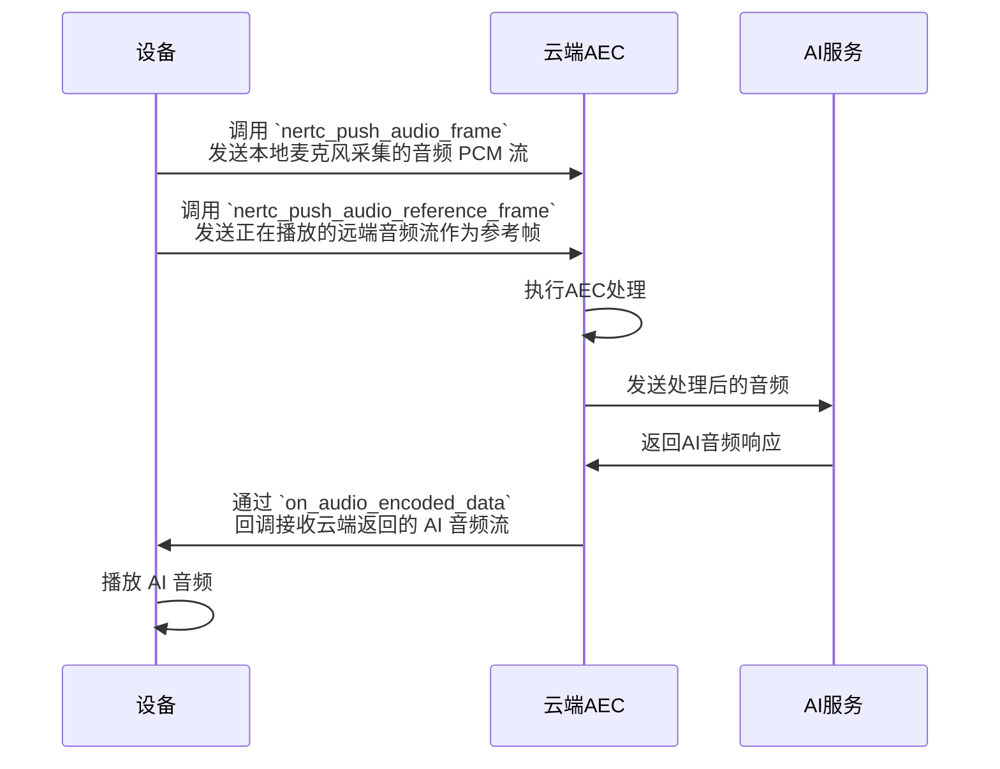
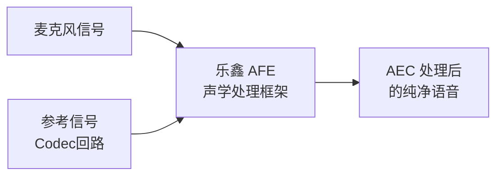
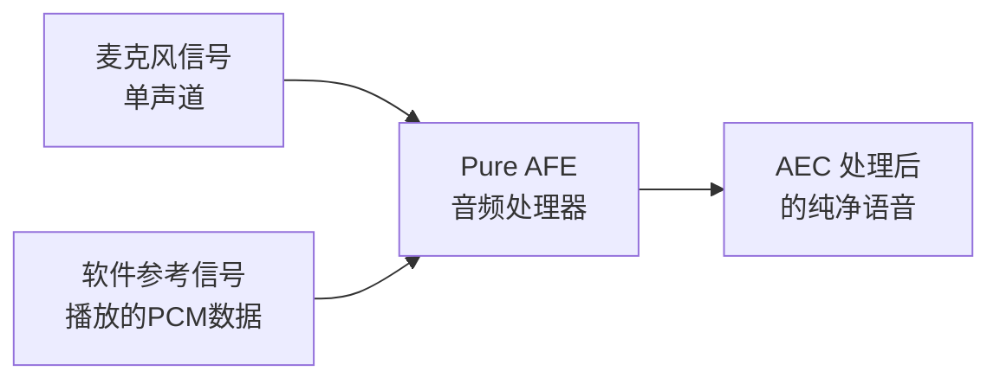

本文详细介绍 AI 对话功能中的音频 3A 方案，包括回声消除（AEC）、噪声抑制（ANS）、自动增益控制（AGC）的技术原理、实现方式以及不同方案的选择指导。

## 前提条件

根据本文操作前，请确保您已经完成了 [基础实现流程](https://doc.yunxin.163.com/ai-hardware/guide/jUyMDgyNTQ?platform=client)。

## 技术名词

### 音频 3A 算法

音频 3A 是指三种音频预处理算法的统称：

| 名词 | 定义 | 应用场景 |
|-------|------|----------|
| **AEC** (Acoustic Echo Cancellation) | 回声消除，从麦克风采集的音频流中去除回声信号 | 消除扬声器播放的 AI 语音回传到麦克风的回声 |
| **ANS** (Automatic Noise Suppression) | 噪声抑制，消除环境中的背景噪声 | 抑制风扇声、空调声等环境噪音 |
| **AGC** (Automatic Gain Control) | 自动增益控制，动态调整音频信号强度 | 确保不同距离说话时音量保持稳定 |

### 相关概念

- **近端信号**：用户的说话声音
- **回声信号**：从扬声器播放出来的 AI 语音被麦克风采集到的声音
- **音频参考帧（Audio Reference Frame）**：AEC 算法的关键输入，提供扬声器播放内容的精确副本。通过比较参考帧和麦克风采集的信号，AEC 算法可以识别并消除回声成分
- **音频 PCM 流**：经过 PCM（Pulse Code Modulation，脉冲编码调制）格式处理的音频数据流，是 AEC 算法的输入数据
- **OPUS 编码**：开源的音频压缩编码格式，专为实时音频通信设计，可将音频数据压缩至原始大小的 10-20%

## 3A 方案概述

网易云信嵌入式 NERTC SDK 根据设备性能、隐私性要求、实时性要求，提供以下 AEC 方案：

| 方案 | 处理位置 | 设备性能要求 | 数据传输 | 回声消除效果 | 自动打断支持 | 手动打断支持 |
|------|----------|--------------|----------|--------------|--------------|--------------|
| 云端 AEC | 云端服务器 | 低 | 需传输参考帧 | 优秀 | ✅ | ✅ |
| 本地双麦克风 AEC | 设备端 | 中等 | 仅传输处理后音频 | 良好 | ✅ | ✅ |
| 本地单麦克风 AEC | 设备端 | 中等 | 仅传输处理后音频 | 良好 | ✅ | ✅ |
| 无 AEC | - | 最低 | 仅传输原始音频 | 无 | ❌ | ✅ |

## 方案选择建议

根据您的设备硬件条件和业务需求，可参考以下建议选择合适的 AEC 方案：

| 场景 | 推荐方案 | 说明 |
|------|----------|------|
| 设备 CPU 性能有限 | 云端 AEC | 将计算密集的 AEC 处理放到云端 |
| 性能充足但流量敏感型设备 | 本地 AEC | 音频在本地处理后再上传 |
| Codec 支持双声道/有参考回路 | 本地双麦克风 AEC | 使用硬件参考信号，效果更好 |
| 单麦克风/无参考回路 | 本地单麦克风 AEC | 使用软件参考信号 |
| 使用耳机/无扬声器 | 无 AEC | 不存在回声问题 |

## 体验 Demo

您可以参考 GitHub 开源工程 [`nertc-esp32-demo`](https://github.com/netease-im/nertc-esp32-demo) 体验音频 3A 方案效果。

<a id="cloud"></a>

## 云端 AEC 方案

此方案将 AEC 处理放在云端进行，对端侧设备性能要求较低，但需要额外传输一路音频参考帧。

### 实现原理



### 接口说明

- **发送**：
  - 调用 `nertc_push_audio_frame` 发送本地麦克风采集的音频 PCM 流
  - 调用 `nertc_push_audio_reference_frame` 发送正在播放的远端音频流作为参考帧
- **接收**：通过 `on_audio_encoded_data` 回调接收云端返回的 AI 音频流
- **打断**：支持自动打断（用户说话时，AI 自动停止播放），也可调用 `nertc_ai_manual_interrupt` 手动打断

### 示例代码

```C++
// 发送麦克风采集的音频流
void MyAPPClass::SendAudioData(void* data, int data_len) {
    nertc_sdk_audio_encoded_frame_t encoded_frame;
    encoded_frame.data = const_cast<unsigned char*>(packet.payload.data());
    encoded_frame.length = packet.payload.size();
    nertc_sdk_audio_config audio_config = {16000, 1, 160};
    nertc_push_audio_encoded_frame(engine_, NERTC_SDK_MEDIA_MAIN_AUDIO,
                                    &audio_config, 100, &encoded_frame);
}

// 接收并处理云端AI音频，同时发送参考帧
void MyAPPClass::OnAudioEncodedData(const nertc_sdk_callback_context_t* ctx,
                                    uint64_t uid,
                                    nertc_sdk_media_stream_e stream_type,
                                    nertc_sdk_audio_encoded_frame_t* encoded_frame,
                                    bool is_mute_packet) {
    ESP_LOGI(TAG, "NERtcSDK OnAudioEncodedData");

    std::vector<uint8_t> payload_vector;
    if(encoded_frame->data) {
        payload_vector.assign(encoded_frame->data, encoded_frame->data + encoded_frame->length);
        // 解码云端返回的音频数据
        std::vector<int16_t> pcm_payload;
        AudioDecode(payload_vector, pcm_payload);

        // 播放解码后的PCM数据
        PlayAudio(pcm_payload);

        // 关键步骤：将刚播放的PCM数据作为参考帧发送给SDK
        nertc_sdk_audio_frame_t audio_frame;
        audio_frame.type = NERTC_SDK_AUDIO_PCM_16;
        audio_frame.data = pcm_payload.data();
        audio_frame.length = pcm_payload.size();
        nertc_push_audio_reference_frame(engine_, NERTC_SDK_MEDIA_MAIN_AUDIO, 
                                       encoded_frame, &audio_frame);
    }
}

// 支持自动打断，同时支持手动打断
void MyAPPClass::ManualInterrupt() {
    nertc_ai_manual_interrupt(engine_);
}
```

<a id="local"></a>

## 本地 AEC 方案

本地 AEC 方案在设备端完成 AEC 处理，无需发送参考帧，但对设备 CPU 有一定要求。本地 AEC 方案的处理 Pipeline 中，最后都进行了降噪处理。根据麦克风配置的不同，分为 **双麦克风 AEC** 和 **单麦克风 AEC** 两种实现方式。

### 本地双麦克风 AEC

双麦克风方案需要 Codec 支持双声道输入，一路为麦克风采集的近端信号，另一路为参考信号（通常为扬声器输出的回路信号）。

**适用场景**：
- Codec 支持双声道输入
- 硬件具备参考信号回路（如回采电路）

**文件位置**：[`main/audio/processors/afe_audio_processor.h`](https://github.com/netease-im/nertc-esp32-demo/blob/main/main/audio/processors/afe_audio_processor.h) 和 [`main/audio/processors/afe_audio_processor.cc`](https://github.com/netease-im/nertc-esp32-demo/blob/main/main/audio/processors/afe_audio_processor.cc)

**实现原理**：



### 本地单麦克风 AEC

单麦克风方案是对双麦克风方案的扩展，适用于 Codec 只有单路麦克风输入、没有硬件参考信号回路的设备。该方案通过软件方式提供参考信号。

**适用场景**：

- Codec 仅支持单声道输入
- 无硬件参考信号回路

**文件位置**：[`main/audio/processors/pure_afe_audio_processor.h`](https://github.com/netease-im/nertc-esp32-demo/blob/main/main/audio/processors/pure_afe_audio_processor.h) 和 [`main/audio/processors/pure_afe_audio_processor.cc`](https://github.com/netease-im/nertc-esp32-demo/blob/main/main/audio/processors/pure_afe_audio_processor.cc)

**实现原理**：



### 集成步骤

#### 1. 添加音频处理器文件

将以下文件添加到 `main/audio/processors/` 目录并修改 CMakeLists.txt 参与编译：

| 文件 | 说明 |
|------|------|
| `afe_audio_processor.h` | 双麦克风 AEC 处理器头文件 |
| `afe_audio_processor.cc` | 双麦克风 AEC 处理器实现 |
| `pure_afe_audio_processor.h` | 单麦克风 AEC 处理器头文件 |
| `pure_afe_audio_processor.cc` | 单麦克风 AEC 处理器实现 |

#### 2. 在 Audio Service 中选择处理器

在创建 `audio_processor_` 时，根据 Codec 的输入通道数自动选择合适的处理器：

```C++
#if CONFIG_USE_AUDIO_PROCESSOR
    if(codec->input_channels() == 1 && !codec->input_reference())
    {
        ESP_LOGI(TAG, "Using Pure AFE audio processor");
        audio_processor_ = std::make_unique<PureAfeAudioProcessor>();
    }
    else
    {
        ESP_LOGI(TAG, "Using AFE audio processor");
        audio_processor_ = std::make_unique<AfeAudioProcessor>();
    }
#else
    audio_processor_ = std::make_unique<NoAudioProcessor>();
#endif
```

#### 3. 提供软件参考信号（单麦克风方案）

对于单麦克风 AEC 方案，需要在播放音频时将 PCM 数据同步输入到音频处理器作为参考信号：

```C++
// 在 Audio Service 播放线程中，将解码的 PCM 数据输入到 Codec 播放前，
// 同步添加到 audio_processor_ 作为 AEC 的参考信号
audio_processor_->InputReferenceAudio(task->pcm);
```

:::note note
具体的调用时机和代码位置请参考 Audio Service 中的播放线程实现。
:::

#### 4. 配置 menuconfig

本地 AEC 功能需要在 menuconfig 中启用，并且对板子类型有依赖限制。如果您使用的是新的开发板，需要修改 `Kconfig.projbuild` 文件，在 `depends on` 中添加您的板子类型。

**Kconfig 配置示例**：

```C++
config USE_DEVICE_AEC
    bool "Enable Device-Side AEC"
    default n
    depends on !USE_NERTC_PTT_MODE && ((BOARD_TYPE_DOIT_AI_01_KIT || BOARD_TYPE_DOIT_AI_01_KIT_LCD || BOARD_TYPE_DOIT_ESP32S3_EYE_6824 || BOARD_TYPE_DOIT_ESP32S3_EYE_6824_DIFF) \
        || (USE_AUDIO_PROCESSOR && (BOARD_TYPE_ZHENGCHEN_EYE || BOARD_TYPE_ESP_BOX_3 || BOARD_TYPE_ESP_BOX || BOARD_TYPE_ESP_BOX_LITE \
        || BOARD_TYPE_LICHUANG_DEV_S3 || BOARD_TYPE_ESP_KORVO2_V3 || BOARD_TYPE_WAVESHARE_S3_TOUCH_AMOLED_1_75 || BOARD_TYPE_WAVESHARE_S3_TOUCH_LCD_1_83\
        || BOARD_TYPE_WAVESHARE_S3_TOUCH_AMOLED_2_06 || BOARD_TYPE_WAVESHARE_S3_TOUCH_LCD_4B || BOARD_TYPE_WAVESHARE_P4_WIFI6_TOUCH_LCD_4B || BOARD_TYPE_WAVESHARE_P4_WIFI6_TOUCH_LCD_7B \
        || BOARD_TYPE_WAVESHARE_P4_WIFI6_TOUCH_LCD_XC || BOARD_TYPE_ESP_S3_LCD_EV_Board_2 || BOARD_TYPE_YUNLIAO_S3 \
        || BOARD_TYPE_ECHOEAR || BOARD_TYPE_WAVESHARE_S3_TOUCH_LCD_3_49 || BOARD_TYPE_DOIT_AI_SPEAKER)))
    help
        To work properly, device-side AEC requires a clean output reference path from the speaker signal and physical acoustic isolation between the microphone and speaker.
```

::: warning 注意
- 新板子需要在 `depends on` 中添加对应的 `BOARD_TYPE_XXX`
- 如果使用指定的 `default.cfg` 编译，需要在该配置文件中添加 `CONFIG_USE_DEVICE_AEC=y`
:::

### 发送处理后的音频

本地 AEC 处理完成后，调用 `nertc_push_audio_encoded_frame` 发送经过 OPUS 编码的音频流：

```C++
// 发送本地AEC处理和编码后的音频
void MyAPPClass::SendAudioData(void* opus_data, int data_len) {
    nertc_sdk_audio_encoded_frame_t encoded_frame;
    encoded_frame.data = (unsigned char*)opus_data;
    encoded_frame.length = data_len;
    nertc_sdk_audio_config audio_config = {MY_AUDIO_SAMPLERATE, MY_AUDIO_CHANNELS, MY_AUDIO_SAMPLES_PER_CHANNEL};
    nertc_push_audio_encoded_frame(engine_, NERTC_SDK_MEDIA_MAIN_AUDIO, 
                                 &audio_config, 100, &encoded_frame);
}

// 接收AI音频并播放
void MyAPPClass::OnAudioEncodedData(const nertc_sdk_callback_context_t* ctx,
                                    uint64_t uid,
                                    nertc_sdk_media_stream_e stream_type,
                                    nertc_sdk_audio_encoded_frame_t* encoded_frame,
                                    bool is_mute_packet) {
    RTC_LOGI(TAG, "NERtcSDK OnAudioEncodedData");

    std::vector<uint8_t> payload_vector;
    if(encoded_frame->data) {
       payload_vector.assign(encoded_frame->data, encoded_frame->data + encoded_frame->length);
       std::vector<int16_t> pcm_vector;
       AudioDecode(payload_vector, pcm_vector);

       // 直接播放，无需发送参考帧
       PlayAudio(pcm_payload);
    }
}

// 支持自动打断，同时支持手动打断
void MyAPPClass::ManualInterrupt() {
    nertc_ai_manual_interrupt(engine_);
}
```

## 无 AEC 方案

此方案不进行任何 AEC 处理，适用于没有扬声器播放远端声音的场景（如使用耳机），或者对回声不敏感的业务。

### 接口说明

- **发送**：调用 `nertc_push_audio_encoded_frame` 发送 OPUS 编码后的音频流
- **接收**：通过 `on_audio_encoded_data` 回调接收音频流
- **打断**：只能通过 `nertc_ai_manual_interrupt` 手动打断，**不支持**自动打断

### 示例代码

```C++
// 发送原始编码音频
void MyAPPClass::SendAudioData(void* data, int data_len) {
    nertc_sdk_audio_encoded_frame_t encoded_frame;
    encoded_frame.data = (unsigned char*)data;
    encoded_frame.length = data_len;
    nertc_sdk_audio_config audio_config = {MY_AUDIO_SAMPLERATE, MY_AUDIO_CHANNELS, MY_AUDIO_SAMPLES_PER_CHANNEL};
    nertc_push_audio_encoded_frame(engine_, NERTC_SDK_MEDIA_MAIN_AUDIO, 
                                 &audio_config, 100, &encoded_frame);
}

// 接收
void MyAPPClass::OnAudioEncodedData(const nertc_sdk_callback_context_t* ctx,
                                    uint64_t uid,
                                    nertc_sdk_media_stream_e stream_type,
                                    nertc_sdk_audio_encoded_frame_t* encoded_frame,
                                    bool is_mute_packet) {
    RTC_LOGI(TAG, "NERtcSDK OnAudioEncodedData");

    std::vector<uint8_t> payload_vector;
    if(encoded_frame->data) {
       payload_vector.assign(encoded_frame->data, encoded_frame->data + encoded_frame->length);
       std::vector<int16_t> pcm_vector;
       AudioDecode(payload_vector, pcm_vector);

       // 直接播放
       PlayAudio(pcm_payload);
    }
}

// 手动打断（无 AEC 方案的唯一打断方式）
void MyAPPClass::ManualInterrupt() {
    nertc_ai_manual_interrupt(engine_);
}
```

## 下一步

了解 3A 方案后，您可以继续学习 [AI 打断](https://doc.yunxin.163.com/ai-hardware/guide/Dc0MjYyMjA?platform=client) 和 [AI 消息回调](https://doc.yunxin.163.com/ai-hardware/guide/DEwNTExODE?platform=client)，掌握完整的 AI 对话功能实现。