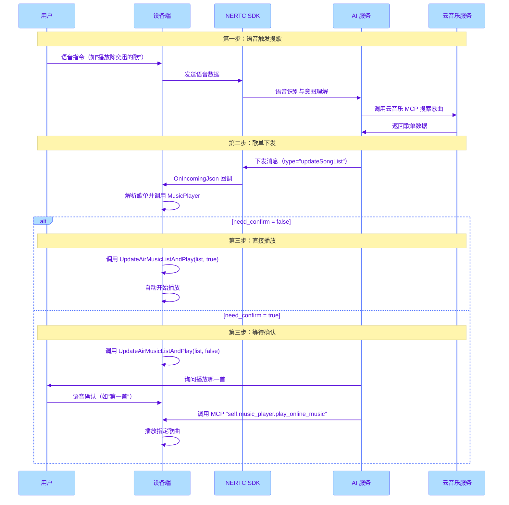

本文介绍如何在嵌入式设备上实现云音乐播放功能，包括云端歌单获取、端侧播放器实现以及相关权限配置。

## 前提条件

根据本文操作前，请确保您已经完成了以下工作：

- [基础实现流程](https://doc.yunxin.163.com/ai-hardware/guide/jUyMDgyNTQ?platform=client)。
- [AEC 方案配置](https://doc.yunxin.163.com/emotional-ai/guide/TY2MjA2ODA?platform=client)。
- 确保设备适配的是乐鑫 ESP32 S3 芯片。
- 采用 ESP-IDF 5.4.1 或 5.4.2 版本开发。

<style>
table th:first-of-type {width: 35%;}
</style>

## 功能概述

云音乐播放功能允许用户通过语音指令播放网易云音乐正版歌曲，支持以下能力：

- **语音搜歌**：通过语音指令触发云端 MCP 进行歌曲搜索
- **歌单播放**：支持播放每日推荐、指定歌手歌曲、专辑等
- **播放控制**：支持上一首、下一首、暂停、停止等播放操作
- **二次确认**：支持歌单搜索后的二次对话确认播放
- **自动连播**：支持歌单内歌曲自动顺序播放

## 权限开通

网易云音乐播放功能需要开通相关权限，请按以下步骤操作：

1. **开通授权**：联系您的网易智企-云信客户经理购买网易云音乐版 License，并提供设备的 Mac 地址。
2. **配置智能体**：开通授权后，在 [智能体平台](https://rtc-agent-console.netease.im) 中为对应的智能体开启云音乐 MCP。详细步骤，请参考 [配置智能体](https://doc.yunxin.163.com/emotional-ai/guide/TU3MjE3NjE?platform=client#%E7%AC%AC%E4%B8%89%E6%AD%A5%E5%88%9B%E5%BB%BA%E6%88%96%E5%A4%8D%E5%88%B6%E6%99%BA%E8%83%BD%E4%BD%93)。

    

    ::: note note
    云音乐功能使用网易云音乐正版曲库，需要确保设备已开通网易云音乐版 License，否则无法正常播放。
    :::

## 体验 Demo

您可以参考 GitHub 开源工程 [`nertc-esp32-demo`](https://github.com/netease-im/nertc-esp32-demo) 体验网易云音乐播放功能，具体步骤如下：

1. 参考上文完成 [权限开通](#权限开通)。
2. 在 [智能体平台](https://rtc-agent-console.netease.im) 注册设备时，设置设备的自定义属性：
   ```JSON
   { "neteaseCloudMusic": true }
   ```
    

3. 拉取 [`nertc-esp32-demo`](https://github.com/netease-im/nertc-esp32-demo) 代码工程。
4. 在 ESP-IDF 的 `menuconfig` 中启用 `CONFIG_USE_MUSIC_PLAYER`：
   ```
   Component config → Application → [*] Enable Music Player
   ```
5. 编译工程并烧录到硬件设备中。
6. 设备连接成功后，开启对话，说出语音指令（如"播放生日快乐歌"）开始体验功能。

## 交互流程



## 云端搜索与歌单下发

### 消息格式

当用户通过语音指令触发云端音乐搜索后，服务端会通过 `OnIncomingJson` 回调下发歌单数据。您需要处理 `type` 为 `updateSongList` 的回调数据，数据格式如下：

```JSON
{
    "type": "updateSongList",
    "songList": "{\"need_confirm\":false,\"song_list\":[{\"index\":0,\"name\":\"歌曲名\",\"url\":\"http://...\",\"album\":\"专辑名\",\"artist\":\"歌手名\"}]}"
}
```

:::note note
`songList` 字段是一个 JSON 字符串，需要二次解析。
:::

### songList 字段说明

| 字段 | 类型 | 说明 |
|------|------|------|
| `need_confirm` | bool | 是否需要二次对话确认播放某一首歌曲 |
| `song_list` | array | 歌曲列表数组 |
     `index` | int | 歌曲在列表中的索引（从 0 开始） |
     `name` | string | 歌曲名称 |
     `url` | string | 歌曲播放地址（MP3 格式） |
     `album` | string | 专辑名称 |
     `artist` | string | 歌手名称 |

### 回调处理示例

具体实现请参考开源工程中 [`application.cc`](https://github.com/netease-im/nertc-esp32-demo/blob/main/main/application.cc) 中处理 `updateSongList` 消息示例。

### 歌单解析实现

具体实现请参考开源工程中 [`application_nertc.cc`](https://github.com/netease-im/nertc-esp32-demo/blob/main/main/application_nertc.cc) 的 `ParseSongListFromJson` 函数。

## 实现端侧播放器

### 播放器文件结构

播放器源码位于开源工程中 [`main/music_player`](https://github.com/netease-im/nertc-esp32-demo/tree/main/main/music_player) 目录下，目录包含以下文件：

| 文件 | 说明 |
|------|------|
| `music_player.h` | 播放器统一外部调用入口，包含 `MusicInfo` 数据结构、`MusicPlayer` 单例类和 `MusicListManager` 类 |
| `music_player.cc` | 播放器核心实现，包括 MCP 工具注册、音频格式转换等 |
| `mp3_online_player.h` | 在线 MP3 流式播放器头文件 |
| `mp3_online_player.cc` | 在线 MP3 流式播放器实现，支持 HTTP 流式下载和解码 |
| `music_player_api.h` | 本地音乐播放 API 头文件 |
| `music_player_api.c` | 本地音乐播放实现 |

### 依赖组件

在 `idf_component.yml` 中添加以下依赖：

```yaml
dependencies:
  # MP3 解码库（必需）
  chmorgan/esp-libhelix-mp3:
    version: "*"
  
  # 本地播放支持（可选）
  espressif/esp_audio_simple_player: ^0.9.5
```

### 核心数据结构

**`MusicInfo`**

```C++
struct MusicInfo {
    std::string name;    // 歌曲名称
    std::string uri;     // 播放地址（HTTP URL 或本地路径）
    std::string album;   // 专辑名称
    std::string artist;  // 歌手名称
};
```

**`MusicListManager`**

`MusicListManager` 类负责管理歌单列表，支持云端歌单和本地歌单：

```C++
class MusicListManager {
public:
    // 设置云端歌单并重置播放位置
    void SetAirMusicList(const std::vector<MusicInfo>& music_list);
    
    // 缓存歌单（等待确认后播放）
    void CacheAirMusicList(const std::vector<MusicInfo>& music_list);
    
    // 从缓存中按索引播放
    bool PlayCachedAirMusicByIndex(int index);
    
    // 获取当前/上一首/下一首歌曲
    MusicInfo GetCurrentAirMusic();
    MusicInfo GetPreviousAirMusic();
    MusicInfo GetNextAirMusic();
    
    // 判断是否为歌单最后一首
    bool CurrentLastMusicOnList(bool is_air_music);
};
```

### 核心 API

**`Initialize`**

初始化播放器，注册 MCP 工具。

```C++
int MusicPlayer::Initialize(AudioCodec* codec, 
                            AudioService* audio_service, 
                            std::string sd_card_music_path = "");
```

**参数说明**

| 参数 | 类型 | 说明 |
|------|------|------|
| `codec` | `AudioCodec*` | 音频编解码器实例 |
| `audio_service` | `AudioService*` | 音频服务实例 |
| `sd_card_music_path` | `std::string` | SD 卡音乐路径（可选） |

**`UpdateAirMusicListAndPlay`**

更新歌单并控制播放。

```C++
void MusicPlayer::UpdateAirMusicListAndPlay(const std::vector<MusicInfo>& music_list, 
                                             bool play_now);
```

**参数说明**

| 参数 | 类型 | 说明 |
|------|------|------|
| `music_list` | `const std::vector<MusicInfo>&` | 解析后的歌单列表 |
| `play_now` | `bool` | 是否立即播放 |

**行为说明**

- 当 `play_now` 为 `true` 时：清除缓存，设置歌单，立即开始播放第一首
- 当 `play_now` 为 `false` 时：将歌单存入缓存，等待 MCP 调用触发播放

### 注册 MCP 工具

`MusicPlayer::Initialize` 会自动注册以下 MCP 工具：

| MCP 名称 | 功能说明 | 参数 |
|----------|----------|------|
| `self.music_player.play_online_music` | 播放指定索引的歌曲 | `index`: 歌曲索引（0-based） |
| `self.music_player.stop_music` | 停止播放 | 无 |
| `self.music_player.next_music` | 播放下一首 | 无 |
| `self.music_player.previous_music` | 播放上一首 | 无 |

:::note note
**play_online_music MCP 说明**

该工具用于在用户确认后播放指定歌曲。AI 会将用户的语音指令（如"第一首"、"播放第 2 个"）转换为 0-based 索引：

- 用户说"第一首" 转换为 `index = 0`
- 用户说"第二首" 转换为 `index = 1`
- 用户说"1" 转换为 `index = 0`
:::

### 实现自动连播

播放器通过 `PlayStateCallback` 监听播放状态，当一首歌播放完成后自动播放下一首，源码示例位于开源工程中 [`music_player.cc`](https://github.com/netease-im/nertc-esp32-demo/blob/main/main/music_player/music_player.cc) 文件：

```C++
void MusicPlayer::PlayStateCallback(music_player_state_t state) {
    std::lock_guard<std::mutex> lock(call_back_mutex_);
    current_state_ = state;
    
    if (current_state_ == MUSIC_PLAYER_STATE_FINISHED || 
        current_state_ == MUSIC_PLAYER_STATE_ERROR) {
        // 如果不是最后一首，自动播放下一首
        if (!CurrentPlayingLastMusic() && is_air_music_playing_) {
            PlayNextAirMusic();
        }
    }
}
```

### 打断处理

当需要打断当前播放时（如用户开始新的对话），调用 `InterruptPlay`，源码示例位于开源工程中 [`music_player.h`](https://github.com/netease-im/nertc-esp32-demo/blob/main/main/music_player/music_player.h) 文件：

```C++
void MusicPlayer::InterruptPlay() {
    if (!initialed) return;
    
    StopAirPlay();  // 停止在线播放流
    if (current_state_ == MUSIC_PLAYER_STATE_PLAYING) {
        StopPlay();  // 停止本地播放
    }
}
```

## 集成步骤

### 第一步：启用音乐播放功能

在乐鑫 ESP-IDF（Espressif IoT Development Framework Configuration）`menuconfig` 中启用 `CONFIG_USE_MUSIC_PLAYER`：

```
xiaozhi assistant → [*] ENABLE MUSIC PLAYER
```

### 第二步：初始化播放器

在 `Application::Initialize` 中初始化 MusicPlayer：

```C++
#ifdef CONFIG_USE_MUSIC_PLAYER
    MusicPlayer::GetInstance().Initialize(audio_codec_, audio_service_, "");
#endif
```

### 第三步：处理歌单消息

确保在 `OnIncomingJson` 回调中处理 [`updateSongList`](https://github.com/netease-im/nertc-esp32-demo/blob/main/main/application.cc) 消息。

### 第四步：打断处理

在 AI 对话开始时打断音乐播放：

```C++
void Application::OnAIDialogStart() {
#ifdef CONFIG_USE_MUSIC_PLAYER
    MusicPlayer::GetInstance().InterruptPlay();
#endif
}
```