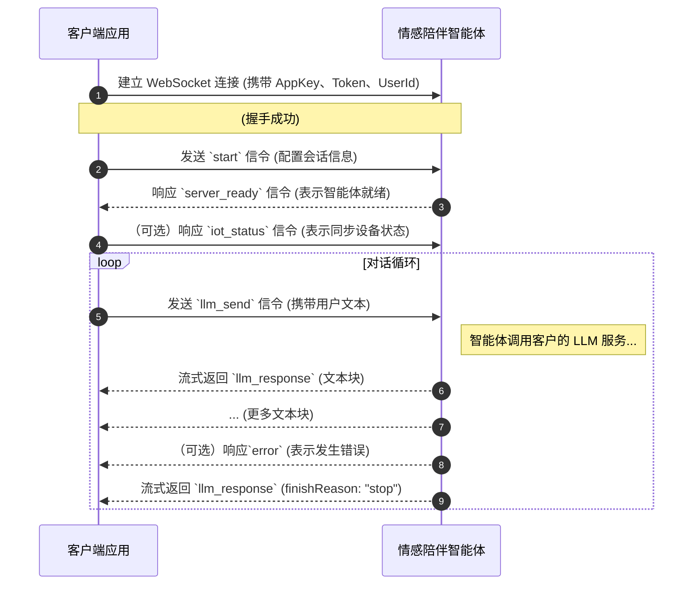
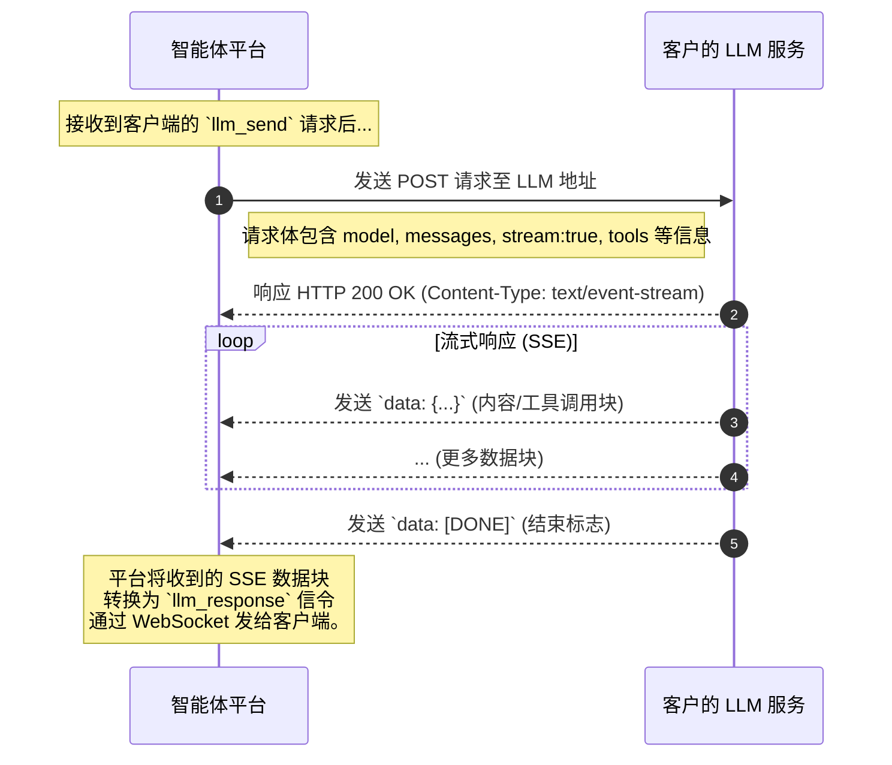

本文介绍如何通过 WebSocket 协议接入网易云信情感陪伴智能体，实现与云端服务的实时通信。通过 WebSocket 接入，您可以快速为应用添加富有情感、具备记忆且可与外部工具交互的智能体能力。
<style>
table th:first-of-type {width: 20%;}
</style>
## 适用范围

本文适用于仅采用部分智能体能力的客户场景，如需采用全部能力，请访问 [情感陪伴智能体](https://doc.yunxin.163.com/emotional-ai/guide/DM4Mzc5NDk?platform=client) 官网文档：

1. **长期记忆**：智能体能够记忆与用户的历史交互关键信息，在后续对话中提供更具个性化和连贯性的体验。
2. **亲密度**：平台内置亲密度计算模型，能够根据对话内容动态调整智能体的回应方式和语气，建立更深层次的情感连接。
3. **情绪识别**：通过分析用户输入的文本，智能体可以识别用户当前的情绪，并作出相应的情感回应。

为确保灵活性和可扩展性，智能体平台采用开放式架构设计。在集成过程中：

- **网易云信提供**：
    - 标准化的智能体平台服务，包含上述三大核心能力。
    - 稳定、高效的 **WebSocket API**，用于您的客户端与平台进行实时通信。
    - 一个遵循 **OpenAI 标准的接口规范**，用于平台调用您指定的大语言模型（LLM）。

- **客户提供**：
    - **客户端应用**：负责与用户交互，并集成网易云信的 WebSocket API。
    - **大语言模型**：您需要自行部署或采购一个符合 **OpenAI API 规范** 的大语言模型服务。平台将通过标准接口调用该模型，以实现对话生成能力。您可以自由选择和更换 LLM 供应商。
    - **RTC 服务**：如您的业务涉及音视频通话，需自行部署 RTC 服务。

<!-- **不包含项（重要说明）**

为避免误解，请注意当前版本的交付范围 **不包含** 以下内容：

- **故事引擎**：一个用于驱动复杂剧情和多轮对话的独立模块。该功能计划在未来版本中迭代，届时可作为增值服务提供。
- **MCP 工具市场**：平台不提供预置的工具市场。但平台完全支持 **工具调用 (Function Calling)**，您可以根据自身业务需求，通过接口注册和使用自定义工具。
- **历史消息存储**：默认情况下，平台不存储用户的完整历史消息。如您需要此服务，可另行协商，在您授权后由网易提供存储方案。-->

## 准备工作

根据本文操作前，请确保您已经在智能体平台上，创建了一个智能体、并为智能体添加了至少一个用户。详细步骤请参考 [配置智能体](https://doc.yunxin.163.com/emotional-ai/guide/zIzNTI4MDQ?platform=client)。

## 客户端与智能体平台对接

您的客户端应用需要通过 WebSocket 协议与智能体平台建立长连接，以进行实时的文本交互。交互流程如下：



<!-- #### 交互流程

1. **Client -> Server**：发送 `start` 信令，初始化对话。
2. **Server -> Client**：返回 `server_ready` 信令，表示智能体准备就绪。
3. **Client -> Server**：(可选) 发送 `iot_status` 信令，同步设备状态。
4. **Client -> Server**：发送 `llm_send` 信令，传递用户输入的文本。
5. **Server -> Client**：流式返回 `llm_response` 信令，包含智能体的回复。
6. **Server -> Client**：当发生错误时，返回 `error` 信令。 -->

### 连接鉴权

- **URL**：`wss://rtc-agent.yunxinapi.com/v1/chat/websocket/completions`
- **鉴权方式**：通过 HTTP Header 进行 Token 鉴权。

建立 WebSocket 连接时，请务必在请求头中携带以下字段：

```
AppKey: <您的网易云信 AppKey>
Token: <您的 Token>
UserId: <当前对话的用户 userId>
```

- **AppKey**：请在 [网易云信控制台](https://app.yunxin.163.com/global/home) 申请 `appkey`，获取鉴权密钥 `appsecret`。
- **Token**：Token 的计算方式请参考网易云信 [NERTC Token 生成文档](https://doc.yunxin.163.com/nertc/server-apis/TcxNDAxMTI?platform=server)。请注意，在生成用于智能体的 Token 时，`channelName` 应设置为空字符串 `""`，`uid` 应设置为当前对话用户的 `userId`。这是因为该 Token 用于平台级鉴权，而非进入某个具体的 RTC 音视频房间。

### 协议规范

连接建立后，双方通过 JSON 格式的信令进行通信。所有信令都包含一个 `action` 字段来标识其类型。

#### [Client -> Server] `start`

连接成功后，客户端必须发送的第一条信令，用于初始化并配置对话会话。

- **示例**：

    ```JSON
    {
        "action": "start",
        "data": {
            "parameters": {
                "chatSessionId": "session-unique-id-12345",
                "userId": "customer-user-001",
                "agentId": "your-agent-id-from-us"
            }
        }
    }
    ```

- **参数说明**：

    参数名 | 类型 | 是否必选 | 说明 |
    :--- | :--- | :--- | :--- |
    `chatSessionId` | String | 是 | 唯一会话 ID，用于标识一次完整的对话过程。该参数取值由客户自定义。 |
    `agentId` | String | 是 | 由网易云信分配给您的智能体 ID。该参数取值来自您创建的情感陪伴智能体 ID。 |
    `userId` | String | 是 | 您的终端用户的唯一标识，最大长度 32 字符，只允许字母、数字以及 "_@.-"。该参数取值来自您为智能体关联的用户。 |
    `userProperties` | Object | 否 | 终端用户属性。 |
      `ip` | string | 否 | 用户所属 IP，用于查询天气等地理位置相关场景。支持 IPv4 和 IPv4，例如 1.2.2.2 或者 2409:8c6a:b021:1400:0:24:0:115。 |
      `preContext` | object | 否 | 会话级别上下文，最多 40 条。示例：<br>`[{"role": "user", "content": "你好，你是谁？"},{"role": "assistant", "content": "我是你的 AI 助手。"}]`<br> `"role"："user"` 表示用户输入，`"role"："assistant"` 表示模型输出。 |
      `promptKeyWord` | object | 否 | 会话级别环境变量，最多设置 30 个 变量。示例：<br>`{"key1": "value1", "key2": "value2"}`<br> `key` 最多支持 100 个字符，`value` 最多支持 512 个字符。 |

#### [Server -> Client] `server_ready`

服务器对 `start` 信令的响应，表示智能体已准备好接收对话数据。

- **示例**：

    ```JSON
    {
        "action": "server_ready",
        "data": {
            "code": 0,
            "message": "OK",
            "connectionId": "c70cde776a074170bb5d2701cfd8691f" // 本次 WebSocket 连接的唯一标识，主要用于日志追踪和问题排查。客户端无需处理此字段。
        }
    }
    ```

#### [Client -> Server] `iot_status` (可选)

用于客户端向智能体同步外部设备或应用的状态。及时上报此状态有助于大模型在进行工具调用时做出更精准的决策。

- **示例**：

    ```JSON
    {
        "action": "iot_status",
        "data": {
            "iotStatus": [
                {
                    "name": "SetVolume",
                    "status": {
                        "volume": 50
                    }
                }
            ]
        }
    }
    ```

#### [Client -> Server] `llm_send`

用于向智能体发送用户的文本输入。

- **示例**：

    ```JSON
    {
        "action": "llm_send",
        "data": {
            "chatId": 1,
            "text": "你好呀！"
        }
    }
    ```

- **参数说明**

    参数名 | 类型 | 是否必选 | 说明 |
    :--- | :--- | :--- | :--- |
    `chatId` | Integer | 是 | 单次请求的唯一 ID，服务器的 `llm_response` 中会原样返回，用于请求-响应的匹配。 |
    `text` | String | 是 | 用户输入的文本内容。 |

#### [Server -> Client] `llm_response`

智能体对 `llm_send` 的响应，以流式（多个 `llm_response` 消息）方式返回。

- **普通文本响应示例** (流式返回的其中一个消息)：

    ```JSON
    {
        "action": "llm_response",
        "data": {
            "chatId": 1,
            "choices": [{
                "delta": {
                    "content": "嗨~今天过得怎么样？",
                    "role": "assistant"
                }
            }],
            "finishReason": null
        },
        "connectionId": "ai1eb0b5c9980f43b586ac67343baab2ae"
    }
    ```

- **工具调用 (Function Call) 响应示例**：

    当大模型判断需要调用您在智能体平台注册的工具时，会返回此格式。有关注册工具的方式，请参考 [配置智能体](https://doc.yunxin.163.com/emotional-ai/guide/TU3MjE3NjE?platform=client#%E7%AC%AC%E4%B8%89%E6%AD%A5%E5%88%9B%E5%BB%BA%E6%88%96%E5%A4%8D%E5%88%B6%E6%99%BA%E8%83%BD%E4%BD%93)。

    ```JSON
    {
        "action": "llm_response",
        "data": {
            "chatId": 1,
            "choices": [{
                "delta": {
                    "content": null,
                    "role": "assistant",
                    "tool_calls": [{
                        "function": {
                            "arguments": "{\"volume\": 80}",
                            "name": "SetVolume"
                        },
                        "id": "call_abc123xyz",
                        "type": "function"
                    }]
                }
            }],
            "finish_reason": "tool_calls"
        },
        "connectionId": "ai1eb0b5c9980f43b586ac67343baab2ae"
    }
    ```

    > **注意**：收到 `tool_calls` 后，您的客户端应执行相应的本地函数（如调整音量）。为了让对话历史对模型更友好，建议您将工具执行结果包装成一句描述性文本，如 **音量已调整到 80**，模拟成用户的自然反馈，然后通过 `llm_send` 发送。模型将基于此反馈继续对话。

    ```mermaid
    sequenceDiagram
    autoNumber
        participant ClientApp as 客户端应用
        participant AgentPlatform as 智能体平台

        ClientApp->>AgentPlatform: 发送 `llm_send` 信令 (例如: **把音量调大点")

        Note right of AgentPlatform: 平台请求 LLM, LLM 判断需调用工具

        AgentPlatform-->>ClientApp: 响应 `llm_response` (含 tool_calls, finishReason: "tool_calls")

        Note left of ClientApp: 客户端解析 tool_calls, <br/>执行本地函数 (如 SetVolume(80))

        ClientApp->>AgentPlatform: 发送 `llm_send` 信令 (携带执行结果的描述文本, 如: "音量已调整到 80")

        Note right of AgentPlatform: 平台将结果告知 LLM, <br/>LLM 生成最终回复

        AgentPlatform-->>ClientApp: 流式返回 `llm_response` (最终回复, 如: "好的，音量已经为你调高了。")
        AgentPlatform-->>ClientApp: ... (finishReason: "stop")
    ```

- **对话结束标志**：

    当一次完整的回答结束后，`finishReason` 字段会被标记为 `stop`。

    ```JSON
    {
        "action": "llm_response",
        "data": {
            "chatId": 1,
            "finishReason": "stop"
        },
        "connectionId": "ai1eb0b5c9980f43b586ac67343baab2ae"
    }
    ```

#### [Server -> Client] `error`

当交互过程中出现任何错误时，服务器会发送此信令。

- **示例**：

    ```JSON
    {
        "action": "error",
        "code": 10400,
        "message": "Invalid parameters in 'start' message."
    }
    ```

## 客户自研大模型 (LLM) 对接

智能体需要调用您提供的大语言模型服务来生成对话内容。您需要提供一个 **符合 OpenAI `chat/completions` API 规范** 的 HTTPS 服务接口。



### 配置您的 LLM 服务

在 [智能体平台](https://rtc-agent-console.netease.im/#/home)，您需要配置以下三个参数，以将您的大模型服务接入网易云信智能体平台。详细的智能体配置说明，请参考 [配置智能体](https://doc.yunxin.163.com/emotional-ai/guide/TU3MjE3NjE?platform=client)。


| 配置项 | 说明 | 示例值 |
| :--- | :--- | :--- |
| **LLM 地址** | 您模型服务的地址。 | `https://api.your-llm-provider.com/v1/chat/completions` |
| **LLM API Key** | 用于访问您模型服务的鉴权密钥。 | `sk-xxxxxxxxxxxxxxxxxxxx` |
| **自定义模型** | 您模型的名称，将用于请求中的 `model` 字段。 | `my-llm-v1` |

### API 请求格式 (平台 -> 您的 LLM)

在每次对话中，网易云信智能体平台会向您的 `URL` 地址发送一个 **POST** 请求。请求体格式如下：

```JSON
{
  "model": "my-llm-v1", // 您在后台配置的 Model Name
  "messages": [
    // 历史对话上下文，平台会自动管理
    { "role": "user", "content": "我想听个笑话" },
    { "role": "assistant", "content": "好的，从前有座山..." },
    { "role": "user", "content": "今天天气怎么样？" }
  ],
  "stream": true, // 平台固定使用流式请求
  "tools": [ /* 您在智能体平台中定义的工具列表 */ ],
  // ... 其他标准 OpenAI 参数
}
```

### API 响应格式 (您的 LLM -> 平台)

您的服务需要以 **流式 (Server-Sent Events)** 方式返回响应，`Content-Type` 应为 `text/event-stream`。

每一条消息都以 `data: ` 开头，以 `\n\n` 结尾。

- **内容块 (Content Chunk)**

    ```
    data: {"id":"chatcmpl-xxx","object":"chat.completion.chunk","created":1732168573,"model":"my-llm-v1","choices":[{"index":0,"delta":{"content": "当" },"finish_reason":null}]}
    ```

- **工具调用块 (Tool Call Chunk)**

    ```
    data: {"id":"chatcmpl-xxx","object":"chat.completion.chunk","created":1732168573,"model":"my-llm-v1","choices":[{"index":0,"delta":{"tool_calls":[{"index":0,"id":"call_abc123","type":"function","function":{"name":"SetVolume","arguments":"{\"vo"}}}]},"finish_reason":null}]}
    ```

- **结束标志**

    所有内容传输完毕后，必须发送一条 `[DONE]` 消息。

    ```
    data: [DONE]
    ```

### 示例：实现一个兼容的服务

以下是一个简单的 Python Flask 应用，演示了如何构建一个符合规范的 LLM 服务端点。

```Python
import json
import time
from flask import Flask, request, Response

app = Flask(__name__)

# 请替换为您自己的 API Key
EXPECTED_API_KEY = "sk-xxxxxxxxxxxxxxxxxxxx"

@app.route('/v1/chat/completions', methods=['POST'])
def chat_completions():
    # 1. 鉴权
    auth_header = request.headers.get('Authorization')
    if not auth_header or auth_header.split()[1] != EXPECTED_API_KEY:
        return {"error": "Unauthorized"}, 401

    request_data = request.json
    model_name = request_data.get('model')

    # 2. 检查是否是流式请求
    if not request_data.get('stream'):
        return {"error": "Only stream=True is supported."}, 400

    def generate_stream_response():
        # 模拟 LLM 思考和流式输出
        response_text = "这是一个模拟的 AI 助手响应，用于演示流式输出效果。"

        for i, char in enumerate(response_text):
            chunk = {
                "id": f"chatcmpl-mock-{int(time.time())}",
                "object": "chat.completion.chunk",
                "created": int(time.time()),
                "model": model_name,
                "choices": [{
                    "index": 0,
                    "delta": {"content": char},
                    "finish_reason": None
                }]
            }
            yield f"data: {json.dumps(chunk)}\n\n"
            time.sleep(0.05) # 模拟延迟

        # 发送结束标志
        final_chunk = {
            "id": f"chatcmpl-mock-{int(time.time())}",
            "object": "chat.completion.chunk",
            "created": int(time.time()),
            "model": model_name,
            "choices": [{"index": 0, "delta": {}, "finish_reason": "stop"}]
        }
        yield f"data: {json.dumps(final_chunk)}\n\n"

        yield "data: [DONE]\n\n"

    return Response(generate_stream_response(), content_type='text/event-stream')

if __name__ == '__main__':
    # 建议使用生产级的 WSGI 服务器（如 Gunicorn）来运行
    app.run(host='0.0.0.0', port=8080)
```