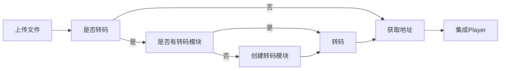
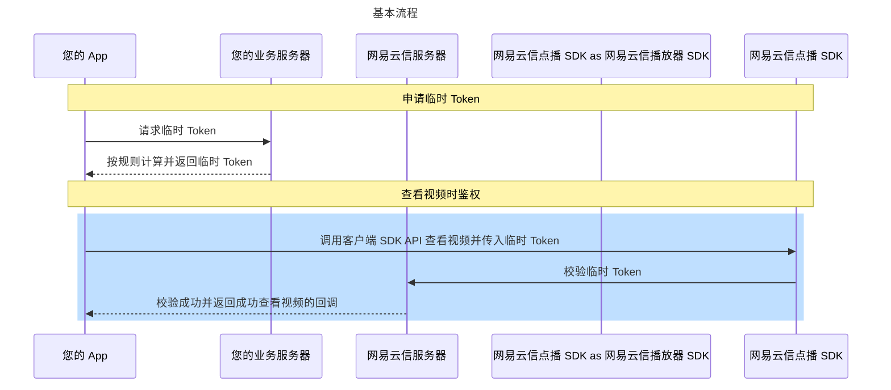

本文介绍网易云信点播服务端接口的调用相关信息，方便您了解如何使用点播服务端接口。

## <span id="接口频率说明">频率说明</span>

每个接口频率限制为 80 次/秒。

## <span id="接口调用流程示意">调用流程</span>

网易云信点播相关接口调用流程如下所示：



<!--  -->

## <span id="请求说明">请求说明</span>

<style>
table th:first-of-type {
    width: 20%;
}
</style>

| 请求信息 | 说明 | 特殊情况
| --- | --- | --- |
| **<span id="服务地址">服务地址</span>** | 网易云信点播服务使用的域名访问地址为：`vcloud.163.com`。 | 如果是海外应用，需要替换为 `api-sea.yunxinvcloud.com`。 |
| **<span id="通信协议">通信协议</span>** | 所有接口均通过 HTTPS 通信，提供高安全性的通信通道。| [获取上传加速节点](https://doc.yunxin.163.com/vod/server-apis/jgwNjczMjU?platform=server#%E8%8E%B7%E5%8F%96%E4%B8%8A%E4%BC%A0%E5%9C%B0%E5%9D%80) 和 [断点续传查询断点](https://doc.yunxin.163.com/vod/server-apis/jgwNjczMjU?platform=server#%E6%9F%A5%E8%AF%A2%E9%95%BF%E4%BC%A0%E6%96%AD%E7%82%B9) 接口只支持 HTTP 通信。
| **<span id="请求方法">请求方法</span>** | 所有接口都只支持 POST 请求。 | [获取上传加速节点](https://doc.yunxin.163.com/vod/server-apis/jgwNjczMjU?platform=server#%E8%8E%B7%E5%8F%96%E4%B8%8A%E4%BC%A0%E5%9C%B0%E5%9D%80) 和 [断点续传查询断点](https://doc.yunxin.163.com/vod/server-apis/jgwNjczMjU?platform=server#%E6%9F%A5%E8%AF%A2%E9%95%BF%E4%BC%A0%E6%96%AD%E7%82%B9) 接口为 GET 请求。
| **<span id="字符编码">字符编码</span>** | 所有接口均使用 UTF-8 编码。 | - |

## <span id="公共参数">公共参数</span>

### <span id="请求参数">请求参数</span>

除 [获取上传加速节点](https://doc.yunxin.163.com/vod/server-apis/jgwNjczMjU?platform=server#%E8%8E%B7%E5%8F%96%E4%B8%8A%E4%BC%A0%E5%9C%B0%E5%9D%80)、[文件数据上传](https://doc.yunxin.163.com/vod/server-apis/jgwNjczMjU?platform=server#%E5%AA%92%E8%B5%84%E4%B8%8A%E4%BC%A0)、[断点续传查询断点](https://doc.yunxin.163.com/vod/server-apis/jgwNjczMjU?platform=server#%E6%9F%A5%E8%AF%A2%E9%95%BF%E4%BC%A0%E6%96%AD%E7%82%B9) 三个接口外，所有点播接口均 **必须** 放置以下公共参数在请求头中，用于标识用户和接口鉴权。后续的接口说明不再对这些参数进行说明，但每次发起请求均需要携带。

| 参数 | <div style="width:60px">数据类型</div> | 说明 |
| ---- | ---- |  ---- |
| AppKey | String | 网易云信控制台上创建应用后为分配的 AppKey。登录 [网易云信控制台](https://app.yunxin.163.com/global/home)，单击应用名称后，进入应用配置页面，即可在 **AppKey 管理** 页签下查看 AppKey 和 AppSecret。<br>|
| Nonce | String |  随机数（随机数，最大长度 128 个字符）。 |
| CurTime | String | 当前 UTC 时间戳，从 1970 年 1 月 1 日 0 点 0 分 0 秒开始到现在的秒数。 |
| CheckSum | String | 哈希算法计算签名参数，服务端认证校验凭证。通过将三个参数（AppSecret、Nonce、CurTime）拼接在一起，然后对拼接后的字符串进行 SHA1 哈希算法处理，生成一个签名值。16 进制字符小写。计算示例见下文 [CheckSum 示例](#接口鉴权)。 <note type="notice">本文中提供的所有接口均面向开发者服务器端调用。请妥善保管用于计算 `CheckSum` 的 `AppSecret`。可在应用的服务器端存储和使用，但不应存储或传递到客户端，也不应在网页等前端代码中嵌入。</note> |

<a id="接口鉴权"></a>

以 Java 语言为例，生成 `CheckSum` 的示例代码如下：

```Java
import java.security.MessageDigest;
public class CheckSumBuilder {
    public static String getCheckSum(String appSecret, String nonce, String curTime) {
        return encode("sha1", appSecret + nonce + curTime);
    }
    private static String encode(String algorithm, String value) {
        if (value == null) {
            return null;
        }
        try {
            MessageDigest messageDigest = MessageDigest.getInstance(algorithm);
            messageDigest.update(value.getBytes());
            return getFormattedText(messageDigest.digest());
        } catch (Exception e) {
            throw new RuntimeException(e);
        }
    }
    private static String getFormattedText(byte[] bytes) {
        int len = bytes.length;
        StringBuilder buf = new StringBuilder(len * 2);
        for (int j = 0; j < len; j++) {
            buf.append(HEX_DIGITS[(bytes[j] >> 4) & 0x0f]);
            buf.append(HEX_DIGITS[bytes[j] & 0x0f]);
        }
        return buf.toString();
    }
    private static final char[] HEX_DIGITS = { '0', '1', '2', '3', '4', '5', '6', '7', '8', '9', 'a', 'b', 'c', 'd', 'e', 'f' };
}
```

### <span id="返回参数">返回参数</span>

所有接口返回类型为 JSON。返回字段如下：

| 名称 | 数据类型 | 说明 |
| ---- | ---- | ---- |
| code | Int | 返回结果的状态码。 |
| ret | String | 返回的结果集。 |
| msg | String | 当返回结果的状态码不为 200 时，包含的错误信息。 |

:::note note
[获取上传加速节点](https://doc.yunxin.163.com/vod/server-apis/jgwNjczMjU?platform=server#%E8%8E%B7%E5%8F%96%E4%B8%8A%E4%BC%A0%E5%9C%B0%E5%9D%80)、[文件数据上传](https://doc.yunxin.163.com/vod/server-apis/jgwNjczMjU?platform=server#%E5%AA%92%E8%B5%84%E4%B8%8A%E4%BC%A0)、[断点续传查询断点](https://doc.yunxin.163.com/vod/server-apis/jgwNjczMjU?platform=server#%E6%9F%A5%E8%AF%A2%E9%95%BF%E4%BC%A0%E6%96%AD%E7%82%B9) 三个接口，无以上公共返回参数。
:::

## 临时 Token

部分场景下，客户端需要使用临时 Token 才能识别开发者身份，从而建立与服务端通信。

### 实现流程

您可以在您的业务服务器中，根据规则自行计算临时 Token。流程如下所示：



流程说明如下：

1. 客户端向应用服务器发起安全认证签名的请求。

    该步骤交互由您自行完成。

2. 应用服务器根据规则自行计算出临时 Token 并返回给客户端。

    该步骤由您自行实现，相应的示例代码和实现方式请参考 [生成 Token](#生成Token)。

3. 客户端通过以上步骤获取临时 Token 之后，可以携带临时 Token 查看视频。

### **<span id="生成Token">**生成 Token**</span>**

生成临时 Token 的关键参数说明如下表所示。

参数 | 类型 | 描述
---- | ---- | ----
curTime | Long | 当前 Unix 时间戳，从 1970 年 1 月 1 日 0 点 0 分 0 秒开始到现在的秒数。单位为毫秒，若传参有误会导致报错 414。 |
ttl | Integer | 临时 Token 过期时间，单位为秒，最大为 86400 秒（1 天）。 |
appKey | String | 请登录网易云信控制台查看您的应用对应的 `AppKey` 和 `AppSecret`，具体请参考 [创建应用并获取 AppKey](https://doc.yunxin.163.com/console/guide/TIzMDE4NTA?platform=console#%E8%8E%B7%E5%8F%96%E5%87%AD%E8%AF%81)。 |
appSecret | String | ^^ |

### 示例代码

以 Java 语言为例，生成 Token 的示例代码如下：

```Java
public String getTokenWithCurrentTime(String appKey, String appSecret, int ttlSec, long curTimeMs) throws Exception {
    if (ttlSec <= 0) {
        ttlSec = defaultTTLSec;
    }
    DynamicToken tokenModel = new DynamicToken();
    //生成 signature，将 appkey、curTime、ttl、appsecret 四个字段拼成一个字符串，进行 sha1 编码
    tokenModel.signature = sha1(String.format("%s%s%s%s", appKey, curTimeMs, ttlSec, appSecret));
    tokenModel.curTime = curTimeMs;     //获取当前时间戳，单位为毫秒
    tokenModel.ttl = ttlSec;      //设置 Token 的过期时间，单位为秒
    ObjectMapper objectMapper = new ObjectMapper();
    String signature = objectMapper.writeValueAsString(tokenModel);
    return Base64.getEncoder().encodeToString(signature.getBytes(StandardCharsets.UTF_8));   // 对 JSON 字符串进行 Base64 编码，返回生成的 Token 字符串
}

private String sha1(String input) throws NoSuchAlgorithmException {
    MessageDigest mDigest = MessageDigest.getInstance("SHA-1");
    byte[] result = mDigest.digest(input.getBytes(StandardCharsets.UTF_8));
    StringBuilder sb = new StringBuilder();
    for (byte b : result) {
        sb.append(String.format("%02x", b));
    }
    return sb.toString();
}

public static class DynamicToken {
    public String signature;
    public long curTime;
    public String appKey;
    public int ttl;
}
```

请求成功后，会得到如下返回参数。

```JSON
{
    "code": 200,
    "token": "eyJjdXJUaW1lIjoxN******lZDRhZTRhOGVjMWIwIiwidHRsIjozNjAwfQ=="
}
```