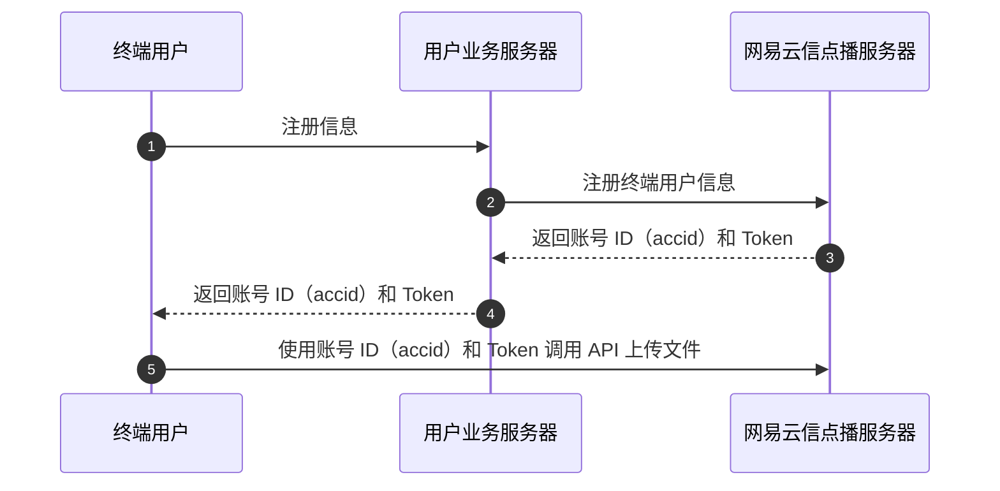

网易云信官网 API 适用于业务服务器调用，为满足业务服务器的终端用户上传视频以及点播加密等需求，网易云信提供了移动端终端用户的管理 API，方便企业管理其终端用户使用网易云信的服务。


::: note note
- 本文中 API 的调用方式和请求头参数均和 [接口概述](https://doc.yunxin.163.com/vod/server-apis/TU3MzkwNDk?platform=server) 一致。

- 网易云信支持使用账号 ID（`accid`）和 Token 和 AppKey 值作为 API 的请求头，替代 Nonce、CheckSum、CurTime、AppKey。
:::

<style>
table th:first-of-type {
    width: 15%;
}
table th:nth-of-type(2) {
    width: 15%;
}
</style>

## <span id="功能逻辑">功能逻辑</span>

以移动端上传为例，移动端上传适用于 Andriod 端和 iOS 端上传视频内容的场景，其使用方式是终端直接上传视频，上传完成后回调业务服务器，由业务服务器通知终端上传成功。

交互过程如图：



<!-- 

 -->
<!-- - 终端用户登录，注册终端信息至用户业务服务器。
- 用户业务服务器注册终端用户信息至网易云信 API 服务器。
- 业务服务器返回 accid 和 token 给终端用户。
- 终端用户使用 accid 和 token 调用 API 上传文件等。 -->

## <span id="创建终端用户">创建终端用户</span>

**<span id="接口描述">接口描述</span>**

- 域名：vcloud.163.com

- 接口名：/app/vod/thirdpart/user/create

用于业务服务器向网易云信注册其终端用户信息。

**<span id="输入参数">输入参数</span>**

| 参数 | 类型 | 是否必选 | 说明 |
| :---- | :---- | :---- | :---- |
| accid | String | 是 | 网易云信视频用户创建的其子用户账号 ID，最大长度 32 字符，必须保证唯一 |
| name | String | 否 | 网易云信视频用户创建的其子用户名称，最大长度 256 字符 |
| type | int | 是 | 网易云信视频用户创建其子用户的方式，1 表示由网易云信视频生成 token，<br/>2 表示由网易云信视频用户传入 token |
| props | String | 否 | JSON 属性，第三方可选填，最大长度 256 字符 |
| token | String | 否 | 网易云信视频用户可以指定其子用户登录 token 值，最大长度 128 字符，<br/>并更新，如果未指定，会自动生成 token，<br/>并在创建成功后返回，如果 type = 2，则必填 |

**<span id="输出参数">输出参数</span>**

| 参数 | 类型 | 说明 |
| :---- | :---- | :---- |
| code | Int | HTTP 状态码，详情请参考 [状态码](https://doc.yunxin.163.com/vod/server-apis/jg5MjczMzg?platform=server)。 |
| accid | String | 网易云信视频用户创建的其子用户账号 ID |
| name | String | 网易云信视频用户创建的其子用户名称 |
| token | String | 网易云信视频用户子用户的 token |
| props | String | JSON 属性，第三方可选填，最大长度 256 字符 |
| msg | String | 错误信息 |

**请求示例**

```cURL
curl -X POST -H "Content-Type: application/json;charset=utf-8" -H "AppKey: 027338bf****9d6af80b3" -H "Nonce: 1" -H "CurTime: 1465723418" -H "CheckSum: 61bbfd88c5102****e65a2abe7ae13" -d '{"accid":"227","name": "网易云信视频","type":1,"props":"test"}' https://vcloud.163.com/app/vod/thirdpart/user/create
```

**返回示例**

```JSON
    "Content-Type": "application/json; charset=utf-8"
    {
      "ret": {
        "accid":"227",
        "name": "网易云信视频",
        "token": "ioapfhoa****juopa",
        "props":"test",
      },
      "code": 200
    }
```

## <span id="更新终端用户">更新终端用户</span>

**<span id="接口描述">接口描述</span>**

- 域名：vcloud.163.com

- 接口名：/app/vod/thirdpart/user/update

用于业务服务器向网易云信更新其终端用户信息。

**<span id="输入参数">输入参数</span>**

| 参数 | 类型 | 是否必选 | 说明 |
| :---- | :---- | :---- | :---- |
| accid | String | 是 | 网易云信视频用户其子用户账号 ID，最大长度 32 字符，必须保证唯一 |
| name | String | 否 | 网易云信视频用户其子用户名称 |
| props | String | 否 | JSON 属性，第三方可选填，最大长度 256 字符 |
| token | String | 否 | 网易云信视频用户可以指定其子用户登录 token 值，最大长度 128 字符 |

**<span id="输出参数">输出参数</span>**

| 参数 | 类型 | 说明 |
| :---- | :---- | :---- |
| code | Int | HTTP 状态码，详情请参考 [状态码](https://doc.yunxin.163.com/vod/server-apis/jg5MjczMzg?platform=server)。 |
| accid | String | 网易云信视频用户创建的其子用户账号 ID |
| name | String | 网易云信视频用户创建的其子用户名称，最大长度 256 字 |
| token | String | 网易云信视频用户子用户的 token |
| props | String | JSON 属性，第三方可选填，最大长度 256 字符 |
| isUsed | Int | 该子用户是否被禁用，0 表示未被禁用，1 表示被禁用 |
| msg | String | 错误信息 |

**请求示例**

```cURL
curl -X POST -H "Content-Type: application/json;charset=utf-8" -H "AppKey: 027338bf****9d6af80b3" -H "Nonce: 1" -H "CurTime: 1465723418" -H "CheckSum: 61bbfd88c5102****e65a2abe7ae13" -d '{"accid":227, "name": "娱乐" }' https://vcloud.163.com/app/vod/thirdpart/user/update
```

**返回示例**

```JSON
    "Content-Type": "application/json; charset=utf-8"
    {
      "ret": {
        "token": "ioapfho*****afijuopa",
        "accid":"227",
        "name": "娱乐",
        "props":"test",
        "isUsed":1,
      },
      "code": 200
    }
```

## <span id="删除终端用户">删除终端用户</span>

用于业务服务器向网易云信删除其终端用户信息。

**<span id="接口描述">接口描述</span>**

- 域名：vcloud.163.com

- 接口名：/app/vod/thirdpart/user/userDelete

**<span id="输入参数">输入参数</span>**

| 参数 | 类型 | 是否必选 | 说明 |
| :---- | :---- | :---- | :---- |
| accid | String | 是 | 网易云信视频用户其子用户账号 ID，最大长度 32 字符，必须保证唯一 |

**<span id="输出参数">输出参数</span>**

| 参数 | 类型 | 说明 |
| :---- | :---- | :---- |
| code | Int | HTTP 状态码，详情请参考 [状态码](https://doc.yunxin.163.com/vod/server-apis/jg5MjczMzg?platform=server)。 |
| msg | String | 错误信息 |

**请求示例**

```cURL
curl -X POST -H "Content-Type: application/json;charset=utf-8" -H "AppKey: 027338bf****9d6af80b3" -H "Nonce: 1" -H "CurTime: 1465723418" -H "CheckSum: 61bbfd88c5102****e65a2abe7ae13" -d '{"accid":227}' https://vcloud.163.com/app/vod/thirdpart/user/userDelete
```

**返回示例**

```JSON
    "Content-Type": "application/json; charset=utf-8"
    {
      "ret": {},
      "code": 200
    }
```

## <span id="屏蔽终端用户">屏蔽终端用户</span>

用于业务服务器向网易云信屏蔽其终端用户信息。

**<span id="接口描述">接口描述</span>**

- 域名：vcloud.163.com

- 接口名：/app/vod/thirdpart/user/userDisable

**<span id="输入参数">输入参数</span>**

| 参数 | 类型 | 是否必选 | 说明 |
| :---- | :---- | :---- | :---- |
| accid | String | 是 | 网易云信视频用户其子用户账号 ID，最大长度 32 字符，必须保证唯一 |

**<span id="输出参数">输出参数</span>**

| 参数 | 类型 | 说明 |
| :---- | :---- | :---- |
| code | Int | HTTP 状态码，详情请参考 [状态码](https://doc.yunxin.163.com/vod/server-apis/jg5MjczMzg?platform=server)。 |
| msg | String | 错误信息 |

**请求示例**

```cURL
curl -X POST -H "Content-Type: application/json;charset=utf-8" -H "AppKey: 027338bf****9d6af80b3" -H "Nonce: 1" -H "CurTime: 1465723418" -H "CheckSum: 61bbfd88c5102****e65a2abe7ae13" -d '{"accid":227}' https://vcloud.163.com/app/vod/thirdpart/user/userDisable
```

**返回示例**

```JSON
    "Content-Type": "application/json; charset=utf-8"
    {
      "ret": {},
      "code": 200
    }
```

## <span id="恢复终端用户">恢复终端用户</span>

用于业务服务器向网易云信恢复其终端用户信息。

**<span id="接口描述">接口描述</span>**

- 域名：vcloud.163.com

- 接口名：/app/vod/thirdpart/user/userRecover

**<span id="输入参数">输入参数</span>**

| 参数 | 类型 | 是否必选 | 说明 |
| :---- | :---- | :---- | :---- |
| accid | String | 是 | 网易云信视频用户其子用户账号 ID，最大长度 32 字符，必须保证唯一 |

**<span id="输出参数">输出参数</span>**

| 参数 | 类型 | 说明 |
| :---- | :---- | :---- |
| code | Int | HTTP 状态码，详情请参考 [状态码](https://doc.yunxin.163.com/vod/server-apis/jg5MjczMzg?platform=server)。 |
| msg | String | 错误信息 |

**请求示例**

```cURL
curl -X POST -H "Content-Type: application/json;charset=utf-8" -H "AppKey: 027338bf****9d6af80b3" -H "Nonce: 1" -H "CurTime: 1465723418" -H "CheckSum: 61bbfd88c5102****e65a2abe7ae13" -d '{"accid":227}' https://vcloud.163.com/app/vod/thirdpart/user/userRecover
```

**返回示例**

```JSON
    "Content-Type": "application/json; charset=utf-8"
    {
      "ret": {},
      "code": 200
    }
```