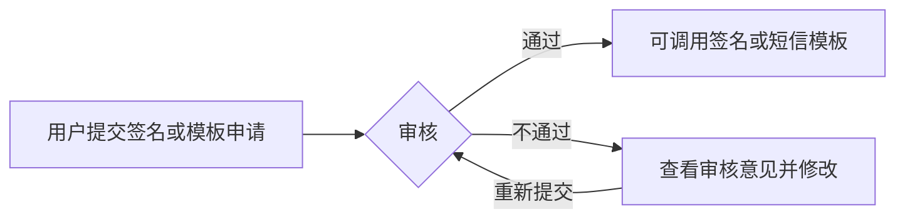

本文为您介绍短信服务的使用须知，包括认证模式、审核规范、审核流程和账号冻结规则。初次接触网易云信短信服务，您可以通过本文了解网易云信的使用规范。

## 认证模式

网易云信实名认证分为个人实名认证和企业实名认证。不同的认证方式对应的短信服务产品功能有所区别。

| 类型 | 账号使用者 | 操作指引 |
| ---- | ---- | ---- |
| 个人实名认证 | 个人 | [个人实名认证](https://doc.yunxin.163.com/console/docs/DgxMzUyNjg?platform=console) |
| 企业实名认证 | 企业、政府（含企业、政府、事业单位、团体、组织） | [企业实名认证](https://doc.yunxin.163.com/console/docs/TA1MjY1Nzk?platform=console) |

如果您的账号当前为个人实名认证，可以申请升级为企业实名认证账号。具体操作指引，请参考 [变更认证类型](https://doc.yunxin.163.com/console/docs/DgxMzUyNjg?platform=console#%E5%8F%98%E6%9B%B4%E8%AE%A4%E8%AF%81%E7%B1%BB%E5%9E%8B)。

## 审核规范

一条完整的短信包括短信签名和短信模板。短信签名和短信模板均需审核通过后方可使用。

| 组成部分 | 说明 | 审核规范 |
| ---- | ---- | ---- |
| 短信签名 | 短信签名是根据用户身份创建的符合自身属性的签名，一般建议设置为账号主体所在机构的全称或简称。 | [短信签名规范](https://doc.yunxin.163.com/sms/docs/Dk4MDYxNTY?platform=server) |
| 短信模板 | 短信模板，即具体发送的短信内容，由变量和模板内容构成。您可以通过变量实现短信内容的定制化。 | [短信模板规范](https://doc.yunxin.163.com/sms/docs/TczMjYxMjM?platform=server) |

## 审核流程

以签名审核为例，提交签名和实名信息后，网易云信向运营商发起报备。报备通过后，完成签名审核。整体短信审核请参考以下流程：

| 类型 | 说明 |
| ---- | ---- |
| 服务时间 | **工作日**：北京时间 9:00 - 21:00 |
| ^^ | **节假日**：北京时间 9:00 - 18:00，指周末及法定节假日 |
| 审核耗时 | **短信签名**：提交后预计 5-7 个工作日内完成报备和审核（需材料符合报备要求）。部分运营商需要 7-10 个工作日。 |
| ^^ | **短信模板**：提交后预计 2 个工作小时内完成审核。 |
| 审核状态 | **审核中**：用户登录 [网易云信控制台](https://app.yunxin.163.com/) 提交了短信签名或模板，正在排队等待审核。若材料符合报备要求，短信签名预计 5-7 个工作日内完成；短信模板预计 2 个工作小时内完成。 |
| ^^ | **已通过**：已通过了审核，短信签名和短信模板都通过审核时，即可开始发送短信。 |
| ^^ | **未通过**：由于某些原因，短信签名或短信模板审核未能通过。您可以登录 [网易云信控制台](https://app.yunxin.163.com/)，在目标签名或模板的审核状态/原因列，单击警告标识查看具体审核未通过的原因，然后根据反馈意见修改后重新提交审核。 |

## 账号冻结

网易云信短信服务会对您创建的短信签名和短信模板进行审核，同时配合系统监控，防范在短信中出现违反国家法律法规要求的相关内容。

如果发现违反规则的短信内容，网易云信将会对相关用户进行账号冻结，并视情况扣罚用户保证金或追究其责任。账号冻结后，该用户无法继续使用短信服务且后续不可再申请开通。该账号未使用完的短信服务资源包、优惠券等也无法继续使用。

:::note note
账号冻结规则适用于所有认证类型的用户，无论是个人实名认证还是企业实名认证。
:::