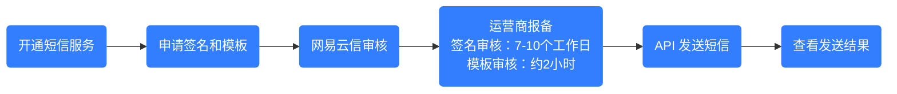

本文主要介绍短信服务的基础知识、计费方式、快速使用流程、控制台/API 的使用指引以及用户常见问题，帮助您快速上手短信服务。

## 短信服务概述

短信服务是网易云信为广大企业用户或个人用户提供的通信服务。通过 API 调用短信发送能力，将指定信息发送至国内或境外手机号码。您可以在不同场景发送不同类型的短信，例如验证码、通知短信、营销短信以及视频短信等，给您带来安全可靠的服务体验。

**短信服务** | [产品简介](https://doc.yunxin.163.com/sms/concept/jI1NDQ2NDI?platform=server)  | [功能特性](https://doc.yunxin.163.com/sms/concept/jQwNTQ1NjQ?platform=server) | [应用场景](https://doc.yunxin.163.com/sms/concept/zI2MDg3MTI?platform=server) | [基本概念](https://doc.yunxin.163.com/sms/concept/jI1NDQ2NDI?platform=server#短信服务术语表) | [签名规范](https://doc.yunxin.163.com/sms/concept/Dk4MDYxNTY?platform=server) | [模板规范](https://doc.yunxin.163.com/sms/concept/TczMjYxMjM?platform=server)

## 计费方式

短信服务使用全流程中，仅在发送短信时产生费用。短信计费方式分为按量计费和套餐包，请根据需要选择最优的计费方案。详情请参考 [计费概述](https://doc.yunxin.163.com/sms/concept/TMwMTQxNzU?platform=server)。

## 使用流程

一条短信由 **短信签名** 和 **短信模板** 组成，因此在发送短信前，您需要先完成短信资质以及签名、模板的申请工作，并等待审核通过。通过 **模板变量** 自定义，您可以实现短信内容的定制化。

以 **国内短信** 为例，以下为您介绍使用短信服务的全流程。国际/港澳台消息以具体页面提供的功能为准。

运营商实名报备流程平均需要 5-7 个工作日，基于近期观测，部分运营商实名报备流程需要 **7-10 个工作日**，但运营商未对此时效进行承诺，**实际可能需要更长时间**。建议您合理规划业务并提前申请相关资质和签名，以确保在正式使用前有充足的时间完成实名报备。

步骤 | 描述
--- | ---
**1. 准备工作** | 注册网易云信账号并完成 **企业级** 实名认证，之后才可以开通网易云信短信服务，具体请参考 [开通短信服务](https://doc.yunxin.163.com/sms/guide/TE1ODQ0NDY?platform=server#第三步开通短信并购买资源包)。
**2. 申请短信签名** | **提交申请**：短信签名是短信发送方的标识，需要能明确辨别发送方。可申请自身主体或授权主体的名称作为签名，建议使用 **企事业单位名**。详见 [审核规范](https://doc.yunxin.163.com/sms/concept/Dk4MDYxNTY?platform=server) 和 [使用说明](https://doc.yunxin.163.com/sms/guide/TE1ODQ0NDY?platform=server)。
^^ | **等待审核**：签名审核通过后方可申请模板，预计 5-7 个工作日内完成审核。 审核工作时间：周一至周日 9:00~21:00，法定节假日顺延。
**3. 申请短信模板** | **提交申请**：短信模板即具体发送的短信内容，模板类型支持验证码、通知短信、营销短信。模板由模板变量和模板内容构成，您可以通过变量实现短信内容的定制化，需注意规范使用变量。详细请参考 [审核规范](https://doc.yunxin.163.com/sms/concept/TczMjYxMjM?platform=server) 和 [使用说明](https://doc.yunxin.163.com/sms/guide/TE1ODQ0NDY?platform=server)。
^^ | **等待审核**：模板审核通过后方可发送短信，预计在 2 个小时内完成审核。 审核工作时间：周一至周日 9:00~21:00，法定节假日顺延。
**4. 发送短信** | 使用已审核通过的短信签名和短信模板创建短信内容，向目标用户发送短信。详情请参考 [API 接口](https://doc.yunxin.163.com/sms/server-apis/jg2NDEyMzI?platform=server)。
**5. 查询发送详情** | **获取短信发送结果**：通过回执抄送的形式获取发送状态，详情请参考 [短信回执抄送](https://doc.yunxin.163.com/sms/server-apis/zMxMTQ4MDA?platform=server)。
^^ | **获取用户回复内容**：通过回执抄送的形式获取用户回复的上行短信内容。详情请参考 [短信回执抄送](https://doc.yunxin.163.com/sms/server-apis/zMxMTQ4MDA?platform=server)。
**6. 设置预警** | 为保障您的业务稳定和资金安全，请您设置联系人并配置预警。当触发预警时，平台会通知到联系人，联系人可第一时间收到预警通知后及时处理。建议您按需配置 **套餐包余量预警**，具体请参考 [设置余额预警](https://doc.yunxin.163.com/console/concept/Tc5ODcxNTc?platform=console)。
**7. 数据统计（指南针）** | 为方便客户监测短信发送数据，网易云信推出指南针功能，方便客户多维度统计短信数据及失败分析，具体使用请参考 [发送记录](https://doc.yunxin.163.com/campass/concept/TYxMDQ4NzM?platform=console)。
**8. 常见问题** | 为方便解决您对接及使用过程中遇到的问题，可以优先查看常见问题 [常见问题](https://doc.yunxin.163.com/sms/guide/zE0Mjg5NjE?platform=server)。
**9. 问题反馈** | 为了快速解决您的问题，请遇到问题时包含以下信息： 1、问题简要描述 2、对应的手机号 3、具体日期<li>例 1：1345678910，该号码 11 月 9 号发送的短信用户没有收到。<li>例 2：1345678910，该号码 11 月 9 号发送失败了，返回 403 的错误码。