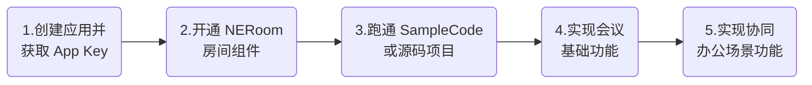
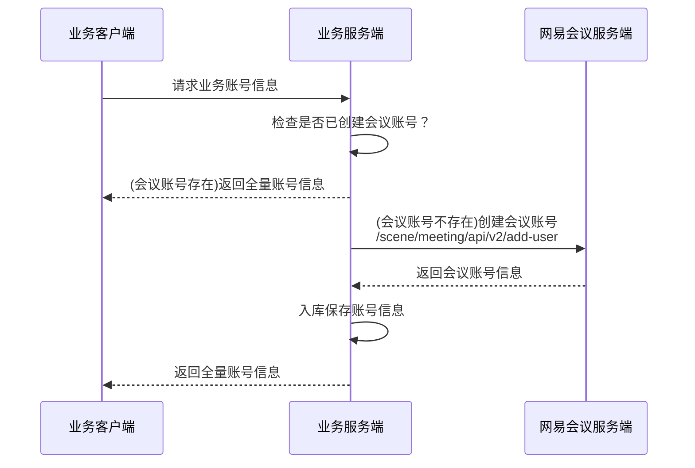
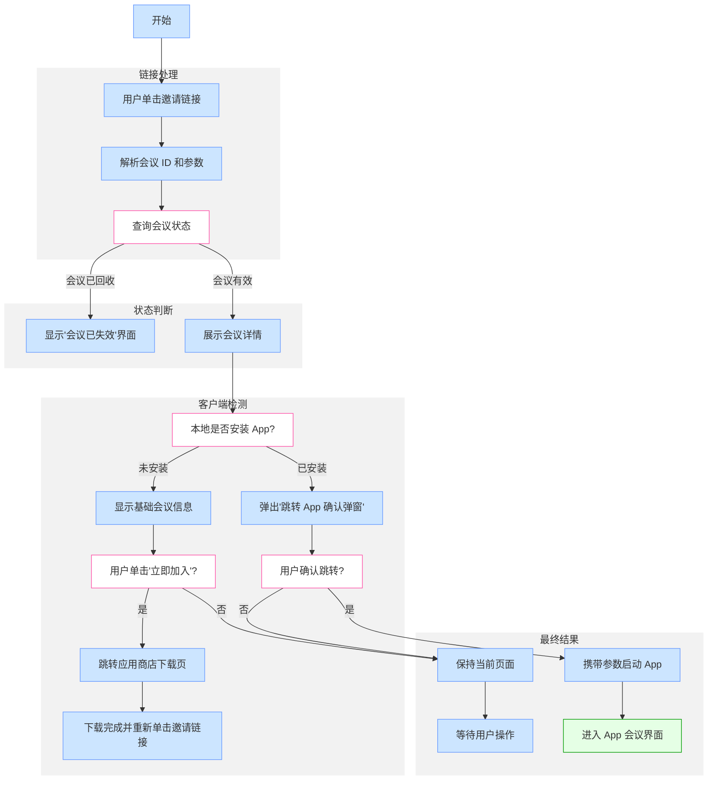

本文以协同办公场景为例，介绍网易会议的两种集成方式（**PaaS 会议组件** 集成、源码项目集成）及各自适用场景。本文内容不涉及 **网易视频会议解决方案** 的集成方式，如有需求，请参考 [开通方案](https://doc.yunxin.163.com/meeting/concept/TkzMjExNDY?platform=client)，开通网易视频会议解决方案。

## 业务场景

在数字化转型的推动下，协同办公场景中的会议已从线下会议和差旅模式转向线上线下融合的智能化形态。通过 AI 技术、多端协作工具及流程优化，让会议效率与决策质量显著提升。

会议模块作为协同办公场景中不可或缺的一环。快速在现有的协同办公场景中搭载一个强大的会议模块，能够帮助企业高效完成沟通平台的统一化。


## 方案架构

网易会议提供全套开放、简单、安全的视频会议服务，帮助企业实现卓越的音视频性能、丰富的会议协作能力、坚实的会议安全保障，打造企业专属的会议能力。企业可以使用网易会议组件 **远程音视频会议、在线协作、会管会控、会议录制、指定邀请、布局管理** 等会议功能，提升办公协作效率，满足大、中、小会议全场景需求。


## 集成方案

以协同办公需求场景为例，如何在现有应用中快速增加会议模块是部分客户的常见需求。在此类协同办公需求场景下，主要采用 **网易会议组件接入** 和 **源码项目集成** 两种集成方案：

| 集成方案 | 方案说明 | 适合需求 |
| --- | --- | --- |
| [网易会议组件](#sdk) | 以封装好的组件包形式交付。您可以通过调用提供的接口，轻松实现完整的会议流程。<ul><li> 优势：简单便捷、开发工作量小。</li><li>劣势：**会议内的 UI 界面是固定的**，仅可进行少量的自定义。</li></ul> | <ul><li> **快速部署**：网易会议组件能够在最短的时间内实现基本的会议需求，减少开发周期。适合希望快速上线会议功能的企业。</li><li> **标准化需求**：适合需要标准化 UI 和功能的企业，确保用户体验的一致性，降低用户学习成本。</li><li> **技术资源有限**：对于技术团队资源不足的企业，使用网易会议组件可以有效减少开发和维护成本。</li></ul> |
| [源码项目集成](#sample) | 提供 **网易会议的完整 UI 开源代码**，您可以根据具体需求灵活定制会议过程中的用户界面。<ul><li> 优势：灵活性高、自定义能力强。</li><li> 劣势：有开发能力要求。</li></ul> | <ul><li> **个性化需求：** 对于需要 **高度个性化界面** 的企业，源码集成允许企业根据品牌形象和用户体验的需求，设计和修改 UI，以增强用户参与感。</li><li> **复杂功能集成：** 适合需要集成复杂业务逻辑或其他第三方服务的场合，您可以在源码基础上添加特定功能，以满足特定的业务需求。</li></ul> |

<!--
| 网易会议 App | 直接使用网易会议 App 是一种快速、便捷的解决方案。您能够通过 [下载](https://meeting.163.com/#toDown) 并使用网易会议应用来进行多人会议通话。<ul><li> 优势：功能全面、稳定性高、开发工作量小。</li><li>劣势：不支持界面自定义。</li></ul> | <ul><li> **功能全面**：网易会议 App 提供了丰富的功能选择，满足多种会议需求。</li><li> **稳定性高**：网易会议 App 经历了多次版本迭代和优化，具备良好的稳定性和用户体验，适合大规模使用。</li><li> **开发工作量小**：无需复杂的开发、集成和维护工作，企业可以专注于会议的组织和参与。</li></ul> | 

-->

## 接入方式

以协同办公需求场景为例，应用接入方式主要有两种：

| 接入方式 | 接入说明 | 主要特点 | 应用示例 |
| --- | --- | --- | --- |
| 独立模块 | 作为独立模块嵌入到协同办公应用中。集成后，遵循标准会议软件用法。 | 多端可单独集成。<br>会议高级功能如白板功能，会议直播等都可以按需添加。 |  |
| 集成模块 | 作为单聊、群聊下的子模块，在日常聊天过程中直接发起在线会议。 | 对标准会议功能有删减需求（详情可参考下文 [实现多人音视频通话](#scene-1)）。<br>存在 **会议中跳转其他消息页面** 需求。 |  |

## 接入流程

本文以 **安卓**、**iOS**、**网页** 为例，介绍如何在现有办公应用中集成会议能力，供您在集成开发前参考。

若有关其他客户端的接入需求，请参考各端对应的集成开发文档（[安卓](https://doc.yunxin.163.com/meeting/guide/Dg4Njg3NDU?platform=android) | [iOS](https://doc.yunxin.163.com/meeting/guide/zg0NTkxMjY?platform=iOS) | [macOS/Windows](https://doc.yunxin.163.com/meeting/guide/DQzNDg3NDU?platform=pc) | [Web/H5](https://doc.yunxin.163.com/meeting/guide/DQzOTU2NzQ?platform=web) | [Electron](https://doc.yunxin.163.com/meeting/guide/DgwNzM5MjY?platform=electron) | [小程序](https://doc.yunxin.163.com/meeting/guide/DU0OTY1NzY?platform=miniProgram)）。



| 主要步骤 | 步骤说明 |
| --- | --- |
| [创建应用并获取 App Key](https://doc.yunxin.163.com/console/guide/TIzMDE4NTA) | 在 [网易云信控制台](https://app.yunxin.163.com/global/home) 中创建应用，查看该应用的应用密钥（AppKey），后续集成 SDK 时，在本地工程中填入该 AppKey。 |
| [开通 NERoom 房间组件](https://doc.yunxin.163.com/console/concept/zc3NDYzNzc) | 在 [网易云信控制台](https://app.yunxin.163.com/global/home) 中为已创建的应用开通 **NERoom 房间组件** 服务。 |
| 跑通 [SampleCode.git](https://github.com/netease-kit/NEMeeting/tree/main/SampleCode) 或者 [源码项目.git](https://github.com/GrowthEase/NetEase_Meeting) | 初步了解 **会议流程**，直观体验 **会议效果**。<note type="note">在体验阶段，您可通过 [meetingkit-restful.html](https://yx-web-nosdn.netease.im/common/0cd52f5e1cadc87c3497a171f7053304/meetingkit-restful.html) 快速创建 **会议测试账号**。通过浏览器打开 `meetingkit-restful.html` HTML 文件，填入您在网易云信控制台获取的 `appkey` 和 `appsecret` 信息及测试账号信息，即可创建会议账号。项目运行后，使用创建的账号完成 **登录鉴权**（适用于 [ID 和 Token 鉴权方式](https://doc.yunxin.163.com/meeting/guide/TAzNjk1MDc?platform=android#%E7%99%BB%E5%BD%95%E6%96%B9%E5%BC%8F)）。</note> |
| [实现会议基础功能](https://doc.yunxin.163.com/meeting/guide/Dg4Njg3NDU?platform=android) | 基于网易会议组件，快速实现会议场景的基本功能。 |
| 实现协同办公场景会议功能 | 参考后续内容，实现协同办公场景下的会议集成流程，包括 [选择组件版本](#version)、完成 [通用集成步骤](#procedure)、了解特定场景下的 [最佳实践](#scene)。 |

<a id="version"></a>

## 一：选择组件版本

在协同办公场景中，除了常规的即时通讯 IM 的沟通需求外，还需要在线视频会议的使用场景。通常要求能够在一个应用内同时使用即时通讯 IM 和会议模块，不做额外的应用跳转动作。常见的有安卓、iOS、网页端。

### 底层依赖

- 网易会议组件是基于 [房间组件 NERoom](https://doc.yunxin.163.com/neroom/concept?platform=client)、[即时通讯 IM](https://doc.yunxin.163.com/messaging2/concept?platform=client)、[音视频通话 2.0](https://doc.yunxin.163.com/nertc/concept?platform=client) 等底层 SDK 封装实现。

    针对不同版本网易会议组件兼容的底层 SDK，请参考各端对应的更新日志（[安卓](https://doc.yunxin.163.com/meeting/guide/zk0MjM1OTg?platform=android) | [iOS](https://doc.yunxin.163.com/meeting/guide/jk0NzYzNzA?platform=iOS) | [macOS/Windows](https://doc.yunxin.163.com/meeting/guide/DkwMTczMjE?platform=pc) | [Web/H5](https://doc.yunxin.163.com/meeting/guide/zEwOTYyODc?platform=web) | [Electron](https://doc.yunxin.163.com/meeting/guide/DYyNDQ4Njk?platform=electron) | [小程序](https://doc.yunxin.163.com/meeting/guide/jc2NTE0MDU?platform=miniProgram)）文档。

- 网易云信 IM UIKit 也是基于即时通讯 IM 底层 SDK 封装的。

### 版本推荐

因此，共同使用 IM UIKit 和网易会议组件时，需要考虑两者的兼容性，使用相互兼容的版本。

| 平台 | 使用的 IM UIKit 版本 | 推荐 IM UIKit 版本 | 推荐网易会议组件版本 | 特殊说明 |
| ---- | ---- | ---- | ---- | ---- |
| 安卓 | 10.x.x | [10.6.1](https://doc.yunxin.163.com/messaging-uikit/concept/zMzNDI4MDI?platform=client#1061-2025-02-19) | [4.8.2](https://doc.yunxin.163.com/meeting/guide/zk0MjM1OTg?platform=android#482-2024-10-18) 及以上 | 必须使用 10.4.0 及以上版本 IM UIKit |
| ^^ | 低于 10.0.0 | [9.7.1](https://doc.yunxin.163.com/messaging-uikit/concept/TMyODkzMjY?platform=client#971-2025-02-12) | [4.8.0](https://doc.yunxin.163.com/meeting/guide/zk0MjM1OTg?platform=android#480-2024-08-29) 及以下 | - |
| iOS | 10.x.x | [10.6.0](https://doc.yunxin.163.com/messaging-uikit/concept/jE5MTA5NjA?platform=client#1060-2025-02-19) | [4.8.2](https://doc.yunxin.163.com/meeting/guide/jk0NzYzNzA?platform=iOS#482-2024-10-18) 及以上 | 必须使用 10.4.1 及以上版本 IM UIKit |
| ^^ | 低于 10.0.0 | [9.7.3](https://doc.yunxin.163.com/messaging-uikit/concept/jMxNTk5NDY?platform=client#973-2024-11-14) | [4.8.0](https://doc.yunxin.163.com/meeting/guide/jk0NzYzNzA?platform=iOS#480-2024-08-29) 及以下 | - |
| 网页 | 10.x.x | [10.7.0](https://doc.yunxin.163.com/messaging-uikit/concept/jM5MjQwNzI?platform=client#1070-2025-02-26) | [4.8.2](https://doc.yunxin.163.com/meeting/guide/zEwOTYyODc?platform=web#482-2024-10-18) 及以上 | 必须使用 10.6.0 及以上版本 IM UIKit |
| ^^ | 低于 10.0.0 | [9.8.7](https://doc.yunxin.163.com/messaging-uikit/concept/TI0OTk5Nzg?platform=client#987-2024-12-27) | [4.8.0](https://doc.yunxin.163.com/meeting/guide/zEwOTYyODc?platform=web#480-2024-08-29) 及以下 | - |

<a id="procedure"></a>

## 二：通用集成步骤

### 第一步：创建会议账号

在实现会议功能前需要完成登录，因此需要有对应的账号。网易会议提供了 [创建会议账号](https://doc.yunxin.163.com/meeting/server-apis/jU0MDAzNTg?platform=server) 服务端接口，业务服务端可以通过接口，提前或者实时创建会议账号。

会议账号创建成功并入库保存后，业务客户端每次请求业务账号信息时，业务服务端将对应的会议账号信息一并返回给客户端。大致流程如下：



- 完整的实现在线会议的主要流程，请参考对应平台的接口调用时序（[安卓](https://doc.yunxin.163.com/meeting/guide/TQxODU5Mjg?platform=android#api-时序) | [iOS](https://doc.yunxin.163.com/meeting/guide/TgyNDAyNTk?platform=iOS#api-%E6%97%B6%E5%BA%8F) | [Web](https://doc.yunxin.163.com/meeting/guide/zE2MDY2ODU?platform=web#%E8%B0%83%E7%94%A8%E6%97%B6%E5%BA%8F)）。
- 在协同办公的场景下，**经常涉及到与 IM 账号的复用** 的案例。具体请参考会议账号复用文档（[安卓](https://doc.yunxin.163.com/meeting/guide/DczMzYwNjE?platform=android) | [iOS](https://doc.yunxin.163.com/meeting/guide/DkxMDQ3OTM?platform=iOS) | [Web](https://doc.yunxin.163.com/meeting/guide/zk4Njk0NjI?platform=web)）。

### 第二步：实现会议功能

<a id="sdk"></a>

#### 场景一：集成会议组件

会议组件适合快速实现标准会议功能，但不需要深度 UI 定制的场景（网易云信为用户开放了 **菜单栏** 项目的自定义能力，如添加/隐藏特定功能按钮）。您可以通过网易会议组件提供的接口完成一系列会前功能，而会中功能操作主要依赖于界面的单击交互。更多详情，请参考 [网易会议组件](https://doc.yunxin.163.com/meeting/concept/zUzOTE4NTU?platform=client)。

各端集成流程如下：

| 客户端 SDK 引入 | 后续流程 | 扩展功能 |
| --- | --- | --- |
| [安卓端集成](https://doc.yunxin.163.com/meeting/guide/Dg4Njg3NDU?platform=android#%E9%9B%86%E6%88%90-sdk) | <ol><li> [初始化](https://doc.yunxin.163.com/meeting/guide/DMzMTkwMjY?platform=android)</li><li> [登录鉴权](https://doc.yunxin.163.com/meeting/guide/TAzNjk1MDc?platform=android)</li><li> [预约会议](https://doc.yunxin.163.com/meeting/guide/Tg2NTI4NzU?platform=android)</li><li> [创建即刻会议](https://doc.yunxin.163.com/meeting/guide/zg2MDU4NjA?platform=android) </li><li> [加入会议](https://doc.yunxin.163.com/meeting/guide/jQ1MTMxMTQ?platform=android) </li><li> [会议管理](https://doc.yunxin.163.com/meeting/guide/zA3OTUzMDA?platform=android) | <ul><li> 虚拟背景</li><li> 会议录制</li><li> 美颜</li><li> 巡检者功能</li><li> 会议直播</li><li> 共享屏幕</li><li> 共享白板</li><li> AI 会议纪要</li><li> 参会者管理</li><li> 自定义菜单</li><li> 字幕</li><li> 举手功能</li><li> 表情回应</li><li> 自定义插件 |
| [iOS 端集成](https://doc.yunxin.163.com/meeting/guide/zg0NTkxMjY?platform=iOS#%E9%9B%86%E6%88%90-sdk) | <ol><li> [初始化](https://doc.yunxin.163.com/meeting/guide/zkzMjMzNTY?platform=iOS)</li><li> [登录鉴权](https://doc.yunxin.163.com/meeting/guide/jAyODA4NDE?platform=iOS)</li><li> [预约会议](https://doc.yunxin.163.com/meeting/guide/TU2NDk5NzQ?platform=iOS)</li><li> [创建即刻会议](https://doc.yunxin.163.com/meeting/guide/jY0MDc0NjE?platform=iOS)</li><li> [加入会议](https://doc.yunxin.163.com/meeting/guide/Tg5MDE3MTE?platform=iOS)</li><li> [会议管理](https://doc.yunxin.163.com/meeting/guide/DE1OTE0NzQ?platform=iOS) | ^^ |
| [网页端集成](https://doc.yunxin.163.com/meeting/guide/DQzOTU2NzQ?platform=web#%E6%96%B9%E5%BC%8F%E4%B8%80%E9%80%9A%E8%BF%87-script-%E6%A0%87%E7%AD%BE%E5%BC%95%E5%85%A5) | <ol><li> [准备账号复用](https://doc.yunxin.163.com/meeting/guide/zk4Njk0NjI?platform=web)</li><li> [初始化](https://doc.yunxin.163.com/meeting/guide/zE2MDY2ODU?platform=web#%E5%88%9D%E5%A7%8B%E5%8C%96-sdk)</li><li> [登录鉴权](https://doc.yunxin.163.com/meeting/guide/zE2MDY2ODU?platform=web#%E7%99%BB%E5%BD%95%E9%89%B4%E6%9D%83)</li><li> [预约会议](https://doc.yunxin.163.com/meeting/guide/zE2MDY2ODU?platform=web#%E9%A2%84%E7%BA%A6%E4%BC%9A%E8%AE%AE)</li><li> [创建即刻会议](https://doc.yunxin.163.com/meeting/guide/zE2MDY2ODU?platform=web#%E5%88%9B%E5%BB%BA%E4%BC%9A%E8%AE%AE)</li><li> [加入会议](https://doc.yunxin.163.com/meeting/guide/zE2MDY2ODU?platform=web#%E5%8A%A0%E5%85%A5%E4%BC%9A%E8%AE%AE)</li><li> [会议管理](https://doc.yunxin.163.com/meeting/guide/zE2MDY2ODU?platform=web#%E8%8E%B7%E5%8F%96%E5%BD%93%E5%89%8D%E4%BC%9A%E8%AE%AE%E4%BF%A1%E6%81%AF) | ^^ |

:::note note
客户端和服务端接口在功能和实现细节上存在差异，如需了解服务端接口的具体功能和使用示例，请参考接口 [`/meeting/api/{appId}/v1/create/{type}`](https://doc.yunxin.163.com/meeting/server-apis/TUwMzc3NzY?platform=server)。</li></ul>
:::

<a id="sample"></a>

#### 场景二：集成源码项目

若您有更深度定制需求（如修改主题色系、界面布局等），推荐集成开源的网易会议源码项目，开源项目地址：[NetEase_Meeting.git](https://github.com/GrowthEase/NetEase_Meeting)。

源码涉及到的端类型如下表：

| 接入方式 | 安卓 | iOS | 网页 | H5 | Flutter | Window/macOS | uni-app | Electron | 小程序 |
| --- | --- | --- | --- | --- | --- | --- | --- | --- | --- |
| [网易会议组件](https://github.com/netease-kit/NEMeeting/tree/main/SampleCode) | ✅ | ✅ | ✅ | ✅ | ❌ | ✅ | ❌ | ✅ | 参考 H5 |
| [会议源码项目](https://github.com/GrowthEase/NetEase_Meeting/tree/main) | 参考 Flutter 项目 | 参考 Flutter 项目 | ✅ | ✅ | ✅ | 参考 Electron 项目 | ❌ | ✅ | ❌ |

- 桌面端基于 Electron 开发，支持跨平台定制。
- 移动端采用 Flutter 构建，具备灵活的 UI 调整能力。

您可以通过对开源项目实现二次开发，根据实际业务需求灵活调整界面元素。如有任何集成问题，请 [提交工单](https://app.yunxin.163.com/global/service/ticket/create) 联系网易云信技术支持工程师。

<a id="scene"></a>

## 三：场景最佳实践

<a id="scene-1"></a>

### 实现多人音视频通话

在现代办公环境中，团队成员之间的沟通和协作需求愈发频繁。尤其是在需要集体讨论、决策及信息分享的场合，多人会议成为了组织和企业日常运作的重要组成部分。因此，如何高效、便捷地接入会议并实现多人音视频通话，成为了这个业务场景中最核心的需求。

**场景建议**

- **快速会议场景**：保留核心音视频功能，适合紧急会议、客服通话等时效性场景。
- **教育培训场景**：通过隐藏非必要控件，降低学生端操作复杂度。
- **嵌入式集成方案**：作为子模块嵌入时，保证 UI 风格一致性。

     

**核心目标**

在多人音视频通话场景，实现以下核心目标：

- 保留基础音视频能力（麦克风/摄像头）
- 移除非必要交互元素
- 提升会议界面纯净度

**实现方法（以安卓为例）**

会议界面极简模式配置示例，相关接口类请参考 [NEMeetingOptions](https://doc.yunxin.163.com/meetingkit/references/android/dokka/Latest/zh/com/netease/yunxin/kit/meeting/sdk/NEMeetingOptions.html)。

```Java
NEMeetingOptions options = new NEJoinMeetingOptions();

// ================= 工具栏菜单定制 =================
NEMenuItemListBuilder toolbarMenuBuilder = NEMenuItemListBuilder.toolbarMenuBuilder();
// 移除默认功能项（按功能模块分组说明）
toolbarMenuBuilder.removeMenuById(NEMenuIDs.PARTICIPANTS_MENU_ID);       // 参与者列表
toolbarMenuBuilder.removeMenuById(NEMenuIDs.MANAGE_PARTICIPANTS_MENU_ID);// 成员管理
toolbarMenuBuilder.removeMenuById(NEMenuIDs.SCREEN_SHARE_MENU_ID);       // 屏幕共享

// 应用精简后的工具栏配置（仅保留音视频控制）
options.fullToolbarMenuItems = toolbarMenuBuilder.build();

// ================= 功能模块显隐控制 =================
// 隐藏更多菜单扩展功能
options.fullMoreMenuItems = new ArrayList<NEMeetingMenuItem>();

// 关闭 Web 应用集成能力
options.noWebApps = true; // 如签到、投票等扩展应用

// 隐藏社交化交互组件
options.noChat = true;              // 聊天对话框
options.showMeetingInfo = false;    // 会议详情面板
options.showHandsUp = false;        // 举手功能
options.showEmojiResponse = false; // 表情互动
```

**配置参数详解**

- **工具栏定制**：通过 [`removeMenuById`](https://doc.yunxin.163.com/meetingkit/references/android/dokka/Latest/zh/com/netease/yunxin/kit/meeting/sdk/menu/NEMenuItemListBuilder.html#removeMenuById(int)) 链式调用移除不需要的功能模块。例如：

    - **成员管理类**：参与者列表/权限管理
    - **协作功能类**：屏幕共享
    - **附加功能类**：录制、直播等

- **界面精简策略**：通过 [`fullToolbarMenuItems`](https://doc.yunxin.163.com/meetingkit/references/android/dokka/Latest/zh/com/netease/yunxin/kit/meeting/sdk/NEMeetingOptions.html#fullMoreMenuItems) 隐藏界面右下角的 **更多** 扩展菜单，实现界面精简策略。

    ```Java
    // 隐藏更多菜单
    options.fullMoreMenuItems = new ArrayList<>();
    ```

- **社交功能开关**：以下示例表示禁用文字聊天、文件传输等 IM 功能。配合关闭表情/举手等交互，打造专注音视频环境。

    ```Java
    // 隐藏社交化交互组件
    options.noWebApps = true; // 如签到、投票等扩展应用
    options.noChat = true;              // 聊天对话框
    options.showMeetingInfo = false;    // 会议详情面板
    options.showHandsUp = false;        // 举手功能
    options.showEmojiResponse = false; // 表情互动
    ```

### 实现会议邀请跳转

**会议邀请** 是常见的会议操作之一，邀请功能不仅解决了会议召集的基础需求，更成为办公提效和数据统计的关键枢纽。跳转链接的逻辑实现，则确保了从邀请发出到实际参会的体验闭环，实现现代协作工具提升会议体验的核心策略。

:::note note
该功能面向需要通过 [**集成网易会议源码项目**](#sample)，并需开发者提前准备用于会议信息展示的 **业务域名**。
:::

**邀请实现步骤**

1. 将会议 App 和 Web 端发布到服务器，获得在线访问链接 `https://xxx.xxx.com`。

2. 在 Web 邀请页源码中，跳转到网易会议的 url 替换成步骤 1 的 `https://xxx.xxx.com`。

3. 将 Web 邀请页发布到服务器时，发布到 `xxx.xxx.com/invite` 路径下。

4. 将应用密钥（appkey）和 `https://xxx.xxx.com`，提供给服务您的网易云信技术支持工程师，协助您将邀请页域名替换成 `https://xxx.xxx.com`。

    邀请页面的功能实现推荐如下流程：



### 实现会议直播

会议直播功能适用于以下场景：

- **大型会议活动**：例如学术会议、公共演讲等需要广泛传播和参与的场合。

- **少量主播互动**：适用于主播之间进行有限交流的场景，此类场合不需要观众间频繁的音视频沟通互动。

**准备工作**

实现直播功能前，请确保您已经在 [网易云信控制台](https://app.yunxin.163.com/global/home) 启用 **房间组件 NERoom** 的 **在线直播** 功能、启用 **音视频通话 RTC** 的 **旁路推流** 功能。

**实现方法**

1. 准备业务域名。

    默认情况下，会议直播使用 `meeting.163.com` 域名。如下图 **网易会议 App** 中开启直播所示：

    

    为避免部分场景下可能导致的权限问题，您可以替换为专有的业务域名：

    1. 准备一个符合要求的业务域名，例如 `xxx.corp.yunxin_live.com`。
    2. 将业务域名提供给服务您的网易云信技术支持工程师进行替换。
    3. 替换后，直播观看地址将更新为类似 `https://xxx.corp.yunxin_live.com?meetingKey=xxx` 格式。此地址也可通过 [查询会议信息](https://doc.yunxin.163.com/meeting/server-apis/TU4NjQxODU?platform=server) 接口获取。

2. 部署直播页面。

   下载 [WebLive.zip](https://yx-web-nosdn.netease.im/common/643bdc32d51bfcb0d968a1ab68615d23/WebLive.zip) 源码项目，配置您的网易云信应用密钥 `appKey`：

    ```JavaScript
    var common = {
      appKey: 'xxxxx',
      cancelJoin: function() {
        console.warn('您单击的关闭');
      }
    }
    ```

    到达观看部署页时，只需要进行会议账号鉴权即可，可参考源码示例，通过 `useruuid` 和 `usertoken` 手动登录。或者业务上直接处理，传入指定的账号和密码。

    ```JavaScript
    function login(){
      var obj = {
        ...common,
        accountToken: getDom('.account-token').value,
        accountId: getDom('.account-id').value,
      };
      neWebMeetingLive.actions.login(obj, (e) => {
        if (e) {
          console.error(e);
        }
      })
    }
    ```

3. 验证会议观看效果。

    

4. 创建会议与配置直播。

    - **客户端创建**：对于客户端创建的会议，仅在预约会议时，可以配置或开启直播功能，此时系统所使用的是网易云信底层依赖的直播能力。

        - 场景一：集成网易会议组件时，通过代码配置直播。

            :::::: div linked-codes
            ::: code 安卓
            ```Java
            NEMeetingItemLive live = NEMeetingKit.getInstance().getPreMeetingService().createMeetingItemLive();
            live.setEnable(true);
            live.setLiveWebAccessControlLevel(NEMeetingLiveAuthLevel.appToken);
            meetingItem.setLive(live);
            ```
            :::
            ::: code iOS
            ```Objective-C
            NEMeetingItemLive *live = [[NEMeetingItemLive alloc] init];
            [live setEnable:YES];
            [live setLiveWebAccessControlLevel:NEMeetingLiveAuthLevelAppToken];
            [meetingItem setLive:live];
            ```
            :::
            ::: code Web
            ```JavaScript
            const neMeetingItemLive = {
              enable:true,
              state:1
            }
            PreMeetingService.createScheduleMeetingItem().then(({ data: meetingItem }) => {
            // 修改预约会议信息
            meetingItem.subject = 'xx'
            meetingItem.startTime = xxx
            meetingItem.endTime = xxx
            meetingItem.noSip = true
            meetingItem.live = neMeetingItemLive
            PreMeetingService.scheduleMeeting(meetingItem)
            })
            ```
            :::
            ::::::

        - 场景二：集成源码项目时，在预约会议界面可以开启直播功能。

            

    - **服务端创建**：若是通过 [服务端接口创建会议](https://doc.yunxin.163.com/meeting/server-apis/TUwMzc3NzY?platform=server)，则可以使用外部 CDN 推拉流地址进行直播，可配置字段为 [`externalLiveConfig`](https://doc.yunxin.163.com/meeting/server-apis/zkyODQyMTY?platform=server#externalliveconfig)。

5. 配置直播能力后，主持人可以在会议菜单栏上单击 **直播** 按钮，在对应页面上选择开播的用户并开启直播，客户端获取直播观看地址即可拉流观看。

    

## 总结

网易会议提供了灵活的接入方式，您可以可根据企业的技术能力、定制需求和业务场景选择合适的集成方案。无论是快速集成、深度定制、还是直接使用网易会议 App，都能有效提升协同办公效率，实现线上会议的无缝衔接。

如有更多集成问题，请 [提交工单](https://app.yunxin.163.com/global/service/ticket/create) 联系网易云信技术支持工程师。