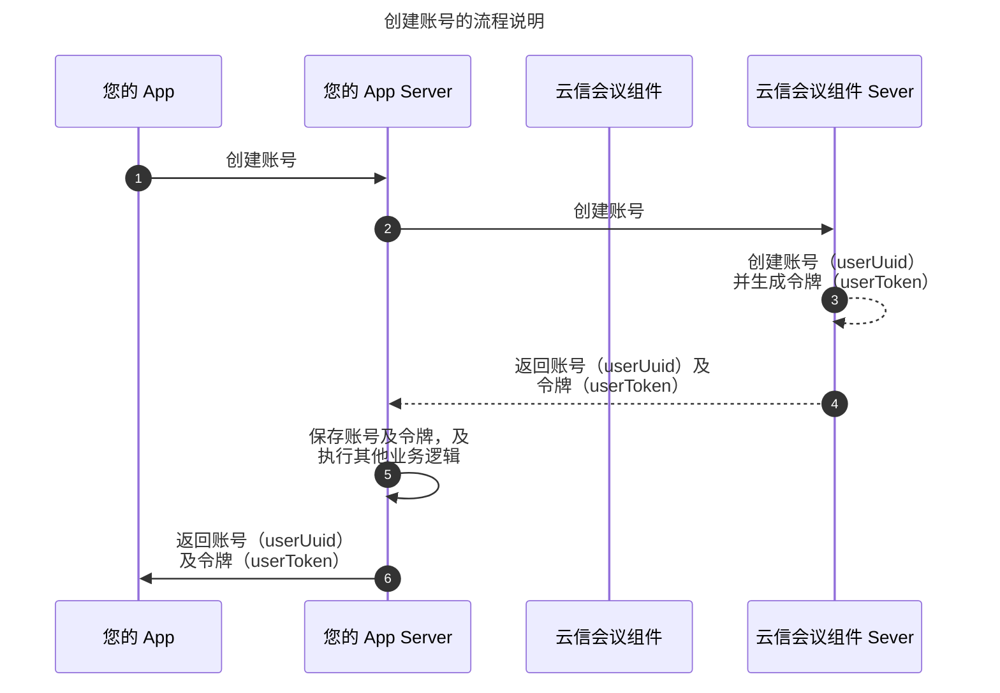
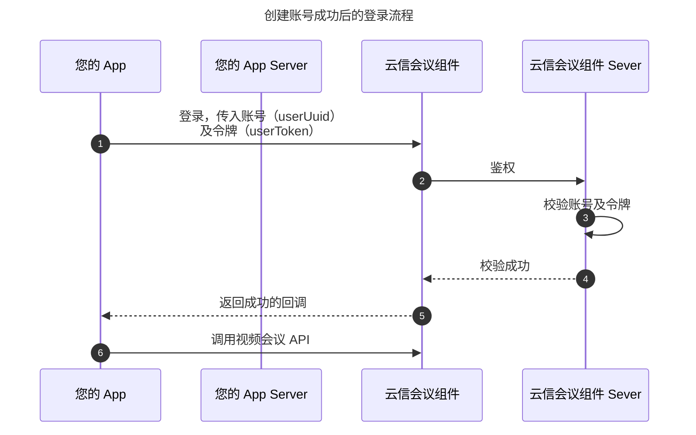

通过该接口在网易云信会议组件创建一个用户账号，客户端需要使用返回的账号信息进行登录鉴权。

:::note note
- 如果您之前没有网易云信 IM 账号，创建视频会议账号时，会同时自动一个 IM 账号用于账号绑定，使得该账号可使用 IM 功能。
- 如果您已经集成了网易云信 IM SDK，已有一个 IM 账号，您可以调用该接口创建一个与 IM 账号绑定的会议账号。如果需要绑定已有的 IM 账号，请先获得 `imAccid` 和 `imToken` 的值。获取方式请参考 [注册网易云信 IM 账号](https://doc.yunxin.163.com/messaging2/server-apis/TQyNjgyMzc?platform=server)。
:::

## 流程说明

创建账号时，客户端服务器向网易云信会议组件服务器发起申请，并获取到注册成功的用户账号（`userUuid`）及登录令牌（`userToken`）。相关流程如下图所示：



账号创建完成后，客户端使用获取到的账号（`userUuid`）和登录令牌（`userToken`）可以接入到网易云信会议组件。相关流程如下图所示：



## 请求信息

- 请求方法：POST
- 请求 URL：https://meeting.yunxinroom.com/scene/meeting/api/v2/add-user HTTP/1.1
- Content-Type：application/json;charset=utf-8
- AppKey：应用的 AppKey。详情请参考 [创建应用并获取 AppKey](https://doc.yunxin.163.com/console/concept/TIzMDE4NTA?platform=console)。
- 鉴权头：接口鉴权。详情请参考 [请求结构](https://doc.yunxin.163.com/meeting/server-apis/TM0MzUxOTU?platform=server#header)。

### 请求头参数

请求头（Header）的参数说明，请参考 [请求结构](https://doc.yunxin.163.com/meeting/server-apis/TM0MzUxOTU?platform=server#header)。

### 请求体参数

| **名称** | **类型** | 是否必选 | **说明** |
| --- | --- | --- | --- |
| userUuid | String | 是 | 用户账号。|\
| | | | - 支持最长 32 个字符。 |\
| | | | - 支持小写英文和数字。 |\
| | | | - 支持四个特殊字符（`_` `@` `.` `-`）。 |
| imToken | String | 否 | 已创建的即时通讯 IM 账号的 Token，用来和已有的 IM 账号绑定。最长支持 64 个字符。如果设置了 `imToken` 参数，请同时将 `userUuid` 设置为用户的 IM 账号（`accountId`）。<note type="note">该参数在应用同时集成网易云信即时通讯 IM 和会议组件的场景下使用，仅集成会议组件的场景可忽略。</note> |
| name | String | 是 | 用户名称。即账号使用者的姓名、称呼、昵称等，最多支持 30 个非空字符。 |
| shortMeetingNum | String | 否 | 企业内个人会议短号，支持 4 到 8 位数字。 |
| sipCid | String | 否 | 企业内 SIP 号，支持 1 到 16 位数字。 |
| avatar | String | 否 | 存储头像图案的 URL，支持 10 到 255 个标准 URI 字符，标准参考 RFC 3986。 |
| phoneNumber | String | 否 | 手机号码。例如 13912341234，目前仅支持中国大陆地区手机号码。 |
| email | String | 否 | 邮箱地址。 |
| returnGeneratedPassword | Boolean | 否 | true: 以明文方式返回生成的密码，密码长度为8位，字符集包括英文字符（大小写均包含）与数字<br> false: 不返回生成的密码 |
| departments | JsonArray | 否 | 用户所在的一个或多个部门的路径。 |\
| | | | - 最多支持 20 层分级。 |\
| | | | - 部门名称支持汉字、数字、英文字母。 |\
| | | | - 不同的部门名称之间用半角逗号（`,`）或反斜杠符号（`/`）分隔。 |\
| | | | - 每一个账户仅支持设置一个部门。即数组元素最多为 1。 |\
| | | | - 示例： |\
| | | |     - ["一级部门 1/二级部门 1"] |\
| | | |     - ["销售部门,杭州分部"] |

### 请求体示例

```JSON
{
    "userUuid": "user_uuid_sample",
    "name": "someone_name",
    "privateMeetingNum": "private_meeting_number_sample",
    "shortMeetingNum": "short_meeting_number_sample",
    "sipCid": "sip_cid_sample",
    "avatar": "https://sample.com/sample_url_path",
    "phoneNumber": "13912341234",
    "email": "someone@example.com",
    "departments":["一级部门,二级部门"]
}
```

## 响应信息

### 响应参数

以下是返回结果（Body）中 `data` 属性内包含的参数。有关统一返回参数的说明，请参考 [返回结果](https://doc.yunxin.163.com/meeting/server-apis/TczMTMyMjg?platform=server)。

| **名称** | **类型** | **说明** |
| --- | --- | --- |
| userUuid | String | 用户账号。可用于登录客户端 SDK。 |
| userToken | String | 用户 Token。 |
| imToken | String | 即时通讯 IM 账号的 Token。 | 
| name | String | 用户名称，即账号使用者的姓名，称呼，昵称等。 |
| privateMeetingNum | String | 个人会议唯一号，全局唯一。 |
| shortMeetingNum | String | 个人会议短号。 |
| sipCid | String | 企业内 SIP 号。 |
| avatar | String | 存储头像图案的 URL。 |
| phoneNumber | String | 手机号码。 |
| email | String | 邮箱地址。 |
| password | String | 用户密码。 |
| state | Integer | - 1：启用。 |\
| | | - 2：禁用。 |\
| | | <note type="note">注销账号即删除账号，没有对应状态。</note> |
| departments | JsonArray | 用户所在的部门路径列表，最多支持 20 级。 |\
| | | 示例：["一级部门 1,二级部门 1"]。 |

### 响应体示例

```JSON
{
    "userUuid": "user_uuid_sample",
    "userToken": "user_token_sample",
    "imToken": "imtoken_sample",
    "name": "someone_name",
    "privateMeetingNum": "private_meeting_number_sample",
    "shortMeetingNum": "short_meeting_number_sample",
    "sipCid": "sip_cid_sample",
    "avatar": "https://sample.com/sample_url_path",
    "phoneNumber": "13912341234",
    "email": "someone@example.com",
    "state": 1,
    "departments":["/一级部门/二级部门"]
}
```

## 错误码

详情请参考 [错误码](https://doc.yunxin.163.com/meeting/server-apis/DEwNTU4MTg?platform=server)。