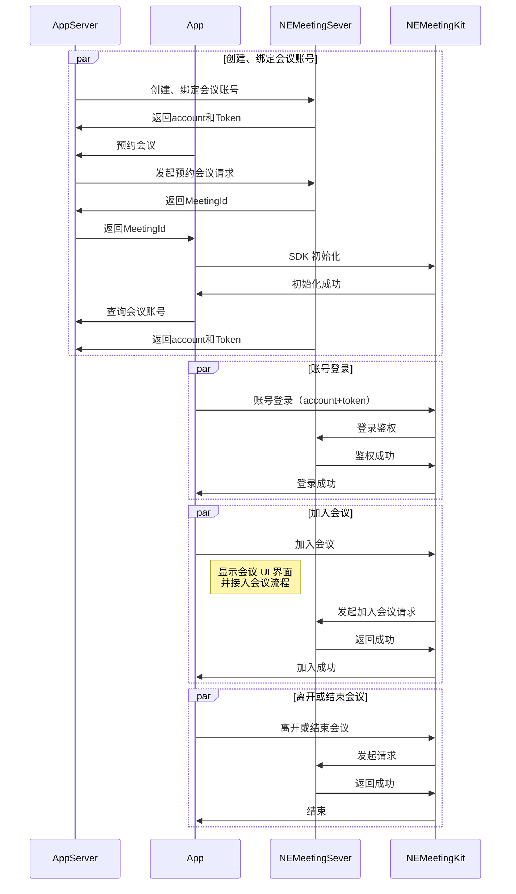

本文为您介绍如何通过 NEMeetingKit 提供的一套简单易用的接口，快速地将音视频会议基础功能集成至现有应用中。

## 功能列表

- <a href="#初始化 SDK">初始化 SDK</a>
- <a href="#登录鉴权">登录鉴权</a>
- <a href="#创建会议">创建会议</a>
- <a href="#加入会议">加入会议</a>
- <a href="#匿名入会">匿名入会</a>
- <a href="#监听会议状态">监听会议状态</a>
- <a href="#获取当前会议信息">获取当前会议信息</a>
- <a href="#离开会议">离开会议</a>
- <a href="#预约会议">预约会议</a>
- <a href="#取消预约会议">取消预约会议</a>
- <a href="#查询指定状态下的预约会议列表">查询指定状态下的预约会议列表</a>
- <a href="#监听预约会议状态">监听预约会议状态</a>
- <a href="#注销登录">注销登录</a>
- <a href="#销毁 SDK">销毁 SDK</a>

## 会议状态流程

预约会议或即时会议的状态流转如下图所示：


## 调用时序

NEMeetingKit 实现在线会议的主要流程如下图所示：

<!--  -->



## <span id="初始化 SDK">初始化 SDK</span>

在调用 SDK 其他接口之前，您首先需要完成初始化操作。

1. 调用 `initialize` 方法完成初始化操作。

   **示例代码** 如下：

    ```TypeScript
    const neMeetingKit = NEMeetingKit.getInstance()
    const appKey = ''
    neMeetingKit.initialize({
        appKey,
        serverUrl: 'https://meeting.yunxinroom.com'
    })
    ```

## <span id="登录鉴权">登录鉴权</span>

请求 SDK 进行登录鉴权，您只有完成 SDK 登录鉴权才可以创建会议。

NEMeetingKit 提供了多种登录方式供您选择，调用不同的登录接口需要传入不同的参数，具体说明如下表。

| 登录方式 | 说明 | 接口 | 参数 | 其他 |
| --- | --- | --- | --- | --- |
| Token 登录 | - | NEMeetingKit#login | accountId、accountToken | 账号信息需要从 <a href="https://doc.yunxin.163.com/meeting/server-apis/DU3NTczMTg" target="_blank">网易会议服务端</a> 获取，由您自行实现相关业务逻辑。 |
| 网易会议账号登录 | - | NEMeetingKit#loginWithNEMeeting | username、password | - |

- 使用账号 ID 和 Token 登录。

   **示例代码** 如下：

    ```TypeScript
    //使用 账号密码 登录
    const neMeetingKit = NEMeetingKit.getInstance()
    const accountService = neMeetingKit.getAccountService()
    // 用户账户
    const userUuid = ''
    // 用户 token
    const token = ''
    accountService.loginByToken(userUuid, token)
    ```

- 使用网易会议账号登录。

    ```TypeScript
    //使用 账号密码 登录
    const neMeetingKit = NEMeetingKit.getInstance()
    const accountService = neMeetingKit.getAccountService()
    // 用户账户
    const userUuid = ''
    // 用户密码
    const password = ''
    accountService.loginByPassword(userUuid, password)
    ```

## <span id="创建会议">创建会议</span>

在已经完成 SDK 登录鉴权的状态下，创建并开始一个新的会议。

1. 调用 `getAccountInfo` 方法获取个人会议 ID。

   **示例代码** 如下：

    ```TypeScript
    //使用 账号密码 登录
    const neMeetingKit = NEMeetingKit.getInstance()
    const accountService = neMeetingKit.getAccountService()
    accountService.getAccountInfo().then((res) => {
    const { data } = res
    // data 账号信息
    })
    ```

2. 配置创建会议相关参数，调用 `startMeeting` 方法创建会议并进行回调处理。您可根据错误码判断接口是否调用成功。

    ```TypeScript
    // 开始会议
    const neMeetingKit = NEMeetingKit.getInstance()
    const meetingService = neMeetingKit.getMeetingService()

    const param = {
    displayName: '入会昵称',
    }

    meetingService.startMeeting(param)
    ```

3. 会议成功创建后，SDK 会拉起会议界面并接管会议逻辑：创建会议的用户会自动成为该会议的主持人，可以进行相关的会议控制操作。其他用户可以通过该会议号入会。

## <span id="加入会议">加入会议</span>

在已经完成 SDK 登录鉴权的状态下，加入一个当前正在进行中的会议。

配置加入会议相关参数，调用 `joinMeeting` 方法创建会议并进行回调处理。您可根据错误码判断接口是否调用成功。

```TypeScript
// 加入会议
const neMeetingKit = NEMeetingKit.getInstance()
const meetingService = neMeetingKit.getMeetingService()

const param = {
  displayName: '入会昵称',
  // 会议号
  meetingNum: '123456',
}

meetingService.joinMeeting(param)
```

## <span id="匿名入会">匿名入会</span>

在已完成初始化的状态下，匿名加入一个当前正在进行中的会议。

配置加入会议相关参数，调用 `anonymousJoinMeeting` 方法匿名加入会议并进行回调处理。您可根据错误码判断接口是否调用成功。

```TypeScript
// 加入会议
const neMeetingKit = NEMeetingKit.getInstance()
const meetingService = neMeetingKit.getMeetingService()

const param = {
  displayName: '入会昵称',
  // 会议号
  meetingNum: '123456',
}

meetingService.anonymousJoinMeeting(param)
```

## <span id="监听会议状态">监听会议状态</span>

通过注册会议状态回调接口，获取会议状态变更的通知。

**示例代码** 如下：

```TypeScript
const neMeetingKit = NEMeetingKit.getInstance()
const meetingService = neMeetingKit.getMeetingService()

meetingService.addMeetingStatusListener({
onMeetingStatusChanged: ({status}) = {
// status: 会议状态
}
})
```

## <span id="获取当前会议信息">获取当前会议信息</span>

在已经完成创建会议或加入会议的状态下，获取当前会议信息。

调用 `getCurrentMeetingInfo` 方法获取当前会议信息并进行回调处理。该接口的回调结果的数据类型为 NEMeetingInfo 对象类型。

::: note note
请确认已经通过一种入会方式（加入会议/创建会议/匿名入会）加入到会议内，否则回调数据对象为空。
:::

**示例代码** 如下：

```TypeScript
const neMeetingKit = NEMeetingKit.getInstance()
const meetingService = neMeetingKit.getMeetingService()

meetingService.getCurrentMeetingInfo().then((res) => {
const {data} = res
// data 当前会议信息
})
```

## <span id="离开会议">离开会议</span>

调用 `leaveMeeting` 方法离开当前会议。

**示例代码** 如下：

```TypeScript
const neMeetingKit = NEMeetingKit.getInstance()
const meetingService = neMeetingKit.getMeetingService()

// false: 离开会议。true: 离开并结束会议。
const closeIfHost = false
meetingService.leaveCurrentMeeting(closeIfHost)
```

## <span id="预约会议">预约会议</span>

在已经完成 SDK 登录鉴权的状态下，预约一个新的会议。

先通过 `createScheduleMeetingItem` 创建预约会议对象。
调用 `scheduleMeeting` 方法预会议并进行回调处理，您可根据错误码判断接口是否调用成功。

::: note note
该接口仅支持 **在登录鉴权成功后调用**，其他情况下会调用失败。
:::

**示例代码** 如下：

```TypeScript
const neMeetingKit = NEMeetingKit.getInstance()
const preMeetingService = neMeetingKit.getPreMeetingService()

preMeetingService.createScheduleMeetingItem().then(({ data: meetingItem }) => {
  // 修改预约会议信息
  meetingItem.subject = ''
  preMeetingService.scheduleMeeting(meetingItem)
})
```

## <span id="取消预约会议">取消预约会议</span>

在已经完成 SDK 登录鉴权的状态下，取消一个已经预约的会议。

调用 `cancelMeeting` 方法取消预约会议并进行回调处理，您可根据错误码判断接口是否调用成功。

::: note note
- 该接口仅支持 **在登录鉴权成功后调用**，其他情况下会调用失败。
- 您无法取消正在进行中的、处于回收状态的或已经结束的会议。
:::

```TypeScript
const neMeetingKit = NEMeetingKit.getInstance()
const preMeetingService = neMeetingKit.getPreMeetingService()
// 会议唯一 ID
const meetingId = 123
// 是否取消所有周期性会议
const cancelRecurringMeeting = false

preMeetingService.cancelMeeting(meetingId, cancelRecurringMeeting)
```

## <span id="查询指定状态下的预约会议列表">查询指定状态下的预约会议列表</span>

在已经完成 SDK 登录鉴权的状态下，根据指定的一种或多种会议状态在已预约的所有会议基础上筛选出会议列表。

调用 `getMeetingList` 方法查询指定状态下的预约会议列表并进行回调处理，您可根据错误码判断接口是否调用成功。

::: note note
该接口仅支持 **在登录鉴权成功后调用**，其他情况下会调用失败。
:::

**示例代码** 如下：

```TypeScript
const neMeetingKit = NEMeetingKit.getInstance()
const preMeetingService = neMeetingKit.getPreMeetingService()

preMeetingService.getMeetingList([NEMeetingItemStatus.init, NEMeetingItemStatus.started, NEMeetingItemStatus.ended])
```

## <span id="监听预约会议状态">监听预约会议状态</span>

通过注册预约会议状态回调接口，监听预约会议状态的变更通知，从而实现会议界面上实时更新当前会议状态，包括参会人的加入或离开。

::: note note
一次预约会议状态变更回调可能包含多个预约会议信息的变更。
:::

```TypeScript
const neMeetingKit = NEMeetingKit.getInstance()
const preMeetingService = neMeetingKit.getPreMeetingService()

preMeetingService.addListener({
onMeetingItemInfoChanged: (meetingItemList) => {
// meetingItemList 变更会议列表
}
})
```

## <span id="注销登录">注销登录</span>

注销当前已登录的账号，返回未登录状态。

调用 `logout` 方法注销当前账号并进行回调处理。

**示例代码** 如下：

```TypeScript
//账户登出
const neMeetingKit = NEMeetingKit.getInstance()
const accountService = neMeetingKit.getAccountService()

accountService.logout()
```

## <span id="销毁 SDK">销毁 SDK</span>

在退出您的应用程序之前，需要销毁 SDK。

调用 `unInitialize` 方法销毁当前会议进程并进行回调处理。

**示例代码** 如下：

```TypeScript
//账户登出
const neMeetingKit = NEMeetingKit.getInstance()

neMeetingKit.unInitialize()
```

::: note note
请在收到销毁通知回调后退出您的应用程序。
:::