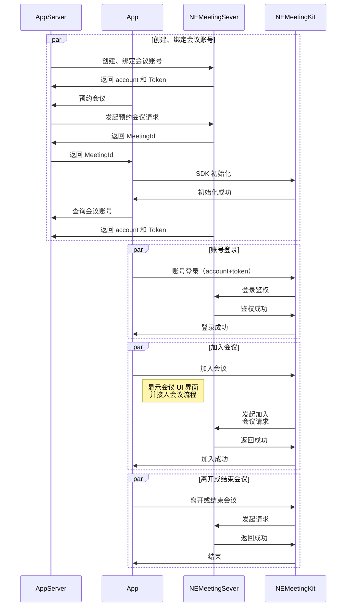

本文介绍了 NEMeetingKit 实现基础功能的示例代码，可以作为快速接入阶段参考，详细实现方式可以参考 [GitHub Demo 工程](https://doc.yunxin.163.com/meeting/quick-start/DYzNzIyOTI?platform=client)。

## 调用时序

NEMeetingKit 实现在线会议的主要流程如下图所示：



## 初始化 SDK

在调用 NEMeetingkit 其他接口之前，您首先需要完成初始化操作。请不要重复初始化，否则 NEMeetingkit 会报错。

```C++
std::string appkey = "appKey";
std::string url = "url";
std::string runPath = "runPath";
nem_sdk_interface::NEMeetingKitConfig config;
config.setAppKey(appkey);
config.setAppName("NetEase Meeting");
config.getAppInfo()->ProductName("NetEase Meeting");
config.getAppInfo()->OrganizationName("NetEase");
config.getAppInfo()->ApplicationName("Meeting");
config.getAppInfo()->SDKPath(runPath);
config.setRunAdmin(false);
config.setUseAssetServerConfig(false);
config.setLanguage(NEMeetingLanguage::kNEChinese);
config.setServerUrl(url);
config.getLoggerConfig()->LoggerLevel((NELogLevel)log_level);
NEMeetingKit::getInstance()->initialize(config, [this](MeetingErrorCode errorCode, const std::string& errorMessage, const NEMeetingCorpInfo& info) {
    PrintLog("MeetingSDK initialize errorMessage: " + errorMessage);
});
```

## 账户登录、登录

### 设置回调

```C++
void MainWindow::onAddAccountServiceListenerBtnClicked() {
    auto service = NEMeetingKit::getInstance()->getAccountService();
    if (service) {
        service->addListener(this);
    } else {
        // MeetingKit is not initialized
    }
}
```

```C++
void MainWindow::onKickOut() {
    // callback
}
void MainWindow::onAuthInfoExpired() {
    // callback
}
void MainWindow::onReconnected() {
    // callback
}
void MainWindow::onAccountInfoUpdated(NEAccountInfo accountInfo) {
    // callback
}
```

### 登录的调用

```C++
void MainWindow::onGetAccountInfoBtnClicked() {
    auto service = NEMeetingKit::getInstance()->getAccountService();
    if (service) {
        service->getAccountInfo([this](MeetingErrorCode errorCode, const std::string& errorMessage, const NEAccountInfo& accountInfo) {
         // callback
        });
    } else {
        // MeetingKit is not initialized
    }
}
```

### 登出的调用

```C++
void MainWindow::onLogoutBtnClicked() {
    auto service = NEMeetingKit::getInstance()->getAccountService();
    if (service) {
        service->logout([this](MeetingErrorCode errorCode, const std::string& errorMessage) {
            // callback
        });
    } else {
        // MeetingKit is not initialized
    }
}
```

## 显示会前主界面

```C++
auto settingService = NEMeetingKit::getInstance()->getSettingService();
settingService->openSettingsWindow();
```

## 加入会议

### 设置回调

```Objective-C
auto m_meetingService = NEMeetingKit::getInstance()->getMeetingService();  
m_meetingService->joinMeeting(param, opts, [this](MeetingErrorCode errorCode, const std::string& errorMessage) {
            // callback
        });
```

### 入会的调用

```C++
NEJoinMeetingParams param;
param.meetingId = meetingId;
param.displayName = displayName;
NEJoinMeetingOptions opts;
opts.noAudio = param.noAudio;
opts.noVideo = param.noVideo;
opts.noChat = param.noChat;
opts.noInvite = param.noInvite;
m_meetingService->joinMeeting(param, opts, [this](MeetingErrorCode errorCode, const std::string& errorMessage) {
    // callback
});
```

## 离开会议

### 设置回调

```C++
auto m_meetingService = NEMeetingKit::getInstance()->getMeetingService();
if (!m_meetingService){
    m_meetingService->addMeetingStatusListener([this](const NEMeetingStatusListener::Event& event) {
        if (event.status == NEMeetingStatus::MEETING_STATUS_DISCONNECTING) {
            // callback
        }
        });
    }
}
```

### 离会的调用

```C++
m_meetingService->leaveCurrentMeeting(closeIfHost, [this](MeetingErrorCode errorCode, const std::string& errorMessage) {
// callback
});
```

## 提取日志文件

```C++
auto service = NEMeetingKit::getInstance()->getFeedbackService();
if (service) {
service->loadFeedbackView([this](MeetingErrorCode errorCode, const std::string& errorMessage) {
    // callback
});
} else {
// MeetingKit is not initialized
}
```

## 预约会议

```C++
auto service = NEMeetingKit::getInstance()->getPremeetingService();
NEMeetingItem createScheduleMeetingItem();
m_premeetingService->scheduleMeeting(item, [this](MeetingErrorCode errorCode, const std::string& errorMessage, const NEMeetingItem& meetingItem) {
    // callback
});
```

## 编辑预约会议

```C++
NEMeetingItem item;
//todo 修改编辑会议对象
m_premeetingService->editMeeting(item, editRecurringMeeting, [this](MeetingErrorCode errorCode, const std::string& errorMessage) {
    // callback
});
```

## 取消预约会议

```C++
std::string meetingId;
  m_premeetingService->cancelMeeting(meetingId, cancelRecurringMeeting, [this](MeetingErrorCode errorCode, const std::string& errorMessage) {
            // callback
        });
```

## 常用定制化功能

### 定制会议中菜单回调

```C++
m_meetingService = NEMeetingKit::getInstance()->getMeetingService();
if (m_meetingService) {
    m_meetingService->addMeetingStatusListener(this);
    m_meetingService->setOnInjectedMenuItemClickListener(
        [this](NEMenuClickInfoPtr clickInfoPtr, const NEMeetingInfo& meetingInfo, const NEMenuStateController& stateController) {
            // callback
        });
}
```

### 定制会议中消息通知回调

```C++
auto service = NEMeetingKit::getInstance()->getMessageService();
if (service) {
    service->addMeetingMessageChannelListener(
        [this](const NEMeetingSessionMessage& message) {
            // callback
        },
        [this](const std::list<NEMeetingRecentSession>& messages) {
            // callback
        },
        [this](const NEMeetingSessionMessage& message) {
            // callback
        },
        [this](const std::string& sessionId, const NEMeetingSessionType& sessionType) {
            // callback
        });
            );
} else {
    // MeetingKit is not initialized
}
```

## 销毁 SDK

```C++
void MainWindow::onUnInitBtnClicked() {
    NEMeetingKit::getInstance()->unInitialize([this](MeetingErrorCode errorCode, const std::string& errorMessage) {
        // 销毁完成的回调，此处将退出请求抛到
    });
}
```

## 更多功能

请参考 [NEMeetingSDK（NESDK）接口参考](https://doc.yunxin.163.com/meeting/client-apis/TIxOTgyNjE?platform=client) 文档。